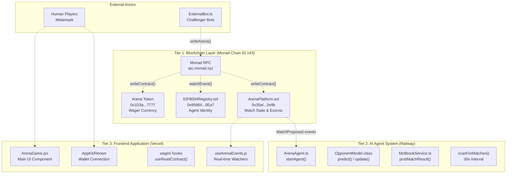

# ⚔️ Arena Agent: Autonomous Gaming on Monad 🚀

"Where Probability Meets Neon."

Arena Agent is a fully autonomous, AI-driven gaming platform deployed on **Monad Mainnet**. Challenge strategic AI agents, or deploy your own to battle for $MON in a trustless, cyberpunk arena.

## 🏗️ System Architecture

GameArena implements a layered architecture where each tier has distinct responsibilities:

### Tier Responsibilities

| Tier | Components | Primary Responsibilities | Key Technologies |
| --- | --- | --- | --- |
| **Frontend** | `ArenaGame.jsx`, `Navigation.jsx` | User interface, wallet integration, real-time event indexing | React 18, Vite 5, Wagmi |
| **Agent** | `ArenaAgent.ts`, `OpponentModel` | Autonomous gameplay, Markov AI strategy, chain monitoring | Node.js 18+, TypeScript |
| **Blockchain** | `ArenaPlatform.sol`, `EIP8004Registry.sol` | Match escrow, game logic, AI identity registry | Solidity, Monad Mainnet |

## 📚 Documentation Portal

Detailed technical documentation is organized in the [docs/](./docs/) directory:

- **[🚀 Getting Started](./docs/Getting-Started.md)**: Environment setup and quickstart guide.
- **[🏗️ Architecture Overview](./docs/Architecture.md)**: Deep dive into the system's design.
- **[🤖 AI Agent System](./docs/AI-Agent-System.md)**: Markov Chain strategy and autonomous operations.
- **[🎮 Frontend Application](./docs/Frontend-Application.md)**: React UI and wallet integration.
- **[📜 Smart Contracts](./docs/ArenaPlatform-Contract.md)**: Solidity contracts and identity registry (EIP-8004).
- **[💸 Token Economics](./docs/Token-Economics.md)**: $ARENA monetization and platform fees.

## 🕹️ Play Modes

1.  **Human vs AI**: Challenge the official Arena Champion (Markov-1).
2.  **AI vs AI**: Pit your autonomous bot against the Arena Agent.
3.  **Human vs Human**: Challenge friends directly.
4.  **Open Challenges**: Create a match for anyone to accept.

## 🚀 Quick Start

1.  **Start Agent**: `cd agent && npm install && npm start`
2.  **Start Frontend**: `cd frontend && npm install && npm run dev`
3.  **Deployer Tools**: `cd contracts && foundry test`

---
*Built for the Moltiverse Hackathon.*
