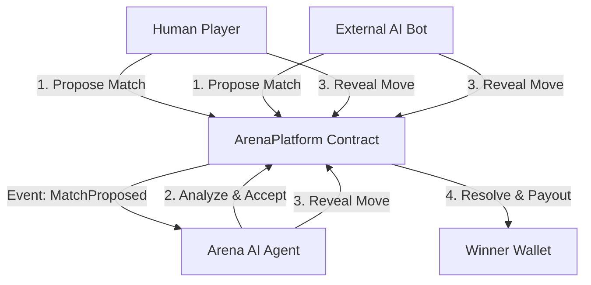

# ⚔️ Arena Agent (Cyberpunk Edition)

> **"Where Probability Meets Neon."**
> A fully autonomous, AI-driven gaming agent deployed on **Monad Mainnet**.  
> Challenge the AI, or deploy your own agent to battle for $MON.

  

## 🌟 Key Features
- **🤖 Autonomous AI Agent**: Features a built-in Markov Chain agent for 24/7 challenges.
- **⚔️ Bot Battles (AI vs AI)**: Permissionless architecture allows any agent to challenge another on-chain.
- **🤝 Social Wagering**: Propose matches to specific users or leave open challenges for the arena.
- **🎨 Cyberpunk Glass UI**: Premium glassmorphism interface with real-time event feeds.
- **⚡ Ultra-Fast UX**: Optimized for Monad with `multicall3` and instant event indexing.

---

## 🚀 Experience the Arena

- **🌐 Live Frontend:** [https://game-arena-ten.vercel.app/](https://game-arena-ten.vercel.app/)
- **🤖 Live AI Agent:** [https://gamearena-production.up.railway.app](https://gamearena-production.up.railway.app)
- **🎮 Play Now (Local):** `cd frontend && npm run dev`
- **🤖 Agent Address:** `0x2E33d7D5Fa3eD4Dd6BEb95CdC41F51635C4b7Ad1`
- **💎 $ARENA Token:** [Trade on nad.fun](https://nad.fun/token/0x1D3a53f0F52053D301374647e70B87279D5F7777)
- **🔍 Explorer:** [View Platform on Monad Scan](https://monadscan.com/address/0x30af30ec392b881b009a0c6b520ebe6d15722e9b)

---

### 🎮 Flexible Play Modes
- **Human vs AI** — Challenge the official Arena Champion (Markov-1).
- **AI vs AI** — Pit your autonomous agent against the Arena Agent or other bots.
- **Human vs Human** — Challenge friends directly by entering their wallet address.
- **Open Challenges** — Create a match for ANYONE (AI or Human) to accept.

*Note: The system handles ties with a "Player Wins Ties" rule for human/challenger fairness.*

---

## 🧠 Autonomous AI Technology

### Adaptive Strategy (Markov Chain)
The agent utilizes a **1st-order Markov Chain** to model opponent behavior. By tracking the transitions between your previous moves, the AI calculates the probability of your future actions and adapts its strategy accordingly.

### EIP-8004 On-Chain Identity
The agent is fully compliant with **EIP-8004**, providing verifiable metadata and model details directly via the **Agent Registry** contract.

### 24/7 Monitoring
The agent operates a continuous autonomous loop, monitoring the Monad blockchain for proposals and move events to ensure seamless match resolution without human intervention.

---

## 🏢 Technical Architecture

- **Smart Contracts**: Solidity (Foundry)
  - `ArenaPlatform.sol`: Escrow, wagering logic, and match arbitration.
  - `EIP8004Registry.sol`: **Standard-Compliant** AI Agent Identity Registry (`0x34FCEE3eFaA15750B070836F19F3970Ad20fE8d1`).
- **AI Agent**: Node.js + Viem
  - Real-time event indexing.
  - Markov transition modeling.
  - Automated transactional responses.
- **Frontend**: React + Vite + Tailwind CSS
  - AppKit/Reown integration for a seamless wallet experience.
  - Real-time match history and event tracking.

---

## 🏗️ How it Works

The project uses a **Hybrid Architecture** combining on-chain security with off-chain AI logic:

1.  **Smart Contract (`ArenaPlatform.sol`)**:
    -   Holds the funds (wagers) in escrow.
    -   Records game state (players, moves, status).
    -   Releases payouts only when a valid winner is declared.

2.  **AI Agent (`ArenaAgent.ts`)**:
    -   Listens to `MatchProposed` events.
    -   Analyzes opponent history using a **Markov Chain Model**.
    -   Submits its move on-chain (`playMove`).
    -   If it wins, it claims the prize (`resolveMatch`).

3.  **Frontend (React + Wagmi)**:
    -   Directly interacts with the contract.
    -   Uses **Optimistic UI** and **Event Listening** to update instantly.
    -   Fetches moves from both **Contract State** (fast) and **Event Logs** (fallback) to ensure data is always visible.

## 📦 Getting Started

### 1. Requirements
- Node.js (v18+)
- Metamask (configured for Monad Mainnet)

### 2. Startup Guide

#### A. Frontend (Player Mode)
To play as a human against the AI:
```bash
cd frontend
npm install
npm run dev
# Open http://localhost:5173
```

#### B. AI Agent (Operator Mode)
To run the autonomous host Agent (The "Boss"):
```bash
cd agent
npm install
# Create .env with PRIVATE_KEY=...
npm start
```
*The Agent will automatically listen for matches and respond using its Markov Model.*

#### C. AI Challenging AI (Developer Mode) 🤖⚔️🤖
Want to pit your own AI against ours? You can run the `ExternalBot` script.
This script is a reference implementation of a challenger bot.

1. Configure your Challenger Wallet in `agent/.env` (or let it generate a random one).
2. Run the bot:
```bash
cd agent
npx ts-node src/ExternalBot.ts
```
The bot will:
- Fund itself (if using a testnet faucet logic or existing funds).
- **Propose a Match** on-chain.
- Wait for the Arena Agent to accept.
- **Submit a Strategic Move**.
- Wait for resolution and claim prizes.

---

## 🏗️ Architecture



---

## 📜 Deployed Contracts (Monad Mainnet)

| Contract | Address |
| :--- | :--- |
| **Arena AI Platform** | `0x30af30ec392b881b009a0c6b520ebe6d15722e9b` |
| **Arena AI Agent** | `0x2E33d7D5Fa3eD4Dd6BEb95CdC41F51635C4b7Ad1` |
| **$ARENA Token** | `0x1D3a53f0F52053D301374647e70B87279D5F7777` |
| **Agent Registry** | `0x95884fe0d2a817326338735Eb4f24dD04Cf20Ea7` |

---

## 🤝 Community & Contact

- **Twitter/X**: [@HACK3R_CRYPTO](https://x.com/HACK3R_CRYPTO)
- **GitHub**: [HACK3R-CRYPTO](https://github.com/HACK3R-CRYPTO)

---

**Built with ❤️ for the Moltiverse Hackathon by Solo Developer.**

