# AI Agent System

> **Relevant source files**
> * [README.md](https://github.com/HACK3R-CRYPTO/GameArena/blob/30ace840/README.md)
> * [agent/src/ArenaAgent.ts](https://github.com/HACK3R-CRYPTO/GameArena/blob/30ace840/agent/src/ArenaAgent.ts)
> * [package.json](https://github.com/HACK3R-CRYPTO/GameArena/blob/30ace840/package.json)
> * [railway.json](https://github.com/HACK3R-CRYPTO/GameArena/blob/30ace840/railway.json)

This document provides comprehensive technical documentation for the Arena Champion AI agent - an autonomous blockchain-based agent that operates 24/7 on Monad mainnet. The agent monitors for match proposals, accepts challenges, computes strategic moves using Markov Chain intelligence, and executes all transactions independently.

For information about the smart contracts the agent interacts with, see [Smart Contracts](/HACK3R-CRYPTO/GameArena/4-smart-contracts). For details on how external developers can build their own bots, see [External Integration](/HACK3R-CRYPTO/GameArena/7-external-integration).

---

## Overview

The Arena Champion AI is implemented as a Node.js application in [agent/src/ArenaAgent.ts L1-L551](https://github.com/HACK3R-CRYPTO/GameArena/blob/30ace840/agent/src/ArenaAgent.ts#L1-L551)

 that runs continuously on Railway infrastructure. The agent maintains three core responsibilities:

1. **Event Monitoring**: Watches blockchain events and periodically scans for missed matches
2. **Strategic Intelligence**: Uses 1st-order Markov Chains to model opponent behavior and predict moves
3. **Autonomous Execution**: Accepts challenges, plays moves, and resolves matches without human intervention

**Agent Identity**:

* **Address**: `0x2E33d7D5Fa3eD4Dd6BEb95CdC41F51635C4b7Ad1`
* **Registry**: EIP-8004 compliant registration at `0x34FCEE3eFaA15750B070836F19F3970Ad20fE8d1`
* **Platform**: Monad Mainnet (Chain ID 143)

**Sources**: [agent/src/ArenaAgent.ts L28-L38](https://github.com/HACK3R-CRYPTO/GameArena/blob/30ace840/agent/src/ArenaAgent.ts#L28-L38)

 [README.md L23-L25](https://github.com/HACK3R-CRYPTO/GameArena/blob/30ace840/README.md#L23-L25)

---

## Agent Startup and Initialization

### Startup Flow


**Sources**: [agent/src/ArenaAgent.ts L244-L345](https://github.com/HACK3R-CRYPTO/GameArena/blob/30ace840/agent/src/ArenaAgent.ts#L244-L345)

 [agent/src/ArenaAgent.ts L256-L295](https://github.com/HACK3R-CRYPTO/GameArena/blob/30ace840/agent/src/ArenaAgent.ts#L256-L295)

### Environment Configuration

The agent requires the following environment variables:

| Variable | Purpose | Example |
| --- | --- | --- |
| `PRIVATE_KEY` | Agent wallet private key | `0x123...abc` |
| `VITE_RPC_URL` | Monad RPC endpoint | `https://rpc.monad.xyz` |
| `VITE_ARENA_PLATFORM_ADDRESS` | Platform contract address | `0x30af30ec...` |
| `GEMINI_API_KEY` | Google Gemini API key (optional) | For social post generation |
| `MOLTBOOK_API_KEY` | Moltbook social API key (optional) | For social updates |

The agent performs a critical validation check at startup [agent/src/ArenaAgent.ts L31-L35](https://github.com/HACK3R-CRYPTO/GameArena/blob/30ace840/agent/src/ArenaAgent.ts#L31-L35)

 and exits immediately if `PRIVATE_KEY` is not set, preventing deployment errors.

**Sources**: [agent/src/ArenaAgent.ts L7-L8](https://github.com/HACK3R-CRYPTO/GameArena/blob/30ace840/agent/src/ArenaAgent.ts#L7-L8)

 [agent/src/ArenaAgent.ts L31-L38](https://github.com/HACK3R-CRYPTO/GameArena/blob/30ace840/agent/src/ArenaAgent.ts#L31-L38)

---

## Core Architecture

### Component Hierarchy

```mermaid
flowchart TD

RPC["Monad RPC<br>http()"]
PUBLIC["publicClient<br>createPubilcClient()"]
WALLET["walletClient<br>createWalletClient()"]
ACCOUNT["account<br>privateKeyToAccount()"]
WATCH_PROPOSED["watchEvent<br>MatchProposed"]
WATCH_MOVE["watchEvent<br>MovePlayed"]
SCANNER["scanForMatches()<br>setInterval 30s"]
OPPONENT_MODEL["OpponentModel class"]
TRANSITIONS["transitions Map<br>[gameType][player][prevMove][nextMove]"]
HISTORY["history Map<br>[gameType][player] → lastMove"]
PREDICT["predict(gameType, player)"]
HANDLE_CHALLENGE["handleChallenge()"]
TRY_PLAY["tryPlayMove()"]
TRY_RESOLVE["tryResolveMatch()"]
DETERMINE_WINNER["determineWinner()"]
PROCESSING["processingAcceptance Set"]
LOCKS["activeGameLocks Set"]
COMPLETED["completedMatches Set"]
RESPONDED["respondedMatches Set"]
MOLTBOOK["MoltbookService<br>postChallengeAccepted()<br>postMatchResult()"]

SCANNER -.-> HANDLE_CHALLENGE
SCANNER -.-> TRY_PLAY
SCANNER -.-> TRY_RESOLVE

subgraph subGraph5 ["External Services"]
    MOLTBOOK
end

subgraph subGraph4 ["State Management"]
    PROCESSING
    LOCKS
    COMPLETED
    RESPONDED
end

subgraph subGraph3 ["Action Handlers"]
    HANDLE_CHALLENGE
    TRY_PLAY
    TRY_RESOLVE
    DETERMINE_WINNER
end

subgraph subGraph2 ["Intelligence Layer"]
    OPPONENT_MODEL
    TRANSITIONS
    HISTORY
    PREDICT
    PREDICT -.-> TRANSITIONS
    PREDICT -.-> HISTORY
end

subgraph subGraph1 ["Event Detection"]
    WATCH_PROPOSED
    WATCH_MOVE
    SCANNER
end

subgraph subGraph0 ["Blockchain Layer"]
    RPC
    PUBLIC
    WALLET
    ACCOUNT
    WALLET -.-> ACCOUNT
    PUBLIC -.-> RPC
    WALLET -.-> RPC
end
```



**Sources**: [agent/src/ArenaAgent.ts L59-L68](https://github.com/HACK3R-CRYPTO/GameArena/blob/30ace840/agent/src/ArenaAgent.ts#L59-L68)

 [agent/src/ArenaAgent.ts L73-L143](https://github.com/HACK3R-CRYPTO/GameArena/blob/30ace840/agent/src/ArenaAgent.ts#L73-L143)

 [agent/src/ArenaAgent.ts L145-L153](https://github.com/HACK3R-CRYPTO/GameArena/blob/30ace840/agent/src/ArenaAgent.ts#L145-L153)

### Key Data Structures

#### State Management Sets

The agent uses four `Set<string>` collections to prevent duplicate processing and race conditions:

```yaml
respondedMatches: Set<string>        // Line 146 - Historical tracking (unused in current version)
processingAcceptance: Set<string>    // Line 147 - Prevents duplicate acceptances
completedMatches: Set<string>        // Line 148 - Skips finished matches in scanner
activeGameLocks: Set<string>         // Line 152 - Prevents concurrent move/resolve operations
```

**Match ID Format**: All sets use `matchId.toString()` as keys, with `tryResolveMatch` using `matchIdStr + '_resolve'` as a separate lock key [agent/src/ArenaAgent.ts L450](https://github.com/HACK3R-CRYPTO/GameArena/blob/30ace840/agent/src/ArenaAgent.ts#L450-L450)

**Sources**: [agent/src/ArenaAgent.ts L145-L153](https://github.com/HACK3R-CRYPTO/GameArena/blob/30ace840/agent/src/ArenaAgent.ts#L145-L153)

#### OpponentModel Class Structure

The `OpponentModel` class maintains per-opponent, per-game-type Markov Chains:

| Property | Type | Purpose |
| --- | --- | --- |
| `transitions` | `Record<number, Record<string, number[][]>>` | Transition matrices: `[gameType][playerAddress][prevMove][nextMove] = count` |
| `history` | `Record<number, Record<string, number>>` | Last move tracking: `[gameType][playerAddress] → lastMove` |
| `matchCount` | `number` | Total matches processed |
| `wins` | `Record<string, number>` | Win count per player address |

**Game Type Move Sizes**:

* GameType 0 (RPS): 3 moves (Rock=0, Paper=1, Scissors=2)
* GameType 1 (Dice): 6 moves (1-6)
* GameType 3 (Coin): 2 moves (Heads=0, Tails=1)

**Sources**: [agent/src/ArenaAgent.ts L73-L143](https://github.com/HACK3R-CRYPTO/GameArena/blob/30ace840/agent/src/ArenaAgent.ts#L73-L143)

---

## Dual Event Monitoring System

The agent implements a sophisticated dual-layer event detection system to ensure zero missed matches despite network instability.

### Architecture Comparison

| Feature | Event Watchers | Periodic Scanner |
| --- | --- | --- |
| **Latency** | <1 second | ~30 seconds |
| **Reliability** | Network-dependent | High (retries + backoff) |
| **Coverage** | Real-time events only | All historical matches |
| **Resource Usage** | WebSocket connection | Batch RPC calls |
| **Implementation** | `publicClient.watchEvent()` | `setInterval(scanForMatches, 30000)` |

**Sources**: [agent/src/ArenaAgent.ts L299-L344](https://github.com/HACK3R-CRYPTO/GameArena/blob/30ace840/agent/src/ArenaAgent.ts#L299-L344)

### Event Watcher Implementation


**Event Definitions**:

* `MatchProposed`: Triggers `handleChallenge()` [agent/src/ArenaAgent.ts L302-L317](https://github.com/HACK3R-CRYPTO/GameArena/blob/30ace840/agent/src/ArenaAgent.ts#L302-L317)
* `MovePlayed`: Triggers `tryPlayMove()` and `tryResolveMatch()` [agent/src/ArenaAgent.ts L319-L344](https://github.com/HACK3R-CRYPTO/GameArena/blob/30ace840/agent/src/ArenaAgent.ts#L319-L344)

**Sources**: [agent/src/ArenaAgent.ts L302-L344](https://github.com/HACK3R-CRYPTO/GameArena/blob/30ace840/agent/src/ArenaAgent.ts#L302-L344)

### Periodic Scanner Implementation

The `scanForMatches()` function runs every 30 seconds and performs batch processing:


**Performance Optimization**: Uses `multicall` [agent/src/ArenaAgent.ts L203-L210](https://github.com/HACK3R-CRYPTO/GameArena/blob/30ace840/agent/src/ArenaAgent.ts#L203-L210)

 to fetch all active match structs in a single RPC call, dramatically reducing latency compared to sequential reads.

**Completed Match Filtering**: Once a match reaches status 2 (Completed) or 3 (Cancelled), it's added to `completedMatches` Set [agent/src/ArenaAgent.ts L221-L224](https://github.com/HACK3R-CRYPTO/GameArena/blob/30ace840/agent/src/ArenaAgent.ts#L221-L224)

 and permanently skipped in future scans, reducing load as the match counter grows.

**Sources**: [agent/src/ArenaAgent.ts L170-L242](https://github.com/HACK3R-CRYPTO/GameArena/blob/30ace840/agent/src/ArenaAgent.ts#L170-L242)

---

## Match Handling Flow

### Challenge Acceptance Process

```css
#mermaid-eda2jar7bgq{font-family:ui-sans-serif,-apple-system,system-ui,Segoe UI,Helvetica;font-size:16px;fill:#333;}@keyframes edge-animation-frame{from{stroke-dashoffset:0;}}@keyframes dash{to{stroke-dashoffset:0;}}#mermaid-eda2jar7bgq .edge-animation-slow{stroke-dasharray:9,5!important;stroke-dashoffset:900;animation:dash 50s linear infinite;stroke-linecap:round;}#mermaid-eda2jar7bgq .edge-animation-fast{stroke-dasharray:9,5!important;stroke-dashoffset:900;animation:dash 20s linear infinite;stroke-linecap:round;}#mermaid-eda2jar7bgq .error-icon{fill:#dddddd;}#mermaid-eda2jar7bgq .error-text{fill:#222222;stroke:#222222;}#mermaid-eda2jar7bgq .edge-thickness-normal{stroke-width:1px;}#mermaid-eda2jar7bgq .edge-thickness-thick{stroke-width:3.5px;}#mermaid-eda2jar7bgq .edge-pattern-solid{stroke-dasharray:0;}#mermaid-eda2jar7bgq .edge-thickness-invisible{stroke-width:0;fill:none;}#mermaid-eda2jar7bgq .edge-pattern-dashed{stroke-dasharray:3;}#mermaid-eda2jar7bgq .edge-pattern-dotted{stroke-dasharray:2;}#mermaid-eda2jar7bgq .marker{fill:#999;stroke:#999;}#mermaid-eda2jar7bgq .marker.cross{stroke:#999;}#mermaid-eda2jar7bgq svg{font-family:ui-sans-serif,-apple-system,system-ui,Segoe UI,Helvetica;font-size:16px;}#mermaid-eda2jar7bgq p{margin:0;}#mermaid-eda2jar7bgq defs #statediagram-barbEnd{fill:#999;stroke:#999;}#mermaid-eda2jar7bgq g.stateGroup text{fill:#dddddd;stroke:none;font-size:10px;}#mermaid-eda2jar7bgq g.stateGroup text{fill:#333;stroke:none;font-size:10px;}#mermaid-eda2jar7bgq g.stateGroup .state-title{font-weight:bolder;fill:#333;}#mermaid-eda2jar7bgq g.stateGroup rect{fill:#ffffff;stroke:#dddddd;}#mermaid-eda2jar7bgq g.stateGroup line{stroke:#999;stroke-width:1;}#mermaid-eda2jar7bgq .transition{stroke:#999;stroke-width:1;fill:none;}#mermaid-eda2jar7bgq .stateGroup .composit{fill:#f4f4f4;border-bottom:1px;}#mermaid-eda2jar7bgq .stateGroup .alt-composit{fill:#e0e0e0;border-bottom:1px;}#mermaid-eda2jar7bgq .state-note{stroke:#e6d280;fill:#fff5ad;}#mermaid-eda2jar7bgq .state-note text{fill:#333;stroke:none;font-size:10px;}#mermaid-eda2jar7bgq .stateLabel .box{stroke:none;stroke-width:0;fill:#ffffff;opacity:0.5;}#mermaid-eda2jar7bgq .edgeLabel .label rect{fill:#ffffff;opacity:0.5;}#mermaid-eda2jar7bgq .edgeLabel{background-color:#ffffff;text-align:center;}#mermaid-eda2jar7bgq .edgeLabel p{background-color:#ffffff;}#mermaid-eda2jar7bgq .edgeLabel rect{opacity:0.5;background-color:#ffffff;fill:#ffffff;}#mermaid-eda2jar7bgq .edgeLabel .label text{fill:#333;}#mermaid-eda2jar7bgq .label div .edgeLabel{color:#333;}#mermaid-eda2jar7bgq .stateLabel text{fill:#333;font-size:10px;font-weight:bold;}#mermaid-eda2jar7bgq .node circle.state-start{fill:#999;stroke:#999;}#mermaid-eda2jar7bgq .node .fork-join{fill:#999;stroke:#999;}#mermaid-eda2jar7bgq .node circle.state-end{fill:#dddddd;stroke:#f4f4f4;stroke-width:1.5;}#mermaid-eda2jar7bgq .end-state-inner{fill:#f4f4f4;stroke-width:1.5;}#mermaid-eda2jar7bgq .node rect{fill:#ffffff;stroke:#dddddd;stroke-width:1px;}#mermaid-eda2jar7bgq .node polygon{fill:#ffffff;stroke:#dddddd;stroke-width:1px;}#mermaid-eda2jar7bgq #statediagram-barbEnd{fill:#999;}#mermaid-eda2jar7bgq .statediagram-cluster rect{fill:#ffffff;stroke:#dddddd;stroke-width:1px;}#mermaid-eda2jar7bgq .cluster-label,#mermaid-eda2jar7bgq .nodeLabel{color:#333;}#mermaid-eda2jar7bgq .statediagram-cluster rect.outer{rx:5px;ry:5px;}#mermaid-eda2jar7bgq .statediagram-state .divider{stroke:#dddddd;}#mermaid-eda2jar7bgq .statediagram-state .title-state{rx:5px;ry:5px;}#mermaid-eda2jar7bgq .statediagram-cluster.statediagram-cluster .inner{fill:#f4f4f4;}#mermaid-eda2jar7bgq .statediagram-cluster.statediagram-cluster-alt .inner{fill:#f8f8f8;}#mermaid-eda2jar7bgq .statediagram-cluster .inner{rx:0;ry:0;}#mermaid-eda2jar7bgq .statediagram-state rect.basic{rx:5px;ry:5px;}#mermaid-eda2jar7bgq .statediagram-state rect.divider{stroke-dasharray:10,10;fill:#f8f8f8;}#mermaid-eda2jar7bgq .note-edge{stroke-dasharray:5;}#mermaid-eda2jar7bgq .statediagram-note rect{fill:#fff5ad;stroke:#e6d280;stroke-width:1px;rx:0;ry:0;}#mermaid-eda2jar7bgq .statediagram-note rect{fill:#fff5ad;stroke:#e6d280;stroke-width:1px;rx:0;ry:0;}#mermaid-eda2jar7bgq .statediagram-note text{fill:#333;}#mermaid-eda2jar7bgq .statediagram-note .nodeLabel{color:#333;}#mermaid-eda2jar7bgq .statediagram .edgeLabel{color:red;}#mermaid-eda2jar7bgq #dependencyStart,#mermaid-eda2jar7bgq #dependencyEnd{fill:#999;stroke:#999;stroke-width:1;}#mermaid-eda2jar7bgq .statediagramTitleText{text-anchor:middle;font-size:18px;fill:#333;}#mermaid-eda2jar7bgq :root{--mermaid-font-family:"trebuchet ms",verdana,arial,sans-serif;}MatchProposed event or ScannermatchId receivedAlready in processingAcceptanceNew challengeAdd to processingAcceptance SetWager > balance/2Sufficient balanceLog rejectionsimulateContract() successSimulation failedwriteContract(acceptMatch)waitForTransactionReceipt()moltbook.postChallengeAccepted()DetectedCheckProcessingSkipLockValidateBalanceRejectSimulateUnlockAcceptWaitSocialSuccess
```

**Balance Protection**: The agent only accepts wagers up to 50% of its current balance [agent/src/ArenaAgent.ts L353-L360](https://github.com/HACK3R-CRYPTO/GameArena/blob/30ace840/agent/src/ArenaAgent.ts#L353-L360)

 reserving the remainder for gas fees and future matches.

**Sources**: [agent/src/ArenaAgent.ts L347-L385](https://github.com/HACK3R-CRYPTO/GameArena/blob/30ace840/agent/src/ArenaAgent.ts#L347-L385)

### Move Submission Logic

The `tryPlayMove()` function implements critical fairness rules:

```

```

**Fairness Rule**: If the agent is the opponent (accepted a challenge), it waits for the challenger to move first [agent/src/ArenaAgent.ts L404-L412](https://github.com/HACK3R-CRYPTO/GameArena/blob/30ace840/agent/src/ArenaAgent.ts#L404-L412)

 This prevents the agent from front-running by seeing the challenger's transaction in the mempool before committing its own move.

**Move Conversion**: For Dice Roll (gameType 1), the prediction returns 0-5 but the contract expects 1-6, so `moveToSend = aiMove + 1` [agent/src/ArenaAgent.ts L428](https://github.com/HACK3R-CRYPTO/GameArena/blob/30ace840/agent/src/ArenaAgent.ts#L428-L428)

**Sources**: [agent/src/ArenaAgent.ts L387-L446](https://github.com/HACK3R-CRYPTO/GameArena/blob/30ace840/agent/src/ArenaAgent.ts#L387-L446)

### Match Resolution Logic

```

```

**Global Referee Mode**: Any participant (or even a third party) can call `resolveMatch()` after both players move. The agent acts as a "Global Referee" [agent/src/ArenaAgent.ts L462](https://github.com/HACK3R-CRYPTO/GameArena/blob/30ace840/agent/src/ArenaAgent.ts#L462-L462)

 automatically resolving matches it participates in or witnesses.

**Sources**: [agent/src/ArenaAgent.ts L448-L513](https://github.com/HACK3R-CRYPTO/GameArena/blob/30ace840/agent/src/ArenaAgent.ts#L448-L513)

---

## Markov Chain Intelligence

### OpponentModel Architecture

The agent uses 1st-order Markov Chains to model each opponent's move patterns per game type.


**Sources**: [agent/src/ArenaAgent.ts L73-L143](https://github.com/HACK3R-CRYPTO/GameArena/blob/30ace840/agent/src/ArenaAgent.ts#L73-L143)

### Update Method

The `update()` method is called whenever a `MovePlayed` event is detected:

```sql
update(gameType: number, player: string, move: number)
```

**Process**:

1. Initialize player's transition matrix if first time: `Array.from({ length: size }, () => Array(size).fill(0))` [agent/src/ArenaAgent.ts L89](https://github.com/HACK3R-CRYPTO/GameArena/blob/30ace840/agent/src/ArenaAgent.ts#L89-L89)
2. Check if previous move exists: `lastMove = this.history[gameType][player]` [agent/src/ArenaAgent.ts L92](https://github.com/HACK3R-CRYPTO/GameArena/blob/30ace840/agent/src/ArenaAgent.ts#L92-L92)
3. Increment transition count: `transitions[gameType][player][lastMove][move]++` [agent/src/ArenaAgent.ts L100](https://github.com/HACK3R-CRYPTO/GameArena/blob/30ace840/agent/src/ArenaAgent.ts#L100-L100)
4. Update history: `this.history[gameType][player] = move` [agent/src/ArenaAgent.ts L108](https://github.com/HACK3R-CRYPTO/GameArena/blob/30ace840/agent/src/ArenaAgent.ts#L108-L108)

**Initialization Safety**: The matrix size depends on game type [agent/src/ArenaAgent.ts L85](https://github.com/HACK3R-CRYPTO/GameArena/blob/30ace840/agent/src/ArenaAgent.ts#L85-L85)

:

* RPS (0): 3x3 matrix
* Dice (1): 6x6 matrix
* Coin (3): 2x2 matrix

**Sources**: [agent/src/ArenaAgent.ts L80-L109](https://github.com/HACK3R-CRYPTO/GameArena/blob/30ace840/agent/src/ArenaAgent.ts#L80-L109)

### Predict Method

The `predict()` method generates the agent's strategic move:

```
predict(gameType: number, player: string): number
```

**Decision Tree**:


**Sources**: [agent/src/ArenaAgent.ts L111-L143](https://github.com/HACK3R-CRYPTO/GameArena/blob/30ace840/agent/src/ArenaAgent.ts#L111-L143)

---

## Game-Specific Strategies

### Rock-Paper-Scissors (GameType 0)

**Strategy**: Direct counter to predicted move

```
predictedMove = argmax(transitions[0][player][lastMove])
agentMove = (predictedMove + 1) % 3
```

**Logic**:

* If opponent likely plays Rock (0) → Agent plays Paper (1)
* If opponent likely plays Paper (1) → Agent plays Scissors (2)
* If opponent likely plays Scissors (2) → Agent plays Rock (0)

**Implementation**: [agent/src/ArenaAgent.ts L131-L132](https://github.com/HACK3R-CRYPTO/GameArena/blob/30ace840/agent/src/ArenaAgent.ts#L131-L132)

**Sources**: [agent/src/ArenaAgent.ts L131-L132](https://github.com/HACK3R-CRYPTO/GameArena/blob/30ace840/agent/src/ArenaAgent.ts#L131-L132)

 [agent/src/ArenaAgent.ts L427](https://github.com/HACK3R-CRYPTO/GameArena/blob/30ace840/agent/src/ArenaAgent.ts#L427-L427)

### Dice Roll (GameType 1)

**Strategy**: Favor high values with 70% probability

```javascript
// Prediction returns 0-5 (internal)
const internalMove = Math.random() > 0.3 ? 5 : Math.floor(Math.random() * 6);
const contractMove = internalMove + 1; // Convert to 1-6 for contract
```

**Reasoning**: In a highest-roll-wins game, always rolling 6 gives the best expected value. The 30% randomness prevents complete predictability.

**Move Conversion**: The contract expects dice values 1-6, but internal prediction uses 0-5. The conversion happens at [agent/src/ArenaAgent.ts L428](https://github.com/HACK3R-CRYPTO/GameArena/blob/30ace840/agent/src/ArenaAgent.ts#L428-L428)

**Implementation**: [agent/src/ArenaAgent.ts L134-L135](https://github.com/HACK3R-CRYPTO/GameArena/blob/30ace840/agent/src/ArenaAgent.ts#L134-L135)

**Sources**: [agent/src/ArenaAgent.ts L134-L135](https://github.com/HACK3R-CRYPTO/GameArena/blob/30ace840/agent/src/ArenaAgent.ts#L134-L135)

 [agent/src/ArenaAgent.ts L428](https://github.com/HACK3R-CRYPTO/GameArena/blob/30ace840/agent/src/ArenaAgent.ts#L428-L428)

### Coin Flip (GameType 3)

**Strategy**: 50% exploit pattern, 50% flip prediction

```javascript
const predicted = argmax(transitions[3][player][lastMove]);
return Math.random() > 0.5 ? predicted : 1 - predicted;
```

**Reasoning**: If the opponent has a pattern (e.g., alternating), following it gives 50% win rate. Flipping it also gives 50%. The randomness prevents exploitation by the opponent.

**Oracle Flip Resolution**: At resolution time, the agent acts as a randomness oracle [agent/src/ArenaAgent.ts L529-L530](https://github.com/HACK3R-CRYPTO/GameArena/blob/30ace840/agent/src/ArenaAgent.ts#L529-L530)

 generating a fair 50/50 result: `Math.random() > 0.5 ? 1 : 0`.

**Implementation**: [agent/src/ArenaAgent.ts L136-L137](https://github.com/HACK3R-CRYPTO/GameArena/blob/30ace840/agent/src/ArenaAgent.ts#L136-L137)

**Sources**: [agent/src/ArenaAgent.ts L136-L137](https://github.com/HACK3R-CRYPTO/GameArena/blob/30ace840/agent/src/ArenaAgent.ts#L136-L137)

 [agent/src/ArenaAgent.ts L526-L538](https://github.com/HACK3R-CRYPTO/GameArena/blob/30ace840/agent/src/ArenaAgent.ts#L526-L538)

---

## Winner Determination Logic

The `determineWinner()` function implements on-chain game resolution logic locally:

### Game Rules Implementation


**RPS Counter Logic**: [agent/src/ArenaAgent.ts L520-L521](https://github.com/HACK3R-CRYPTO/GameArena/blob/30ace840/agent/src/ArenaAgent.ts#L520-L521)

```
Rock (0) beats Scissors (2)
Paper (1) beats Rock (0)  
Scissors (2) beats Paper (1)
```

**Dice Comparison**: [agent/src/ArenaAgent.ts L523-L524](https://github.com/HACK3R-CRYPTO/GameArena/blob/30ace840/agent/src/ArenaAgent.ts#L523-L524)

```
Highest roll wins
```

**Coin Flip Oracle**: [agent/src/ArenaAgent.ts L529-L537](https://github.com/HACK3R-CRYPTO/GameArena/blob/30ace840/agent/src/ArenaAgent.ts#L529-L537)

```
Generate random 0 (Heads) or 1 (Tails)
Winner is whoever guessed correctly
If both correct or both wrong: tie
```

**Tie-Breaker**: [agent/src/ArenaAgent.ts L540-L544](https://github.com/HACK3R-CRYPTO/GameArena/blob/30ace840/agent/src/ArenaAgent.ts#L540-L544)

```
50/50 random selection between p1 and p2
```

**Sources**: [agent/src/ArenaAgent.ts L515-L548](https://github.com/HACK3R-CRYPTO/GameArena/blob/30ace840/agent/src/ArenaAgent.ts#L515-L548)

---

## Error Handling and Retry Mechanisms

### Retry Helper Function

The `withRetry()` function provides exponential backoff for transient RPC failures:

```javascript
async function withRetry<T>(fn: () => Promise<T>, label: string, retries = 3): Promise<T>
```

**Retry Strategy**:

* **Attempts**: 3 by default
* **Backoff**: 2000ms * (attempt number) * Attempt 1 fails → wait 2s * Attempt 2 fails → wait 4s * Attempt 3 fails → throw error
* **Error Logging**: Displays `shortMessage` or `message` for each retry [agent/src/ArenaAgent.ts L162](https://github.com/HACK3R-CRYPTO/GameArena/blob/30ace840/agent/src/ArenaAgent.ts#L162-L162)

**Usage Examples**:

* `withRetry(() => publicClient.readContract(...), "matchCounter")` [agent/src/ArenaAgent.ts L172-L176](https://github.com/HACK3R-CRYPTO/GameArena/blob/30ace840/agent/src/ArenaAgent.ts#L172-L176)
* `withRetry(() => publicClient.multicall(...), "multicallMatches")` [agent/src/ArenaAgent.ts L210](https://github.com/HACK3R-CRYPTO/GameArena/blob/30ace840/agent/src/ArenaAgent.ts#L210-L210)
* `withRetry(() => publicClient.readContract(...), "hasPlayed")` [agent/src/ArenaAgent.ts L398-L400](https://github.com/HACK3R-CRYPTO/GameArena/blob/30ace840/agent/src/ArenaAgent.ts#L398-L400)

**Sources**: [agent/src/ArenaAgent.ts L156-L168](https://github.com/HACK3R-CRYPTO/GameArena/blob/30ace840/agent/src/ArenaAgent.ts#L156-L168)

### Transaction Error Handling

Each transaction operation includes try-catch blocks with specific error detection:


**Error Message Detection**:

* `'available'` [agent/src/ArenaAgent.ts L379-L380](https://github.com/HACK3R-CRYPTO/GameArena/blob/30ace840/agent/src/ArenaAgent.ts#L379-L380) : Match already accepted by another party
* `'Match not in progress'` [agent/src/ArenaAgent.ts L491](https://github.com/HACK3R-CRYPTO/GameArena/blob/30ace840/agent/src/ArenaAgent.ts#L491-L491) : Match already resolved

**State Cleanup**: Failed `acceptMatch` removes matchId from `processingAcceptance` [agent/src/ArenaAgent.ts L378](https://github.com/HACK3R-CRYPTO/GameArena/blob/30ace840/agent/src/ArenaAgent.ts#L378-L378)

 to allow retry on next scan.

**Sources**: [agent/src/ArenaAgent.ts L362-L384](https://github.com/HACK3R-CRYPTO/GameArena/blob/30ace840/agent/src/ArenaAgent.ts#L362-L384)

 [agent/src/ArenaAgent.ts L489-L509](https://github.com/HACK3R-CRYPTO/GameArena/blob/30ace840/agent/src/ArenaAgent.ts#L489-L509)

---

## Social Integration

The agent integrates with Moltbook social platform via `MoltbookService` to post match updates.

### MoltbookService Interface


**Initialization**: `const moltbook = new MoltbookService()` [agent/src/ArenaAgent.ts L150](https://github.com/HACK3R-CRYPTO/GameArena/blob/30ace840/agent/src/ArenaAgent.ts#L150-L150)

### Social Update Points

The agent posts to Moltbook at two key moments:

| Event | Function | Timing | Data Posted |
| --- | --- | --- | --- |
| **Challenge Accepted** | `postChallengeAccepted()` | After `acceptMatch` transaction confirmed | matchId, challenger address, wager amount, game type |
| **Match Completed** | `postMatchResult()` | After `resolveMatch` transaction confirmed | matchId, challenger, opponent, winner, total prize, game type |

**Challenge Acceptance Post**: [agent/src/ArenaAgent.ts L370-L376](https://github.com/HACK3R-CRYPTO/GameArena/blob/30ace840/agent/src/ArenaAgent.ts#L370-L376)

```
await moltbook.postChallengeAccepted(
    matchId.toString(),
    challenger,
    formatEther(wager),
    GAME_NAMES[gameType] || 'Unknown'
);
```

**Match Result Post**: [agent/src/ArenaAgent.ts L479-L487](https://github.com/HACK3R-CRYPTO/GameArena/blob/30ace840/agent/src/ArenaAgent.ts#L479-L487)

```
await moltbook.postMatchResult(
    matchId.toString(),
    matchData[1], // Challenger
    matchData[2], // Opponent  
    winner,
    formatEther(matchData[3] * 2n), // Total Prize
    GAME_NAMES[gameType] || 'Unknown'
);
```

**Fallback Posting**: If the agent fails to resolve a match because another party already resolved it, the agent still attempts to post the result to Moltbook using the winner from the match struct [agent/src/ArenaAgent.ts L493-L506](https://github.com/HACK3R-CRYPTO/GameArena/blob/30ace840/agent/src/ArenaAgent.ts#L493-L506)

**Sources**: [agent/src/ArenaAgent.ts L150](https://github.com/HACK3R-CRYPTO/GameArena/blob/30ace840/agent/src/ArenaAgent.ts#L150-L150)

 [agent/src/ArenaAgent.ts L370-L376](https://github.com/HACK3R-CRYPTO/GameArena/blob/30ace840/agent/src/ArenaAgent.ts#L370-L376)

 [agent/src/ArenaAgent.ts L479-L487](https://github.com/HACK3R-CRYPTO/GameArena/blob/30ace840/agent/src/ArenaAgent.ts#L479-L487)

 [agent/src/ArenaAgent.ts L493-L506](https://github.com/HACK3R-CRYPTO/GameArena/blob/30ace840/agent/src/ArenaAgent.ts#L493-L506)

---

## Deployment and Operations

### Railway Deployment Configuration

The agent is configured for deployment on Railway via `railway.json`:

```json
{
  "build": { "builder": "NIXPACKS" },
  "deploy": {
    "startCommand": "cd agent && npm install && npm start",
    "restartPolicyType": "ALWAYS",
    "healthcheck": null
  }
}
```

**Restart Policy**: `"ALWAYS"` ensures the agent automatically restarts if it crashes [railway.json L8](https://github.com/HACK3R-CRYPTO/GameArena/blob/30ace840/railway.json#L8-L8)

**Start Command**: Navigates to agent directory, installs dependencies, and runs `npm start` [railway.json L7](https://github.com/HACK3R-CRYPTO/GameArena/blob/30ace840/railway.json#L7-L7)

**Sources**: [railway.json L1-L11](https://github.com/HACK3R-CRYPTO/GameArena/blob/30ace840/railway.json#L1-L11)

 [package.json L8](https://github.com/HACK3R-CRYPTO/GameArena/blob/30ace840/package.json#L8-L8)

### Monitoring and Logging

The agent uses `chalk` for colored console output:

| Color | Purpose | Example |
| --- | --- | --- |
| `chalk.blue` | Startup info | "Connected to network. Current block: 12345" |
| `chalk.yellow` | Warnings | "Challenge rejected: Wager too high" |
| `chalk.green` | Success | "Match #5 accepted!" |
| `chalk.red` | Errors | "Failed to accept match: Insufficient balance" |
| `chalk.gray` | Debug info | "Scanning 3 active matches..." |
| `chalk.magenta` | Agent actions | "🤖 Agent playing move for Match #7..." |
| `chalk.cyan` | Resolution | "⚖️ Resolving Match #8..." |

**Log Locations**: All console output is captured by Railway's logging system and accessible via the Railway dashboard.

**Sources**: [agent/src/ArenaAgent.ts L4](https://github.com/HACK3R-CRYPTO/GameArena/blob/30ace840/agent/src/ArenaAgent.ts#L4-L4)

### Runtime Statistics

The agent maintains runtime statistics through the `OpponentModel` class:

```
matchCount: number = 0;           // Total moves processed
wins: Record<string, number>;     // Win count per opponent
```

These statistics are updated via `model.update()` [agent/src/ArenaAgent.ts L105-L106](https://github.com/HACK3R-CRYPTO/GameArena/blob/30ace840/agent/src/ArenaAgent.ts#L105-L106)

 but not currently persisted to disk, resetting on agent restart.

**Sources**: [agent/src/ArenaAgent.ts L77-L78](https://github.com/HACK3R-CRYPTO/GameArena/blob/30ace840/agent/src/ArenaAgent.ts#L77-L78)

 [agent/src/ArenaAgent.ts L105-L106](https://github.com/HACK3R-CRYPTO/GameArena/blob/30ace840/agent/src/ArenaAgent.ts#L105-L106)

---

## Concurrency Control

The agent implements multiple layers of concurrency control to prevent race conditions and duplicate processing.

### Lock Mechanisms


### Lock Implementation Patterns

**Pattern 1: Accept Match Lock**

```sql
if (processingAcceptance.has(matchId.toString())) return;
processingAcceptance.add(matchId.toString());

try {
    // ... acceptMatch transaction ...
} catch (error) {
    processingAcceptance.delete(matchId.toString()); // Allow retry
}
```

[agent/src/ArenaAgent.ts L348-L349](https://github.com/HACK3R-CRYPTO/GameArena/blob/30ace840/agent/src/ArenaAgent.ts#L348-L349)

 [agent/src/ArenaAgent.ts L378](https://github.com/HACK3R-CRYPTO/GameArena/blob/30ace840/agent/src/ArenaAgent.ts#L378-L378)

**Pattern 2: Play Move Lock (Try-Finally)**

```sql
if (activeGameLocks.has(matchIdStr)) return;

activeGameLocks.add(matchIdStr);
try {
    // ... playMove transaction ...
} finally {
    activeGameLocks.delete(matchIdStr);
}
```

[agent/src/ArenaAgent.ts L389](https://github.com/HACK3R-CRYPTO/GameArena/blob/30ace840/agent/src/ArenaAgent.ts#L389-L389)

 [agent/src/ArenaAgent.ts L414](https://github.com/HACK3R-CRYPTO/GameArena/blob/30ace840/agent/src/ArenaAgent.ts#L414-L414)

 [agent/src/ArenaAgent.ts L444](https://github.com/HACK3R-CRYPTO/GameArena/blob/30ace840/agent/src/ArenaAgent.ts#L444-L444)

**Pattern 3: Resolve Lock (Separate Key)**

```javascript
const resolveKey = matchIdStr + '_resolve';
if (activeGameLocks.has(resolveKey)) return;

activeGameLocks.add(resolveKey);
try {
    // ... resolveMatch transaction ...
} finally {
    activeGameLocks.delete(resolveKey);
}
```

[agent/src/ArenaAgent.ts L450](https://github.com/HACK3R-CRYPTO/GameArena/blob/30ace840/agent/src/ArenaAgent.ts#L450-L450)

 [agent/src/ArenaAgent.ts L460](https://github.com/HACK3R-CRYPTO/GameArena/blob/30ace840/agent/src/ArenaAgent.ts#L460-L460)

 [agent/src/ArenaAgent.ts L511](https://github.com/HACK3R-CRYPTO/GameArena/blob/30ace840/agent/src/ArenaAgent.ts#L511-L511)

**Pattern 4: Completed Match Filtering**

```
// In scanner loop
if (m[5] === 2 || m[5] === 3) {  // Status Completed or Cancelled
    completedMatches.add(matchIdStr);
    continue;
}
```

[agent/src/ArenaAgent.ts L221-L224](https://github.com/HACK3R-CRYPTO/GameArena/blob/30ace840/agent/src/ArenaAgent.ts#L221-L224)

**Why Separate Keys**: Play move and resolve can happen concurrently (agent plays → immediately try resolve), so they use different lock keys: `matchId` vs `matchId + '_resolve'`.

**Sources**: [agent/src/ArenaAgent.ts L145-L153](https://github.com/HACK3R-CRYPTO/GameArena/blob/30ace840/agent/src/ArenaAgent.ts#L145-L153)

 [agent/src/ArenaAgent.ts L348-L349](https://github.com/HACK3R-CRYPTO/GameArena/blob/30ace840/agent/src/ArenaAgent.ts#L348-L349)

 [agent/src/ArenaAgent.ts L389](https://github.com/HACK3R-CRYPTO/GameArena/blob/30ace840/agent/src/ArenaAgent.ts#L389-L389)

 [agent/src/ArenaAgent.ts L414](https://github.com/HACK3R-CRYPTO/GameArena/blob/30ace840/agent/src/ArenaAgent.ts#L414-L414)

 [agent/src/ArenaAgent.ts L444](https://github.com/HACK3R-CRYPTO/GameArena/blob/30ace840/agent/src/ArenaAgent.ts#L444-L444)

 [agent/src/ArenaAgent.ts L450](https://github.com/HACK3R-CRYPTO/GameArena/blob/30ace840/agent/src/ArenaAgent.ts#L450-L450)

 [agent/src/ArenaAgent.ts L460](https://github.com/HACK3R-CRYPTO/GameArena/blob/30ace840/agent/src/ArenaAgent.ts#L460-L460)

 [agent/src/ArenaAgent.ts L511](https://github.com/HACK3R-CRYPTO/GameArena/blob/30ace840/agent/src/ArenaAgent.ts#L511-L511)

 [agent/src/ArenaAgent.ts L221-L224](https://github.com/HACK3R-CRYPTO/GameArena/blob/30ace840/agent/src/ArenaAgent.ts#L221-L224)

---

## Performance Optimizations

### Multicall Batching

The scanner uses `publicClient.multicall()` to fetch multiple match structs in a single RPC call:

```javascript
const matchContracts = toCheck.map(id => ({
    address: ARENA_ADDRESS,
    abi: ARENA_ABI,
    functionName: 'matches',
    args: [id]
}));

const results = await withRetry(() => 
    publicClient.multicall({ contracts: matchContracts }), 
    "multicallMatches"
);
```

**Performance Impact**:

* **Without Multicall**: N sequential RPC calls for N matches (~200ms * N)
* **With Multicall**: 1 RPC call for N matches (~200ms total)
* **Improvement**: ~N-fold speedup

**Sources**: [agent/src/ArenaAgent.ts L203-L210](https://github.com/HACK3R-CRYPTO/GameArena/blob/30ace840/agent/src/ArenaAgent.ts#L203-L210)

### Completed Match Set Optimization

The `completedMatches` Set provides O(1) lookup to skip finished matches:

```javascript
const toCheck: bigint[] = [];
for (let i = 0n; i < matchCounter; i++) {
    if (!completedMatches.has(i.toString())) {
        toCheck.push(i);
    }
}
```

**Memory vs Performance Tradeoff**:

* **Memory**: ~40 bytes per completed match (Set entry + string)
* **Performance Gain**: Avoids fetching/processing thousands of completed matches as `matchCounter` grows
* **Long-term**: After 1000 matches, scanner only checks ~10-20 active matches instead of all 1000

**Sources**: [agent/src/ArenaAgent.ts L183-L187](https://github.com/HACK3R-CRYPTO/GameArena/blob/30ace840/agent/src/ArenaAgent.ts#L183-L187)

### RPC Connection Timeout

The agent implements a 15-second timeout for initial RPC connection:

```javascript
const blockNumber = await Promise.race([
    publicClient.getBlockNumber(),
    new Promise((_, reject) => setTimeout(() => 
        reject(new Error('RPC connection timeout (15s)')), 15000))
]);
```

**Purpose**: Fails fast if RPC endpoint is unreachable, rather than hanging indefinitely during Railway deployment.

**Sources**: [agent/src/ArenaAgent.ts L247-L250](https://github.com/HACK3R-CRYPTO/GameArena/blob/30ace840/agent/src/ArenaAgent.ts#L247-L250)

---

## Future Enhancements

Based on code comments and TODOs, potential improvements include:

1. **Persistent Statistics**: Store `OpponentModel` data to disk to maintain learning across restarts
2. **Deterministic Coin Flip**: Use `blockhash` for verifiable randomness instead of `Math.random()` [agent/src/ArenaAgent.ts L527](https://github.com/HACK3R-CRYPTO/GameArena/blob/30ace840/agent/src/ArenaAgent.ts#L527-L527)
3. **Dynamic Wager Limits**: Adjust maximum wager based on recent win rate and balance trends
4. **Multi-Agent Support**: Allow running multiple agents with different strategies from one codebase
5. **Advanced Markov Chains**: Extend to 2nd or 3rd order chains for deeper pattern recognition
6. **LLM Integration**: Connect to Gemini API for dynamic strategy generation based on opponent analysis

**Sources**: [agent/src/ArenaAgent.ts L527](https://github.com/HACK3R-CRYPTO/GameArena/blob/30ace840/agent/src/ArenaAgent.ts#L527-L527)