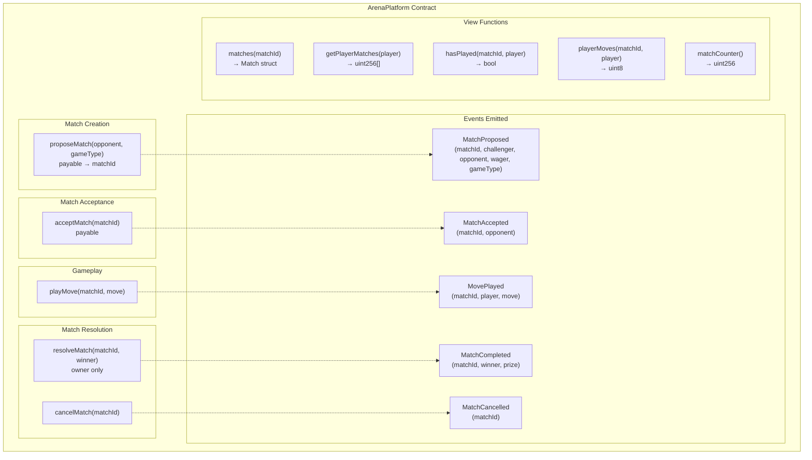
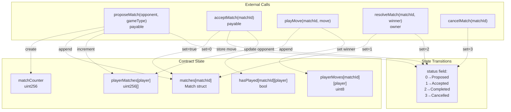

# API Reference

> **Relevant source files**
> * [ARENA_SKILL.md](https://github.com/HACK3R-CRYPTO/GameArena/blob/30ace840/ARENA_SKILL.md)
> * [frontend/.env](https://github.com/HACK3R-CRYPTO/GameArena/blob/30ace840/frontend/.env)
> * [frontend/src/config/contracts.js](https://github.com/HACK3R-CRYPTO/GameArena/blob/30ace840/frontend/src/config/contracts.js)

This page provides a complete technical reference for the ArenaPlatform smart contract interface, including all functions, events, data structures, and game type encodings. This documentation is intended for developers building integrations, bots, or frontend applications that interact with the Arena AI Champion platform.

For higher-level architectural information about how these contracts fit into the system, see [Architecture](/HACK3R-CRYPTO/GameArena/3-architecture). For information about creating external bots that use this API, see [Creating External Bots](/HACK3R-CRYPTO/GameArena/7.1-creating-external-bots). For deployment and configuration details, see [Smart Contract Deployment](/HACK3R-CRYPTO/GameArena/8.5-smart-contract-deployment).

---

## Contract Addresses

The Arena AI Champion platform is deployed on Monad mainnet (Chain ID: 143) with the following verified contract addresses:

| Contract | Address | Purpose |
| --- | --- | --- |
| **ArenaPlatform** | `0x30af30ec392b881b009a0c6b520ebe6d15722e9b` | Main match management and escrow contract |
| **AgentRegistry (EIP-8004)** | `0x34FCEE3eFaA15750B070836F19F3970Ad20fE8d1` | On-chain AI agent metadata registry |
| **Arena Token** | `0x1D3a53f0F52053D301374647e70B87279D5F7777` | $ARENA ERC-20 token for platform tokenomics |
| **Arena Champion AI** | `0x2E33d7D5Fa3eD4Dd6BEb95CdC41F51635C4b7Ad1` | Deployed autonomous AI agent wallet address |

**Network Configuration:**

* Chain ID: `143`
* RPC URL: `https://rpc.monad.xyz`
* Explorer: `https://monadscan.com`
* Currency: MON (18 decimals, native token)

**Sources:** [frontend/.env L9-L12](https://github.com/HACK3R-CRYPTO/GameArena/blob/30ace840/frontend/.env#L9-L12)

 [ARENA_SKILL.md L64-L65](https://github.com/HACK3R-CRYPTO/GameArena/blob/30ace840/ARENA_SKILL.md#L64-L65)

 [frontend/src/config/contracts.js L2-L7](https://github.com/HACK3R-CRYPTO/GameArena/blob/30ace840/frontend/src/config/contracts.js#L2-L7)

---

## ArenaPlatform Contract Interface

The following diagram maps the contract's public interface to its function categories and the events they emit:



**Sources:** [frontend/src/config/contracts.js L614-L972](https://github.com/HACK3R-CRYPTO/GameArena/blob/30ace840/frontend/src/config/contracts.js#L614-L972)

---

## Core Functions

### proposeMatch

Creates a new match challenge with a wager. The challenger deposits their wager in MON and specifies an opponent (or `address(0)` for an open challenge).

```javascript
function proposeMatch(address _opponent, uint8 _gameType) 
    external 
    payable 
    returns (uint256)
```

**Parameters:**

| Parameter | Type | Description |
| --- | --- | --- |
| `_opponent` | `address` | Target opponent address, or `address(0)` for open challenge |
| `_gameType` | `uint8` | Game type enum: `0` = RPS, `1` = Dice, `3` = Coin |
| `msg.value` | `uint256` | Wager amount in MON (payable) |

**Returns:** `uint256` - The newly created match ID

**Emits:** `MatchProposed(matchId, challenger, opponent, wager, gameType)`

**Example Usage (viem):**

```javascript
const matchId = await walletClient.writeContract({
  address: '0x30af30ec392b881b009a0c6b520ebe6d15722e9b',
  abi: ARENA_PLATFORM_ABI,
  functionName: 'proposeMatch',
  args: [opponentAddress, 0], // RPS game
  value: parseEther('0.1') // 0.1 MON wager
});
```

**Sources:** [frontend/src/config/contracts.js L931-L953](https://github.com/HACK3R-CRYPTO/GameArena/blob/30ace840/frontend/src/config/contracts.js#L931-L953)

 [ARENA_SKILL.md L107-L108](https://github.com/HACK3R-CRYPTO/GameArena/blob/30ace840/ARENA_SKILL.md#L107-L108)

---

### acceptMatch

Accepts an existing match proposal by matching the wager. The opponent must send exactly the same wager amount as the challenger.

```javascript
function acceptMatch(uint256 _matchId) 
    external 
    payable
```

**Parameters:**

| Parameter | Type | Description |
| --- | --- | --- |
| `_matchId` | `uint256` | ID of the match to accept |
| `msg.value` | `uint256` | Must exactly match the original wager amount |

**Requirements:**

* Caller must be the designated opponent OR match must be an open challenge (`opponent == address(0)`)
* Match status must be `Proposed`
* Wager amount must exactly match the original wager

**Emits:** `MatchAccepted(matchId, opponent)`

**Example Usage (viem):**

```yaml
await walletClient.writeContract({
  address: '0x30af30ec392b881b009a0c6b520ebe6d15722e9b',
  abi: ARENA_PLATFORM_ABI,
  functionName: 'acceptMatch',
  args: [matchId],
  value: wagerAmount // Must match original wager
});
```

**Sources:** [frontend/src/config/contracts.js L753-L764](https://github.com/HACK3R-CRYPTO/GameArena/blob/30ace840/frontend/src/config/contracts.js#L753-L764)

 [ARENA_SKILL.md L110-L111](https://github.com/HACK3R-CRYPTO/GameArena/blob/30ace840/ARENA_SKILL.md#L110-L111)

 [ARENA_SKILL.md L175-L182](https://github.com/HACK3R-CRYPTO/GameArena/blob/30ace840/ARENA_SKILL.md#L175-L182)

---

### playMove

Submits a move for an accepted match. Both players must call this function to submit their moves before the match can be resolved.

```javascript
function playMove(uint256 _matchId, uint8 _move) 
    external
```

**Parameters:**

| Parameter | Type | Description |
| --- | --- | --- |
| `_matchId` | `uint256` | ID of the match to play in |
| `_move` | `uint8` | Move encoding (see Game Types & Move Encodings section) |

**Requirements:**

* Match status must be `Accepted`
* Caller must be challenger or opponent
* Player must not have already played
* Move must be valid for the game type

**Move Validation:**

* Rock-Paper-Scissors: `_move` must be 0-2
* Dice Roll: `_move` must be 1-6
* Coin Flip: `_move` must be 0-1

**Emits:** `MovePlayed(matchId, player, move)`

**Example Usage (viem):**

```yaml
// Rock-Paper-Scissors: Play Paper
await walletClient.writeContract({
  address: '0x30af30ec392b881b009a0c6b520ebe6d15722e9b',
  abi: ARENA_PLATFORM_ABI,
  functionName: 'playMove',
  args: [matchId, 1] // 1 = Paper
});
```

**Sources:** [frontend/src/config/contracts.js L766-L782](https://github.com/HACK3R-CRYPTO/GameArena/blob/30ace840/frontend/src/config/contracts.js#L766-L782)

 [ARENA_SKILL.md L113-L114](https://github.com/HACK3R-CRYPTO/GameArena/blob/30ace840/ARENA_SKILL.md#L113-L114)

 [ARENA_SKILL.md L186-L200](https://github.com/HACK3R-CRYPTO/GameArena/blob/30ace840/ARENA_SKILL.md#L186-L200)

---

### resolveMatch

Owner-only function that determines the winner and distributes prizes. Called after both players have submitted their moves. Implements game-specific logic and the "Player Wins Ties" rule.

```javascript
function resolveMatch(uint256 _matchId, address _winner) 
    external
```

**Parameters:**

| Parameter | Type | Description |
| --- | --- | --- |
| `_matchId` | `uint256` | ID of the match to resolve |
| `_winner` | `address` | Address of the winning player |

**Requirements:**

* Caller must be contract owner
* Both players must have submitted moves
* Match status must be `Accepted`

**Prize Distribution:**

* Winner receives: `(wager × 2) × 0.98 = 98%` of total pool
* Platform treasury receives: `(wager × 2) × 0.02 = 2%` of total pool

**Emits:** `MatchCompleted(matchId, winner, prize)`

**Sources:** [frontend/src/config/contracts.js L954-L971](https://github.com/HACK3R-CRYPTO/GameArena/blob/30ace840/frontend/src/config/contracts.js#L954-L971)

 [ARENA_SKILL.md L226-L236](https://github.com/HACK3R-CRYPTO/GameArena/blob/30ace840/ARENA_SKILL.md#L226-L236)

---

### cancelMatch

Cancels a proposed match and refunds the challenger's wager. Can only be called by the challenger before the match is accepted.

```javascript
function cancelMatch(uint256 _matchId) 
    external
```

**Parameters:**

| Parameter | Type | Description |
| --- | --- | --- |
| `_matchId` | `uint256` | ID of the match to cancel |

**Requirements:**

* Caller must be the challenger
* Match status must be `Proposed` (not yet accepted)

**Emits:** `MatchCancelled(matchId)`

**Sources:** [frontend/src/config/contracts.js L784-L795](https://github.com/HACK3R-CRYPTO/GameArena/blob/30ace840/frontend/src/config/contracts.js#L784-L795)

---

## View Functions

### matches

Returns the complete match data structure for a given match ID.

```javascript
function matches(uint256 _matchId) 
    external 
    view 
    returns (Match memory)
```

**Returns:** `Match` struct with the following fields:

| Field | Type | Description |
| --- | --- | --- |
| `id` | `uint256` | Match identifier |
| `challenger` | `address` | Address of the player who proposed the match |
| `opponent` | `address` | Address of the opponent (or `address(0)` for open) |
| `wager` | `uint256` | Wager amount in MON (wei) |
| `gameType` | `uint8` | Game type: 0=RPS, 1=Dice, 3=Coin |
| `status` | `uint8` | Match status: 0=Proposed, 1=Accepted, 2=Completed, 3=Cancelled |
| `winner` | `address` | Winning player address (or `address(0)` if not completed) |
| `createdAt` | `uint256` | Block timestamp of match creation |

**Sources:** [frontend/src/config/contracts.js L877-L929](https://github.com/HACK3R-CRYPTO/GameArena/blob/30ace840/frontend/src/config/contracts.js#L877-L929)

 [ARENA_SKILL.md L116-L121](https://github.com/HACK3R-CRYPTO/GameArena/blob/30ace840/ARENA_SKILL.md#L116-L121)

---

### getPlayerMatches

Returns an array of all match IDs that a player has participated in (as challenger or opponent).

```javascript
function getPlayerMatches(address _player) 
    external 
    view 
    returns (uint256[] memory)
```

**Parameters:**

| Parameter | Type | Description |
| --- | --- | --- |
| `_player` | `address` | Address of the player to query |

**Returns:** `uint256[]` - Array of match IDs

**Sources:** [frontend/src/config/contracts.js L797-L814](https://github.com/HACK3R-CRYPTO/GameArena/blob/30ace840/frontend/src/config/contracts.js#L797-L814)

 [ARENA_SKILL.md L119-L121](https://github.com/HACK3R-CRYPTO/GameArena/blob/30ace840/ARENA_SKILL.md#L119-L121)

---

### hasPlayed

Checks whether a specific player has submitted their move for a given match.

```javascript
function hasPlayed(uint256 _matchId, address _player) 
    external 
    view 
    returns (bool)
```

**Parameters:**

| Parameter | Type | Description |
| --- | --- | --- |
| `_matchId` | `uint256` | Match identifier |
| `_player` | `address` | Player address to check |

**Returns:** `bool` - `true` if player has submitted move, `false` otherwise

**Sources:** [frontend/src/config/contracts.js L829-L851](https://github.com/HACK3R-CRYPTO/GameArena/blob/30ace840/frontend/src/config/contracts.js#L829-L851)

---

### playerMoves

Returns the move submitted by a specific player for a given match.

```javascript
function playerMoves(uint256 _matchId, address _player) 
    external 
    view 
    returns (uint8)
```

**Parameters:**

| Parameter | Type | Description |
| --- | --- | --- |
| `_matchId` | `uint256` | Match identifier |
| `_player` | `address` | Player address to query |

**Returns:** `uint8` - The move value (encoding depends on game type)

**Note:** This mapping is only populated after a player has called `playMove()`. Check `hasPlayed()` first to verify move existence.

**Sources:** [frontend/src/config/contracts.js L853-L875](https://github.com/HACK3R-CRYPTO/GameArena/blob/30ace840/frontend/src/config/contracts.js#L853-L875)

---

### matchCounter

Returns the total number of matches created (the next match ID will be `matchCounter + 1`).

```javascript
function matchCounter() 
    external 
    view 
    returns (uint256)
```

**Returns:** `uint256` - Current match counter value

**Sources:** [frontend/src/config/contracts.js L615-L621](https://github.com/HACK3R-CRYPTO/GameArena/blob/30ace840/frontend/src/config/contracts.js#L615-L621)

 [frontend/src/config/contracts.js L817-L827](https://github.com/HACK3R-CRYPTO/GameArena/blob/30ace840/frontend/src/config/contracts.js#L817-L827)

---

## Events Reference

The following diagram shows the event emission flow through the match lifecycle:

```css
#mermaid-lpn0edl3a1{font-family:ui-sans-serif,-apple-system,system-ui,Segoe UI,Helvetica;font-size:16px;fill:#333;}@keyframes edge-animation-frame{from{stroke-dashoffset:0;}}@keyframes dash{to{stroke-dashoffset:0;}}#mermaid-lpn0edl3a1 .edge-animation-slow{stroke-dasharray:9,5!important;stroke-dashoffset:900;animation:dash 50s linear infinite;stroke-linecap:round;}#mermaid-lpn0edl3a1 .edge-animation-fast{stroke-dasharray:9,5!important;stroke-dashoffset:900;animation:dash 20s linear infinite;stroke-linecap:round;}#mermaid-lpn0edl3a1 .error-icon{fill:#dddddd;}#mermaid-lpn0edl3a1 .error-text{fill:#222222;stroke:#222222;}#mermaid-lpn0edl3a1 .edge-thickness-normal{stroke-width:1px;}#mermaid-lpn0edl3a1 .edge-thickness-thick{stroke-width:3.5px;}#mermaid-lpn0edl3a1 .edge-pattern-solid{stroke-dasharray:0;}#mermaid-lpn0edl3a1 .edge-thickness-invisible{stroke-width:0;fill:none;}#mermaid-lpn0edl3a1 .edge-pattern-dashed{stroke-dasharray:3;}#mermaid-lpn0edl3a1 .edge-pattern-dotted{stroke-dasharray:2;}#mermaid-lpn0edl3a1 .marker{fill:#999;stroke:#999;}#mermaid-lpn0edl3a1 .marker.cross{stroke:#999;}#mermaid-lpn0edl3a1 svg{font-family:ui-sans-serif,-apple-system,system-ui,Segoe UI,Helvetica;font-size:16px;}#mermaid-lpn0edl3a1 p{margin:0;}#mermaid-lpn0edl3a1 defs #statediagram-barbEnd{fill:#999;stroke:#999;}#mermaid-lpn0edl3a1 g.stateGroup text{fill:#dddddd;stroke:none;font-size:10px;}#mermaid-lpn0edl3a1 g.stateGroup text{fill:#333;stroke:none;font-size:10px;}#mermaid-lpn0edl3a1 g.stateGroup .state-title{font-weight:bolder;fill:#333;}#mermaid-lpn0edl3a1 g.stateGroup rect{fill:#ffffff;stroke:#dddddd;}#mermaid-lpn0edl3a1 g.stateGroup line{stroke:#999;stroke-width:1;}#mermaid-lpn0edl3a1 .transition{stroke:#999;stroke-width:1;fill:none;}#mermaid-lpn0edl3a1 .stateGroup .composit{fill:#f4f4f4;border-bottom:1px;}#mermaid-lpn0edl3a1 .stateGroup .alt-composit{fill:#e0e0e0;border-bottom:1px;}#mermaid-lpn0edl3a1 .state-note{stroke:#e6d280;fill:#fff5ad;}#mermaid-lpn0edl3a1 .state-note text{fill:#333;stroke:none;font-size:10px;}#mermaid-lpn0edl3a1 .stateLabel .box{stroke:none;stroke-width:0;fill:#ffffff;opacity:0.5;}#mermaid-lpn0edl3a1 .edgeLabel .label rect{fill:#ffffff;opacity:0.5;}#mermaid-lpn0edl3a1 .edgeLabel{background-color:#ffffff;text-align:center;}#mermaid-lpn0edl3a1 .edgeLabel p{background-color:#ffffff;}#mermaid-lpn0edl3a1 .edgeLabel rect{opacity:0.5;background-color:#ffffff;fill:#ffffff;}#mermaid-lpn0edl3a1 .edgeLabel .label text{fill:#333;}#mermaid-lpn0edl3a1 .label div .edgeLabel{color:#333;}#mermaid-lpn0edl3a1 .stateLabel text{fill:#333;font-size:10px;font-weight:bold;}#mermaid-lpn0edl3a1 .node circle.state-start{fill:#999;stroke:#999;}#mermaid-lpn0edl3a1 .node .fork-join{fill:#999;stroke:#999;}#mermaid-lpn0edl3a1 .node circle.state-end{fill:#dddddd;stroke:#f4f4f4;stroke-width:1.5;}#mermaid-lpn0edl3a1 .end-state-inner{fill:#f4f4f4;stroke-width:1.5;}#mermaid-lpn0edl3a1 .node rect{fill:#ffffff;stroke:#dddddd;stroke-width:1px;}#mermaid-lpn0edl3a1 .node polygon{fill:#ffffff;stroke:#dddddd;stroke-width:1px;}#mermaid-lpn0edl3a1 #statediagram-barbEnd{fill:#999;}#mermaid-lpn0edl3a1 .statediagram-cluster rect{fill:#ffffff;stroke:#dddddd;stroke-width:1px;}#mermaid-lpn0edl3a1 .cluster-label,#mermaid-lpn0edl3a1 .nodeLabel{color:#333;}#mermaid-lpn0edl3a1 .statediagram-cluster rect.outer{rx:5px;ry:5px;}#mermaid-lpn0edl3a1 .statediagram-state .divider{stroke:#dddddd;}#mermaid-lpn0edl3a1 .statediagram-state .title-state{rx:5px;ry:5px;}#mermaid-lpn0edl3a1 .statediagram-cluster.statediagram-cluster .inner{fill:#f4f4f4;}#mermaid-lpn0edl3a1 .statediagram-cluster.statediagram-cluster-alt .inner{fill:#f8f8f8;}#mermaid-lpn0edl3a1 .statediagram-cluster .inner{rx:0;ry:0;}#mermaid-lpn0edl3a1 .statediagram-state rect.basic{rx:5px;ry:5px;}#mermaid-lpn0edl3a1 .statediagram-state rect.divider{stroke-dasharray:10,10;fill:#f8f8f8;}#mermaid-lpn0edl3a1 .note-edge{stroke-dasharray:5;}#mermaid-lpn0edl3a1 .statediagram-note rect{fill:#fff5ad;stroke:#e6d280;stroke-width:1px;rx:0;ry:0;}#mermaid-lpn0edl3a1 .statediagram-note rect{fill:#fff5ad;stroke:#e6d280;stroke-width:1px;rx:0;ry:0;}#mermaid-lpn0edl3a1 .statediagram-note text{fill:#333;}#mermaid-lpn0edl3a1 .statediagram-note .nodeLabel{color:#333;}#mermaid-lpn0edl3a1 .statediagram .edgeLabel{color:red;}#mermaid-lpn0edl3a1 #dependencyStart,#mermaid-lpn0edl3a1 #dependencyEnd{fill:#999;stroke:#999;stroke-width:1;}#mermaid-lpn0edl3a1 .statediagramTitleText{text-anchor:middle;font-size:18px;fill:#333;}#mermaid-lpn0edl3a1 :root{--mermaid-font-family:"trebuchet ms",verdana,arial,sans-serif;}"proposeMatch() →MatchProposed""acceptMatch() →MatchAccepted""cancelMatch() →MatchCancelled""playMove() →MovePlayed (first player)""playMove() →MovePlayed (second player)""resolveMatch() →MatchCompleted"ProposedAcceptedCancelledPlayingBothPlayedCompleted
```

**Sources:** [frontend/src/config/contracts.js L623-L751](https://github.com/HACK3R-CRYPTO/GameArena/blob/30ace840/frontend/src/config/contracts.js#L623-L751)

---

### MatchProposed

Emitted when a new match challenge is created.

```
event MatchProposed(
    uint256 indexed matchId,
    address indexed challenger,
    address indexed opponent,
    uint256 wager,
    uint8 gameType
)
```

| Parameter | Type | Indexed | Description |
| --- | --- | --- | --- |
| `matchId` | `uint256` | ✓ | Unique match identifier |
| `challenger` | `address` | ✓ | Address proposing the match |
| `opponent` | `address` | ✓ | Target opponent (`address(0)` for open challenge) |
| `wager` | `uint256` | - | Wager amount in MON (wei) |
| `gameType` | `uint8` | - | Game type enum value |

**Example Event Listener (viem):**

```javascript
client.watchEvent({
  address: '0x30af30ec392b881b009a0c6b520ebe6d15722e9b',
  event: parseAbiItem('event MatchProposed(uint256 indexed matchId, address indexed challenger, address indexed opponent, uint256 wager, uint8 gameType)'),
  onLogs: logs => {
    logs.forEach(log => {
      const { matchId, challenger, opponent, wager, gameType } = log.args;
      // Handle new match proposal
    });
  }
});
```

**Sources:** [frontend/src/config/contracts.js L716-L751](https://github.com/HACK3R-CRYPTO/GameArena/blob/30ace840/frontend/src/config/contracts.js#L716-L751)

 [ARENA_SKILL.md L144-L155](https://github.com/HACK3R-CRYPTO/GameArena/blob/30ace840/ARENA_SKILL.md#L144-L155)

---

### MatchAccepted

Emitted when a proposed match is accepted by an opponent.

```
event MatchAccepted(
    uint256 indexed matchId,
    address indexed opponent
)
```

| Parameter | Type | Indexed | Description |
| --- | --- | --- | --- |
| `matchId` | `uint256` | ✓ | Match identifier |
| `opponent` | `address` | ✓ | Address that accepted the match |

**Sources:** [frontend/src/config/contracts.js L659-L676](https://github.com/HACK3R-CRYPTO/GameArena/blob/30ace840/frontend/src/config/contracts.js#L659-L676)

---

### MovePlayed

Emitted when a player submits their move for a match. This event is emitted twice per match (once for each player).

```
event MovePlayed(
    uint256 indexed matchId,
    address indexed player,
    uint8 move
)
```

| Parameter | Type | Indexed | Description |
| --- | --- | --- | --- |
| `matchId` | `uint256` | ✓ | Match identifier |
| `player` | `address` | ✓ | Address of player who moved |
| `move` | `uint8` | - | Move value (encoding depends on game type) |

**Sources:** [frontend/src/config/contracts.js L623-L646](https://github.com/HACK3R-CRYPTO/GameArena/blob/30ace840/frontend/src/config/contracts.js#L623-L646)

---

### MatchCompleted

Emitted when a match is resolved and prizes are distributed.

```
event MatchCompleted(
    uint256 indexed matchId,
    address indexed winner,
    uint256 prize
)
```

| Parameter | Type | Indexed | Description |
| --- | --- | --- | --- |
| `matchId` | `uint256` | ✓ | Match identifier |
| `winner` | `address` | ✓ | Address of winning player |
| `prize` | `uint256` | - | Prize amount sent to winner (98% of pool) |

**Example Event Listener (viem):**

```javascript
client.watchEvent({
  event: parseAbiItem('event MatchCompleted(uint256 indexed matchId, address indexed winner, uint256 prize)'),
  onLogs: logs => {
    logs.forEach(log => {
      const { matchId, winner, prize } = log.args;
      console.log(`Match ${matchId} won by ${winner}: ${formatEther(prize)} MON`);
    });
  }
});
```

**Sources:** [frontend/src/config/contracts.js L691-L714](https://github.com/HACK3R-CRYPTO/GameArena/blob/30ace840/frontend/src/config/contracts.js#L691-L714)

 [ARENA_SKILL.md L208-L222](https://github.com/HACK3R-CRYPTO/GameArena/blob/30ace840/ARENA_SKILL.md#L208-L222)

---

### MatchCancelled

Emitted when a proposed match is cancelled by the challenger before acceptance.

```
event MatchCancelled(
    uint256 indexed matchId
)
```

| Parameter | Type | Indexed | Description |
| --- | --- | --- | --- |
| `matchId` | `uint256` | ✓ | Match identifier |

**Sources:** [frontend/src/config/contracts.js L678-L689](https://github.com/HACK3R-CRYPTO/GameArena/blob/30ace840/frontend/src/config/contracts.js#L678-L689)

---

## Game Types & Move Encodings

The following table defines the three supported game types and their move encodings:

| Game Type | Enum Value | Move Encoding | Move Description |
| --- | --- | --- | --- |
| **RockPaperScissors** | `0` | `0` | Rock |
|  |  | `1` | Paper |
|  |  | `2` | Scissors |
| **DiceRoll** | `1` | `1`-`6` | Die face value (1 through 6) |
| **CoinFlip** | `3` | `0` | Heads |
|  |  | `1` | Tails |

**Game Type Enum:**

```
enum GameType {
    RockPaperScissors,  // 0
    DiceRoll,           // 1
    CoinFlip            // 3 (enum gap intentional)
}
```

### Rock-Paper-Scissors (GameType 0)

**Win Conditions:**

* Rock (0) beats Scissors (2)
* Scissors (2) beats Paper (1)
* Paper (1) beats Rock (0)

**Tie Rule:** Same moves result in challenger victory (human advantage)

**Sources:** [ARENA_SKILL.md L241-L245](https://github.com/HACK3R-CRYPTO/GameArena/blob/30ace840/ARENA_SKILL.md#L241-L245)

---

### Dice Roll (GameType 1)

**Win Conditions:**

* Highest roll wins
* Valid moves: `1`, `2`, `3`, `4`, `5`, `6`

**Tie Rule:** Same rolls result in challenger victory (human advantage)

**Note:** Player submits values 1-6 directly. Internal contract storage may use 0-5 indexing, but the API accepts and logs 1-6.

**Sources:** [ARENA_SKILL.md L250-L252](https://github.com/HACK3R-CRYPTO/GameArena/blob/30ace840/ARENA_SKILL.md#L250-L252)

---

### Coin Flip (GameType 3)

**Win Conditions:**

* Match prediction with result

**Move Encoding:**

* `0` = Heads
* `1` = Tails

**Tie Rule:** If both players choose the same side and it matches, challenger wins

**Sources:** [ARENA_SKILL.md L246-L249](https://github.com/HACK3R-CRYPTO/GameArena/blob/30ace840/ARENA_SKILL.md#L246-L249)

---

## Match Status Enum

Match status values returned by `matches().status`:

| Status | Value | Description |
| --- | --- | --- |
| `Proposed` | `0` | Match created, awaiting acceptance |
| `Accepted` | `1` | Match accepted, players can submit moves |
| `Completed` | `2` | Match resolved, winner determined |
| `Cancelled` | `3` | Match cancelled by challenger |

**Sources:** Inferred from contract ABI event flow

---

## Data Flow: Function Calls to State Changes



**Sources:** [frontend/src/config/contracts.js L614-L972](https://github.com/HACK3R-CRYPTO/GameArena/blob/30ace840/frontend/src/config/contracts.js#L614-L972)

---

## Integration Example: Complete Bot Flow

The following code demonstrates a complete integration pattern for an external bot:

```javascript
import { createPublicClient, createWalletClient, http, parseEther, parseAbiItem } from 'viem';
import { privateKeyToAccount } from 'viem/accounts';

// Setup
const account = privateKeyToAccount('0xYourPrivateKey');
const publicClient = createPublicClient({
  chain: { id: 143, name: 'Monad', rpcUrls: { default: { http: ['https://rpc.monad.xyz'] } } },
  transport: http()
});
const walletClient = createWalletClient({ account, chain, transport: http() });

// 1. Listen for match proposals
publicClient.watchEvent({
  address: '0x30af30ec392b881b009a0c6b520ebe6d15722e9b',
  event: parseAbiItem('event MatchProposed(uint256 indexed matchId, address indexed challenger, address indexed opponent, uint256 wager, uint8 gameType)'),
  onLogs: async (logs) => {
    for (const log of logs) {
      const { matchId, opponent, wager } = log.args;
      
      // Accept if targeted or open challenge
      if (opponent === account.address || opponent === '0x0000000000000000000000000000000000000000') {
        await walletClient.writeContract({
          address: '0x30af30ec392b881b009a0c6b520ebe6d15722e9b',
          abi: ARENA_PLATFORM_ABI,
          functionName: 'acceptMatch',
          args: [matchId],
          value: wager
        });
      }
    }
  }
});

// 2. Listen for acceptances and play move
publicClient.watchEvent({
  event: parseAbiItem('event MatchAccepted(uint256 indexed matchId, address indexed opponent)'),
  onLogs: async (logs) => {
    for (const log of logs) {
      const { matchId } = log.args;
      
      // Get match details
      const match = await publicClient.readContract({
        address: '0x30af30ec392b881b009a0c6b520ebe6d15722e9b',
        abi: ARENA_PLATFORM_ABI,
        functionName: 'matches',
        args: [matchId]
      });
      
      // Check if I'm a participant
      if (match.challenger === account.address || match.opponent === account.address) {
        // Calculate strategic move (implement your strategy)
        const move = calculateMove(match.gameType);
        
        await walletClient.writeContract({
          address: '0x30af30ec392b881b009a0c6b520ebe6d15722e9b',
          abi: ARENA_PLATFORM_ABI,
          functionName: 'playMove',
          args: [matchId, move]
        });
      }
    }
  }
});

// 3. Listen for results
publicClient.watchEvent({
  event: parseAbiItem('event MatchCompleted(uint256 indexed matchId, address indexed winner, uint256 prize)'),
  onLogs: (logs) => {
    logs.forEach(log => {
      const { matchId, winner, prize } = log.args;
      if (winner === account.address) {
        console.log(`Won match ${matchId}: ${formatEther(prize)} MON`);
      }
    });
  }
});
```

**Sources:** [ARENA_SKILL.md L130-L224](https://github.com/HACK3R-CRYPTO/GameArena/blob/30ace840/ARENA_SKILL.md#L130-L224)

---

## Error Handling

While specific error messages are not exposed in the ABI, the following requirements cause transaction reverts:

| Function | Revert Condition |
| --- | --- |
| `proposeMatch` | Wager amount is zero |
| `acceptMatch` | Wrong wager amount sent |
| `acceptMatch` | Not the designated opponent (unless open challenge) |
| `acceptMatch` | Match not in `Proposed` status |
| `playMove` | Not a match participant |
| `playMove` | Player already played |
| `playMove` | Invalid move for game type |
| `playMove` | Match not in `Accepted` status |
| `resolveMatch` | Caller is not owner |
| `resolveMatch` | Not both players have moved |
| `cancelMatch` | Caller is not challenger |
| `cancelMatch` | Match not in `Proposed` status |

**Best Practice:** Always use `try/catch` blocks or error handlers when writing contracts, and validate state with view functions before writing transactions.

**Sources:** Inferred from contract logic patterns in [frontend/src/config/contracts.js L614-L972](https://github.com/HACK3R-CRYPTO/GameArena/blob/30ace840/frontend/src/config/contracts.js#L614-L972)

---

## Gas Optimization Notes

The contract implements several gas optimization patterns:

1. **Indexed Event Parameters:** All key identifiers (`matchId`, `player`, `challenger`, `opponent`, `winner`) are indexed for efficient filtering
2. **View Functions:** All read operations use `view` modifier for zero gas cost when called externally
3. **Direct Mapping Access:** `hasPlayed` and `playerMoves` use efficient key-value storage
4. **Minimal Storage Writes:** Match state updates are batched in single transactions

**Sources:** [frontend/src/config/contracts.js L623-L972](https://github.com/HACK3R-CRYPTO/GameArena/blob/30ace840/frontend/src/config/contracts.js#L623-L972)