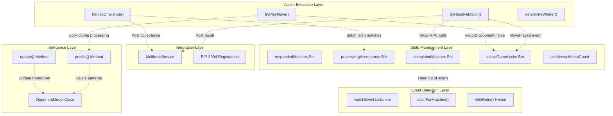
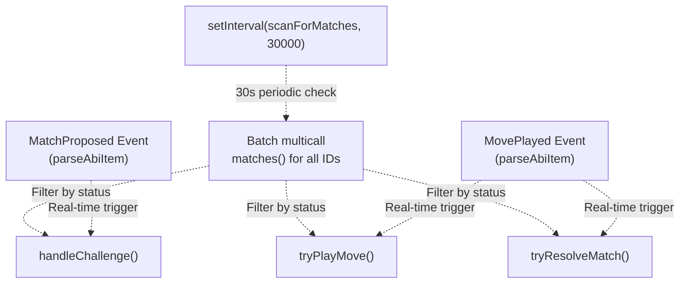
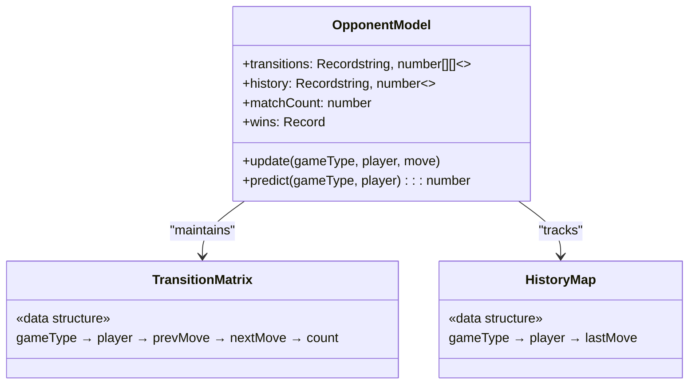
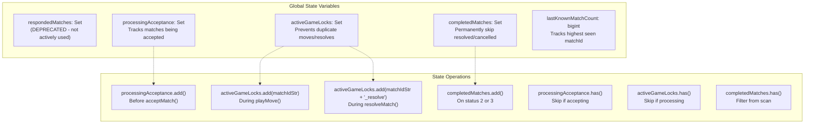
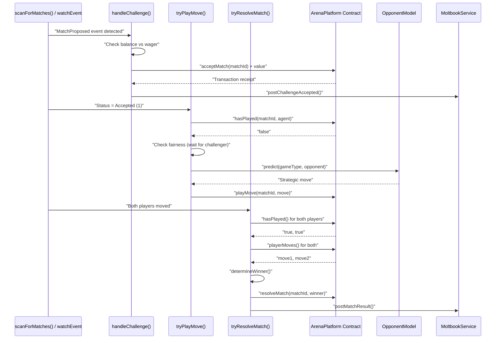
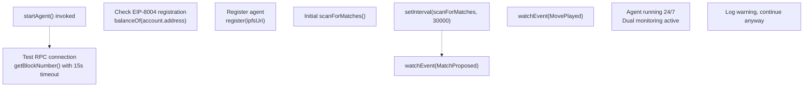

# Agent Architecture

> **Relevant source files**
> * [agent/src/ArenaAgent.ts](https://github.com/HACK3R-CRYPTO/GameArena/blob/30ace840/agent/src/ArenaAgent.ts)
> * [package.json](https://github.com/HACK3R-CRYPTO/GameArena/blob/30ace840/package.json)
> * [railway.json](https://github.com/HACK3R-CRYPTO/GameArena/blob/30ace840/railway.json)

This document describes the structural design and core components of the autonomous AI agent system. The Arena Champion AI operates 24/7 to accept match challenges, analyze opponents, execute strategic moves, and resolve matches on the Monad blockchain.

For details on the Markov Chain intelligence and prediction algorithms, see [Markov Chain Intelligence](/HACK3R-CRYPTO/GameArena/5.2-markov-chain-intelligence). For game-specific strategy implementations, see [Game Strategies](/HACK3R-CRYPTO/GameArena/5.3-game-strategies). For event processing mechanics and concurrency controls, see [Event Processing & Concurrency](/HACK3R-CRYPTO/GameArena/5.4-event-processing-and-concurrency).

## Purpose and Scope

The agent architecture implements a fully autonomous blockchain actor that:

* Monitors the ArenaPlatform contract for match proposals and state changes
* Maintains opponent behavioral models using Markov Chain analysis
* Executes strategic gameplay decisions based on historical patterns
* Manages concurrent match processing with state guards and locks
* Handles EIP-8004 agent registry integration
* Posts social updates to Moltbook for match events

The entire agent system is implemented in a single TypeScript file located at [agent/src/ArenaAgent.ts](https://github.com/HACK3R-CRYPTO/GameArena/blob/30ace840/agent/src/ArenaAgent.ts)

## Core Components Overview

The agent architecture consists of five primary subsystems that work together to create an autonomous blockchain participant.



**Component Interaction Model**

The Event Detection Layer feeds match state changes into the Action Execution Layer, which uses the Intelligence Layer for strategic decisions. State Management prevents race conditions and duplicate processing. The Integration Layer handles external service communication.

**Sources:** [agent/src/ArenaAgent.ts L1-L551](https://github.com/HACK3R-CRYPTO/GameArena/blob/30ace840/agent/src/ArenaAgent.ts#L1-L551)

## Component Details

### Event Detection Layer

The agent uses a dual-monitoring strategy combining real-time event watchers with periodic batch scanning to ensure no matches are missed.

| Component | Type | Purpose | Location |
| --- | --- | --- | --- |
| `watchEvent` (MatchProposed) | Real-time listener | Immediate challenge detection | [ArenaAgent.ts L302-L317](https://github.com/HACK3R-CRYPTO/GameArena/blob/30ace840/ArenaAgent.ts#L302-L317) |
| `watchEvent` (MovePlayed) | Real-time listener | Immediate move detection | [ArenaAgent.ts L319-L344](https://github.com/HACK3R-CRYPTO/GameArena/blob/30ace840/ArenaAgent.ts#L319-L344) |
| `scanForMatches()` | Periodic scanner | Safety net for missed events, batch processing | [ArenaAgent.ts L170-L242](https://github.com/HACK3R-CRYPTO/GameArena/blob/30ace840/ArenaAgent.ts#L170-L242) |
| `withRetry()` | Retry wrapper | Handle temporary RPC failures with exponential backoff | [ArenaAgent.ts L156-L168](https://github.com/HACK3R-CRYPTO/GameArena/blob/30ace840/ArenaAgent.ts#L156-L168) |

**Event Watcher Configuration**



**Dual Monitoring Strategy**

The event watchers provide instant reaction (latency < 1s) while the periodic scanner acts as a fallback for any missed events due to network issues, RPC disconnections, or race conditions during agent restart.

**Sources:** [agent/src/ArenaAgent.ts L299-L344](https://github.com/HACK3R-CRYPTO/GameArena/blob/30ace840/agent/src/ArenaAgent.ts#L299-L344)

 [agent/src/ArenaAgent.ts L170-L242](https://github.com/HACK3R-CRYPTO/GameArena/blob/30ace840/agent/src/ArenaAgent.ts#L170-L242)

### Opponent Modeling System

The `OpponentModel` class implements a 1st-order Markov Chain to track and predict opponent behavior patterns.



**Data Structure Organization**

The model maintains per-game-type, per-player transition probabilities using nested records:

| Field | Type | Purpose |
| --- | --- | --- |
| `transitions` | `Record<number, Record<string, number[][]>>` | Transition count matrices indexed by game type, then player address |
| `history` | `Record<number, Record<string, number>>` | Last move played by each player in each game type |
| `matchCount` | `number` | Total number of moves processed across all matches |
| `wins` | `Record<string, number>` | Win count tracking per player address |

**Matrix Dimensions by Game Type**

* RPS (gameType=0): 3×3 matrix (Rock, Paper, Scissors)
* Dice Roll (gameType=1): 6×6 matrix (1-6)
* Coin Flip (gameType=3): 2×2 matrix (Heads, Tails)

The `update()` method increments transition counts when a new move is observed: `transitions[gameType][player][lastMove][currentMove]++`. The `predict()` method queries this matrix to find the most probable next move based on the opponent's last move.

**Sources:** [agent/src/ArenaAgent.ts L72-L143](https://github.com/HACK3R-CRYPTO/GameArena/blob/30ace840/agent/src/ArenaAgent.ts#L72-L143)

### State Management Layer

The agent uses five state tracking structures to prevent race conditions and ensure idempotent processing.



**State Guard Patterns**

| Set | Entry Point | Exit Point | Purpose |
| --- | --- | --- | --- |
| `processingAcceptance` | [ArenaAgent.ts L349](https://github.com/HACK3R-CRYPTO/GameArena/blob/30ace840/ArenaAgent.ts#L349-L349) | [ArenaAgent.ts L378](https://github.com/HACK3R-CRYPTO/GameArena/blob/30ace840/ArenaAgent.ts#L378-L378) <br>  (on error) | Prevents duplicate acceptance of same match |
| `activeGameLocks` | [ArenaAgent.ts L414](https://github.com/HACK3R-CRYPTO/GameArena/blob/30ace840/ArenaAgent.ts#L414-L414) | [ArenaAgent.ts L444](https://github.com/HACK3R-CRYPTO/GameArena/blob/30ace840/ArenaAgent.ts#L444-L444) <br>  (finally) | Prevents simultaneous move submissions |
| `activeGameLocks` (resolve) | [ArenaAgent.ts L460](https://github.com/HACK3R-CRYPTO/GameArena/blob/30ace840/ArenaAgent.ts#L460-L460) | [ArenaAgent.ts L511](https://github.com/HACK3R-CRYPTO/GameArena/blob/30ace840/ArenaAgent.ts#L511-L511) <br>  (finally) | Prevents duplicate resolution attempts |
| `completedMatches` | [ArenaAgent.ts L222](https://github.com/HACK3R-CRYPTO/GameArena/blob/30ace840/ArenaAgent.ts#L222-L222) | Never removed | Permanently filters out finished matches from scanning |

**Match Status Filtering**

The `scanForMatches()` function checks `completedMatches` before including a matchId in the batch fetch, significantly reducing RPC call volume:

```javascript
for (let i = 0n; i < matchCounter; i++) {
    if (!completedMatches.has(i.toString())) {
        toCheck.push(i);
    }
}
```

When a match reaches status 2 (Completed) or 3 (Cancelled), it is permanently added to `completedMatches` and will never be checked again.

**Sources:** [agent/src/ArenaAgent.ts L146-L153](https://github.com/HACK3R-CRYPTO/GameArena/blob/30ace840/agent/src/ArenaAgent.ts#L146-L153)

 [agent/src/ArenaAgent.ts L181-L187](https://github.com/HACK3R-CRYPTO/GameArena/blob/30ace840/agent/src/ArenaAgent.ts#L181-L187)

 [agent/src/ArenaAgent.ts L220-L224](https://github.com/HACK3R-CRYPTO/GameArena/blob/30ace840/agent/src/ArenaAgent.ts#L220-L224)

### Action Execution Layer

The action layer implements four core functions that interact with the ArenaPlatform contract.



**Function Responsibilities**

| Function | Trigger | Contract Call | State Changes |
| --- | --- | --- | --- |
| `handleChallenge()` | MatchProposed event or status=0 scan | `acceptMatch(_matchId)` | Add to `processingAcceptance` |
| `tryPlayMove()` | Status=1 scan or MovePlayed event | `playMove(_matchId, _move)` | Add to `activeGameLocks` |
| `tryResolveMatch()` | Both players moved | `resolveMatch(_matchId, _winner)` | Add to `activeGameLocks` with `_resolve` suffix |
| `determineWinner()` | Called by `tryResolveMatch()` | None (pure function) | None |

**Fairness Mechanism**

The `tryPlayMove()` function implements a critical fairness check at [ArenaAgent.ts L406-L412](https://github.com/HACK3R-CRYPTO/GameArena/blob/30ace840/ArenaAgent.ts#L406-L412)

:

```javascript
// If we are the opponent (accepted someone's challenge),
// wait for the challenger to play first so they can't see our move
if (isOpponent) {
    const challengerPlayed = await publicClient.readContract({...});
    if (!challengerPlayed) return; // Wait for challenger to go first
}
```

This prevents front-running by ensuring the opponent cannot see the challenger's move before submitting their own.

**Sources:** [agent/src/ArenaAgent.ts L347-L385](https://github.com/HACK3R-CRYPTO/GameArena/blob/30ace840/agent/src/ArenaAgent.ts#L347-L385)

 [agent/src/ArenaAgent.ts L387-L446](https://github.com/HACK3R-CRYPTO/GameArena/blob/30ace840/agent/src/ArenaAgent.ts#L387-L446)

 [agent/src/ArenaAgent.ts L448-L513](https://github.com/HACK3R-CRYPTO/GameArena/blob/30ace840/agent/src/ArenaAgent.ts#L448-L513)

 [agent/src/ArenaAgent.ts L515-L548](https://github.com/HACK3R-CRYPTO/GameArena/blob/30ace840/agent/src/ArenaAgent.ts#L515-L548)

## Agent Initialization and Lifecycle

The agent startup sequence initializes clients, registers with EIP-8004, and starts monitoring.



**Initialization Steps**

1. **Client Creation** [ArenaAgent.ts L59-L68](https://github.com/HACK3R-CRYPTO/GameArena/blob/30ace840/ArenaAgent.ts#L59-L68) : Creates `publicClient` for reads and `walletClient` for transactions using `privateKeyToAccount(PRIVATE_KEY)`
2. **RPC Connection Test** [ArenaAgent.ts L246-L255](https://github.com/HACK3R-CRYPTO/GameArena/blob/30ace840/ArenaAgent.ts#L246-L255) : Validates network connectivity with 15-second timeout
3. **EIP-8004 Registration** [ArenaAgent.ts L265-L295](https://github.com/HACK3R-CRYPTO/GameArena/blob/30ace840/ArenaAgent.ts#L265-L295) : Checks `balanceOf()` and calls `register(ipfsUri)` if not yet registered
4. **Initial Scan** [ArenaAgent.ts L300](https://github.com/HACK3R-CRYPTO/GameArena/blob/30ace840/ArenaAgent.ts#L300-L300) : Performs immediate batch check of all matches
5. **Periodic Scanner Start** [ArenaAgent.ts L299](https://github.com/HACK3R-CRYPTO/GameArena/blob/30ace840/ArenaAgent.ts#L299-L299) : Begins 30-second interval loop
6. **Event Watchers Start** [ArenaAgent.ts L302-L344](https://github.com/HACK3R-CRYPTO/GameArena/blob/30ace840/ArenaAgent.ts#L302-L344) : Activates real-time event monitoring

**Client Configuration**

The agent uses two Viem clients with the Monad mainnet chain definition:

| Client | Purpose | Account | Location |
| --- | --- | --- | --- |
| `publicClient` | Contract reads, event watching | None (read-only) | [ArenaAgent.ts L59-L62](https://github.com/HACK3R-CRYPTO/GameArena/blob/30ace840/ArenaAgent.ts#L59-L62) |
| `walletClient` | Transaction signing | `privateKeyToAccount(PRIVATE_KEY)` | [ArenaAgent.ts L64-L68](https://github.com/HACK3R-CRYPTO/GameArena/blob/30ace840/ArenaAgent.ts#L64-L68) |

**MONAD_MAINNET Chain Definition**

Custom chain object defined at [ArenaAgent.ts L42-L57](https://github.com/HACK3R-CRYPTO/GameArena/blob/30ace840/ArenaAgent.ts#L42-L57)

 with:

* Chain ID: 143
* Native currency: MON
* RPC URL: `process.env.VITE_RPC_URL` or `https://rpc.monad.xyz`
* Multicall3 address: `0xcA11bde05977b3631167028862bE2a173976CA11`

**Sources:** [agent/src/ArenaAgent.ts L244-L300](https://github.com/HACK3R-CRYPTO/GameArena/blob/30ace840/agent/src/ArenaAgent.ts#L244-L300)

 [agent/src/ArenaAgent.ts L31-L68](https://github.com/HACK3R-CRYPTO/GameArena/blob/30ace840/agent/src/ArenaAgent.ts#L31-L68)

## Deployment Architecture

The agent runs as a persistent Node.js service on Railway with automatic restart on failure.

| Configuration | Value | Source |
| --- | --- | --- |
| Deployment Platform | Railway | [railway.json](https://github.com/HACK3R-CRYPTO/GameArena/blob/30ace840/railway.json) |
| Build Command | `cd agent && npm install` | [package.json L9](https://github.com/HACK3R-CRYPTO/GameArena/blob/30ace840/package.json#L9-L9) |
| Start Command | `cd agent && npm start` | [railway.json L7](https://github.com/HACK3R-CRYPTO/GameArena/blob/30ace840/railway.json#L7-L7) |
| Restart Policy | `ALWAYS` | [railway.json L8](https://github.com/HACK3R-CRYPTO/GameArena/blob/30ace840/railway.json#L8-L8) |
| Node Version | `>= 20` | [package.json L14-L16](https://github.com/HACK3R-CRYPTO/GameArena/blob/30ace840/package.json#L14-L16) |
| Runtime | `tsx` (TypeScript execution without compilation) | [agent/package.json](https://github.com/HACK3R-CRYPTO/GameArena/blob/30ace840/agent/package.json) |

**Environment Variables Required**

| Variable | Purpose | Example |
| --- | --- | --- |
| `PRIVATE_KEY` | Agent wallet private key (0x-prefixed) | `0xabc123...` |
| `VITE_RPC_URL` | Monad RPC endpoint | `https://rpc.monad.xyz` |
| `VITE_ARENA_PLATFORM_ADDRESS` | ArenaPlatform contract address | `0x30af...2e9b` |
| `GEMINI_API_KEY` | Google Gemini AI for content generation | (API key) |
| `MOLTBOOK_API_KEY` | Moltbook social platform authentication | (API key) |

The agent validates `PRIVATE_KEY` presence at startup and exits with an error message if missing [ArenaAgent.ts L31-L35](https://github.com/HACK3R-CRYPTO/GameArena/blob/30ace840/ArenaAgent.ts#L31-L35)

**Sources:** [railway.json L1-L11](https://github.com/HACK3R-CRYPTO/GameArena/blob/30ace840/railway.json#L1-L11)

 [package.json L1-L16](https://github.com/HACK3R-CRYPTO/GameArena/blob/30ace840/package.json#L1-L16)

 [agent/src/ArenaAgent.ts L31-L38](https://github.com/HACK3R-CRYPTO/GameArena/blob/30ace840/agent/src/ArenaAgent.ts#L31-L38)

## Contract ABIs and Addresses

The agent defines contract interfaces using `parseAbi()` for type-safe interaction.

**ArenaPlatform ABI**

Defined at [ArenaAgent.ts L10-L21](https://github.com/HACK3R-CRYPTO/GameArena/blob/30ace840/ArenaAgent.ts#L10-L21)

 with:

* Events: `MatchProposed`, `MatchAccepted`, `MovePlayed`
* Write functions: `acceptMatch()`, `playMove()`, `resolveMatch()`
* Read functions: `matchCounter()`, `matches()`, `hasPlayed()`, `playerMoves()`

**EIP-8004 Registry ABI**

Defined at [ArenaAgent.ts L23-L26](https://github.com/HACK3R-CRYPTO/GameArena/blob/30ace840/ArenaAgent.ts#L23-L26)

 and [ArenaAgent.ts L259-L262](https://github.com/HACK3R-CRYPTO/GameArena/blob/30ace840/ArenaAgent.ts#L259-L262)

 with:

* Write function: `register(string agentURI)`
* Read function: `balanceOf(address owner)`

**Contract Addresses**

| Contract | Address | Variable |
| --- | --- | --- |
| ArenaPlatform | `0x30af30ec392b881b009a0c6b520ebe6d15722e9b` | `ARENA_ADDRESS` [ArenaAgent.ts L28](https://github.com/HACK3R-CRYPTO/GameArena/blob/30ace840/ArenaAgent.ts#L28-L28) |
| EIP-8004 Registry | `0x34FCEE3eFaA15750B070836F19F3970Ad20fE8d1` | `REGISTRY_ADDRESS` [ArenaAgent.ts L258](https://github.com/HACK3R-CRYPTO/GameArena/blob/30ace840/ArenaAgent.ts#L258-L258) |

**Sources:** [agent/src/ArenaAgent.ts L10-L29](https://github.com/HACK3R-CRYPTO/GameArena/blob/30ace840/agent/src/ArenaAgent.ts#L10-L29)

 [agent/src/ArenaAgent.ts L258-L262](https://github.com/HACK3R-CRYPTO/GameArena/blob/30ace840/agent/src/ArenaAgent.ts#L258-L262)