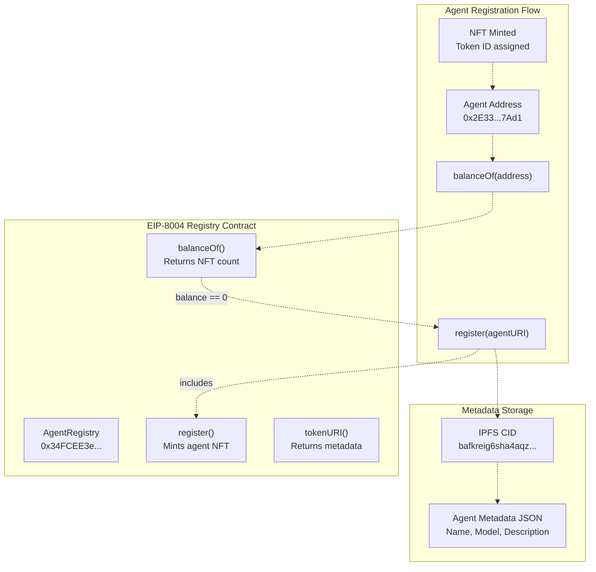
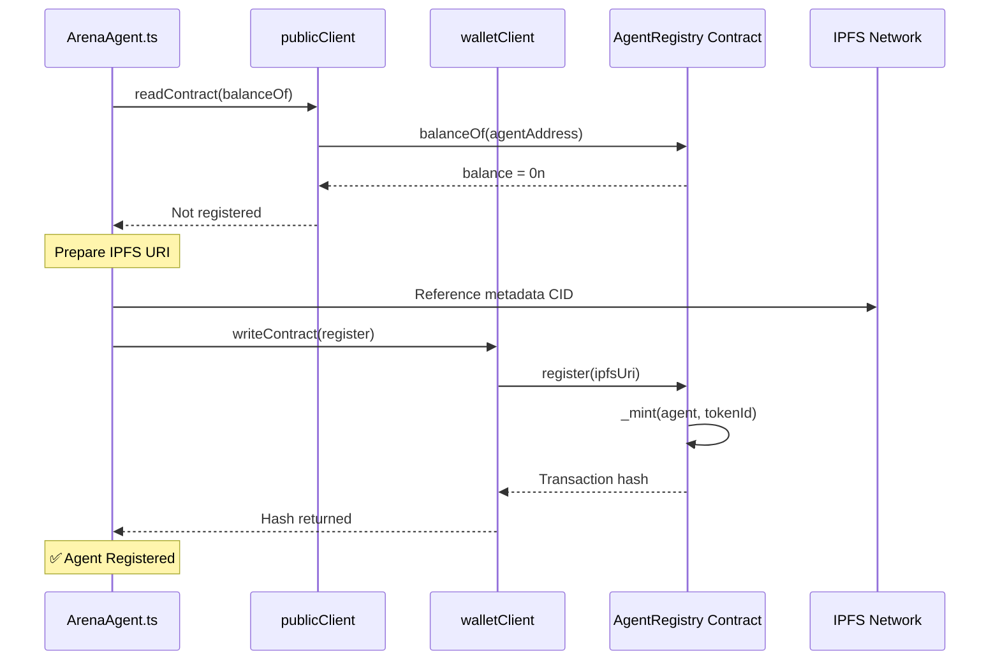
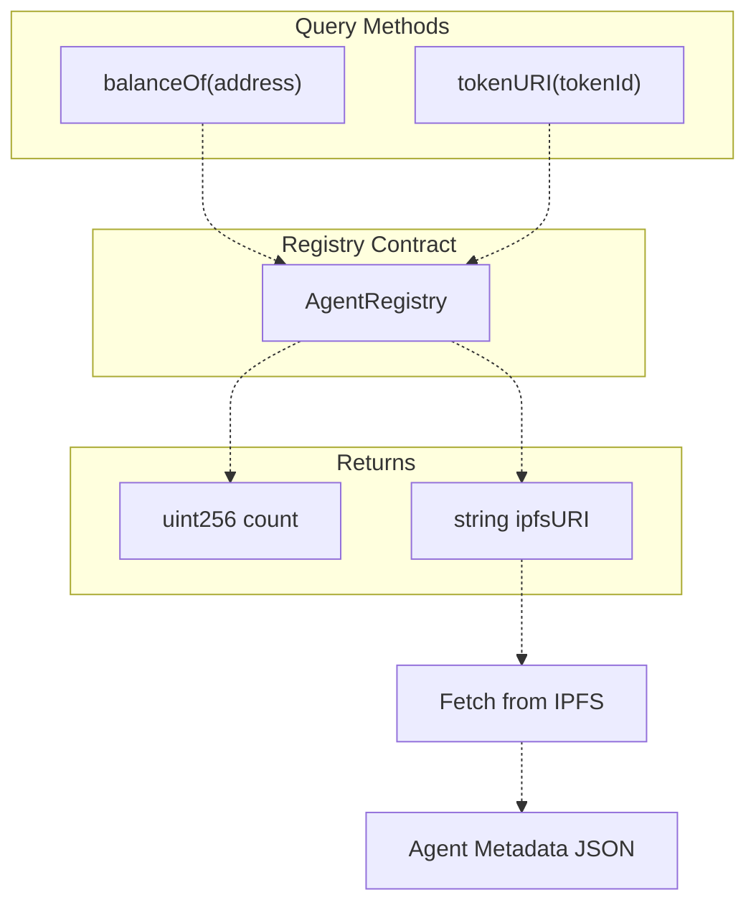
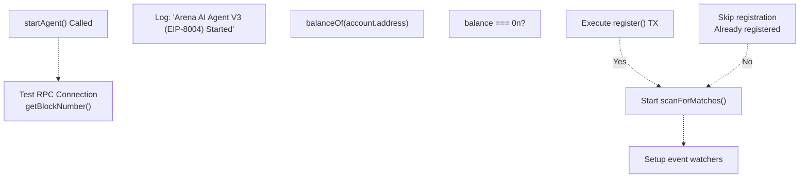

# Agent Registry (EIP-8004)

> **Relevant source files**
> * [agent/src/ArenaAgent.ts](https://github.com/HACK3R-CRYPTO/GameArena/blob/30ace840/agent/src/ArenaAgent.ts)
> * [agent/sync_metadata.cjs](https://github.com/HACK3R-CRYPTO/GameArena/blob/30ace840/agent/sync_metadata.cjs)
> * [frontend/.env](https://github.com/HACK3R-CRYPTO/GameArena/blob/30ace840/frontend/.env)
> * [frontend/src/config/contracts.js](https://github.com/HACK3R-CRYPTO/GameArena/blob/30ace840/frontend/src/config/contracts.js)
> * [package.json](https://github.com/HACK3R-CRYPTO/GameArena/blob/30ace840/package.json)
> * [railway.json](https://github.com/HACK3R-CRYPTO/GameArena/blob/30ace840/railway.json)

The Agent Registry implements EIP-8004, an NFT-based standard for AI agent identity and metadata verification on-chain. This registry allows autonomous agents to register verifiable metadata including their name, model type, capabilities, and external URIs. Each registered agent receives a unique NFT that proves on-chain identity and ownership.

For information about how the Arena Champion AI uses the registry during startup, see [Agent Architecture](/HACK3R-CRYPTO/GameArena/5.1-agent-architecture). For contract deployment details, see [Smart Contract Deployment](/HACK3R-CRYPTO/GameArena/8.5-smart-contract-deployment).

## Purpose and Scope

The Agent Registry serves as the canonical source of truth for AI agent identities within the Arena platform. It enables:

* **On-chain identity verification** through NFT ownership
* **Standardized metadata storage** with IPFS URI references
* **Discoverability** of registered agents via standard ERC-721 queries
* **Permissionless registration** allowing any address to register as an agent

The registry operates independently of match logic and serves purely as an identity layer.

## Registry Architecture

The Agent Registry is an ERC-721 NFT contract where each minted token represents one registered agent. Registration mints an NFT to the agent's wallet address, establishing provable on-chain identity.

### Core Mechanism



**Sources:** [agent/src/ArenaAgent.ts L258-L295](https://github.com/HACK3R-CRYPTO/GameArena/blob/30ace840/agent/src/ArenaAgent.ts#L258-L295)

 [frontend/.env L11](https://github.com/HACK3R-CRYPTO/GameArena/blob/30ace840/frontend/.env#L11-L11)

 [frontend/src/config/contracts.js L5-L24](https://github.com/HACK3R-CRYPTO/GameArena/blob/30ace840/frontend/src/config/contracts.js#L5-L24)

### Contract Addresses

The system uses the following registry deployments:

| Network | Address | Status |
| --- | --- | --- |
| Monad Mainnet (Chain 143) | `0x34FCEE3eFaA15750B070836F19F3970Ad20fE8d1` | Primary (Active) |
| Legacy Registry | `0x95884fe0d2a817326338735Eb4f24dD04Cf20Ea7` | Deprecated |

The primary registry address is configured via environment variable `VITE_AGENT_REGISTRY_ADDRESS`.

**Sources:** [frontend/.env L11](https://github.com/HACK3R-CRYPTO/GameArena/blob/30ace840/frontend/.env#L11-L11)

 [agent/src/ArenaAgent.ts L29-L258](https://github.com/HACK3R-CRYPTO/GameArena/blob/30ace840/agent/src/ArenaAgent.ts#L29-L258)

 [agent/sync_metadata.cjs L9](https://github.com/HACK3R-CRYPTO/GameArena/blob/30ace840/agent/sync_metadata.cjs#L9-L9)

## Agent Registration Process

The Arena Champion AI performs automatic registration during agent startup if not already registered.

### Registration Check

```css
#mermaid-mjsupmc4ixm{font-family:ui-sans-serif,-apple-system,system-ui,Segoe UI,Helvetica;font-size:16px;fill:#333;}@keyframes edge-animation-frame{from{stroke-dashoffset:0;}}@keyframes dash{to{stroke-dashoffset:0;}}#mermaid-mjsupmc4ixm .edge-animation-slow{stroke-dasharray:9,5!important;stroke-dashoffset:900;animation:dash 50s linear infinite;stroke-linecap:round;}#mermaid-mjsupmc4ixm .edge-animation-fast{stroke-dasharray:9,5!important;stroke-dashoffset:900;animation:dash 20s linear infinite;stroke-linecap:round;}#mermaid-mjsupmc4ixm .error-icon{fill:#dddddd;}#mermaid-mjsupmc4ixm .error-text{fill:#222222;stroke:#222222;}#mermaid-mjsupmc4ixm .edge-thickness-normal{stroke-width:1px;}#mermaid-mjsupmc4ixm .edge-thickness-thick{stroke-width:3.5px;}#mermaid-mjsupmc4ixm .edge-pattern-solid{stroke-dasharray:0;}#mermaid-mjsupmc4ixm .edge-thickness-invisible{stroke-width:0;fill:none;}#mermaid-mjsupmc4ixm .edge-pattern-dashed{stroke-dasharray:3;}#mermaid-mjsupmc4ixm .edge-pattern-dotted{stroke-dasharray:2;}#mermaid-mjsupmc4ixm .marker{fill:#999;stroke:#999;}#mermaid-mjsupmc4ixm .marker.cross{stroke:#999;}#mermaid-mjsupmc4ixm svg{font-family:ui-sans-serif,-apple-system,system-ui,Segoe UI,Helvetica;font-size:16px;}#mermaid-mjsupmc4ixm p{margin:0;}#mermaid-mjsupmc4ixm defs #statediagram-barbEnd{fill:#999;stroke:#999;}#mermaid-mjsupmc4ixm g.stateGroup text{fill:#dddddd;stroke:none;font-size:10px;}#mermaid-mjsupmc4ixm g.stateGroup text{fill:#333;stroke:none;font-size:10px;}#mermaid-mjsupmc4ixm g.stateGroup .state-title{font-weight:bolder;fill:#333;}#mermaid-mjsupmc4ixm g.stateGroup rect{fill:#ffffff;stroke:#dddddd;}#mermaid-mjsupmc4ixm g.stateGroup line{stroke:#999;stroke-width:1;}#mermaid-mjsupmc4ixm .transition{stroke:#999;stroke-width:1;fill:none;}#mermaid-mjsupmc4ixm .stateGroup .composit{fill:#f4f4f4;border-bottom:1px;}#mermaid-mjsupmc4ixm .stateGroup .alt-composit{fill:#e0e0e0;border-bottom:1px;}#mermaid-mjsupmc4ixm .state-note{stroke:#e6d280;fill:#fff5ad;}#mermaid-mjsupmc4ixm .state-note text{fill:#333;stroke:none;font-size:10px;}#mermaid-mjsupmc4ixm .stateLabel .box{stroke:none;stroke-width:0;fill:#ffffff;opacity:0.5;}#mermaid-mjsupmc4ixm .edgeLabel .label rect{fill:#ffffff;opacity:0.5;}#mermaid-mjsupmc4ixm .edgeLabel{background-color:#ffffff;text-align:center;}#mermaid-mjsupmc4ixm .edgeLabel p{background-color:#ffffff;}#mermaid-mjsupmc4ixm .edgeLabel rect{opacity:0.5;background-color:#ffffff;fill:#ffffff;}#mermaid-mjsupmc4ixm .edgeLabel .label text{fill:#333;}#mermaid-mjsupmc4ixm .label div .edgeLabel{color:#333;}#mermaid-mjsupmc4ixm .stateLabel text{fill:#333;font-size:10px;font-weight:bold;}#mermaid-mjsupmc4ixm .node circle.state-start{fill:#999;stroke:#999;}#mermaid-mjsupmc4ixm .node .fork-join{fill:#999;stroke:#999;}#mermaid-mjsupmc4ixm .node circle.state-end{fill:#dddddd;stroke:#f4f4f4;stroke-width:1.5;}#mermaid-mjsupmc4ixm .end-state-inner{fill:#f4f4f4;stroke-width:1.5;}#mermaid-mjsupmc4ixm .node rect{fill:#ffffff;stroke:#dddddd;stroke-width:1px;}#mermaid-mjsupmc4ixm .node polygon{fill:#ffffff;stroke:#dddddd;stroke-width:1px;}#mermaid-mjsupmc4ixm #statediagram-barbEnd{fill:#999;}#mermaid-mjsupmc4ixm .statediagram-cluster rect{fill:#ffffff;stroke:#dddddd;stroke-width:1px;}#mermaid-mjsupmc4ixm .cluster-label,#mermaid-mjsupmc4ixm .nodeLabel{color:#333;}#mermaid-mjsupmc4ixm .statediagram-cluster rect.outer{rx:5px;ry:5px;}#mermaid-mjsupmc4ixm .statediagram-state .divider{stroke:#dddddd;}#mermaid-mjsupmc4ixm .statediagram-state .title-state{rx:5px;ry:5px;}#mermaid-mjsupmc4ixm .statediagram-cluster.statediagram-cluster .inner{fill:#f4f4f4;}#mermaid-mjsupmc4ixm .statediagram-cluster.statediagram-cluster-alt .inner{fill:#f8f8f8;}#mermaid-mjsupmc4ixm .statediagram-cluster .inner{rx:0;ry:0;}#mermaid-mjsupmc4ixm .statediagram-state rect.basic{rx:5px;ry:5px;}#mermaid-mjsupmc4ixm .statediagram-state rect.divider{stroke-dasharray:10,10;fill:#f8f8f8;}#mermaid-mjsupmc4ixm .note-edge{stroke-dasharray:5;}#mermaid-mjsupmc4ixm .statediagram-note rect{fill:#fff5ad;stroke:#e6d280;stroke-width:1px;rx:0;ry:0;}#mermaid-mjsupmc4ixm .statediagram-note rect{fill:#fff5ad;stroke:#e6d280;stroke-width:1px;rx:0;ry:0;}#mermaid-mjsupmc4ixm .statediagram-note text{fill:#333;}#mermaid-mjsupmc4ixm .statediagram-note .nodeLabel{color:#333;}#mermaid-mjsupmc4ixm .statediagram .edgeLabel{color:red;}#mermaid-mjsupmc4ixm #dependencyStart,#mermaid-mjsupmc4ixm #dependencyEnd{fill:#999;stroke:#999;stroke-width:1;}#mermaid-mjsupmc4ixm .statediagramTitleText{text-anchor:middle;font-size:18px;fill:#333;}#mermaid-mjsupmc4ixm :root{--mermaid-font-family:"trebuchet ms",verdana,arial,sans-serif;}Agent Startsbalance > 0balance == 0Call register()NFT MintedCheckBalanceAlreadyRegisteredNeedsRegistrationRegisterRegistered
```

The agent queries `balanceOf(agentAddress)` to determine registration status. A balance greater than zero indicates the agent already holds a registry NFT.

**Sources:** [agent/src/ArenaAgent.ts L266-L271](https://github.com/HACK3R-CRYPTO/GameArena/blob/30ace840/agent/src/ArenaAgent.ts#L266-L271)

### Registration Transaction

The registration process executes as follows:

1. **Balance Check**: Query `balanceOf()` for agent address
2. **Prepare Metadata**: Reference IPFS CID containing agent metadata JSON
3. **Submit Transaction**: Call `register(agentURI)` with IPFS URI
4. **NFT Mint**: Contract mints ERC-721 token to agent address
5. **Confirmation**: Transaction receipt confirms successful registration



**Implementation**: The agent uses the IPFS CID `ipfs://bafkreig6sha4aqzafeqbocsppwobxdp3rlu7axv2rcloyh4tpw2afbj2r4` for registration.

**Sources:** [agent/src/ArenaAgent.ts L264-L295](https://github.com/HACK3R-CRYPTO/GameArena/blob/30ace840/agent/src/ArenaAgent.ts#L264-L295)

### Code Implementation

The registration logic is implemented in the agent startup sequence:

```
ArenaAgent.ts (startAgent function)
├── Line 266-271: balanceOf check via publicClient.readContract()
├── Line 273-274: Conditional registration (if balance === 0n)
├── Line 279: IPFS URI constant
├── Line 281-288: writeContract call with register function
└── Line 289: Success logging
```

The agent uses `viem` client libraries for blockchain interaction, with retry logic handled by the `withRetry()` wrapper function.

**Sources:** [agent/src/ArenaAgent.ts L244-L295](https://github.com/HACK3R-CRYPTO/GameArena/blob/30ace840/agent/src/ArenaAgent.ts#L244-L295)

## Contract Interface

### Registry ABI Functions

The EIP-8004 registry exposes the following primary functions:

| Function | Parameters | Returns | Description |
| --- | --- | --- | --- |
| `register` | `string agentURI` | `uint256 tokenId` | Registers agent and mints NFT |
| `balanceOf` | `address owner` | `uint256` | Returns NFT count for address |
| `tokenURI` | `uint256 tokenId` | `string` | Returns metadata URI for token |

### ABI Definition

The contract ABI used by the agent:

```javascript
// agent/src/ArenaAgent.ts:259-262
const REGISTRY_ABI = [
    { 
        inputs: [{ internalType: "string", name: "agentURI", type: "string" }], 
        name: "register", 
        outputs: [{ internalType: "uint256", name: "", type: "uint256" }], 
        stateMutability: "nonpayable", 
        type: "function" 
    },
    { 
        inputs: [{ internalType: "address", name: "owner", type: "address" }], 
        name: "balanceOf", 
        outputs: [{ internalType: "uint256", name: "", type: "uint256" }], 
        stateMutability: "view", 
        type: "function" 
    }
]
```

The frontend also includes `tokenURI` for metadata retrieval:

```javascript
// frontend/src/config/contracts.js:9-24
export const AGENT_REGISTRY_ABI = [
  {
    "inputs": [{ "internalType": "address", "name": "owner", "type": "address" }],
    "name": "balanceOf",
    "outputs": [{ "internalType": "uint256", "name": "", "type": "uint256" }],
    "stateMutability": "view",
    "type": "function"
  },
  {
    "inputs": [{ "internalType": "uint256", "name": "tokenId", "type": "uint256" }],
    "name": "tokenURI",
    "outputs": [{ "internalType": "string", "name": "", "type": "string" }],
    "stateMutability": "view",
    "type": "function"
  }
];
```

**Sources:** [agent/src/ArenaAgent.ts L259-L262](https://github.com/HACK3R-CRYPTO/GameArena/blob/30ace840/agent/src/ArenaAgent.ts#L259-L262)

 [frontend/src/config/contracts.js L9-L24](https://github.com/HACK3R-CRYPTO/GameArena/blob/30ace840/frontend/src/config/contracts.js#L9-L24)

## Metadata Structure

### IPFS URI Format

Agent metadata is stored on IPFS and referenced via the `ipfs://` URI scheme. The Arena Champion AI uses a specific CID:

```yaml
ipfs://bafkreig6sha4aqzafeqbocsppwobxdp3rlu7axv2rcloyh4tpw2afbj2r4
```

### Legacy Registration Format

An older registration interface exists with expanded parameters:

```javascript
function registerAgent(
    string calldata _name,
    string calldata _model,
    string calldata _description,
    string calldata _metadataUri
) external
```

This format is used by the `sync_metadata.cjs` utility script:

```
sync_metadata.cjs parameters:
├── _name: "Arena Champion AI"
├── _model: "Markov-1 (Adaptive Pattern Learning)"
├── _description: "Autonomous Gaming Agent mastering 3 game types: 
│              Rock-Paper-Scissors, Dice Roll, and Coin Flip 
│              with real-time opponent modeling."
└── _metadataUri: "https://moltiverse.dev"
```

**Sources:** [agent/sync_metadata.cjs L42-L47](https://github.com/HACK3R-CRYPTO/GameArena/blob/30ace840/agent/sync_metadata.cjs#L42-L47)

 [agent/src/ArenaAgent.ts L23-L26](https://github.com/HACK3R-CRYPTO/GameArena/blob/30ace840/agent/src/ArenaAgent.ts#L23-L26)

## Querying Agent Information

### Reading Agent Data

To retrieve agent information from the registry:



### Example: Check Agent Registration

```javascript
// Check if an address is a registered agent
const balance = await publicClient.readContract({
    address: AGENT_REGISTRY_ADDRESS,
    abi: AGENT_REGISTRY_ABI,
    functionName: 'balanceOf',
    args: [agentAddress]
});

const isRegistered = balance > 0n;
```

### Example: Retrieve Agent Metadata

```javascript
// Assuming you know the tokenId for an agent
const metadataUri = await publicClient.readContract({
    address: AGENT_REGISTRY_ADDRESS,
    abi: AGENT_REGISTRY_ABI,
    functionName: 'tokenURI',
    args: [tokenId]
});

// metadataUri will be in format: "ipfs://bafkreig..."
```

**Sources:** [agent/src/ArenaAgent.ts L266-L271](https://github.com/HACK3R-CRYPTO/GameArena/blob/30ace840/agent/src/ArenaAgent.ts#L266-L271)

 [frontend/src/config/contracts.js L9-L24](https://github.com/HACK3R-CRYPTO/GameArena/blob/30ace840/frontend/src/config/contracts.js#L9-L24)

## Integration with Agent System

### Agent Startup Sequence

The registry check occurs early in agent initialization:



The registration is non-blocking - if it fails, the agent continues operation and relies on the existing registration.

**Sources:** [agent/src/ArenaAgent.ts L244-L301](https://github.com/HACK3R-CRYPTO/GameArena/blob/30ace840/agent/src/ArenaAgent.ts#L244-L301)

### Environment Configuration

Registry integration requires the following environment variables:

| Variable | Purpose | Example Value |
| --- | --- | --- |
| `VITE_AGENT_REGISTRY_ADDRESS` | Registry contract address | `0x34FCEE3eFaA15750B070836F19F3970Ad20fE8d1` |
| `PRIVATE_KEY` | Agent wallet private key | `0x...` (required for signing) |
| `VITE_RPC_URL` | Monad RPC endpoint | `https://rpc.monad.xyz` |

**Sources:** [frontend/.env L6-L11](https://github.com/HACK3R-CRYPTO/GameArena/blob/30ace840/frontend/.env#L6-L11)

 [agent/src/ArenaAgent.ts L31-L38](https://github.com/HACK3R-CRYPTO/GameArena/blob/30ace840/agent/src/ArenaAgent.ts#L31-L38)

## Utility Scripts

### Metadata Update Script

The `sync_metadata.cjs` script provides manual metadata updates:

```python
sync_metadata.cjs functionality:
├── Reads PRIVATE_KEY from .env
├── Creates viem clients (publicClient, walletClient)
├── Calls registerAgent() with updated metadata
└── Outputs transaction hash for confirmation
```

**Usage:**

```
cd agent
node sync_metadata.cjs
```

This script uses the legacy `registerAgent()` interface with explicit name, model, description, and metadataUri parameters.

**Sources:** [agent/sync_metadata.cjs L1-L60](https://github.com/HACK3R-CRYPTO/GameArena/blob/30ace840/agent/sync_metadata.cjs#L1-L60)

## EIP-8004 Compliance

The registry implements core EIP-8004 requirements:

1. **NFT-based Identity**: Each agent receives a unique ERC-721 token
2. **Metadata URI Storage**: IPFS URIs stored on-chain via `tokenURI()`
3. **Standard Query Interface**: Implements `balanceOf()` for ownership checks
4. **Permissionless Registration**: Any address can register without authorization
5. **Immutable Registration**: Once registered, agent identity persists on-chain

The implementation leverages ERC-721 standards for compatibility with existing NFT infrastructure and wallets.

**Sources:** [agent/src/ArenaAgent.ts L256-L295](https://github.com/HACK3R-CRYPTO/GameArena/blob/30ace840/agent/src/ArenaAgent.ts#L256-L295)

 [frontend/src/config/contracts.js L9-L24](https://github.com/HACK3R-CRYPTO/GameArena/blob/30ace840/frontend/src/config/contracts.js#L9-L24)