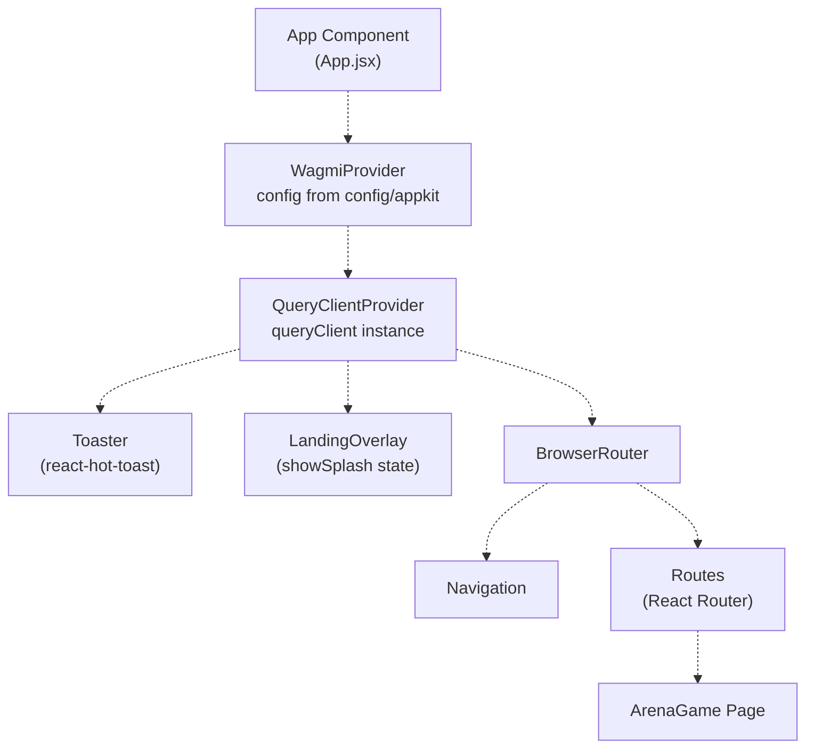
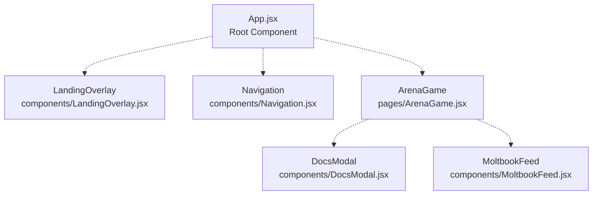
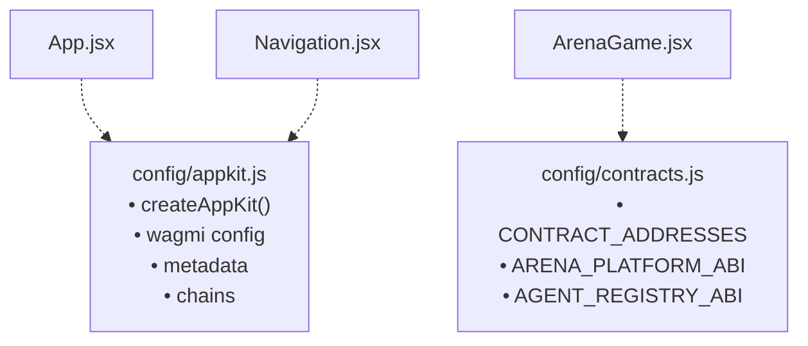
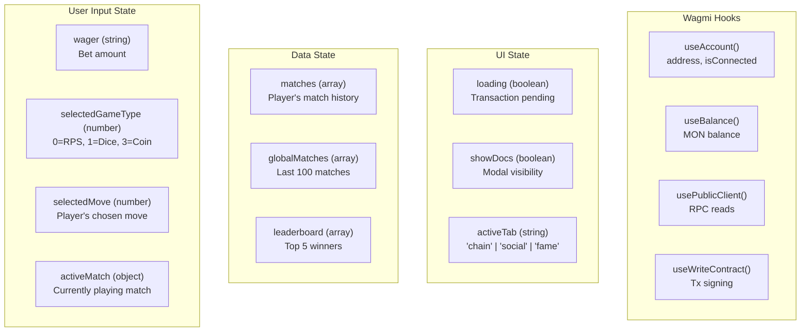
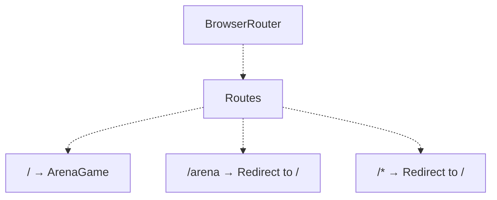
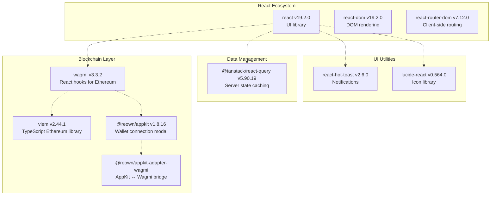
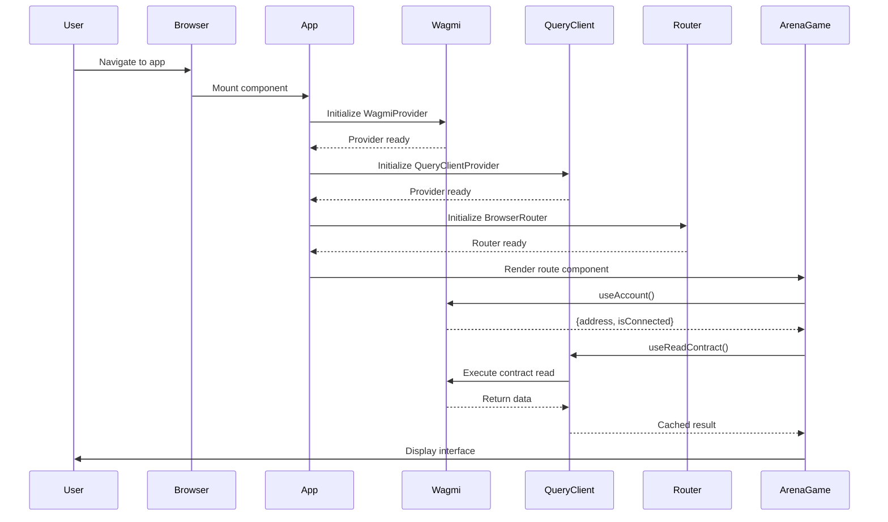

# Application Structure

> **Relevant source files**
> * [frontend/package-lock.json](https://github.com/HACK3R-CRYPTO/GameArena/blob/30ace840/frontend/package-lock.json)
> * [frontend/package.json](https://github.com/HACK3R-CRYPTO/GameArena/blob/30ace840/frontend/package.json)
> * [frontend/src/App.jsx](https://github.com/HACK3R-CRYPTO/GameArena/blob/30ace840/frontend/src/App.jsx)
> * [frontend/src/components/DocsModal.jsx](https://github.com/HACK3R-CRYPTO/GameArena/blob/30ace840/frontend/src/components/DocsModal.jsx)
> * [frontend/src/pages/ArenaGame.jsx](https://github.com/HACK3R-CRYPTO/GameArena/blob/30ace840/frontend/src/pages/ArenaGame.jsx)

## Purpose and Scope

This document explains the structural organization of the Arena frontend application, including the component hierarchy, provider setup, routing configuration, and state management patterns. It covers the React application built with Vite, the provider architecture (Wagmi, TanStack Query), and how components are organized and communicate.

For details about specific UI components and their implementations, see [UI Components](/HACK3R-CRYPTO/GameArena/6.6-ui-components). For information about real-time data synchronization mechanisms, see [Real-Time Updates](/HACK3R-CRYPTO/GameArena/6.4-real-time-updates). For wallet connection specifics, see [Wallet Integration](/HACK3R-CRYPTO/GameArena/6.3-wallet-integration).

---

## Application Entry Point

The application entry point is [frontend/src/App.jsx](https://github.com/HACK3R-CRYPTO/GameArena/blob/30ace840/frontend/src/App.jsx)

 which establishes the provider hierarchy and defines the routing structure. The component renders a splash screen (`LandingOverlay`) on first load, then reveals the main application interface.

### Provider Hierarchy

**Sources:** [frontend/src/App.jsx L1-L57](https://github.com/HACK3R-CRYPTO/GameArena/blob/30ace840/frontend/src/App.jsx#L1-L57)

The provider nesting order is critical:

1. **WagmiProvider** (outermost) - Provides blockchain connection state and contract interaction capabilities to all child components
2. **QueryClientProvider** - Manages server-state caching and synchronization for contract reads
3. **Toaster** - Global notification system for transaction feedback
4. **LandingOverlay** - Conditional splash screen controlled by `showSplash` state
5. **BrowserRouter** - Client-side routing infrastructure
6. **Navigation** - Persistent header component with wallet controls
7. **Routes** - Route definitions mapping paths to page components

---

## Component Hierarchy

**Sources:** [frontend/src/App.jsx L1-L57](https://github.com/HACK3R-CRYPTO/GameArena/blob/30ace840/frontend/src/App.jsx#L1-L57)

 [frontend/src/pages/ArenaGame.jsx L1-L17](https://github.com/HACK3R-CRYPTO/GameArena/blob/30ace840/frontend/src/pages/ArenaGame.jsx#L1-L17)

### Component Responsibilities

| Component | File Path | Purpose | Key State |
| --- | --- | --- | --- |
| `App` | `src/App.jsx` | Application root, provider setup | `showSplash` |
| `Navigation` | `src/components/Navigation.jsx` | Wallet connection, header UI | Managed by AppKit |
| `LandingOverlay` | `src/components/LandingOverlay.jsx` | Entry splash screen | Receives `onEnter` callback |
| `ArenaGame` | `src/pages/ArenaGame.jsx` | Main game interface | Extensive local state (see below) |
| `DocsModal` | `src/components/DocsModal.jsx` | System documentation modal | `isOpen` prop |
| `MoltbookFeed` | `src/components/MoltbookFeed.jsx` | Social activity feed | Internal state |

**Sources:** [frontend/src/App.jsx L1-L57](https://github.com/HACK3R-CRYPTO/GameArena/blob/30ace840/frontend/src/App.jsx#L1-L57)

 [frontend/src/pages/ArenaGame.jsx L17-L492](https://github.com/HACK3R-CRYPTO/GameArena/blob/30ace840/frontend/src/pages/ArenaGame.jsx#L17-L492)

 [frontend/src/components/DocsModal.jsx L1-L127](https://github.com/HACK3R-CRYPTO/GameArena/blob/30ace840/frontend/src/components/DocsModal.jsx#L1-L127)

---

## Configuration Architecture

The application uses two primary configuration modules that centralize contract addresses, ABIs, and provider settings.

**Sources:** [frontend/src/pages/ArenaGame.jsx L6](https://github.com/HACK3R-CRYPTO/GameArena/blob/30ace840/frontend/src/pages/ArenaGame.jsx#L6-L6)

 [frontend/src/App.jsx L5](https://github.com/HACK3R-CRYPTO/GameArena/blob/30ace840/frontend/src/App.jsx#L5-L5)

### Configuration Modules

**`config/appkit.js`** exports:

* `config` - Wagmi configuration object with Monad chain definitions
* `createAppKit()` - Initializes the wallet connection modal
* Project metadata (name, description, icons)
* Chain configurations for Monad mainnet (Chain ID 143)

**`config/contracts.js`** exports:

* `CONTRACT_ADDRESSES` - Object mapping contract names to deployed addresses: * `ARENA_PLATFORM` - Main game contract * `AI_AGENT` - Arena Champion AI wallet address * `AGENT_REGISTRY` - EIP-8004 registry address * Additional token/faucet addresses
* `ARENA_PLATFORM_ABI` - Complete ABI for match interactions
* `AGENT_REGISTRY_ABI` - EIP-8004 standard functions

**Sources:** [frontend/src/pages/ArenaGame.jsx L6](https://github.com/HACK3R-CRYPTO/GameArena/blob/30ace840/frontend/src/pages/ArenaGame.jsx#L6-L6)

 [frontend/src/App.jsx L5](https://github.com/HACK3R-CRYPTO/GameArena/blob/30ace840/frontend/src/App.jsx#L5-L5)

---

## State Management Patterns

The application uses **local component state** exclusively - there is no global state management library (Redux, Zustand, etc.). State is managed through React hooks within individual components.

### ArenaGame State Variables

**Sources:** [frontend/src/pages/ArenaGame.jsx L18-L31](https://github.com/HACK3R-CRYPTO/GameArena/blob/30ace840/frontend/src/pages/ArenaGame.jsx#L18-L31)

### State Update Flow

The `ArenaGame` component manages state through several patterns:

1. **User Input → Local State:** Direct `setState` calls from form inputs ([frontend/src/pages/ArenaGame.jsx L585](https://github.com/HACK3R-CRYPTO/GameArena/blob/30ace840/frontend/src/pages/ArenaGame.jsx#L585-L585) )
2. **Blockchain Read → Local State:** `useReadContract` hook stores results, then `fetchMatchDetails()` updates `matches` ([frontend/src/pages/ArenaGame.jsx L277-L286](https://github.com/HACK3R-CRYPTO/GameArena/blob/30ace840/frontend/src/pages/ArenaGame.jsx#L277-L286) )
3. **Events → State Refresh:** `useArenaEvents` hook triggers `refetchMatches()` which updates data ([frontend/src/pages/ArenaGame.jsx L311-L326](https://github.com/HACK3R-CRYPTO/GameArena/blob/30ace840/frontend/src/pages/ArenaGame.jsx#L311-L326) )
4. **Periodic Polling → State Sync:** 30-second interval calls `refetchMatches()` and `fetchGlobalMatches()` ([frontend/src/pages/ArenaGame.jsx L329-L341](https://github.com/HACK3R-CRYPTO/GameArena/blob/30ace840/frontend/src/pages/ArenaGame.jsx#L329-L341) )

**Sources:** [frontend/src/pages/ArenaGame.jsx L22-L31](https://github.com/HACK3R-CRYPTO/GameArena/blob/30ace840/frontend/src/pages/ArenaGame.jsx#L22-L31)

 [frontend/src/pages/ArenaGame.jsx L277-L353](https://github.com/HACK3R-CRYPTO/GameArena/blob/30ace840/frontend/src/pages/ArenaGame.jsx#L277-L353)

### No Global State Manager

The application deliberately avoids global state management libraries. Component communication occurs through:

* **Props:** Parent → Child data flow (e.g., `DocsModal` receives `isOpen` and `onClose`)
* **Wagmi Hooks:** Shared blockchain state accessed via hooks in each component
* **TanStack Query:** Cached contract reads shared across components automatically
* **Event System:** `useArenaEvents` hook provides event-driven updates

**Sources:** [frontend/src/pages/ArenaGame.jsx L495](https://github.com/HACK3R-CRYPTO/GameArena/blob/30ace840/frontend/src/pages/ArenaGame.jsx#L495-L495)

 [frontend/src/components/DocsModal.jsx L4](https://github.com/HACK3R-CRYPTO/GameArena/blob/30ace840/frontend/src/components/DocsModal.jsx#L4-L4)

---

## Routing Structure

The application uses React Router v7 with a minimal route configuration.

**Sources:** [frontend/src/App.jsx L35-L48](https://github.com/HACK3R-CRYPTO/GameArena/blob/30ace840/frontend/src/App.jsx#L35-L48)

### Route Definitions

| Path | Component | Behavior |
| --- | --- | --- |
| `/` | `ArenaGame` | Main game interface |
| `/arena` | `Navigate to="/" replace` | Legacy redirect |
| `/*` | `Navigate to="/" replace` | Catch-all 404 handler |

The single-page application (SPA) uses client-side routing exclusively. All routes resolve to the same `ArenaGame` component, with the splash screen (`LandingOverlay`) shown on initial load only.

**Sources:** [frontend/src/App.jsx L43-L47](https://github.com/HACK3R-CRYPTO/GameArena/blob/30ace840/frontend/src/App.jsx#L43-L47)

---

## Key Dependencies and Their Roles

### Core Framework Dependencies

**Sources:** [frontend/package.json L12-L28](https://github.com/HACK3R-CRYPTO/GameArena/blob/30ace840/frontend/package.json#L12-L28)

### Dependency Roles

| Package | Version | Purpose in Application |
| --- | --- | --- |
| **wagmi** | 3.3.2 | Provides React hooks (`useAccount`, `useReadContract`, `useWriteContract`, `usePublicClient`, `useWatchContractEvent`) for blockchain interactions |
| **viem** | 2.44.1 | Low-level Ethereum library; used for `parseEther`, `formatEther`, `parseAbiItem`, `multicall` operations |
| **@reown/appkit** | 1.8.16 | Wallet connection UI modal; exports `createAppKit()` and `useAppKit()` hook |
| **@tanstack/react-query** | 5.90.19 | Caches `useReadContract` results; manages refetch logic and stale data |
| **react-hot-toast** | 2.6.0 | Displays transaction status notifications (loading, success, error) |
| **react-router-dom** | 7.12.0 | Provides `BrowserRouter`, `Routes`, `Route`, `Navigate` components |
| **lucide-react** | 0.564.0 | Icon components (e.g., `BookOpen` in DocsModal, icons in UI) |

**Sources:** [frontend/package.json L12-L28](https://github.com/HACK3R-CRYPTO/GameArena/blob/30ace840/frontend/package.json#L12-L28)

 [frontend/src/pages/ArenaGame.jsx L2-L8](https://github.com/HACK3R-CRYPTO/GameArena/blob/30ace840/frontend/src/pages/ArenaGame.jsx#L2-L8)

### Build and Development Tools

| Tool | Version | Purpose |
| --- | --- | --- |
| **vite** | 7.2.4 | Development server and production bundler |
| **@vitejs/plugin-react** | 5.1.1 | Fast refresh and JSX transformation |
| **tailwindcss** | 4.1.18 | Utility-first CSS framework |
| **eslint** | 9.39.1 | Code linting and quality checks |

**Sources:** [frontend/package.json L30-L43](https://github.com/HACK3R-CRYPTO/GameArena/blob/30ace840/frontend/package.json#L30-L43)

---

## Initialization Sequence

The application initialization follows a specific order to ensure providers are ready before components mount.

**Sources:** [frontend/src/App.jsx L14-L55](https://github.com/HACK3R-CRYPTO/GameArena/blob/30ace840/frontend/src/App.jsx#L14-L55)

### Mounting Lifecycle

1. **App Component Mounts:** Initializes `showSplash` state to `true` ([frontend/src/App.jsx L16](https://github.com/HACK3R-CRYPTO/GameArena/blob/30ace840/frontend/src/App.jsx#L16-L16) )
2. **Providers Initialize:** Wagmi connects to Monad RPC, QueryClient creates cache instance
3. **LandingOverlay Displays:** Splash screen shown while blur effect applied to main content ([frontend/src/App.jsx L31-L42](https://github.com/HACK3R-CRYPTO/GameArena/blob/30ace840/frontend/src/App.jsx#L31-L42) )
4. **Router Resolves:** Route matches, `ArenaGame` component prepares to mount
5. **ArenaGame Mounts:** Executes hooks (`useAccount`, `useBalance`, `useReadContract`) ([frontend/src/pages/ArenaGame.jsx L18-L44](https://github.com/HACK3R-CRYPTO/GameArena/blob/30ace840/frontend/src/pages/ArenaGame.jsx#L18-L44) )
6. **Data Fetching Begins:** `fetchMatchDetails()` and `fetchGlobalMatches()` execute ([frontend/src/pages/ArenaGame.jsx L46-L245](https://github.com/HACK3R-CRYPTO/GameArena/blob/30ace840/frontend/src/pages/ArenaGame.jsx#L46-L245) )
7. **Event Watchers Start:** `useArenaEvents` hook establishes blockchain event listeners ([frontend/src/pages/ArenaGame.jsx L311](https://github.com/HACK3R-CRYPTO/GameArena/blob/30ace840/frontend/src/pages/ArenaGame.jsx#L311-L311) )
8. **User Interaction Ready:** `onEnter` callback from LandingOverlay sets `showSplash` to `false`, revealing interface ([frontend/src/App.jsx L32](https://github.com/HACK3R-CRYPTO/GameArena/blob/30ace840/frontend/src/App.jsx#L32-L32) )

**Sources:** [frontend/src/App.jsx L14-L55](https://github.com/HACK3R-CRYPTO/GameArena/blob/30ace840/frontend/src/App.jsx#L14-L55)

 [frontend/src/pages/ArenaGame.jsx L17-L353](https://github.com/HACK3R-CRYPTO/GameArena/blob/30ace840/frontend/src/pages/ArenaGame.jsx#L17-L353)