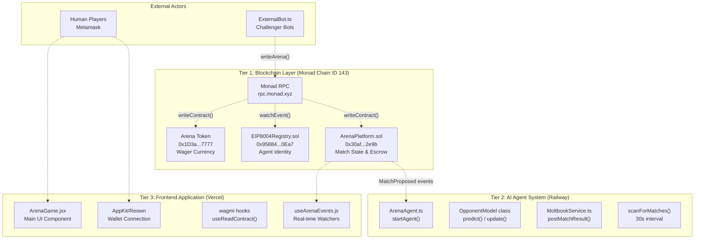
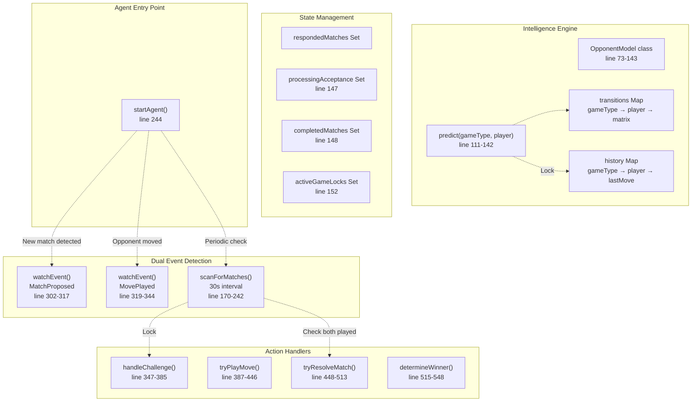
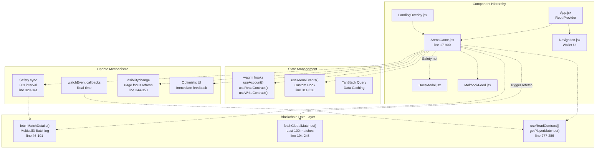
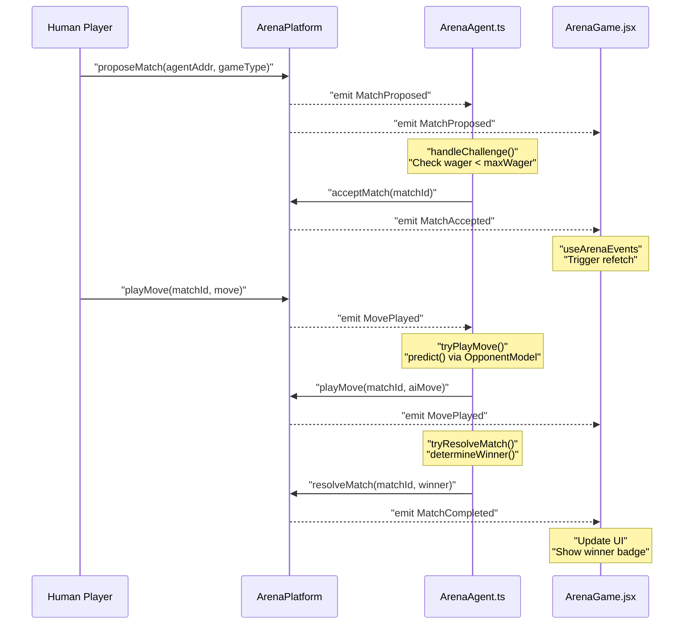
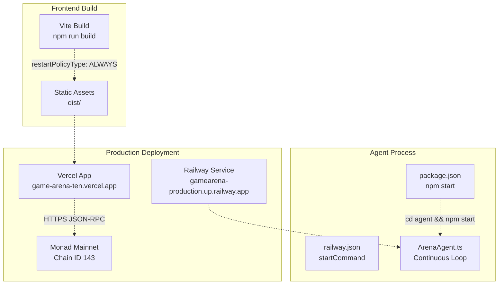

# Architecture

> **Relevant source files**
> * [README.md](https://github.com/HACK3R-CRYPTO/GameArena/blob/30ace840/README.md)
> * [agent/src/ArenaAgent.ts](https://github.com/HACK3R-CRYPTO/GameArena/blob/30ace840/agent/src/ArenaAgent.ts)
> * [frontend/src/pages/ArenaGame.jsx](https://github.com/HACK3R-CRYPTO/GameArena/blob/30ace840/frontend/src/pages/ArenaGame.jsx)
> * [package.json](https://github.com/HACK3R-CRYPTO/GameArena/blob/30ace840/package.json)
> * [railway.json](https://github.com/HACK3R-CRYPTO/GameArena/blob/30ace840/railway.json)

## Purpose and Scope

This document describes the high-level system architecture of the Arena AI Champion platform, explaining how the three primary system layers—blockchain smart contracts, autonomous AI agent, and frontend application—interact to enable 1v1 wagering matches between humans, AI agents, and external bots on the Monad blockchain.

This page focuses on the overall system design and component interactions. For detailed information about specific subsystems, see:

* Match state transitions and game flow: [Match Lifecycle](/HACK3R-CRYPTO/GameArena/3.1-match-lifecycle)
* Blockchain event coordination mechanisms: [Event-Driven Communication](/HACK3R-CRYPTO/GameArena/3.2-event-driven-communication)
* Support for multiple participant types: [Multi-Actor Model](/HACK3R-CRYPTO/GameArena/3.3-multi-actor-model)
* Smart contract implementation details: [Smart Contracts](/HACK3R-CRYPTO/GameArena/4-smart-contracts)
* AI agent intelligence system: [AI Agent System](/HACK3R-CRYPTO/GameArena/5-ai-agent-system)
* Frontend application structure: [Frontend Application](/HACK3R-CRYPTO/GameArena/6-frontend-application)

---

## Three-Tier System Architecture

The Arena AI Champion platform operates as a three-tier distributed system where each layer has distinct responsibilities and communicates through the Monad blockchain as the single source of truth.



**Sources:** [agent/src/ArenaAgent.ts L1-L550](https://github.com/HACK3R-CRYPTO/GameArena/blob/30ace840/agent/src/ArenaAgent.ts#L1-L550)

 [frontend/src/pages/ArenaGame.jsx L1-L900](https://github.com/HACK3R-CRYPTO/GameArena/blob/30ace840/frontend/src/pages/ArenaGame.jsx#L1-L900)

 [README.md L52-L64](https://github.com/HACK3R-CRYPTO/GameArena/blob/30ace840/README.md#L52-L64)

---

## Blockchain Layer: Smart Contract Foundation

The blockchain layer consists of three deployed smart contracts on Monad mainnet (Chain ID: 143) that manage all state transitions, escrow funds, and provide verifiable agent identity.

### Contract Addresses and Roles

| Contract | Address | Primary Responsibilities |
| --- | --- | --- |
| **ArenaPlatform** | `0x30af30ec392b881b009a0c6b520ebe6d15722e9b` | Match state machine, wager escrow, move validation, prize distribution |
| **EIP8004Registry** | `0x95884fe0d2a817326338735Eb4f24dD04Cf20Ea7` | AI agent metadata storage, identity verification |
| **Arena Token** | `0x1D3a53f0F52053D301374647e70B87279D5F7777` | Alternative wager currency (MON is primary) |

The `ArenaPlatform` contract implements the core state machine with five key functions:

* `proposeMatch(address _opponent, uint8 _gameType)` - Creates new match with wager lock
* `acceptMatch(uint256 _matchId)` - Opponent deposits matching wager
* `playMove(uint256 _matchId, uint8 _move)` - Submit encrypted move commitment
* `resolveMatch(uint256 _matchId, address _winner)` - Determine winner and distribute prizes
* `getPlayerMatches(address _player)` - Query all matches for an address

**Sources:** [agent/src/ArenaAgent.ts L10-L21](https://github.com/HACK3R-CRYPTO/GameArena/blob/30ace840/agent/src/ArenaAgent.ts#L10-L21)

 [agent/src/ArenaAgent.ts L28-L29](https://github.com/HACK3R-CRYPTO/GameArena/blob/30ace840/agent/src/ArenaAgent.ts#L28-L29)

 [README.md L153-L161](https://github.com/HACK3R-CRYPTO/GameArena/blob/30ace840/README.md#L153-L161)

---

## AI Agent System: Autonomous Operation

The AI agent operates as a 24/7 Node.js service deployed on Railway, continuously monitoring the blockchain for match proposals and automatically responding with intelligent move selection.



**Sources:** [agent/src/ArenaAgent.ts L244-L300](https://github.com/HACK3R-CRYPTO/GameArena/blob/30ace840/agent/src/ArenaAgent.ts#L244-L300)

 [agent/src/ArenaAgent.ts L73-L143](https://github.com/HACK3R-CRYPTO/GameArena/blob/30ace840/agent/src/ArenaAgent.ts#L73-L143)

 [agent/src/ArenaAgent.ts L170-L242](https://github.com/HACK3R-CRYPTO/GameArena/blob/30ace840/agent/src/ArenaAgent.ts#L170-L242)

### Key Agent Components

**1. OpponentModel Class** [agent/src/ArenaAgent.ts L73-L143](https://github.com/HACK3R-CRYPTO/GameArena/blob/30ace840/agent/src/ArenaAgent.ts#L73-L143)

The `OpponentModel` maintains per-opponent, per-game-type Markov Chain transition matrices:

* `transitions`: 3D map storing move transition counts `[gameType][playerAddress][prevMove][nextMove]`
* `history`: Stores each player's last move per game type
* `update()`: Records new moves and updates transition probabilities
* `predict()`: Returns optimal counter-move based on learned patterns

**2. Dual Event Monitoring** [agent/src/ArenaAgent.ts L302-L344](https://github.com/HACK3R-CRYPTO/GameArena/blob/30ace840/agent/src/ArenaAgent.ts#L302-L344)

Two complementary systems ensure no matches are missed:

* **Real-time watchers**: `watchEvent()` callbacks for instant responses
* **Periodic scanner**: `scanForMatches()` every 30 seconds as safety net

**3. Concurrency Guards** [agent/src/ArenaAgent.ts L146-L153](https://github.com/HACK3R-CRYPTO/GameArena/blob/30ace840/agent/src/ArenaAgent.ts#L146-L153)

Four Set-based locks prevent race conditions:

* `respondedMatches`: Prevents duplicate challenge responses
* `processingAcceptance`: Locks matches during acceptance
* `activeGameLocks`: Prevents concurrent move submissions
* `completedMatches`: Permanent skip list for resolved matches

**Sources:** [agent/src/ArenaAgent.ts L73-L168](https://github.com/HACK3R-CRYPTO/GameArena/blob/30ace840/agent/src/ArenaAgent.ts#L73-L168)

 [agent/src/ArenaAgent.ts L244-L344](https://github.com/HACK3R-CRYPTO/GameArena/blob/30ace840/agent/src/ArenaAgent.ts#L244-L344)

---

## Frontend Application: Real-Time User Interface

The frontend is a React application built with Vite, deployed on Vercel, providing a responsive UI with multiple update mechanisms for low-latency blockchain data synchronization.



**Sources:** [frontend/src/pages/ArenaGame.jsx L1-L900](https://github.com/HACK3R-CRYPTO/GameArena/blob/30ace840/frontend/src/pages/ArenaGame.jsx#L1-L900)

### Frontend Data Optimization

The `ArenaGame` component implements a three-stage cascading fetch strategy using Multicall3 for ultra-efficient blockchain reads:

**Stage 1: Match Structs** [frontend/src/pages/ArenaGame.jsx L55-L62](https://github.com/HACK3R-CRYPTO/GameArena/blob/30ace840/frontend/src/pages/ArenaGame.jsx#L55-L62)

```
multicall([matches(0), matches(1), ..., matches(n)])
→ Returns all match metadata in single RPC call
```

**Stage 2: Move Status Checks** [frontend/src/pages/ArenaGame.jsx L68-L93](https://github.com/HACK3R-CRYPTO/GameArena/blob/30ace840/frontend/src/pages/ArenaGame.jsx#L68-L93)

```
For matches with status === 1 or 2:
  multicall([hasPlayed(id, challenger), hasPlayed(id, opponent)])
→ Only checks active/completed matches
```

**Stage 3: Actual Moves** [frontend/src/pages/ArenaGame.jsx L102-L148](https://github.com/HACK3R-CRYPTO/GameArena/blob/30ace840/frontend/src/pages/ArenaGame.jsx#L102-L148)

```
For players where hasPlayed === true:
  multicall([playerMoves(id, player)])
→ Only fetches moves that exist
```

This approach reduces RPC calls from `O(n * 3)` to `O(1) + O(active * 2) + O(moved)`, dramatically improving load times.

**Sources:** [frontend/src/pages/ArenaGame.jsx L46-L191](https://github.com/HACK3R-CRYPTO/GameArena/blob/30ace840/frontend/src/pages/ArenaGame.jsx#L46-L191)

---

## Communication Patterns

The system uses blockchain events as the primary communication bus between all components. The `ArenaPlatform` contract emits four core events that drive all system coordination:

| Event Name | Emitted By | Consumed By | Purpose |
| --- | --- | --- | --- |
| `MatchProposed` | `proposeMatch()` | Agent, Frontend | New match available for acceptance |
| `MatchAccepted` | `acceptMatch()` | Agent, Frontend | Match fully funded, moves can begin |
| `MovePlayed` | `playMove()` | Agent, Frontend | Player submitted move, check if both ready |
| `MatchCompleted` | `resolveMatch()` | Frontend | Winner determined, prizes distributed |



**Sources:** [agent/src/ArenaAgent.ts L10-L21](https://github.com/HACK3R-CRYPTO/GameArena/blob/30ace840/agent/src/ArenaAgent.ts#L10-L21)

 [agent/src/ArenaAgent.ts L302-L344](https://github.com/HACK3R-CRYPTO/GameArena/blob/30ace840/agent/src/ArenaAgent.ts#L302-L344)

 [frontend/src/pages/ArenaGame.jsx L311-L326](https://github.com/HACK3R-CRYPTO/GameArena/blob/30ace840/frontend/src/pages/ArenaGame.jsx#L311-L326)

---

## Network Configuration

All system components connect to the Monad blockchain through a unified RPC endpoint and chain configuration:

**Monad Mainnet Configuration** [agent/src/ArenaAgent.ts L42-L57](https://github.com/HACK3R-CRYPTO/GameArena/blob/30ace840/agent/src/ArenaAgent.ts#L42-L57)

```yaml
Chain ID: 143
Name: "Monad Mainnet"
RPC URL: https://rpc.monad.xyz
Native Currency: MON (18 decimals)
Multicall3: 0xcA11bde05977b3631167028862bE2a173976CA11
```

The agent creates two viem clients:

* `publicClient`: Read-only contract calls and event watching [agent/src/ArenaAgent.ts L59-L62](https://github.com/HACK3R-CRYPTO/GameArena/blob/30ace840/agent/src/ArenaAgent.ts#L59-L62)
* `walletClient`: Transaction signing with private key [agent/src/ArenaAgent.ts L64-L68](https://github.com/HACK3R-CRYPTO/GameArena/blob/30ace840/agent/src/ArenaAgent.ts#L64-L68)

The frontend uses wagmi hooks configured with the same chain definition through AppKit/Reown integration.

**Sources:** [agent/src/ArenaAgent.ts L42-L68](https://github.com/HACK3R-CRYPTO/GameArena/blob/30ace840/agent/src/ArenaAgent.ts#L42-L68)

 [README.md L52-L64](https://github.com/HACK3R-CRYPTO/GameArena/blob/30ace840/README.md#L52-L64)

---

## Deployment Architecture



**Railway Configuration** [railway.json L1-L11](https://github.com/HACK3R-CRYPTO/GameArena/blob/30ace840/railway.json#L1-L11)

* Builder: NIXPACKS (auto-detects Node.js)
* Start command: `cd agent && npm install && npm start`
* Restart policy: `ALWAYS` (ensures 24/7 uptime)
* No healthcheck endpoint defined (relies on process monitoring)

**Root Package Script** [package.json L7-L8](https://github.com/HACK3R-CRYPTO/GameArena/blob/30ace840/package.json#L7-L8)

* Executes `cd agent && npm install && npm start` on Railway deploy
* Agent runs via `tsx` for TypeScript execution without compilation

**Sources:** [railway.json L1-L11](https://github.com/HACK3R-CRYPTO/GameArena/blob/30ace840/railway.json#L1-L11)

 [package.json L1-L16](https://github.com/HACK3R-CRYPTO/GameArena/blob/30ace840/package.json#L1-L16)

---

## Technology Stack Summary

| Layer | Technologies | Key Libraries |
| --- | --- | --- |
| **Blockchain** | Solidity, Foundry | OpenZeppelin contracts |
| **AI Agent** | Node.js v20+, TypeScript | viem, dotenv, chalk |
| **Frontend** | React 18, Vite 5 | wagmi, @reown/appkit, TanStack Query |
| **Deployment** | Railway (agent), Vercel (frontend) | tsx, nixpacks |
| **External** | Moltbook API, Google Gemini AI | Custom service wrappers |

The system requires Node.js 18+ and uses viem as the unified Ethereum library across both agent and frontend for consistency. All components communicate exclusively through the Monad RPC endpoint, ensuring the blockchain remains the single source of truth for all match state.

**Sources:** [agent/src/ArenaAgent.ts L1-L8](https://github.com/HACK3R-CRYPTO/GameArena/blob/30ace840/agent/src/ArenaAgent.ts#L1-L8)

 [package.json L13-L15](https://github.com/HACK3R-CRYPTO/GameArena/blob/30ace840/package.json#L13-L15)

 [README.md L52-L64](https://github.com/HACK3R-CRYPTO/GameArena/blob/30ace840/README.md#L52-L64)