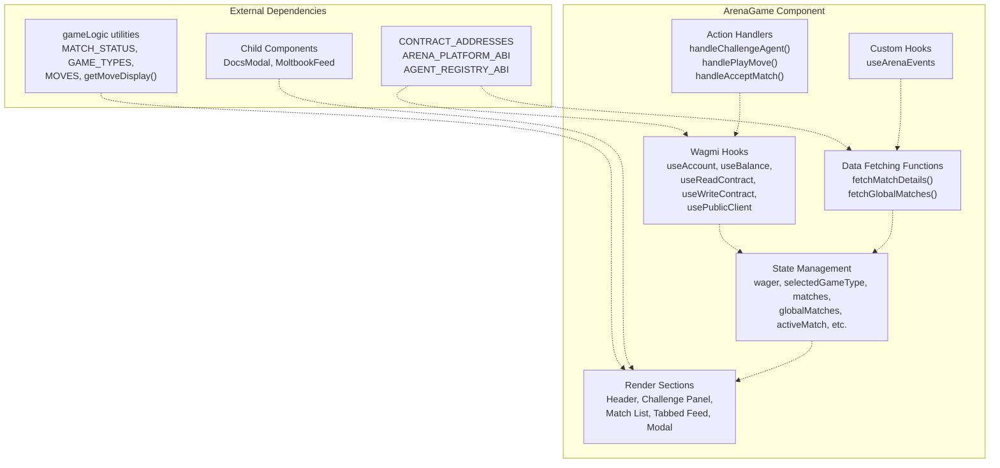
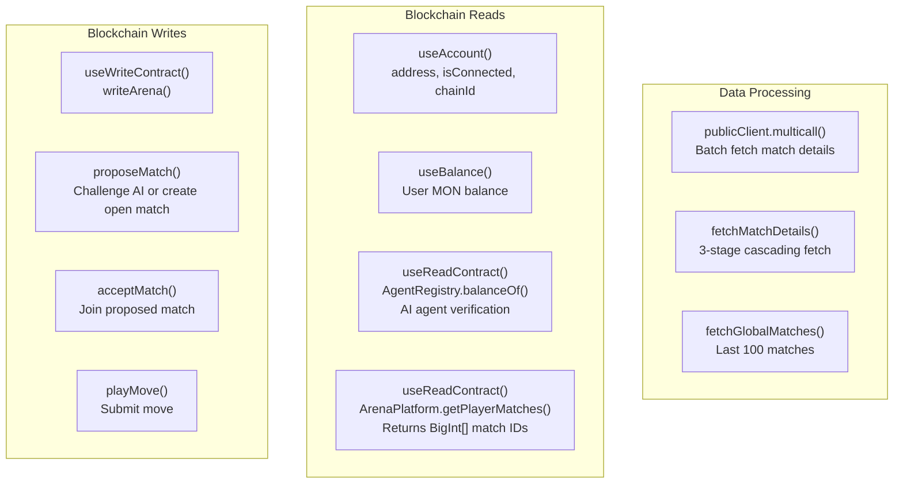
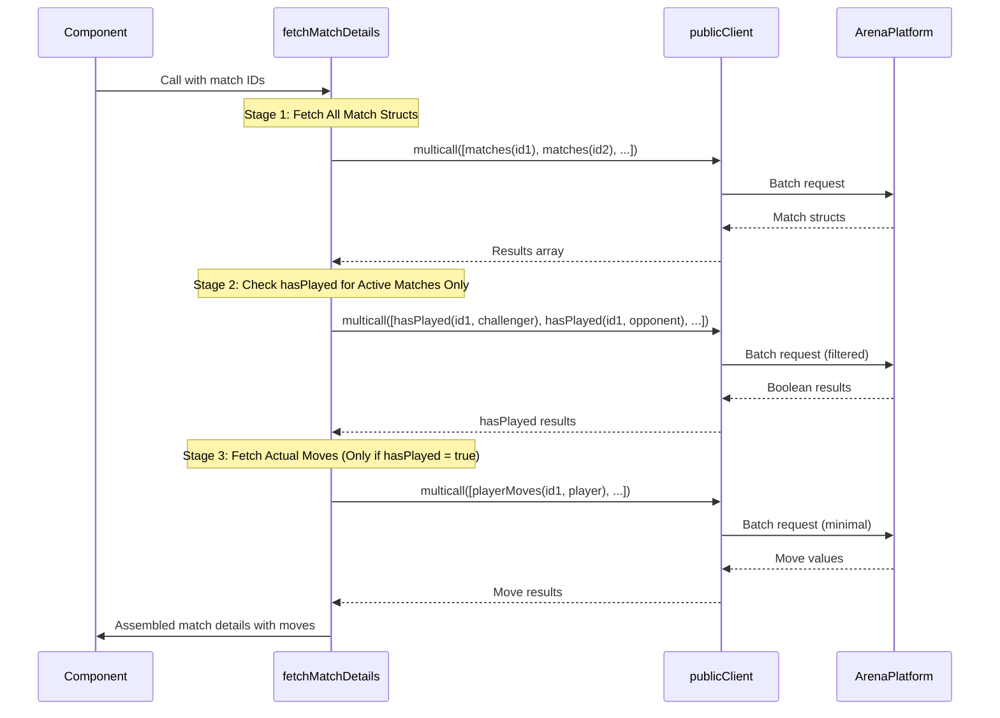
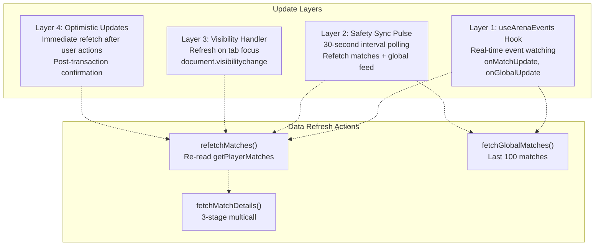
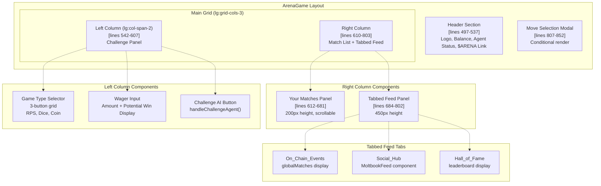
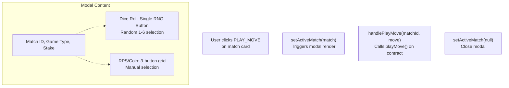

# ArenaGame Component

> **Relevant source files**
> * [frontend/src/pages/ArenaGame.jsx](https://github.com/HACK3R-CRYPTO/GameArena/blob/30ace840/frontend/src/pages/ArenaGame.jsx)
> * [frontend/src/utils/gameLogic.js](https://github.com/HACK3R-CRYPTO/GameArena/blob/30ace840/frontend/src/utils/gameLogic.js)

The `ArenaGame` component is the primary user interface for the Arena platform. It provides the main game interaction screen where users challenge the AI agent, view their active matches, browse global match history, and execute moves. This component orchestrates all frontend blockchain interactions, real-time event monitoring, and UI state management.

For information about the overall application structure and routing, see [Application Structure](/HACK3R-CRYPTO/GameArena/6.1-application-structure). For details on wallet connection, see [Wallet Integration](/HACK3R-CRYPTO/GameArena/6.3-wallet-integration). For the event monitoring system, see [Real-Time Updates](/HACK3R-CRYPTO/GameArena/6.4-real-time-updates). For multicall optimization details, see [Blockchain Data Optimization](/HACK3R-CRYPTO/GameArena/6.5-blockchain-data-optimization).

## Component Architecture

The `ArenaGame` component is structured as a single-file React functional component located at [frontend/src/pages/ArenaGame.jsx](https://github.com/HACK3R-CRYPTO/GameArena/blob/30ace840/frontend/src/pages/ArenaGame.jsx)

 It integrates Wagmi hooks for blockchain interaction, custom event watchers for real-time updates, and optimized multicall batching for efficient data fetching.



**Sources:** [frontend/src/pages/ArenaGame.jsx L1-L859](https://github.com/HACK3R-CRYPTO/GameArena/blob/30ace840/frontend/src/pages/ArenaGame.jsx#L1-L859)

## State Management

The component maintains local state for UI interaction, match data, and loading states. All state is managed using React's `useState` hook.

| State Variable | Type | Purpose |
| --- | --- | --- |
| `wager` | string | User input for wager amount in MON |
| `selectedGameType` | number | Currently selected game type (0=RPS, 1=Dice, 3=Coin) |
| `matches` | array | User's personal matches fetched via `getPlayerMatches` |
| `globalMatches` | array | Last 100 matches for global feed display |
| `loading` | boolean | Transaction processing state |
| `activeMatch` | object | Match selected for move execution (triggers modal) |
| `selectedMove` | number | User's selected move in modal |
| `showDocs` | boolean | DocsModal visibility state |
| `activeTab` | string | Active tab in feed: 'chain', 'social', or 'fame' |
| `leaderboard` | array | Top 5 winners computed from globalMatches |

Additional refs track stale closure prevention:

* `playerMatchIdsRef`: Stores latest player match IDs to detect changes [frontend/src/pages/ArenaGame.jsx L289-L290](https://github.com/HACK3R-CRYPTO/GameArena/blob/30ace840/frontend/src/pages/ArenaGame.jsx#L289-L290)
* `matchesRef`: Stores latest matches state [frontend/src/pages/ArenaGame.jsx L290](https://github.com/HACK3R-CRYPTO/GameArena/blob/30ace840/frontend/src/pages/ArenaGame.jsx#L290-L290)

**Sources:** [frontend/src/pages/ArenaGame.jsx L22-L31](https://github.com/HACK3R-CRYPTO/GameArena/blob/30ace840/frontend/src/pages/ArenaGame.jsx#L22-L31)

 [frontend/src/pages/ArenaGame.jsx L289-L291](https://github.com/HACK3R-CRYPTO/GameArena/blob/30ace840/frontend/src/pages/ArenaGame.jsx#L289-L291)

## Blockchain Integration

The component integrates with the Monad blockchain through Wagmi hooks and custom contract readers.



**Agent Identity Verification (EIP-8004):**

The component verifies AI agent status by checking the `AgentRegistry.balanceOf()` for `CONTRACT_ADDRESSES.AI_AGENT`. A balance > 0 indicates an active registered agent.

[frontend/src/pages/ArenaGame.jsx L34-L41](https://github.com/HACK3R-CRYPTO/GameArena/blob/30ace840/frontend/src/pages/ArenaGame.jsx#L34-L41)

**Sources:** [frontend/src/pages/ArenaGame.jsx L18-L43](https://github.com/HACK3R-CRYPTO/GameArena/blob/30ace840/frontend/src/pages/ArenaGame.jsx#L18-L43)

## Ultra-Optimized Data Fetching

The `fetchMatchDetails` function implements a three-stage cascading multicall strategy to minimize RPC calls while fetching complete match data. This is critical for performance on Monad.

### Three-Stage Multicall Architecture



### Stage Breakdown

**Stage 1: Batch Fetch Match Structs** [frontend/src/pages/ArenaGame.jsx L54-L62](https://github.com/HACK3R-CRYPTO/GameArena/blob/30ace840/frontend/src/pages/ArenaGame.jsx#L54-L62)

Fetches all match struct data in a single multicall. Each match struct contains:

* `id`, `challenger`, `opponent`, `wager`, `gameType`, `status`, `winner`, `createdAt`

**Stage 2: Conditional hasPlayed Checks** [frontend/src/pages/ArenaGame.jsx L64-L99](https://github.com/HACK3R-CRYPTO/GameArena/blob/30ace840/frontend/src/pages/ArenaGame.jsx#L64-L99)

Only for matches with status `1` (Accepted) or `2` (Completed), checks if challenger/opponent have played. Skips proposed/cancelled matches entirely.

**Stage 3: Fetch Actual Moves** [frontend/src/pages/ArenaGame.jsx L101-L149](https://github.com/HACK3R-CRYPTO/GameArena/blob/30ace840/frontend/src/pages/ArenaGame.jsx#L101-L149)

Only fetches `playerMoves(matchId, player)` for players where `hasPlayed == true`. This minimizes unnecessary reads.

**Final Assembly** [frontend/src/pages/ArenaGame.jsx L150-L187](https://github.com/HACK3R-CRYPTO/GameArena/blob/30ace840/frontend/src/pages/ArenaGame.jsx#L150-L187)

Maps fetched moves back to matches and constructs final match objects with `challengerMove` and `opponentMove` populated.

**Optimization Impact:**

For a user with 10 matches (5 proposed, 3 active, 2 completed):

* **Naive approach:** 10 + (8 × 2) + (8 × 2) = 42 calls
* **Ultra-optimized approach:** 1 + 1 + 1 = 3 multicalls

**Sources:** [frontend/src/pages/ArenaGame.jsx L46-L191](https://github.com/HACK3R-CRYPTO/GameArena/blob/30ace840/frontend/src/pages/ArenaGame.jsx#L46-L191)

## Global Match Feed

The `fetchGlobalMatches` function retrieves the last 100 matches for the live activity feed.

**Implementation:** [frontend/src/pages/ArenaGame.jsx L194-L245](https://github.com/HACK3R-CRYPTO/GameArena/blob/30ace840/frontend/src/pages/ArenaGame.jsx#L194-L245)

1. Read `matchCounter` from contract
2. Calculate ID range: `[total - 100, total - 1]` in reverse order
3. Single multicall to fetch all match structs
4. Update `globalMatches` state

The leaderboard is computed client-side by aggregating winners from `globalMatches` [frontend/src/pages/ArenaGame.jsx L248-L269](https://github.com/HACK3R-CRYPTO/GameArena/blob/30ace840/frontend/src/pages/ArenaGame.jsx#L248-L269)

:

```javascript
const wins = {};
globalMatches.forEach(m => {
    if (m.status === 2 && m.winner !== '0x0000...') {
        wins[winner] = (wins[winner] || 0) + 1;
    }
});
// Sort and take top 5
```

**Sources:** [frontend/src/pages/ArenaGame.jsx L194-L269](https://github.com/HACK3R-CRYPTO/GameArena/blob/30ace840/frontend/src/pages/ArenaGame.jsx#L194-L269)

## Real-Time Update System

The component employs a four-layer update strategy to ensure data freshness.



### Event-Based Updates

The `useArenaEvents` custom hook monitors blockchain events and triggers callbacks:

[frontend/src/pages/ArenaGame.jsx L310-L326](https://github.com/HACK3R-CRYPTO/GameArena/blob/30ace840/frontend/src/pages/ArenaGame.jsx#L310-L326)

```javascript
useArenaEvents({
    onMatchUpdate: async () => {
        const { data: freshIds } = await refetchMatches();
        if (freshIds) fetchMatchDetails(freshIds);
    },
    onGlobalUpdate: () => {
        fetchGlobalMatches();
    },
    address,
    matches
});
```

### Safety Sync Pulse

A 30-second interval ensures missed events are eventually caught:

[frontend/src/pages/ArenaGame.jsx L329-L341](https://github.com/HACK3R-CRYPTO/GameArena/blob/30ace840/frontend/src/pages/ArenaGame.jsx#L329-L341)

### Visibility Change Listener

Refreshes data when user returns to the tab:

[frontend/src/pages/ArenaGame.jsx L344-L353](https://github.com/HACK3R-CRYPTO/GameArena/blob/30ace840/frontend/src/pages/ArenaGame.jsx#L344-L353)

**Sources:** [frontend/src/pages/ArenaGame.jsx L310-L353](https://github.com/HACK3R-CRYPTO/GameArena/blob/30ace840/frontend/src/pages/ArenaGame.jsx#L310-L353)

## UI Layout Structure

The component renders a three-column responsive layout with header, challenge panel, match list, and tabbed feed.



### Header Section

[frontend/src/pages/ArenaGame.jsx L497-L537](https://github.com/HACK3R-CRYPTO/GameArena/blob/30ace840/frontend/src/pages/ArenaGame.jsx#L497-L537)

Displays:

* Platform title and contract address
* User MON balance from `useBalance()` hook
* AI agent online/offline status from `agentProfile.active`
* Link to purchase $ARENA token on nad.fun

### Challenge Panel (Left Column)

[frontend/src/pages/ArenaGame.jsx L542-L607](https://github.com/HACK3R-CRYPTO/GameArena/blob/30ace840/frontend/src/pages/ArenaGame.jsx#L542-L607)

**Game Type Selection:** Three-button grid for RPS, Dice, Coin [frontend/src/pages/ArenaGame.jsx L558-L572](https://github.com/HACK3R-CRYPTO/GameArena/blob/30ace840/frontend/src/pages/ArenaGame.jsx#L558-L572)

**Wager Input:** Text input with potential win calculation (wager × 2 × 0.98) [frontend/src/pages/ArenaGame.jsx L574-L590](https://github.com/HACK3R-CRYPTO/GameArena/blob/30ace840/frontend/src/pages/ArenaGame.jsx#L574-L590)

**Challenge Button:** Calls `handleChallengeAgent()` with `proposeMatch(AI_AGENT, gameType)` [frontend/src/pages/ArenaGame.jsx L598-L605](https://github.com/HACK3R-CRYPTO/GameArena/blob/30ace840/frontend/src/pages/ArenaGame.jsx#L598-L605)

### Your Matches Panel (Right Column)

[frontend/src/pages/ArenaGame.jsx L612-L681](https://github.com/HACK3R-CRYPTO/GameArena/blob/30ace840/frontend/src/pages/ArenaGame.jsx#L612-L681)

Displays user's personal matches from the `matches` state array. Each match card shows:

* Game type icon
* Match ID and status
* Wager amount
* Move icons if completed
* "PLAY_MOVE" button for accepted matches
* Win/loss/tie badge for completed matches

Match determination logic [frontend/src/pages/ArenaGame.jsx L625-L636](https://github.com/HACK3R-CRYPTO/GameArena/blob/30ace840/frontend/src/pages/ArenaGame.jsx#L625-L636)

:

```javascript
const isChallenger = m.challenger?.toLowerCase() === address?.toLowerCase();
const myMoveId = isChallenger ? m.challengerMove : m.opponentMove;
const oppMoveId = isChallenger ? m.opponentMove : m.challengerMove;
```

### Tabbed Feed Panel (Right Column)

[frontend/src/pages/ArenaGame.jsx L684-L802](https://github.com/HACK3R-CRYPTO/GameArena/blob/30ace840/frontend/src/pages/ArenaGame.jsx#L684-L802)

Three tabs controlled by `activeTab` state:

**1. On_Chain_Events Tab:** Displays `globalMatches` with match details, player addresses, and win/loss status [frontend/src/pages/ArenaGame.jsx L713-L750](https://github.com/HACK3R-CRYPTO/GameArena/blob/30ace840/frontend/src/pages/ArenaGame.jsx#L713-L750)

**2. Social_Hub Tab:** Renders `MoltbookFeed` component for AI agent's social posts [frontend/src/pages/ArenaGame.jsx L751-L758](https://github.com/HACK3R-CRYPTO/GameArena/blob/30ace840/frontend/src/pages/ArenaGame.jsx#L751-L758)

**3. Hall_of_Fame Tab:** Shows top 5 winners from `leaderboard` state with ranking badges [frontend/src/pages/ArenaGame.jsx L759-L799](https://github.com/HACK3R-CRYPTO/GameArena/blob/30ace840/frontend/src/pages/ArenaGame.jsx#L759-L799)

**Sources:** [frontend/src/pages/ArenaGame.jsx L492-L854](https://github.com/HACK3R-CRYPTO/GameArena/blob/30ace840/frontend/src/pages/ArenaGame.jsx#L492-L854)

## Move Selection Modal

The modal renders when `activeMatch` is set (non-null). It provides a terminal-style interface for move execution.

[frontend/src/pages/ArenaGame.jsx L807-L852](https://github.com/HACK3R-CRYPTO/GameArena/blob/30ace840/frontend/src/pages/ArenaGame.jsx#L807-L852)



**Dice Roll Special Case:** [frontend/src/pages/ArenaGame.jsx L824-L834](https://github.com/HACK3R-CRYPTO/GameArena/blob/30ace840/frontend/src/pages/ArenaGame.jsx#L824-L834)

For `gameType === 1` (Dice), a single button generates a random roll client-side:

```javascript
onClick={() => {
    const roll = Math.floor(Math.random() * 6) + 1;
    handlePlayMove(activeMatch.id, roll);
}}
```

**RPS/Coin Selection:** [frontend/src/pages/ArenaGame.jsx L836-L847](https://github.com/HACK3R-CRYPTO/GameArena/blob/30ace840/frontend/src/pages/ArenaGame.jsx#L836-L847)

Displays a 3-button grid of move options from `MOVES.RPS` or `MOVES.COIN`.

**Sources:** [frontend/src/pages/ArenaGame.jsx L807-L852](https://github.com/HACK3R-CRYPTO/GameArena/blob/30ace840/frontend/src/pages/ArenaGame.jsx#L807-L852)

## Action Handlers

All user actions are handled through async functions that interact with the blockchain via `writeArena()`.

### handleChallengeAgent

[frontend/src/pages/ArenaGame.jsx L403-L433](https://github.com/HACK3R-CRYPTO/GameArena/blob/30ace840/frontend/src/pages/ArenaGame.jsx#L403-L433)

**Purpose:** Propose a match to the AI agent.

**Flow:**

1. Validate wallet connection
2. Call `writeArena()` with `proposeMatch(AI_AGENT, selectedGameType)`
3. Send `wager` amount as transaction value
4. Wait for transaction confirmation via `publicClient.waitForTransactionReceipt()`
5. Show success toast and refetch matches

### handlePlayMove

[frontend/src/pages/ArenaGame.jsx L355-L401](https://github.com/HACK3R-CRYPTO/GameArena/blob/30ace840/frontend/src/pages/ArenaGame.jsx#L355-L401)

**Purpose:** Submit user's move for an accepted match.

**Flow:**

1. Call `writeArena()` with `playMove(matchId, move)`
2. Wait for confirmation
3. Display move-specific success message (e.g., "Selected Rock!")
4. Refetch matches immediately for optimistic UI update
5. If opponent is AI agent, show "AI is analyzing..." toast

**Move Display Labels:** [frontend/src/pages/ArenaGame.jsx L369-L380](https://github.com/HACK3R-CRYPTO/GameArena/blob/30ace840/frontend/src/pages/ArenaGame.jsx#L369-L380)

Converts numeric move IDs to human-readable labels based on game type.

### handleAcceptMatch

[frontend/src/pages/ArenaGame.jsx L465-L490](https://github.com/HACK3R-CRYPTO/GameArena/blob/30ace840/frontend/src/pages/ArenaGame.jsx#L465-L490)

**Purpose:** Accept an open or proposed match.

**Flow:**

1. Call `writeArena()` with `acceptMatch(matchId)`
2. Send `wagerAmount` as transaction value
3. Wait for confirmation
4. Refetch matches

### handleCreateMatch

[frontend/src/pages/ArenaGame.jsx L435-L463](https://github.com/HACK3R-CRYPTO/GameArena/blob/30ace840/frontend/src/pages/ArenaGame.jsx#L435-L463)

**Purpose:** Create an open challenge (opponent = address(0)).

**Flow:**

1. Call `writeArena()` with `proposeMatch(0x0000..., selectedGameType)`
2. Send wager as transaction value
3. Wait for confirmation
4. Refetch matches

**Sources:** [frontend/src/pages/ArenaGame.jsx L355-L490](https://github.com/HACK3R-CRYPTO/GameArena/blob/30ace840/frontend/src/pages/ArenaGame.jsx#L355-L490)

## Integration with Game Logic Utilities

The component imports game constants and helpers from `gameLogic.js`:

| Import | Purpose | Usage |
| --- | --- | --- |
| `MATCH_STATUS` | Array of status labels | Display match state in UI [frontend/src/pages/ArenaGame.jsx L652](https://github.com/HACK3R-CRYPTO/GameArena/blob/30ace840/frontend/src/pages/ArenaGame.jsx#L652-L652) |
| `GAME_TYPES` | Array of game config objects | Game selection grid [frontend/src/pages/ArenaGame.jsx L559](https://github.com/HACK3R-CRYPTO/GameArena/blob/30ace840/frontend/src/pages/ArenaGame.jsx#L559-L559) |
| `MOVES` | Object with RPS/DICE/COIN move arrays | Move selection modal [frontend/src/pages/ArenaGame.jsx L837](https://github.com/HACK3R-CRYPTO/GameArena/blob/30ace840/frontend/src/pages/ArenaGame.jsx#L837-L837) |
| `getMoveDisplay()` | Convert moveId to icon/label | Display completed match moves [frontend/src/pages/ArenaGame.jsx L634-L635](https://github.com/HACK3R-CRYPTO/GameArena/blob/30ace840/frontend/src/pages/ArenaGame.jsx#L634-L635) |

**Game Type Structure:** [frontend/src/utils/gameLogic.js L5-L9](https://github.com/HACK3R-CRYPTO/GameArena/blob/30ace840/frontend/src/utils/gameLogic.js#L5-L9)

```
{ id: 0, label: 'Rock-Paper-Scissors', icon: '✊', description: '...' }
{ id: 1, label: 'Dice Roll', icon: '🎲', description: '...' }
{ id: 3, label: 'Coin Flip', icon: '🪙', description: '...' }
```

**Sources:** [frontend/src/pages/ArenaGame.jsx L9](https://github.com/HACK3R-CRYPTO/GameArena/blob/30ace840/frontend/src/pages/ArenaGame.jsx#L9-L9)

 [frontend/src/utils/gameLogic.js L1-L46](https://github.com/HACK3R-CRYPTO/GameArena/blob/30ace840/frontend/src/utils/gameLogic.js#L1-L46)

## Performance Considerations

The component implements several optimizations to minimize RPC calls and prevent unnecessary re-renders:

1. **Ref-based stale closure prevention:** `playerMatchIdsRef` and `matchesRef` track latest values to avoid interval resets [frontend/src/pages/ArenaGame.jsx L289-L308](https://github.com/HACK3R-CRYPTO/GameArena/blob/30ace840/frontend/src/pages/ArenaGame.jsx#L289-L308)
2. **Conditional fetching:** Only fetches match details if IDs have changed [frontend/src/pages/ArenaGame.jsx L294-L308](https://github.com/HACK3R-CRYPTO/GameArena/blob/30ace840/frontend/src/pages/ArenaGame.jsx#L294-L308)
3. **Disabled polling on useReadContract:** `refetchInterval: false` prevents automatic polling [frontend/src/pages/ArenaGame.jsx L284](https://github.com/HACK3R-CRYPTO/GameArena/blob/30ace840/frontend/src/pages/ArenaGame.jsx#L284-L284)
4. **Cascading multicall stages:** Fetch moves only for active matches where players have actually moved
5. **Memoized event callbacks:** `useCallback` on fetch functions prevents recreation [frontend/src/pages/ArenaGame.jsx L46-L194](https://github.com/HACK3R-CRYPTO/GameArena/blob/30ace840/frontend/src/pages/ArenaGame.jsx#L46-L194)

**Sources:** [frontend/src/pages/ArenaGame.jsx L46-L353](https://github.com/HACK3R-CRYPTO/GameArena/blob/30ace840/frontend/src/pages/ArenaGame.jsx#L46-L353)

## Error Handling

All transaction handlers use try-catch blocks with toast notifications:

```javascript
try {
    const hash = await writeArena({ ... });
    toast.loading('Confirming transaction...', { id: toastId });
    await publicClient.waitForTransactionReceipt({ hash });
    toast.success('Success message', { id: toastId });
} catch (error) {
    console.error(error);
    toast.error('Failed message', { id: toastId });
} finally {
    setLoading(false);
}
```

Toast IDs ensure loading states are updated correctly on the same toast instance.

**Sources:** [frontend/src/pages/ArenaGame.jsx L355-L490](https://github.com/HACK3R-CRYPTO/GameArena/blob/30ace840/frontend/src/pages/ArenaGame.jsx#L355-L490)