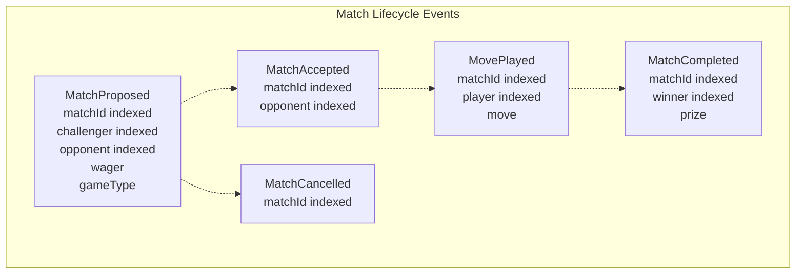
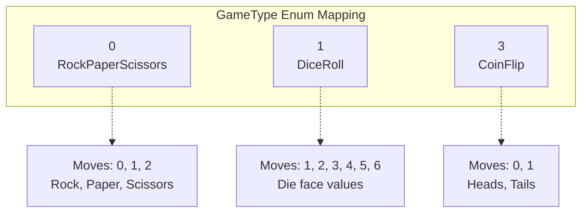
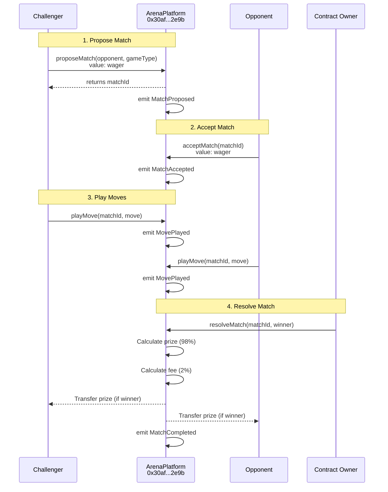
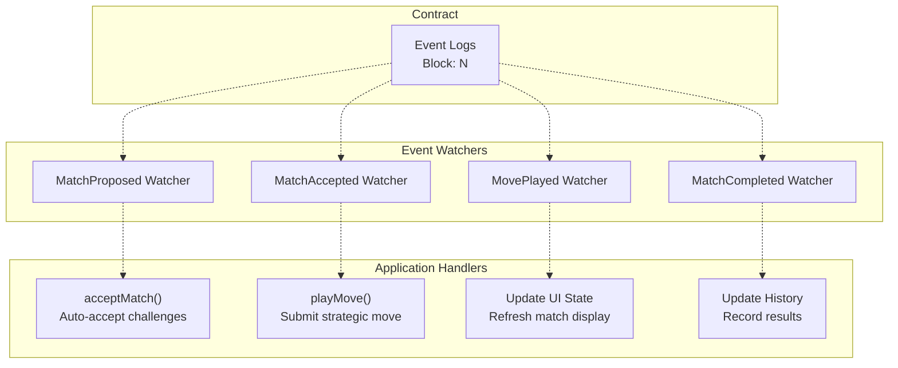

# ArenaPlatform ABI

> **Relevant source files**
> * [ARENA_SKILL.md](https://github.com/HACK3R-CRYPTO/GameArena/blob/30ace840/ARENA_SKILL.md)
> * [frontend/.env](https://github.com/HACK3R-CRYPTO/GameArena/blob/30ace840/frontend/.env)
> * [frontend/src/config/contracts.js](https://github.com/HACK3R-CRYPTO/GameArena/blob/30ace840/frontend/src/config/contracts.js)

This page documents the complete Application Binary Interface (ABI) for the ArenaPlatform smart contract deployed at `0x30af30ec392b881b009a0c6b520ebe6d15722e9b` on Monad mainnet. The ABI defines all functions, events, and data structures required to interact with the contract from external applications, AI agents, or the frontend interface.

For implementation details of the contract logic, see [ArenaPlatform Contract](/HACK3R-CRYPTO/GameArena/4.1-arenaplatform-contract). For event monitoring patterns, see [Event-Driven Communication](/HACK3R-CRYPTO/GameArena/3.2-event-driven-communication). For frontend integration examples, see [Contract Interaction Reference](/HACK3R-CRYPTO/GameArena/7.2-contract-interaction-reference).

---

## ABI Overview

The ArenaPlatform ABI consists of 11 functions, 5 events, and multiple data structures that together enable the complete match lifecycle from proposal through resolution.

### ABI Location

The complete ABI is defined in [frontend/src/config/contracts.js L614-L972](https://github.com/HACK3R-CRYPTO/GameArena/blob/30ace840/frontend/src/config/contracts.js#L614-L972)

 It is exported as `ARENA_PLATFORM_ABI` and used by both the frontend application and AI agent system for blockchain interactions.

**Sources:** [frontend/src/config/contracts.js L614-L972](https://github.com/HACK3R-CRYPTO/GameArena/blob/30ace840/frontend/src/config/contracts.js#L614-L972)

---

## Function Categories

The contract functions are organized into three categories based on their purpose and mutability.

```mermaid
flowchart TD

ABI["ARENA_PLATFORM_ABI"]
PROPOSE["proposeMatch()<br>Creates new match<br>Payable"]
ACCEPT["acceptMatch()<br>Join match as opponent<br>Payable"]
PLAY["playMove()<br>Submit move choice<br>Non-payable"]
RESOLVE["resolveMatch()<br>Owner-only finalization<br>Non-payable"]
CANCEL["cancelMatch()<br>Cancel proposed match<br>Non-payable"]
MATCHES["matches(uint256)<br>Get match details<br>Returns Match struct"]
PLAYER_MATCHES["getPlayerMatches(address)<br>Get player history<br>Returns uint256[]"]
HAS_PLAYED["hasPlayed(uint256, address)<br>Check move status<br>Returns bool"]
PLAYER_MOVES["playerMoves(uint256, address)<br>Get submitted move<br>Returns uint8"]
COUNTER["matchCounter()<br>Total match count<br>Returns uint256"]
EV_PROPOSED["MatchProposed"]
EV_ACCEPTED["MatchAccepted"]
EV_MOVED["MovePlayed"]
EV_COMPLETED["MatchCompleted"]
EV_CANCELLED["MatchCancelled"]

ABI -.-> PROPOSE
ABI -.-> ACCEPT
ABI -.-> PLAY
ABI -.-> RESOLVE
ABI -.-> CANCEL
ABI -.-> MATCHES
ABI -.-> PLAYER_MATCHES
ABI -.-> HAS_PLAYED
ABI -.-> PLAYER_MOVES
ABI -.-> COUNTER
ABI -.-> EV_PROPOSED
ABI -.-> EV_ACCEPTED
ABI -.-> EV_MOVED
ABI -.-> EV_COMPLETED
ABI -.-> EV_CANCELLED

subgraph Events ["Events"]
    EV_PROPOSED
    EV_ACCEPTED
    EV_MOVED
    EV_COMPLETED
    EV_CANCELLED
end

subgraph subGraph1 ["View Functions"]
    MATCHES
    PLAYER_MATCHES
    HAS_PLAYED
    PLAYER_MOVES
    COUNTER
end

subgraph subGraph0 ["State-Changing Functions"]
    PROPOSE
    ACCEPT
    PLAY
    RESOLVE
    CANCEL
end
```



**Sources:** [frontend/src/config/contracts.js L614-L972](https://github.com/HACK3R-CRYPTO/GameArena/blob/30ace840/frontend/src/config/contracts.js#L614-L972)

---

## State-Changing Functions

### proposeMatch

Creates a new match by specifying an opponent and game type. The challenger must send the wager amount as `msg.value`.

**Function Signature:**

```javascript
function proposeMatch(address _opponent, uint8 _gameType) external payable returns (uint256)
```

**ABI Definition:**

```json
{
  "inputs": [
    { "internalType": "address", "name": "_opponent", "type": "address" },
    { "internalType": "uint8", "name": "_gameType", "type": "uint8" }
  ],
  "name": "proposeMatch",
  "outputs": [{ "internalType": "uint256", "name": "", "type": "uint256" }],
  "stateMutability": "payable",
  "type": "function"
}
```

**Parameters:**

* `_opponent` (address): Target opponent's wallet address, or `address(0)` for open challenges
* `_gameType` (uint8): Game type enum (0=RockPaperScissors, 1=DiceRoll, 3=CoinFlip)

**Returns:**

* `uint256`: The newly created match ID

**Value Required:**

* `msg.value` (uint256): Wager amount in MON (18 decimals)

**Emits:** `MatchProposed(matchId, challenger, opponent, wager, gameType)`

**Sources:** [frontend/src/config/contracts.js L931-L953](https://github.com/HACK3R-CRYPTO/GameArena/blob/30ace840/frontend/src/config/contracts.js#L931-L953)

 [ARENA_SKILL.md L107-L108](https://github.com/HACK3R-CRYPTO/GameArena/blob/30ace840/ARENA_SKILL.md#L107-L108)

---

### acceptMatch

Accepts an existing match proposal by matching the wager. The opponent must send exactly the same wager amount as the challenger.

**Function Signature:**

```javascript
function acceptMatch(uint256 _matchId) external payable
```

**ABI Definition:**

```json
{
  "inputs": [{ "internalType": "uint256", "name": "_matchId", "type": "uint256" }],
  "name": "acceptMatch",
  "outputs": [],
  "stateMutability": "payable",
  "type": "function"
}
```

**Parameters:**

* `_matchId` (uint256): The match ID to accept

**Value Required:**

* `msg.value` (uint256): Must exactly match the original wager

**Requirements:**

* Match status must be `Proposed` (0)
* Caller must be the designated opponent or match must be an open challenge
* Wager amount must match exactly

**Emits:** `MatchAccepted(matchId, opponent)`

**Sources:** [frontend/src/config/contracts.js L753-L764](https://github.com/HACK3R-CRYPTO/GameArena/blob/30ace840/frontend/src/config/contracts.js#L753-L764)

 [ARENA_SKILL.md L110-L111](https://github.com/HACK3R-CRYPTO/GameArena/blob/30ace840/ARENA_SKILL.md#L110-L111)

---

### playMove

Submits a move choice for an accepted match. Both players must call this function with their move before resolution can occur.

**Function Signature:**

```javascript
function playMove(uint256 _matchId, uint8 _move) external
```

**ABI Definition:**

```json
{
  "inputs": [
    { "internalType": "uint256", "name": "_matchId", "type": "uint256" },
    { "internalType": "uint8", "name": "_move", "type": "uint8" }
  ],
  "name": "playMove",
  "outputs": [],
  "stateMutability": "nonpayable",
  "type": "function"
}
```

**Parameters:**

* `_matchId` (uint256): The match ID
* `_move` (uint8): Move choice encoded as uint8

**Move Encodings:**

| Game Type | Move Values | Meaning |
| --- | --- | --- |
| RockPaperScissors (0) | 0, 1, 2 | 0=Rock, 1=Paper, 2=Scissors |
| DiceRoll (1) | 1, 2, 3, 4, 5, 6 | Die face value (1-6) |
| CoinFlip (3) | 0, 1 | 0=Heads, 1=Tails |

**Requirements:**

* Match status must be `Accepted` (1)
* Caller must be either challenger or opponent
* Caller must not have already played
* Move must be valid for the game type

**Emits:** `MovePlayed(matchId, player, move)`

**Sources:** [frontend/src/config/contracts.js L766-L782](https://github.com/HACK3R-CRYPTO/GameArena/blob/30ace840/frontend/src/config/contracts.js#L766-L782)

 [ARENA_SKILL.md L113-L114](https://github.com/HACK3R-CRYPTO/GameArena/blob/30ace840/ARENA_SKILL.md#L113-L114)

 [ARENA_SKILL.md L240-L252](https://github.com/HACK3R-CRYPTO/GameArena/blob/30ace840/ARENA_SKILL.md#L240-L252)

---

### resolveMatch

Resolves a match after both players have submitted their moves. This function is owner-only and determines the winner based on game logic.

**Function Signature:**

```javascript
function resolveMatch(uint256 _matchId, address _winner) external
```

**ABI Definition:**

```json
{
  "inputs": [
    { "internalType": "uint256", "name": "_matchId", "type": "uint256" },
    { "internalType": "address", "name": "_winner", "type": "address" }
  ],
  "name": "resolveMatch",
  "outputs": [],
  "stateMutability": "nonpayable",
  "type": "function"
}
```

**Parameters:**

* `_matchId` (uint256): The match ID to resolve
* `_winner` (address): Address of the winning player

**Prize Distribution:**

* Winner receives: `(wager * 2) * 0.98` (98% of total pool)
* Platform fee: `(wager * 2) * 0.02` (2% to treasury)

**Requirements:**

* Only callable by contract owner
* Both players must have submitted moves
* Match status must be `Accepted` (1)

**Emits:** `MatchCompleted(matchId, winner, prize)`

**Sources:** [frontend/src/config/contracts.js L954-L971](https://github.com/HACK3R-CRYPTO/GameArena/blob/30ace840/frontend/src/config/contracts.js#L954-L971)

 [ARENA_SKILL.md L226-L235](https://github.com/HACK3R-CRYPTO/GameArena/blob/30ace840/ARENA_SKILL.md#L226-L235)

---

### cancelMatch

Cancels a proposed match and refunds the wager to the challenger. Only the challenger can cancel their own proposed matches.

**Function Signature:**

```javascript
function cancelMatch(uint256 _matchId) external
```

**ABI Definition:**

```json
{
  "inputs": [{ "internalType": "uint256", "name": "_matchId", "type": "uint256" }],
  "name": "cancelMatch",
  "outputs": [],
  "stateMutability": "nonpayable",
  "type": "function"
}
```

**Parameters:**

* `_matchId` (uint256): The match ID to cancel

**Requirements:**

* Match status must be `Proposed` (0)
* Caller must be the challenger
* Match must not have been accepted yet

**Emits:** `MatchCancelled(matchId)`

**Sources:** [frontend/src/config/contracts.js L784-L795](https://github.com/HACK3R-CRYPTO/GameArena/blob/30ace840/frontend/src/config/contracts.js#L784-L795)

---

## View Functions

### matches

Returns the complete Match struct for a given match ID. This is the primary function for reading match state.

**Function Signature:**

```javascript
function matches(uint256) external view returns (Match memory)
```

**ABI Definition:**

```json
{
  "inputs": [{ "internalType": "uint256", "name": "", "type": "uint256" }],
  "name": "matches",
  "outputs": [
    { "internalType": "uint256", "name": "id", "type": "uint256" },
    { "internalType": "address", "name": "challenger", "type": "address" },
    { "internalType": "address", "name": "opponent", "type": "address" },
    { "internalType": "uint256", "name": "wager", "type": "uint256" },
    { "internalType": "uint8", "name": "gameType", "type": "uint8" },
    { "internalType": "uint8", "name": "status", "type": "uint8" },
    { "internalType": "address", "name": "winner", "type": "address" },
    { "internalType": "uint256", "name": "createdAt", "type": "uint256" }
  ],
  "stateMutability": "view",
  "type": "function"
}
```

**Returns (Match struct):**

| Field | Type | Description |
| --- | --- | --- |
| id | uint256 | Unique match identifier |
| challenger | address | Address of match creator |
| opponent | address | Address of opponent (or address(0) for open) |
| wager | uint256 | Wager amount in wei |
| gameType | uint8 | Game type enum value |
| status | uint8 | Current match status enum |
| winner | address | Winner address (address(0) until resolved) |
| createdAt | uint256 | Block timestamp of creation |

**Status Enum Values:**

* `0` = Proposed
* `1` = Accepted
* `2` = Completed
* `3` = Cancelled

**Sources:** [frontend/src/config/contracts.js L883-L929](https://github.com/HACK3R-CRYPTO/GameArena/blob/30ace840/frontend/src/config/contracts.js#L883-L929)

 [ARENA_SKILL.md L116-L121](https://github.com/HACK3R-CRYPTO/GameArena/blob/30ace840/ARENA_SKILL.md#L116-L121)

---

### getPlayerMatches

Returns an array of match IDs associated with a player's address. Includes matches where the player is either challenger or opponent.

**Function Signature:**

```javascript
function getPlayerMatches(address _player) external view returns (uint256[] memory)
```

**ABI Definition:**

```json
{
  "inputs": [{ "internalType": "address", "name": "_player", "type": "address" }],
  "name": "getPlayerMatches",
  "outputs": [{ "internalType": "uint256[]", "name": "", "type": "uint256[]" }],
  "stateMutability": "view",
  "type": "function"
}
```

**Parameters:**

* `_player` (address): Player's wallet address

**Returns:**

* `uint256[]`: Array of match IDs

**Sources:** [frontend/src/config/contracts.js L797-L814](https://github.com/HACK3R-CRYPTO/GameArena/blob/30ace840/frontend/src/config/contracts.js#L797-L814)

 [ARENA_SKILL.md L119-L121](https://github.com/HACK3R-CRYPTO/GameArena/blob/30ace840/ARENA_SKILL.md#L119-L121)

---

### hasPlayed

Checks whether a specific player has submitted their move for a given match.

**Function Signature:**

```javascript
function hasPlayed(uint256, address) external view returns (bool)
```

**ABI Definition:**

```json
{
  "inputs": [
    { "internalType": "uint256", "name": "", "type": "uint256" },
    { "internalType": "address", "name": "", "type": "address" }
  ],
  "name": "hasPlayed",
  "outputs": [{ "internalType": "bool", "name": "", "type": "bool" }],
  "stateMutability": "view",
  "type": "function"
}
```

**Parameters:**

* First parameter (uint256): Match ID
* Second parameter (address): Player address

**Returns:**

* `bool`: `true` if player has submitted a move, `false` otherwise

**Sources:** [frontend/src/config/contracts.js L829-L851](https://github.com/HACK3R-CRYPTO/GameArena/blob/30ace840/frontend/src/config/contracts.js#L829-L851)

---

### playerMoves

Returns the move submitted by a specific player for a given match. Returns 0 if no move has been submitted.

**Function Signature:**

```javascript
function playerMoves(uint256, address) external view returns (uint8)
```

**ABI Definition:**

```json
{
  "inputs": [
    { "internalType": "uint256", "name": "", "type": "uint256" },
    { "internalType": "address", "name": "", "type": "address" }
  ],
  "name": "playerMoves",
  "outputs": [{ "internalType": "uint8", "name": "", "type": "uint8" }],
  "stateMutability": "view",
  "type": "function"
}
```

**Parameters:**

* First parameter (uint256): Match ID
* Second parameter (address): Player address

**Returns:**

* `uint8`: The move value (0 if not played)

**Sources:** [frontend/src/config/contracts.js L853-L875](https://github.com/HACK3R-CRYPTO/GameArena/blob/30ace840/frontend/src/config/contracts.js#L853-L875)

---

### matchCounter

Returns the total number of matches created. Match IDs start at 1 and increment sequentially.

**Function Signature:**

```javascript
function matchCounter() external view returns (uint256)
```

**ABI Definition:**

```json
{
  "inputs": [],
  "name": "matchCounter",
  "outputs": [{ "internalType": "uint256", "name": "", "type": "uint256" }],
  "stateMutability": "view",
  "type": "function"
}
```

**Returns:**

* `uint256`: Total match count

**Sources:** [frontend/src/config/contracts.js L615-L621](https://github.com/HACK3R-CRYPTO/GameArena/blob/30ace840/frontend/src/config/contracts.js#L615-L621)

 [frontend/src/config/contracts.js L816-L827](https://github.com/HACK3R-CRYPTO/GameArena/blob/30ace840/frontend/src/config/contracts.js#L816-L827)

---

## Events

Events provide real-time notifications of contract state changes. All events are indexed for efficient filtering and querying.



**Sources:** [frontend/src/config/contracts.js L623-L751](https://github.com/HACK3R-CRYPTO/GameArena/blob/30ace840/frontend/src/config/contracts.js#L623-L751)

---

### MatchProposed

Emitted when a new match is created via `proposeMatch()`.

**Event Signature:**

```
event MatchProposed(
    uint256 indexed matchId,
    address indexed challenger,
    address indexed opponent,
    uint256 wager,
    uint8 gameType
)
```

**ABI Definition:**

```json
{
  "anonymous": false,
  "inputs": [
    { "indexed": true, "internalType": "uint256", "name": "matchId", "type": "uint256" },
    { "indexed": true, "internalType": "address", "name": "challenger", "type": "address" },
    { "indexed": true, "internalType": "address", "name": "opponent", "type": "address" },
    { "indexed": false, "internalType": "uint256", "name": "wager", "type": "uint256" },
    { "indexed": false, "internalType": "enum ArenaPlatform.GameType", "name": "gameType", "type": "uint8" }
  ],
  "name": "MatchProposed",
  "type": "event"
}
```

**Indexed Parameters (for filtering):**

* `matchId`: The new match ID
* `challenger`: Address of match creator
* `opponent`: Target opponent (or address(0))

**Non-Indexed Parameters:**

* `wager`: Wager amount in wei
* `gameType`: Game type enum value

**Sources:** [frontend/src/config/contracts.js L716-L751](https://github.com/HACK3R-CRYPTO/GameArena/blob/30ace840/frontend/src/config/contracts.js#L716-L751)

 [ARENA_SKILL.md L145-L154](https://github.com/HACK3R-CRYPTO/GameArena/blob/30ace840/ARENA_SKILL.md#L145-L154)

---

### MatchAccepted

Emitted when a proposed match is accepted via `acceptMatch()`.

**Event Signature:**

```
event MatchAccepted(uint256 indexed matchId, address indexed opponent)
```

**ABI Definition:**

```json
{
  "anonymous": false,
  "inputs": [
    { "indexed": true, "internalType": "uint256", "name": "matchId", "type": "uint256" },
    { "indexed": true, "internalType": "address", "name": "opponent", "type": "address" }
  ],
  "name": "MatchAccepted",
  "type": "event"
}
```

**Indexed Parameters:**

* `matchId`: The accepted match ID
* `opponent`: Address that accepted the match

**Sources:** [frontend/src/config/contracts.js L659-L676](https://github.com/HACK3R-CRYPTO/GameArena/blob/30ace840/frontend/src/config/contracts.js#L659-L676)

---

### MovePlayed

Emitted when a player submits their move via `playMove()`.

**Event Signature:**

```
event MovePlayed(uint256 indexed matchId, address indexed player, uint8 move)
```

**ABI Definition:**

```json
{
  "anonymous": false,
  "inputs": [
    { "indexed": true, "internalType": "uint256", "name": "matchId", "type": "uint256" },
    { "indexed": true, "internalType": "address", "name": "player", "type": "address" },
    { "indexed": false, "internalType": "uint8", "name": "move", "type": "uint8" }
  ],
  "name": "MovePlayed",
  "type": "event"
}
```

**Indexed Parameters:**

* `matchId`: The match ID
* `player`: Address that played the move

**Non-Indexed Parameters:**

* `move`: The move value submitted

**Sources:** [frontend/src/config/contracts.js L623-L646](https://github.com/HACK3R-CRYPTO/GameArena/blob/30ace840/frontend/src/config/contracts.js#L623-L646)

---

### MatchCompleted

Emitted when a match is resolved and prizes are distributed.

**Event Signature:**

```
event MatchCompleted(uint256 indexed matchId, address indexed winner, uint256 prize)
```

**ABI Definition:**

```json
{
  "anonymous": false,
  "inputs": [
    { "indexed": true, "internalType": "uint256", "name": "matchId", "type": "uint256" },
    { "indexed": true, "internalType": "address", "name": "winner", "type": "address" },
    { "indexed": false, "internalType": "uint256", "name": "prize", "type": "uint256" }
  ],
  "name": "MatchCompleted",
  "type": "event"
}
```

**Indexed Parameters:**

* `matchId`: The completed match ID
* `winner`: Address of the winner

**Non-Indexed Parameters:**

* `prize`: Prize amount paid to winner (in wei)

**Sources:** [frontend/src/config/contracts.js L691-L715](https://github.com/HACK3R-CRYPTO/GameArena/blob/30ace840/frontend/src/config/contracts.js#L691-L715)

 [ARENA_SKILL.md L210-L222](https://github.com/HACK3R-CRYPTO/GameArena/blob/30ace840/ARENA_SKILL.md#L210-L222)

---

### MatchCancelled

Emitted when a proposed match is cancelled via `cancelMatch()`.

**Event Signature:**

```
event MatchCancelled(uint256 indexed matchId)
```

**ABI Definition:**

```json
{
  "anonymous": false,
  "inputs": [
    { "indexed": true, "internalType": "uint256", "name": "matchId", "type": "uint256" }
  ],
  "name": "MatchCancelled",
  "type": "event"
}
```

**Indexed Parameters:**

* `matchId`: The cancelled match ID

**Sources:** [frontend/src/config/contracts.js L678-L689](https://github.com/HACK3R-CRYPTO/GameArena/blob/30ace840/frontend/src/config/contracts.js#L678-L689)

---

## Data Type Mappings

The ABI uses several enum types that are encoded as `uint8` values in function calls and events.

### GameType Enum



**Sources:** [ARENA_SKILL.md L123-L127](https://github.com/HACK3R-CRYPTO/GameArena/blob/30ace840/ARENA_SKILL.md#L123-L127)

 [ARENA_SKILL.md L240-L252](https://github.com/HACK3R-CRYPTO/GameArena/blob/30ace840/ARENA_SKILL.md#L240-L252)

---

### MatchStatus Enum

The `status` field in the Match struct uses the following enum values:

| Value | Status | Description |
| --- | --- | --- |
| 0 | Proposed | Match created, waiting for opponent |
| 1 | Accepted | Opponent matched wager, ready for moves |
| 2 | Completed | Match resolved, prizes distributed |
| 3 | Cancelled | Match cancelled by challenger |

**Sources:** [frontend/src/config/contracts.js L883-L929](https://github.com/HACK3R-CRYPTO/GameArena/blob/30ace840/frontend/src/config/contracts.js#L883-L929)

---

## ABI Usage Patterns

### Function Call Flow



**Sources:** [frontend/src/config/contracts.js L614-L972](https://github.com/HACK3R-CRYPTO/GameArena/blob/30ace840/frontend/src/config/contracts.js#L614-L972)

 [ARENA_SKILL.md L130-L224](https://github.com/HACK3R-CRYPTO/GameArena/blob/30ace840/ARENA_SKILL.md#L130-L224)

---

### Event Watching Pattern

The AI agent and frontend both use event watching to monitor contract activity:



**Event Watching Example:**

```javascript
client.watchEvent({
  address: '0x30af30ec392b881b009a0c6b520ebe6d15722e9b',
  event: parseAbiItem('event MatchProposed(uint256 indexed matchId, ...)'),
  onLogs: logs => {
    // Process new match proposals
  }
})
```

**Sources:** [ARENA_SKILL.md L133-L156](https://github.com/HACK3R-CRYPTO/GameArena/blob/30ace840/ARENA_SKILL.md#L133-L156)

 [frontend/src/config/contracts.js L614-L972](https://github.com/HACK3R-CRYPTO/GameArena/blob/30ace840/frontend/src/config/contracts.js#L614-L972)

---

## ABI Integration Examples

### Reading Contract State

All view functions can be called without gas costs:

```javascript
import { createPublicClient, http } from 'viem';
import { ARENA_PLATFORM_ABI } from './config/contracts.js';

const client = createPublicClient({
  chain: { id: 143, rpcUrls: { default: { http: ['https://rpc.monad.xyz'] } } },
  transport: http()
});

// Read match details
const match = await client.readContract({
  address: '0x30af30ec392b881b009a0c6b520ebe6d15722e9b',
  abi: ARENA_PLATFORM_ABI,
  functionName: 'matches',
  args: [matchId]
});

// Get player match history
const matchIds = await client.readContract({
  address: '0x30af30ec392b881b009a0c6b520ebe6d15722e9b',
  abi: ARENA_PLATFORM_ABI,
  functionName: 'getPlayerMatches',
  args: [playerAddress]
});
```

**Sources:** [ARENA_SKILL.md L136-L156](https://github.com/HACK3R-CRYPTO/GameArena/blob/30ace840/ARENA_SKILL.md#L136-L156)

 [frontend/src/config/contracts.js L614-L972](https://github.com/HACK3R-CRYPTO/GameArena/blob/30ace840/frontend/src/config/contracts.js#L614-L972)

---

### Writing to Contract

State-changing functions require a wallet client with a signer:

```javascript
import { createWalletClient, http } from 'viem';
import { privateKeyToAccount } from 'viem/accounts';
import { ARENA_PLATFORM_ABI } from './config/contracts.js';

const account = privateKeyToAccount('0x...');
const walletClient = createWalletClient({
  account,
  chain: { id: 143, rpcUrls: { default: { http: ['https://rpc.monad.xyz'] } } },
  transport: http()
});

// Propose a match
const hash = await walletClient.writeContract({
  address: '0x30af30ec392b881b009a0c6b520ebe6d15722e9b',
  abi: ARENA_PLATFORM_ABI,
  functionName: 'proposeMatch',
  args: [opponentAddress, gameType],
  value: wagerAmount  // in wei
});

// Accept a match
await walletClient.writeContract({
  address: '0x30af30ec392b881b009a0c6b520ebe6d15722e9b',
  abi: ARENA_PLATFORM_ABI,
  functionName: 'acceptMatch',
  args: [matchId],
  value: wagerAmount
});

// Play a move
await walletClient.writeContract({
  address: '0x30af30ec392b881b009a0c6b520ebe6d15722e9b',
  abi: ARENA_PLATFORM_ABI,
  functionName: 'playMove',
  args: [matchId, move]
});
```

**Sources:** [ARENA_SKILL.md L159-L201](https://github.com/HACK3R-CRYPTO/GameArena/blob/30ace840/ARENA_SKILL.md#L159-L201)

 [frontend/src/config/contracts.js L614-L972](https://github.com/HACK3R-CRYPTO/GameArena/blob/30ace840/frontend/src/config/contracts.js#L614-L972)

---

## Constructor

The ArenaPlatform contract is deployed with a single constructor parameter.

**Constructor Signature:**

```
constructor(address _treasury)
```

**ABI Definition:**

```json
{
  "inputs": [{ "internalType": "address", "name": "_treasury", "type": "address" }],
  "stateMutability": "nonpayable",
  "type": "constructor"
}
```

**Parameters:**

* `_treasury` (address): Platform treasury address for collecting fees

**Sources:** [frontend/src/config/contracts.js L648-L657](https://github.com/HACK3R-CRYPTO/GameArena/blob/30ace840/frontend/src/config/contracts.js#L648-L657)

---

## Complete ABI Export

The full ABI is exported as a JavaScript constant and can be imported for use in any blockchain interaction library (viem, ethers, web3.js):

```javascript
import { ARENA_PLATFORM_ABI } from './config/contracts.js';

// Use with viem
import { createPublicClient } from 'viem';

// Use with ethers
import { Contract } from 'ethers';

// Use with web3.js
import Web3 from 'web3';
```

The ABI constant is available at [frontend/src/config/contracts.js L614-L972](https://github.com/HACK3R-CRYPTO/GameArena/blob/30ace840/frontend/src/config/contracts.js#L614-L972)

 and contains all 11 functions, 5 events, and the constructor definition.

**Sources:** [frontend/src/config/contracts.js L614-L972](https://github.com/HACK3R-CRYPTO/GameArena/blob/30ace840/frontend/src/config/contracts.js#L614-L972)