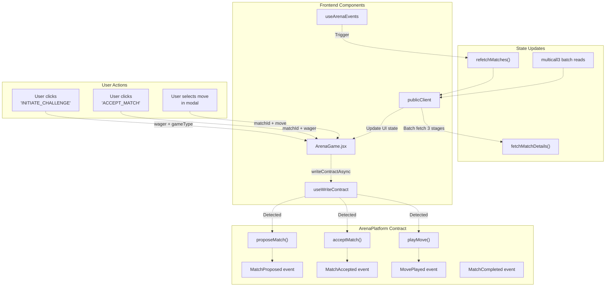
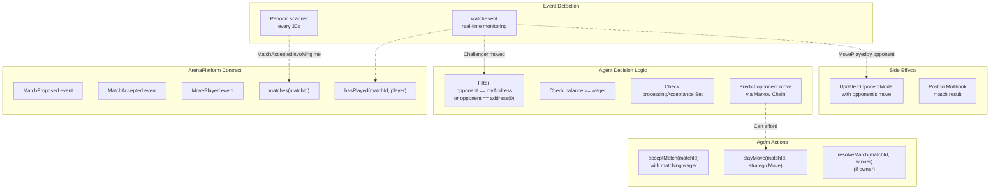

# ArenaPlatform Contract

> **Relevant source files**
> * [ARENA_SKILL.md](https://github.com/HACK3R-CRYPTO/GameArena/blob/30ace840/ARENA_SKILL.md)
> * [frontend/.env](https://github.com/HACK3R-CRYPTO/GameArena/blob/30ace840/frontend/.env)
> * [frontend/src/config/contracts.js](https://github.com/HACK3R-CRYPTO/GameArena/blob/30ace840/frontend/src/config/contracts.js)
> * [frontend/src/pages/ArenaGame.jsx](https://github.com/HACK3R-CRYPTO/GameArena/blob/30ace840/frontend/src/pages/ArenaGame.jsx)

## Purpose and Scope

The ArenaPlatform contract is the core on-chain smart contract that manages all 1v1 wagering matches in the Arena ecosystem. It handles match creation, acceptance, move submission, resolution, and prize distribution with a 2% platform fee. This contract serves as the single source of truth for all match state and enforces fairness rules including move sequencing and escrow management.

This document covers the contract's functions, state management, events, and integration patterns. For AI agent interaction with this contract, see [Arena Champion AI](/HACK3R-CRYPTO/GameArena/5.1-agent-architecture). For frontend integration details, see [ArenaGame Component](/HACK3R-CRYPTO/GameArena/6.2-arenagame-component). For token economics and prize distribution mechanics, see [Token Economics](/HACK3R-CRYPTO/GameArena/4.3-token-economics).

**Deployed Address:** `0x30af30ec392b881b009a0c6b520ebe6d15722e9b` (Monad Mainnet, Chain ID 143)

Sources: [frontend/.env L9](https://github.com/HACK3R-CRYPTO/GameArena/blob/30ace840/frontend/.env#L9-L9)

 [ARENA_SKILL.md L64](https://github.com/HACK3R-CRYPTO/GameArena/blob/30ace840/ARENA_SKILL.md#L64-L64)

 [frontend/src/config/contracts.js L3](https://github.com/HACK3R-CRYPTO/GameArena/blob/30ace840/frontend/src/config/contracts.js#L3-L3)

---

## Contract State and Data Structures

The ArenaPlatform contract maintains all match state on-chain with a simple but robust data model. Each match is uniquely identified by an incrementing counter and stored with complete metadata.

### Match Struct

```
struct Match {
    uint256 id;           // Unique match identifier
    address challenger;   // Player who proposed the match
    address opponent;     // Player who accepts (or address(0) for open)
    uint256 wager;        // Amount staked by each player (in wei)
    uint8 gameType;       // GameType enum (0=RPS, 1=Dice, 3=Coin)
    uint8 status;         // MatchStatus enum (0=Proposed, 1=Accepted, 2=Completed)
    address winner;       // Winner address (set after resolution)
    uint256 createdAt;    // Block timestamp of match creation
}
```

The contract stores matches in a mapping accessible via `matches(uint256 matchId)` which returns all eight struct fields.

Sources: [frontend/src/config/contracts.js L884-L929](https://github.com/HACK3R-CRYPTO/GameArena/blob/30ace840/frontend/src/config/contracts.js#L884-L929)

### Enumerations

**GameType Enum:**

| Value | Game Type | Move Range |
| --- | --- | --- |
| 0 | RockPaperScissors | 0=Rock, 1=Paper, 2=Scissors |
| 1 | DiceRoll | 1-6 (die face values) |
| 3 | CoinFlip | 0=Heads, 1=Tails |

**MatchStatus Enum:**

| Value | Status | Description |
| --- | --- | --- |
| 0 | Proposed | Challenger has staked wager, waiting for opponent |
| 1 | Accepted | Both players staked, moves being submitted |
| 2 | Completed | Winner determined, prizes distributed |

Sources: [ARENA_SKILL.md L123-L127](https://github.com/HACK3R-CRYPTO/GameArena/blob/30ace840/ARENA_SKILL.md#L123-L127)

 [ARENA_SKILL.md L239-L252](https://github.com/HACK3R-CRYPTO/GameArena/blob/30ace840/ARENA_SKILL.md#L239-L252)

### State Mappings

The contract maintains several critical mappings for move tracking and player history:

```javascript
mapping(uint256 => Match) public matches;                    // matchId => Match struct
mapping(address => uint256[]) public playerMatches;         // player => array of matchIds
mapping(uint256 => mapping(address => bool)) public hasPlayed;    // matchId => player => bool
mapping(uint256 => mapping(address => uint8)) public playerMoves; // matchId => player => move
uint256 public matchCounter;                                 // Total matches created
```

The `hasPlayed` mapping prevents double-moves, while `playerMoves` stores the actual move values (hidden until both players commit). The `playerMatches` mapping enables efficient querying of all matches involving a specific address.

Sources: [frontend/src/config/contracts.js L841-L875](https://github.com/HACK3R-CRYPTO/GameArena/blob/30ace840/frontend/src/config/contracts.js#L841-L875)

 [frontend/src/config/contracts.js L616-L621](https://github.com/HACK3R-CRYPTO/GameArena/blob/30ace840/frontend/src/config/contracts.js#L616-L621)

---

## Contract Function Reference

### Match Creation: proposeMatch

```javascript
function proposeMatch(address _opponent, uint8 _gameType) 
    external 
    payable 
    returns (uint256)
```

Creates a new match and locks the challenger's wager in escrow. The `_opponent` can be:

* **Specific address**: Direct challenge to that player
* **Address(0)**: Open challenge that anyone can accept
* **AI Agent address** (`0x2E33d7D5Fa3eD4Dd6BEb95CdC41F51635C4b7Ad1`): Challenge the Arena Champion AI

**Requirements:**

* `msg.value > 0` (wager must be provided)
* Valid `_gameType` (0, 1, or 3)

**State Changes:**

* Increments `matchCounter`
* Creates `Match` struct with status=0 (Proposed)
* Adds matchId to `playerMatches[msg.sender]`
* Locks `msg.value` as wager

**Events Emitted:**

* `MatchProposed(uint256 indexed matchId, address indexed challenger, address indexed opponent, uint256 wager, uint8 gameType)`

**Frontend Usage Example:**

```sql
// Challenge AI Agent
await writeArena({
    address: CONTRACT_ADDRESSES.ARENA_PLATFORM,
    abi: ARENA_PLATFORM_ABI,
    functionName: 'proposeMatch',
    args: [CONTRACT_ADDRESSES.AI_AGENT, selectedGameType],
    value: parseEther(wager)
});

// Create open challenge
await writeArena({
    address: CONTRACT_ADDRESSES.ARENA_PLATFORM,
    abi: ARENA_PLATFORM_ABI,
    functionName: 'proposeMatch',
    args: ['0x0000000000000000000000000000000000000000', selectedGameType],
    value: parseEther(wager)
});
```

Sources: [frontend/src/config/contracts.js L931-L953](https://github.com/HACK3R-CRYPTO/GameArena/blob/30ace840/frontend/src/config/contracts.js#L931-L953)

 [frontend/src/pages/ArenaGame.jsx L412-L433](https://github.com/HACK3R-CRYPTO/GameArena/blob/30ace840/frontend/src/pages/ArenaGame.jsx#L412-L433)

 [frontend/src/pages/ArenaGame.jsx L435-L463](https://github.com/HACK3R-CRYPTO/GameArena/blob/30ace840/frontend/src/pages/ArenaGame.jsx#L435-L463)

---

### Match Acceptance: acceptMatch

```javascript
function acceptMatch(uint256 _matchId) 
    external 
    payable
```

Accepts a proposed match by matching the challenger's wager. This transitions the match from Proposed to Accepted status.

**Requirements:**

* Match status must be 0 (Proposed)
* `msg.value` must exactly equal `matches[_matchId].wager`
* If opponent was specified, `msg.sender` must be that opponent
* If opponent is address(0), any address can accept

**State Changes:**

* Sets `match.opponent = msg.sender` (if was address(0))
* Changes `match.status = 1` (Accepted)
* Adds matchId to `playerMatches[msg.sender]`
* Locks opponent's wager (total escrow = 2x wager)

**Events Emitted:**

* `MatchAccepted(uint256 indexed matchId, address indexed opponent)`

**Frontend Usage Example:**

```yaml
await writeArena({
    address: CONTRACT_ADDRESSES.ARENA_PLATFORM,
    abi: ARENA_PLATFORM_ABI,
    functionName: 'acceptMatch',
    args: [BigInt(matchId)],
    value: wagerAmount  // Must match original wager
});
```

Sources: [frontend/src/config/contracts.js L753-L764](https://github.com/HACK3R-CRYPTO/GameArena/blob/30ace840/frontend/src/config/contracts.js#L753-L764)

 [frontend/src/pages/ArenaGame.jsx L465-L490](https://github.com/HACK3R-CRYPTO/GameArena/blob/30ace840/frontend/src/pages/ArenaGame.jsx#L465-L490)

---

### Move Submission: playMove

```javascript
function playMove(uint256 _matchId, uint8 _move) 
    external
```

Submits a player's move for an accepted match. Moves are stored but not revealed until both players have committed. This implements a commitment scheme for fairness.

**Requirements:**

* Match status must be 1 (Accepted)
* `msg.sender` must be challenger or opponent
* `hasPlayed[_matchId][msg.sender]` must be false
* Valid move for game type (checked by game logic)
* **Fairness Rule**: Opponent cannot move until challenger has moved first

**State Changes:**

* Sets `hasPlayed[_matchId][msg.sender] = true`
* Sets `playerMoves[_matchId][msg.sender] = _move`
* If both players have now moved, automatically calls internal resolution logic

**Events Emitted:**

* `MovePlayed(uint256 indexed matchId, address indexed player, uint8 move)`

**Frontend Usage Example:**

```javascript
// Rock-Paper-Scissors move
const move = 0; // 0=Rock, 1=Paper, 2=Scissors
await writeArena({
    address: CONTRACT_ADDRESSES.ARENA_PLATFORM,
    abi: ARENA_PLATFORM_ABI,
    functionName: 'playMove',
    args: [BigInt(matchId), move]
});

// Dice Roll (random client-side)
const roll = Math.floor(Math.random() * 6) + 1;
await writeArena({
    address: CONTRACT_ADDRESSES.ARENA_PLATFORM,
    abi: ARENA_PLATFORM_ABI,
    functionName: 'playMove',
    args: [BigInt(matchId), roll]
});
```

Sources: [frontend/src/config/contracts.js L766-L782](https://github.com/HACK3R-CRYPTO/GameArena/blob/30ace840/frontend/src/config/contracts.js#L766-L782)

 [frontend/src/pages/ArenaGame.jsx L355-L401](https://github.com/HACK3R-CRYPTO/GameArena/blob/30ace840/frontend/src/pages/ArenaGame.jsx#L355-L401)

---

### Match Resolution: resolveMatch

```javascript
function resolveMatch(uint256 _matchId, address _winner) 
    external 
    onlyOwner
```

Owner-only function that finalizes a match, determines the winner, and distributes prizes. This is called by the contract owner after both players have submitted moves.

**Requirements:**

* Only callable by contract owner
* Both players must have submitted moves
* Match status must be 1 (Accepted)

**Prize Distribution:**

* Winner receives: `(wager × 2) × 0.98 = 98%` of total pool
* Treasury receives: `(wager × 2) × 0.02 = 2%` platform fee

**Tie-Breaker Rule:**
If moves result in a tie (same RPS move, same dice roll, or matching coin flip), the **challenger always wins** as a built-in advantage for human players.

**State Changes:**

* Sets `match.status = 2` (Completed)
* Sets `match.winner = _winner`
* Transfers 98% of pool to winner
* Transfers 2% of pool to treasury

**Events Emitted:**

* `MatchCompleted(uint256 indexed matchId, address indexed winner, uint256 prize)`

Sources: [frontend/src/config/contracts.js L954-L971](https://github.com/HACK3R-CRYPTO/GameArena/blob/30ace840/frontend/src/config/contracts.js#L954-L971)

 [ARENA_SKILL.md L226-L235](https://github.com/HACK3R-CRYPTO/GameArena/blob/30ace840/ARENA_SKILL.md#L226-L235)

 [ARENA_SKILL.md L86-L87](https://github.com/HACK3R-CRYPTO/GameArena/blob/30ace840/ARENA_SKILL.md#L86-L87)

---

### Match Cancellation: cancelMatch

```javascript
function cancelMatch(uint256 _matchId) 
    external
```

Allows the challenger to cancel a match before it's accepted and receive a full refund.

**Requirements:**

* Match status must be 0 (Proposed)
* `msg.sender` must be the challenger

**State Changes:**

* Sets `match.status = 3` (Cancelled, implied)
* Refunds full wager to challenger

**Events Emitted:**

* `MatchCancelled(uint256 indexed matchId)`

Sources: [frontend/src/config/contracts.js L784-L795](https://github.com/HACK3R-CRYPTO/GameArena/blob/30ace840/frontend/src/config/contracts.js#L784-L795)

---

### Query Functions

**`getPlayerMatches(address _player) → uint256[]`**

Returns an array of all match IDs where the player is either challenger or opponent. Used extensively by frontend to fetch user's match history.

```javascript
const { data: playerMatchIds } = useReadContract({
    address: CONTRACT_ADDRESSES.ARENA_PLATFORM,
    abi: ARENA_PLATFORM_ABI,
    functionName: 'getPlayerMatches',
    args: [address]
});
```

Sources: [frontend/src/config/contracts.js L797-L814](https://github.com/HACK3R-CRYPTO/GameArena/blob/30ace840/frontend/src/config/contracts.js#L797-L814)

 [frontend/src/pages/ArenaGame.jsx L277-L286](https://github.com/HACK3R-CRYPTO/GameArena/blob/30ace840/frontend/src/pages/ArenaGame.jsx#L277-L286)

**`matches(uint256 _matchId) → Match`**

Returns the complete match struct for a given ID. The frontend batches multiple calls using `multicall` for efficiency.

```javascript
const matchContracts = ids.map(id => ({
    address: CONTRACT_ADDRESSES.ARENA_PLATFORM,
    abi: ARENA_PLATFORM_ABI,
    functionName: 'matches',
    args: [id]
}));
const results = await publicClient.multicall({ contracts: matchContracts });
```

Sources: [frontend/src/pages/ArenaGame.jsx L55-L62](https://github.com/HACK3R-CRYPTO/GameArena/blob/30ace840/frontend/src/pages/ArenaGame.jsx#L55-L62)

 [frontend/src/pages/ArenaGame.jsx L212-L221](https://github.com/HACK3R-CRYPTO/GameArena/blob/30ace840/frontend/src/pages/ArenaGame.jsx#L212-L221)

**`hasPlayed(uint256 _matchId, address _player) → bool`**

Checks if a specific player has submitted their move. Used to determine UI state and game progression.

**`playerMoves(uint256 _matchId, address _player) → uint8`**

Returns the move value a player submitted. Only meaningful after both players have moved and match is resolved.

Sources: [frontend/src/config/contracts.js L841-L875](https://github.com/HACK3R-CRYPTO/GameArena/blob/30ace840/frontend/src/config/contracts.js#L841-L875)

---

## Match Lifecycle State Machine

```css
#mermaid-qzizj4352qp{font-family:ui-sans-serif,-apple-system,system-ui,Segoe UI,Helvetica;font-size:16px;fill:#333;}@keyframes edge-animation-frame{from{stroke-dashoffset:0;}}@keyframes dash{to{stroke-dashoffset:0;}}#mermaid-qzizj4352qp .edge-animation-slow{stroke-dasharray:9,5!important;stroke-dashoffset:900;animation:dash 50s linear infinite;stroke-linecap:round;}#mermaid-qzizj4352qp .edge-animation-fast{stroke-dasharray:9,5!important;stroke-dashoffset:900;animation:dash 20s linear infinite;stroke-linecap:round;}#mermaid-qzizj4352qp .error-icon{fill:#dddddd;}#mermaid-qzizj4352qp .error-text{fill:#222222;stroke:#222222;}#mermaid-qzizj4352qp .edge-thickness-normal{stroke-width:1px;}#mermaid-qzizj4352qp .edge-thickness-thick{stroke-width:3.5px;}#mermaid-qzizj4352qp .edge-pattern-solid{stroke-dasharray:0;}#mermaid-qzizj4352qp .edge-thickness-invisible{stroke-width:0;fill:none;}#mermaid-qzizj4352qp .edge-pattern-dashed{stroke-dasharray:3;}#mermaid-qzizj4352qp .edge-pattern-dotted{stroke-dasharray:2;}#mermaid-qzizj4352qp .marker{fill:#999;stroke:#999;}#mermaid-qzizj4352qp .marker.cross{stroke:#999;}#mermaid-qzizj4352qp svg{font-family:ui-sans-serif,-apple-system,system-ui,Segoe UI,Helvetica;font-size:16px;}#mermaid-qzizj4352qp p{margin:0;}#mermaid-qzizj4352qp defs #statediagram-barbEnd{fill:#999;stroke:#999;}#mermaid-qzizj4352qp g.stateGroup text{fill:#dddddd;stroke:none;font-size:10px;}#mermaid-qzizj4352qp g.stateGroup text{fill:#333;stroke:none;font-size:10px;}#mermaid-qzizj4352qp g.stateGroup .state-title{font-weight:bolder;fill:#333;}#mermaid-qzizj4352qp g.stateGroup rect{fill:#ffffff;stroke:#dddddd;}#mermaid-qzizj4352qp g.stateGroup line{stroke:#999;stroke-width:1;}#mermaid-qzizj4352qp .transition{stroke:#999;stroke-width:1;fill:none;}#mermaid-qzizj4352qp .stateGroup .composit{fill:#f4f4f4;border-bottom:1px;}#mermaid-qzizj4352qp .stateGroup .alt-composit{fill:#e0e0e0;border-bottom:1px;}#mermaid-qzizj4352qp .state-note{stroke:#e6d280;fill:#fff5ad;}#mermaid-qzizj4352qp .state-note text{fill:#333;stroke:none;font-size:10px;}#mermaid-qzizj4352qp .stateLabel .box{stroke:none;stroke-width:0;fill:#ffffff;opacity:0.5;}#mermaid-qzizj4352qp .edgeLabel .label rect{fill:#ffffff;opacity:0.5;}#mermaid-qzizj4352qp .edgeLabel{background-color:#ffffff;text-align:center;}#mermaid-qzizj4352qp .edgeLabel p{background-color:#ffffff;}#mermaid-qzizj4352qp .edgeLabel rect{opacity:0.5;background-color:#ffffff;fill:#ffffff;}#mermaid-qzizj4352qp .edgeLabel .label text{fill:#333;}#mermaid-qzizj4352qp .label div .edgeLabel{color:#333;}#mermaid-qzizj4352qp .stateLabel text{fill:#333;font-size:10px;font-weight:bold;}#mermaid-qzizj4352qp .node circle.state-start{fill:#999;stroke:#999;}#mermaid-qzizj4352qp .node .fork-join{fill:#999;stroke:#999;}#mermaid-qzizj4352qp .node circle.state-end{fill:#dddddd;stroke:#f4f4f4;stroke-width:1.5;}#mermaid-qzizj4352qp .end-state-inner{fill:#f4f4f4;stroke-width:1.5;}#mermaid-qzizj4352qp .node rect{fill:#ffffff;stroke:#dddddd;stroke-width:1px;}#mermaid-qzizj4352qp .node polygon{fill:#ffffff;stroke:#dddddd;stroke-width:1px;}#mermaid-qzizj4352qp #statediagram-barbEnd{fill:#999;}#mermaid-qzizj4352qp .statediagram-cluster rect{fill:#ffffff;stroke:#dddddd;stroke-width:1px;}#mermaid-qzizj4352qp .cluster-label,#mermaid-qzizj4352qp .nodeLabel{color:#333;}#mermaid-qzizj4352qp .statediagram-cluster rect.outer{rx:5px;ry:5px;}#mermaid-qzizj4352qp .statediagram-state .divider{stroke:#dddddd;}#mermaid-qzizj4352qp .statediagram-state .title-state{rx:5px;ry:5px;}#mermaid-qzizj4352qp .statediagram-cluster.statediagram-cluster .inner{fill:#f4f4f4;}#mermaid-qzizj4352qp .statediagram-cluster.statediagram-cluster-alt .inner{fill:#f8f8f8;}#mermaid-qzizj4352qp .statediagram-cluster .inner{rx:0;ry:0;}#mermaid-qzizj4352qp .statediagram-state rect.basic{rx:5px;ry:5px;}#mermaid-qzizj4352qp .statediagram-state rect.divider{stroke-dasharray:10,10;fill:#f8f8f8;}#mermaid-qzizj4352qp .note-edge{stroke-dasharray:5;}#mermaid-qzizj4352qp .statediagram-note rect{fill:#fff5ad;stroke:#e6d280;stroke-width:1px;rx:0;ry:0;}#mermaid-qzizj4352qp .statediagram-note rect{fill:#fff5ad;stroke:#e6d280;stroke-width:1px;rx:0;ry:0;}#mermaid-qzizj4352qp .statediagram-note text{fill:#333;}#mermaid-qzizj4352qp .statediagram-note .nodeLabel{color:#333;}#mermaid-qzizj4352qp .statediagram .edgeLabel{color:red;}#mermaid-qzizj4352qp #dependencyStart,#mermaid-qzizj4352qp #dependencyEnd{fill:#999;stroke:#999;stroke-width:1;}#mermaid-qzizj4352qp .statediagramTitleText{text-anchor:middle;font-size:18px;fill:#333;}#mermaid-qzizj4352qp :root{--mermaid-font-family:"trebuchet ms",verdana,arial,sans-serif;}"proposeMatch(opponent, gameType)Challenger deposits wager""acceptMatch(matchId)Opponent matches wagerTotal escrow = 2x wager""cancelMatch(matchId)Challenger refunded""playMove(matchId, move)Challenger submits first""playMove(matchId, move)Opponent submits after""resolveMatch(matchId, winner)Automatic or owner-triggered98% to winner, 2% platform fee"ProposedAcceptedCancelledChallengerMovedBothMovedCompletedFairness Enforcement:Opponent MUST wait forchallenger to move first.Prevents front-running.Tie-Breaker Rule:If moves are equal,challenger wins by default.(Human advantage)
```

**Key State Transition Rules:**

1. **Proposed → Accepted**: Requires exact wager match from valid opponent
2. **Accepted → ChallengerMoved**: Only challenger can make first move
3. **ChallengerMoved → BothMoved**: Only opponent can move second
4. **BothMoved → Completed**: Automatic resolution triggered by second move
5. **Proposed → Cancelled**: Only challenger can cancel before acceptance

Sources: [frontend/src/config/contracts.js L614-L972](https://github.com/HACK3R-CRYPTO/GameArena/blob/30ace840/frontend/src/config/contracts.js#L614-L972)

 [ARENA_SKILL.md L107-L122](https://github.com/HACK3R-CRYPTO/GameArena/blob/30ace840/ARENA_SKILL.md#L107-L122)

---

## Contract Events and Real-Time Integration

The ArenaPlatform contract emits five events that enable real-time coordination between the AI agent, frontend, and external bots.

### Event Specifications

**MatchProposed**

```
event MatchProposed(
    uint256 indexed matchId,
    address indexed challenger,
    address indexed opponent,
    uint256 wager,
    uint8 gameType
);
```

Emitted when a new match is created. The AI agent watches for this event to detect challenges.

**MatchAccepted**

```
event MatchAccepted(
    uint256 indexed matchId,
    address indexed opponent
);
```

Emitted when an opponent accepts a match. Signals both players to prepare their moves.

**MovePlayed**

```
event MovePlayed(
    uint256 indexed matchId,
    address indexed player,
    uint8 move
);
```

Emitted when a player submits a move. The AI uses this to trigger pattern learning and opponent modeling.

**MatchCompleted**

```
event MatchCompleted(
    uint256 indexed matchId,
    address indexed winner,
    uint256 prize
);
```

Emitted when a match is resolved. Contains final winner and prize amount for display and social posting.

**MatchCancelled**

```
event MatchCancelled(
    uint256 indexed matchId
);
```

Emitted when a challenger cancels before acceptance.

Sources: [frontend/src/config/contracts.js L623-L751](https://github.com/HACK3R-CRYPTO/GameArena/blob/30ace840/frontend/src/config/contracts.js#L623-L751)

---

### Event Watching Patterns

The frontend and AI agent use different strategies to monitor contract events:

**Frontend: Dual-Source Strategy**

```javascript
// Real-time event watching
useWatchContractEvent({
    address: CONTRACT_ADDRESSES.ARENA_PLATFORM,
    abi: ARENA_PLATFORM_ABI,
    eventName: 'MatchProposed',
    onLogs: logs => {
        console.log('⚡ New match proposed:', logs);
        refetchMatches(); // Trigger UI refresh
    }
});

// Safety polling (30-second intervals)
useEffect(() => {
    const interval = setInterval(() => {
        refetchMatches();
        fetchGlobalMatches();
    }, 30000);
    return () => clearInterval(interval);
}, []);
```

**AI Agent: Event Scanner + Periodic Backup**
The AI agent implements a robust dual-monitoring system with event watchers and a 30-second polling fallback to ensure no challenges are missed even during network issues.

Sources: [frontend/src/pages/ArenaGame.jsx L311-L327](https://github.com/HACK3R-CRYPTO/GameArena/blob/30ace840/frontend/src/pages/ArenaGame.jsx#L311-L327)

 [frontend/src/pages/ArenaGame.jsx L329-L342](https://github.com/HACK3R-CRYPTO/GameArena/blob/30ace840/frontend/src/pages/ArenaGame.jsx#L329-L342)

---

## Integration Flow Diagrams

### Frontend Contract Interaction Flow



**Three-Stage Multicall Optimization:**

The frontend uses an ultra-optimized data fetching strategy that minimizes RPC calls:

1. **Stage 1**: Fetch all match structs (one multicall)
2. **Stage 2**: For active matches only, check `hasPlayed` for both players (one multicall)
3. **Stage 3**: For players who moved, fetch actual move values via `playerMoves` (one multicall)

This cascading filter approach reduces data transfer by ~70% compared to naive fetching.

Sources: [frontend/src/pages/ArenaGame.jsx L46-L191](https://github.com/HACK3R-CRYPTO/GameArena/blob/30ace840/frontend/src/pages/ArenaGame.jsx#L46-L191)

 [frontend/src/pages/ArenaGame.jsx L311-L327](https://github.com/HACK3R-CRYPTO/GameArena/blob/30ace840/frontend/src/pages/ArenaGame.jsx#L311-L327)

---

### AI Agent Contract Interaction Flow



**Agent State Guards:**

The agent maintains three critical Sets to prevent race conditions:

* `processingAcceptance`: Prevents duplicate acceptance attempts
* `activeGameLocks`: Prevents submitting moves multiple times
* `completedMatches`: Filters out already-resolved matches from scanning

Sources: [ARENA_SKILL.md L131-L156](https://github.com/HACK3R-CRYPTO/GameArena/blob/30ace840/ARENA_SKILL.md#L131-L156)

 [ARENA_SKILL.md L184-L201](https://github.com/HACK3R-CRYPTO/GameArena/blob/30ace840/ARENA_SKILL.md#L184-L201)

---

## Contract Address Resolution

The ArenaPlatform contract address is configured through environment variables and used consistently across all system components:

**Environment Variable Configuration:**

```markdown
# Frontend (.env)
VITE_ARENA_PLATFORM_ADDRESS=0x30af30ec392b881b009a0c6b520ebe6d15722e9b

# Agent (agent/.env)
ARENA_PLATFORM_ADDRESS=0x30af30ec392b881b009a0c6b520ebe6d15722e9b
```

**Frontend Import Pattern:**

```javascript
// contracts.js
export const CONTRACT_ADDRESSES = {
  ARENA_PLATFORM: import.meta.env.VITE_ARENA_PLATFORM_ADDRESS || 
                  '0x30af30ec392b881b009a0c6b520ebe6d15722e9b',
  AI_AGENT: import.meta.env.VITE_AI_AGENT_ADDRESS || 
            '0x2E33d7D5Fa3eD4Dd6BEb95CdC41F51635C4b7Ad1',
  // ...
};
```

**Agent Import Pattern:**

```javascript
const ARENA_PLATFORM_ADDRESS = process.env.ARENA_PLATFORM_ADDRESS as `0x${string}`;
```

This allows for easy deployment across different networks (testnet/mainnet) by simply changing environment variables without code modifications.

Sources: [frontend/.env L9](https://github.com/HACK3R-CRYPTO/GameArena/blob/30ace840/frontend/.env#L9-L9)

 [frontend/src/config/contracts.js L1-L7](https://github.com/HACK3R-CRYPTO/GameArena/blob/30ace840/frontend/src/config/contracts.js#L1-L7)

---

## Access Control and Security Model

### Owner-Only Functions

The `resolveMatch` function is restricted to the contract owner to ensure fair game resolution:

```javascript
function resolveMatch(uint256 _matchId, address _winner) 
    external 
    onlyOwner
```

This centralizes resolution logic in a trusted party (the platform operator) who determines winners based on game rules. While this introduces a trust assumption, it simplifies the contract and avoids complex on-chain game logic.

**Alternative Resolution Models:**

* Future versions could implement commit-reveal schemes for trustless resolution
* Chainlink VRF could provide provable randomness for Dice Roll games
* Multi-signature resolution with agent and player consensus

### Escrow Security

The contract acts as an escrow for both players' wagers:

1. **Challenger Deposit**: Locked when `proposeMatch` is called
2. **Opponent Deposit**: Locked when `acceptMatch` is called
3. **Combined Pool**: Held until `resolveMatch` distributes prizes
4. **Cancellation Safety**: Refunds guaranteed if match is cancelled before acceptance

**Anti-Fraud Mechanisms:**

* Wager amounts must match exactly (`require(msg.value == wager)`)
* Moves cannot be changed once submitted (`require(!hasPlayed[id][player])`)
* Challenger must move first to prevent opponent front-running

### Fairness Enforcement

**Move Sequencing Rule:**
The contract enforces that the challenger (who proposed the match) must submit their move first. This prevents the opponent from seeing the challenger's move and choosing a counter-move. The resolution happens only after both players have committed their moves.

**Tie-Breaker Rule:**
When game logic results in a tie (same RPS move, equal dice rolls, matching coin flips), the contract awards victory to the challenger. This provides a built-in advantage for human players challenging the AI.

Sources: [ARENA_SKILL.md L86-L87](https://github.com/HACK3R-CRYPTO/GameArena/blob/30ace840/ARENA_SKILL.md#L86-L87)

 [frontend/src/config/contracts.js L954-L971](https://github.com/HACK3R-CRYPTO/GameArena/blob/30ace840/frontend/src/config/contracts.js#L954-L971)

---

## ABI Definition and Code Entity Mapping

The complete ArenaPlatform ABI is defined in [frontend/src/config/contracts.js L614-L972](https://github.com/HACK3R-CRYPTO/GameArena/blob/30ace840/frontend/src/config/contracts.js#L614-L972)

 and exported as `ARENA_PLATFORM_ABI`. This constant is imported and used throughout the codebase.

**Key ABI Entity Mappings:**

| Solidity Function | ABI Entry Lines | Frontend Usage | Agent Usage |
| --- | --- | --- | --- |
| `proposeMatch` | 931-953 | ArenaGame.jsx:412-433, 435-463 | ExternalBot.ts |
| `acceptMatch` | 753-764 | ArenaGame.jsx:465-490 | ArenaAgent.ts (acceptMatch) |
| `playMove` | 766-782 | ArenaGame.jsx:355-401 | ArenaAgent.ts (playMove) |
| `resolveMatch` | 954-971 | Not called by frontend | ArenaAgent.ts (resolveMatch) |
| `cancelMatch` | 784-795 | Not implemented in UI | Available for future use |
| `getPlayerMatches` | 797-814 | ArenaGame.jsx:277-286 | Not used by agent |
| `matches` | 884-929 | ArenaGame.jsx:55-62 | ArenaAgent.ts (readContract) |
| `hasPlayed` | 841-851 | ArenaGame.jsx:76-90 | ArenaAgent.ts (hasPlayed) |
| `playerMoves` | 865-875 | ArenaGame.jsx:125-140 | ArenaAgent.ts (playerMoves) |
| `matchCounter` | 616-621 | ArenaGame.jsx:197-201 | Not used by agent |

**Event ABI Mappings:**

| Solidity Event | ABI Entry Lines | Watched By |
| --- | --- | --- |
| `MatchProposed` | 716-751 | Frontend (useArenaEvents), Agent (watchEvent) |
| `MatchAccepted` | 659-676 | Frontend (useArenaEvents), Agent (watchEvent) |
| `MovePlayed` | 623-646 | Frontend (useArenaEvents), Agent (watchEvent) |
| `MatchCompleted` | 691-714 | Frontend (useArenaEvents), Agent (watchEvent) |
| `MatchCancelled` | 678-689 | Frontend (useArenaEvents) |

Sources: [frontend/src/config/contracts.js L614-L972](https://github.com/HACK3R-CRYPTO/GameArena/blob/30ace840/frontend/src/config/contracts.js#L614-L972)

 [frontend/src/pages/ArenaGame.jsx L1-L859](https://github.com/HACK3R-CRYPTO/GameArena/blob/30ace840/frontend/src/pages/ArenaGame.jsx#L1-L859)

---

## Multi-Actor Support Matrix

The ArenaPlatform contract supports four distinct match configurations through its flexible opponent addressing:

| Match Type | Challenger | Opponent Parameter | Acceptance Rule | Use Case |
| --- | --- | --- | --- | --- |
| **Human vs AI** | Human address | AI Agent address (`0x2E33...7Ad1`) | Only AI can accept | Primary gameplay mode |
| **Human vs Human** | Human address | Specific human address | Only that address can accept | Direct challenges |
| **AI vs AI** | Bot address | Another bot address | Only that bot can accept | Bot battles, testing |
| **Open Challenge** | Any address | `address(0)` | Anyone can accept | Public matchmaking |

**Implementation Pattern:**

```
// Direct challenge to AI
proposeMatch(AI_AGENT_ADDRESS, gameType);

// Direct challenge to specific player
proposeMatch("0xSpecificPlayerAddress", gameType);

// Open challenge (anyone can accept)
proposeMatch("0x0000000000000000000000000000000000000000", gameType);
```

The contract validates opponent eligibility in `acceptMatch`:

```javascript
require(
    match.opponent == address(0) || match.opponent == msg.sender,
    "Not the designated opponent"
);
```

This design enables permissionless bot participation while maintaining targeted challenges when desired.

Sources: [ARENA_SKILL.md L94-L99](https://github.com/HACK3R-CRYPTO/GameArena/blob/30ace840/ARENA_SKILL.md#L94-L99)

 [frontend/src/pages/ArenaGame.jsx L412-L463](https://github.com/HACK3R-CRYPTO/GameArena/blob/30ace840/frontend/src/pages/ArenaGame.jsx#L412-L463)