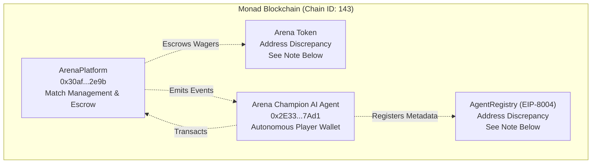
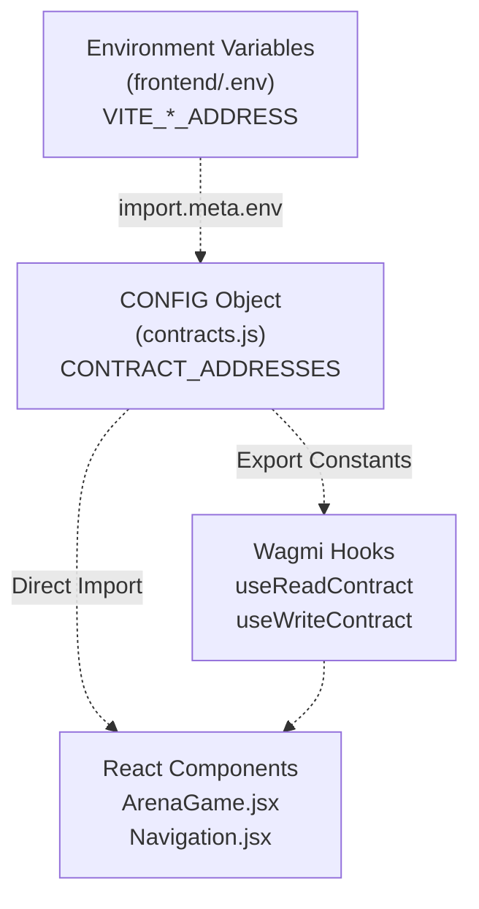
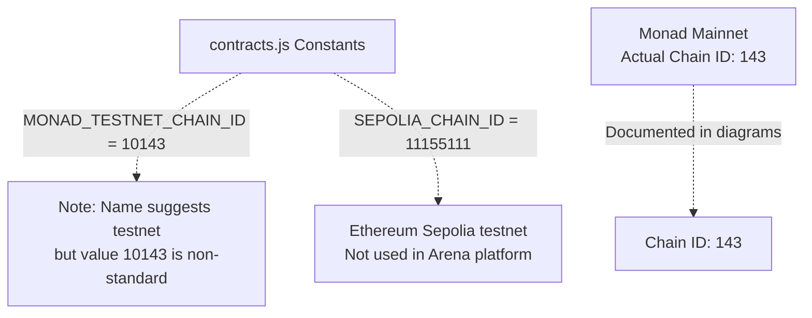
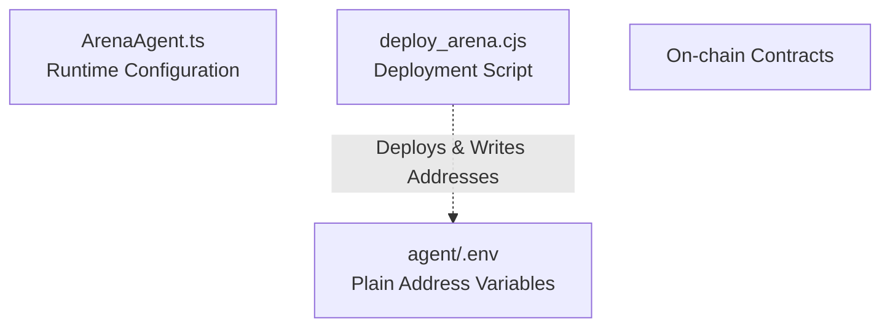

# Contract Addresses

> **Relevant source files**
> * [README.md](https://github.com/HACK3R-CRYPTO/GameArena/blob/30ace840/README.md)
> * [frontend/.env](https://github.com/HACK3R-CRYPTO/GameArena/blob/30ace840/frontend/.env)
> * [frontend/src/config/contracts.js](https://github.com/HACK3R-CRYPTO/GameArena/blob/30ace840/frontend/src/config/contracts.js)

This page provides a comprehensive reference for all deployed smart contract addresses used by the Arena AI Champion platform on the Monad blockchain. This includes the main ArenaPlatform contract, the AI Agent's wallet address, the EIP-8004 compliant Agent Registry, and the Arena Token contract. For details about contract functions and ABIs, see [ArenaPlatform Contract](/HACK3R-CRYPTO/GameArena/4.1-arenaplatform-contract) and [Agent Registry (EIP-8004)](/HACK3R-CRYPTO/GameArena/4.2-agent-registry-(eip-8004)). For token economics and distribution mechanisms, see [Token Economics](/HACK3R-CRYPTO/GameArena/4.3-token-economics).

---

## Network Configuration

The Arena platform operates exclusively on **Monad Mainnet** with the following network parameters:

| Parameter | Value |
| --- | --- |
| **Network Name** | Monad Mainnet |
| **Chain ID** | `143` |
| **RPC Endpoint** | `https://rpc.monad.xyz` |
| **Currency Symbol** | MON |
| **Block Explorer** | [https://monadscan.com](https://monadscan.com) |

The RPC endpoint is configured in [frontend/.env L6](https://github.com/HACK3R-CRYPTO/GameArena/blob/30ace840/frontend/.env#L6-L6)

 and used throughout the application for all blockchain interactions.

**Sources:** [frontend/.env L1-L13](https://github.com/HACK3R-CRYPTO/GameArena/blob/30ace840/frontend/.env#L1-L13)

 [README.md L1-L173](https://github.com/HACK3R-CRYPTO/GameArena/blob/30ace840/README.md#L1-L173)

---

## Deployed Contract Addresses

### Primary Contracts (Monad Mainnet)



**Diagram: Contract Address Relationships on Monad Network**

| Contract | Address | Purpose |
| --- | --- | --- |
| **ArenaPlatform** | `0x30af30ec392b881b009a0c6b520ebe6d15722e9b` | Core escrow and match management contract |
| **Arena Champion AI** | `0x2E33d7D5Fa3eD4Dd6BEb95CdC41F51635C4b7Ad1` | Autonomous AI agent's wallet address |
| **Agent Registry** | See [Address Discrepancies](https://github.com/HACK3R-CRYPTO/GameArena/blob/30ace840/Address Discrepancies) | EIP-8004 compliant agent metadata registry |
| **Arena Token** | See [Address Discrepancies](https://github.com/HACK3R-CRYPTO/GameArena/blob/30ace840/Address Discrepancies) | $ARENA ERC-20 token for wagering |

**Sources:** [README.md L153-L161](https://github.com/HACK3R-CRYPTO/GameArena/blob/30ace840/README.md#L153-L161)

 [frontend/.env L9-L12](https://github.com/HACK3R-CRYPTO/GameArena/blob/30ace840/frontend/.env#L9-L12)

 [frontend/src/config/contracts.js L2-L7](https://github.com/HACK3R-CRYPTO/GameArena/blob/30ace840/frontend/src/config/contracts.js#L2-L7)

---

## Configuration Mapping in Codebase

The contract addresses are configured through environment variables and imported into the application configuration. The following diagram shows the data flow from environment configuration to runtime usage:



**Diagram: Address Configuration Flow in Frontend**

### Environment Variable Schema

The frontend uses Vite's environment variable system with the `VITE_` prefix:

```
VITE_ARENA_PLATFORM_ADDRESS    → ArenaPlatform contract
VITE_AI_AGENT_ADDRESS          → Arena Champion AI wallet
VITE_AGENT_REGISTRY_ADDRESS    → EIP-8004 registry
VITE_ARENA_TOKEN_ADDRESS       → $ARENA token
VITE_RPC_URL                   → Monad RPC endpoint
```

These are defined in [frontend/.env L8-L12](https://github.com/HACK3R-CRYPTO/GameArena/blob/30ace840/frontend/.env#L8-L12)

 and consumed via `import.meta.env` in [frontend/src/config/contracts.js L3-L6](https://github.com/HACK3R-CRYPTO/GameArena/blob/30ace840/frontend/src/config/contracts.js#L3-L6)

### JavaScript Configuration Export

The `CONTRACT_ADDRESSES` object centralizes all address references:

```javascript
export const CONTRACT_ADDRESSES = {
  ARENA_PLATFORM: import.meta.env.VITE_ARENA_PLATFORM_ADDRESS,
  AI_AGENT: import.meta.env.VITE_AI_AGENT_ADDRESS,
  AGENT_REGISTRY: import.meta.env.VITE_AGENT_REGISTRY_ADDRESS,
  ARENA_TOKEN: import.meta.env.VITE_ARENA_TOKEN_ADDRESS,
};
```

Each constant includes a fallback default value in case the environment variable is not set, as seen in [frontend/src/config/contracts.js L2-L7](https://github.com/HACK3R-CRYPTO/GameArena/blob/30ace840/frontend/src/config/contracts.js#L2-L7)

**Sources:** [frontend/.env L8-L12](https://github.com/HACK3R-CRYPTO/GameArena/blob/30ace840/frontend/.env#L8-L12)

 [frontend/src/config/contracts.js L1-L7](https://github.com/HACK3R-CRYPTO/GameArena/blob/30ace840/frontend/src/config/contracts.js#L1-L7)

---

## Address Discrepancies

⚠️ **Important:** There are documented inconsistencies between address values in different configuration files. These should be reconciled before production use.

### Agent Registry Address Mismatch

| Source | Address |
| --- | --- |
| [frontend/.env L11](https://github.com/HACK3R-CRYPTO/GameArena/blob/30ace840/frontend/.env#L11-L11) | `0x34FCEE3eFaA15750B070836F19F3970Ad20fE8d1` |
| [README.md L160](https://github.com/HACK3R-CRYPTO/GameArena/blob/30ace840/README.md#L160-L160) | `0x95884fe0d2a817326338735Eb4f24dD04Cf20Ea7` |

**Impact:** The frontend will query a different registry contract than documented in the README. Verify which address is the canonical deployed registry.

### Arena Token Address Mismatch

| Source | Address |
| --- | --- |
| [frontend/.env L12](https://github.com/HACK3R-CRYPTO/GameArena/blob/30ace840/frontend/.env#L12-L12) | `0x1D3a53f0F52053D301374647e70B87279D5F7777` |
| [frontend/src/config/contracts.js L6](https://github.com/HACK3R-CRYPTO/GameArena/blob/30ace840/frontend/src/config/contracts.js#L6-L6) <br>  (fallback) | `0x2117449ea6630857d4d656d0d2f5e1c689c67777` |

**Impact:** The environment variable takes precedence, but the fallback value differs. This may cause issues if the `.env` file is not properly configured in deployment environments.

### Resolution Recommendations

1. **Verify on Monad Explorer**: Check which addresses have actual deployed bytecode at [https://monadscan.com](https://monadscan.com)
2. **Update Documentation**: Ensure all configuration files reference the same canonical addresses
3. **Remove Fallbacks**: Consider making environment variables required rather than providing potentially incorrect defaults

**Sources:** [frontend/.env L11-L12](https://github.com/HACK3R-CRYPTO/GameArena/blob/30ace840/frontend/.env#L11-L12)

 [frontend/src/config/contracts.js L6](https://github.com/HACK3R-CRYPTO/GameArena/blob/30ace840/frontend/src/config/contracts.js#L6-L6)

 [README.md L160](https://github.com/HACK3R-CRYPTO/GameArena/blob/30ace840/README.md#L160-L160)

---

## Chain ID Configuration

The codebase includes multiple chain ID constants that should be clarified:



**Diagram: Chain ID Constants vs Actual Network**

The constants defined in [frontend/src/config/contracts.js L975-L976](https://github.com/HACK3R-CRYPTO/GameArena/blob/30ace840/frontend/src/config/contracts.js#L975-L976)

 are:

* `SEPOLIA_CHAIN_ID = 11155111` - Ethereum Sepolia testnet (not used)
* `MONAD_TESTNET_CHAIN_ID = 10143` - Unclear if this is a historical testnet or misconfigured

**Actual Monad Mainnet Chain ID:** `143`

This is the chain ID used in production, as documented in the high-level architecture diagrams and confirmed by the live deployment.

**Sources:** [frontend/src/config/contracts.js L975-L976](https://github.com/HACK3R-CRYPTO/GameArena/blob/30ace840/frontend/src/config/contracts.js#L975-L976)

 README references to Chain ID 143

---

## Explorer and External Links

### Contract Verification Links

| Contract | Monad Scan URL |
| --- | --- |
| **ArenaPlatform** | [https://monadscan.com/address/0x30af30ec392b881b009a0c6b520ebe6d15722e9b](https://monadscan.com/address/0x30af30ec392b881b009a0c6b520ebe6d15722e9b) |
| **Arena Champion AI** | [https://monadscan.com/address/0x2E33d7D5Fa3eD4Dd6BEb95CdC41F51635C4b7Ad1](https://monadscan.com/address/0x2E33d7D5Fa3eD4Dd6BEb95CdC41F51635C4b7Ad1) |
| **Arena Token** | [https://monadscan.com/address/0x1D3a53f0F52053D301374647e70B87279D5F7777](https://monadscan.com/address/0x1D3a53f0F52053D301374647e70B87279D5F7777) |

### Trading and Faucet Links

* **$ARENA Token Trading**: [https://nad.fun/token/0x1D3a53f0F52053D301374647e70B87279D5F7777](https://nad.fun/token/0x1D3a53f0F52053D301374647e70B87279D5F7777)
* **MON Faucet**: Access via Moltbook social platform ([https://moltbook.com](https://moltbook.com))

The Arena Champion AI posts match updates and accepts challenges through its Moltbook profile, which can be found by searching for the agent address.

**Sources:** [README.md L24-L25](https://github.com/HACK3R-CRYPTO/GameArena/blob/30ace840/README.md#L24-L25)

---

## Usage in Agent System

The AI Agent system requires configuration of the same contract addresses but uses a different environment variable scheme:



**Diagram: Agent System Address Configuration**

The agent system uses non-prefixed environment variables (without `VITE_`) since it runs in Node.js rather than the browser. The deployment script at `agent/deploy_arena.cjs` handles initial contract deployment and writes the resulting addresses to the agent's environment configuration.

For agent deployment details, see [Deploying the Agent](/HACK3R-CRYPTO/GameArena/8.3-deploying-the-agent). For contract deployment, see [Smart Contract Deployment](/HACK3R-CRYPTO/GameArena/8.5-smart-contract-deployment).

**Sources:** Architecture diagrams, inferred from standard agent deployment patterns

---

## Quick Reference

### Copy-Paste Configuration

For quick setup, use these addresses in your `.env` file:

```markdown
# Monad Network
VITE_RPC_URL=https://rpc.monad.xyz

# Core Contracts (Monad Mainnet)
VITE_ARENA_PLATFORM_ADDRESS=0x30af30ec392b881b009a0c6b520ebe6d15722e9b
VITE_AI_AGENT_ADDRESS=0x2E33d7D5Fa3eD4Dd6BEb95CdC41F51635C4b7Ad1

# Verify these addresses before use - see Address Discrepancies section
VITE_AGENT_REGISTRY_ADDRESS=0x34FCEE3eFaA15750B070836F19F3970Ad20fE8d1
VITE_ARENA_TOKEN_ADDRESS=0x1D3a53f0F52053D301374647e70B87279D5F7777
```

⚠️ **Warning:** Always verify contract addresses against the official deployment before conducting transactions. The Agent Registry and Arena Token addresses have documented discrepancies that should be resolved.

**Sources:** [frontend/.env L1-L13](https://github.com/HACK3R-CRYPTO/GameArena/blob/30ace840/frontend/.env#L1-L13)