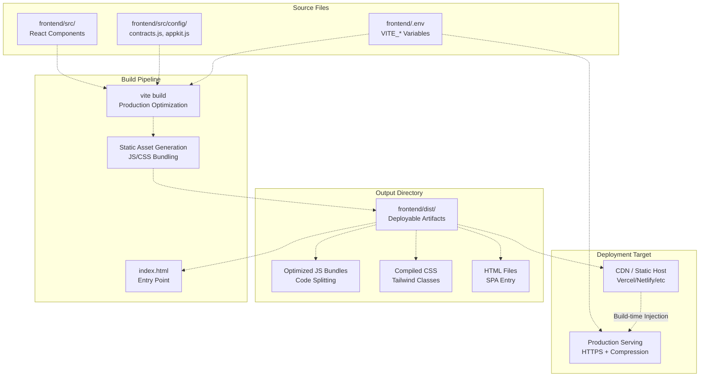
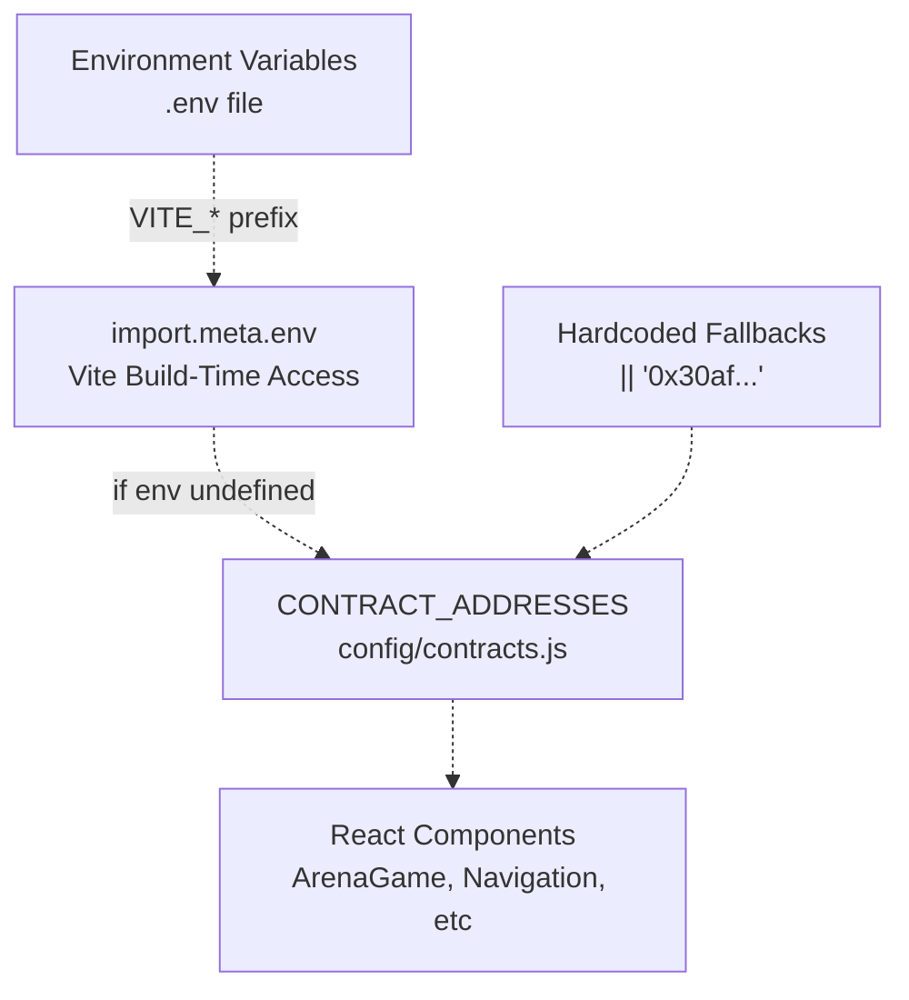
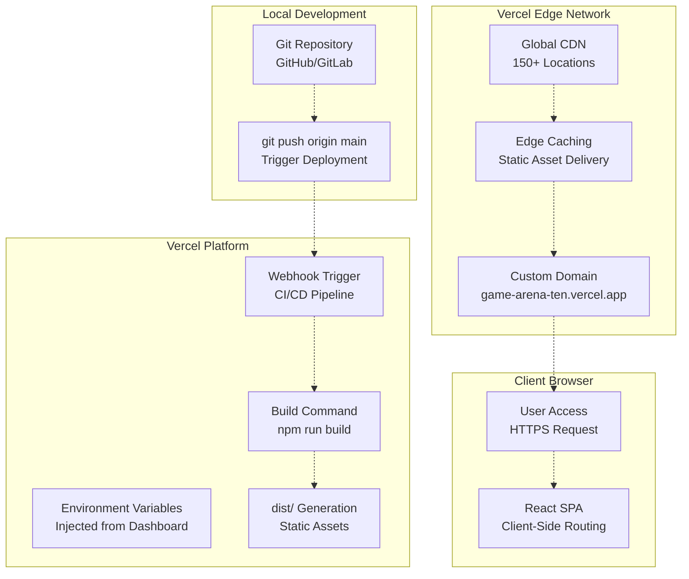
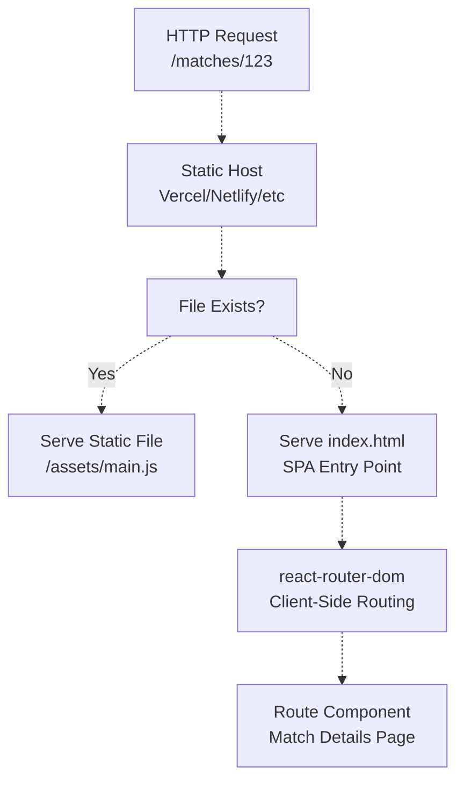
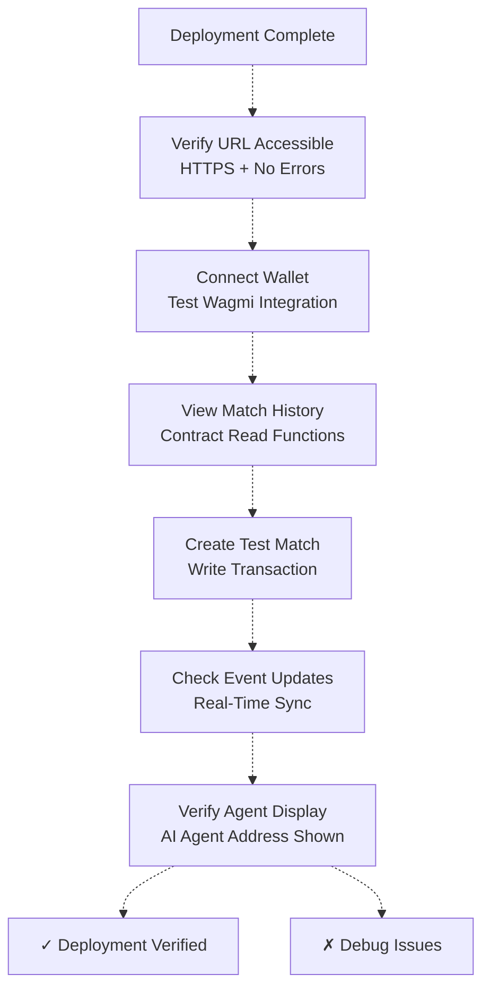
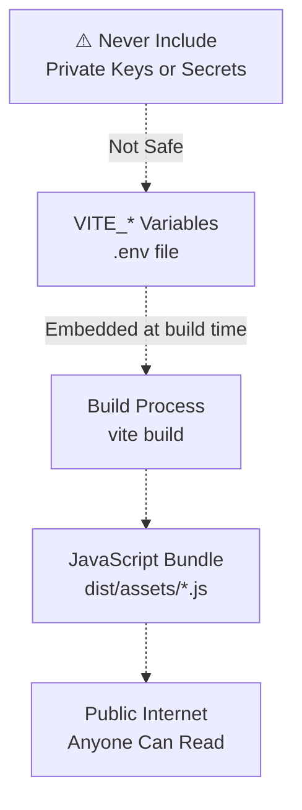
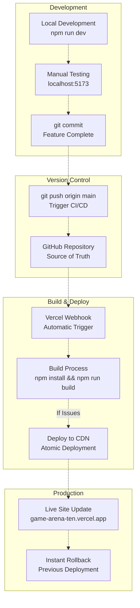

# Deploying the Frontend

> **Relevant source files**
> * [README.md](https://github.com/HACK3R-CRYPTO/GameArena/blob/30ace840/README.md)
> * [frontend/.env](https://github.com/HACK3R-CRYPTO/GameArena/blob/30ace840/frontend/.env)
> * [frontend/package-lock.json](https://github.com/HACK3R-CRYPTO/GameArena/blob/30ace840/frontend/package-lock.json)
> * [frontend/package.json](https://github.com/HACK3R-CRYPTO/GameArena/blob/30ace840/frontend/package.json)
> * [frontend/src/components/DocsModal.jsx](https://github.com/HACK3R-CRYPTO/GameArena/blob/30ace840/frontend/src/components/DocsModal.jsx)
> * [frontend/src/config/contracts.js](https://github.com/HACK3R-CRYPTO/GameArena/blob/30ace840/frontend/src/config/contracts.js)

This document provides instructions for building and deploying the Arena platform frontend application to production hosting environments. It covers the build process, environment configuration, deployment to Vercel (the live platform), and alternative deployment options.

For information about running the frontend locally during development, see [Local Development Setup](/HACK3R-CRYPTO/GameArena/2.2-local-development-setup). For details about the agent deployment process, see [Deploying the Agent](/HACK3R-CRYPTO/GameArena/8.3-deploying-the-agent).

---

## Overview

The Arena frontend is a **Vite + React** single-page application that connects users to the Monad blockchain via wallet providers and displays real-time match data from the ArenaPlatform contract. The production build generates static assets optimized for CDN delivery.

**Live Production Deployment:** [https://game-arena-ten.vercel.app/](https://game-arena-ten.vercel.app/)

**Key Technologies:**

* **Build Tool:** Vite 7.2.4
* **Framework:** React 19.2.0
* **Blockchain Library:** Wagmi 3.3.2 + Viem 2.44.1
* **Wallet Integration:** Reown AppKit 1.8.16
* **State Management:** TanStack Query 5.90.19
* **Styling:** Tailwind CSS 4.1.18

Sources: [frontend/package.json L1-L46](https://github.com/HACK3R-CRYPTO/GameArena/blob/30ace840/frontend/package.json#L1-L46)

 [README.md L20-L26](https://github.com/HACK3R-CRYPTO/GameArena/blob/30ace840/README.md#L20-L26)

---

## Build Process Architecture



**Build Process Flow:**

1. **Source Collection:** Vite reads all React components from `frontend/src/`
2. **Environment Variable Injection:** All `VITE_*` prefixed variables from `.env` are embedded at build time via `import.meta.env`
3. **Asset Optimization:** JavaScript is minified, CSS is processed via PostCSS + Tailwind, and code splitting creates separate chunks
4. **Output Generation:** Static files are written to `frontend/dist/` directory
5. **Deployment:** The `dist/` folder is uploaded to a static hosting provider

Sources: [frontend/package.json L6-L10](https://github.com/HACK3R-CRYPTO/GameArena/blob/30ace840/frontend/package.json#L6-L10)

 [frontend/.env L1-L13](https://github.com/HACK3R-CRYPTO/GameArena/blob/30ace840/frontend/.env#L1-L13)

---

## Environment Variable Configuration

### Required Variables

All environment variables must be prefixed with `VITE_` to be accessible in the browser via `import.meta.env`. These values are **embedded into the JavaScript bundle at build time** and become public.

| Variable | Purpose | Example Value | Used In |
| --- | --- | --- | --- |
| `VITE_RPC_URL` | Monad blockchain RPC endpoint | `https://rpc.monad.xyz` | Wagmi provider configuration |
| `VITE_ARENA_PLATFORM_ADDRESS` | ArenaPlatform contract address | `0x30af30ec392b881b...` | Contract interaction |
| `VITE_AI_AGENT_ADDRESS` | Arena Champion agent wallet | `0x2E33d7D5Fa3eD4Dd...` | UI display, match filtering |
| `VITE_AGENT_REGISTRY_ADDRESS` | EIP-8004 registry contract | `0x34FCEE3eFaA15750...` | Agent metadata queries |
| `VITE_ARENA_TOKEN_ADDRESS` | $ARENA token contract | `0x1D3a53f0F52053D3...` | Token balance checks |
| `VITE_REOWN_PROJECT_ID` | Reown AppKit project ID | `80ad617c75ff0a3e...` | Wallet modal configuration |
| `VITE_WEB3AUTH_CLIENT_ID` | Web3Auth OAuth client | `BOP1piqYY0Tf10Qd...` | Social login provider |

Sources: [frontend/.env L1-L13](https://github.com/HACK3R-CRYPTO/GameArena/blob/30ace840/frontend/.env#L1-L13)

 [frontend/src/config/contracts.js L1-L7](https://github.com/HACK3R-CRYPTO/GameArena/blob/30ace840/frontend/src/config/contracts.js#L1-L7)

### Environment File Structure

**Development (`.env`):**

```javascript
# Wallet / Auth
VITE_WEB3AUTH_CLIENT_ID=BOP1piqYY0Tf10QdHE0Azm5UK-OWkHRJFkSsGuHFIFdyokVa6DXB3jNiNKgFskGW-HfBpQvKN0HWWj1u8NmaKFk
VITE_REOWN_PROJECT_ID=80ad617c75ff0a3e14ee2636f4bbfe56

# Chain / RPC
VITE_RPC_URL=https://rpc.monad.xyz

# Arena Contracts
VITE_ARENA_PLATFORM_ADDRESS=0x30af30ec392b881b009a0c6b520ebe6d15722e9b
VITE_AI_AGENT_ADDRESS=0x2E33d7D5Fa3eD4Dd6BEb95CdC41F51635C4b7Ad1
VITE_AGENT_REGISTRY_ADDRESS=0x34FCEE3eFaA15750B070836F19F3970Ad20fE8d1
VITE_ARENA_TOKEN_ADDRESS=0x1D3a53f0F52053D301374647e70B87279D5F7777
```

**Production (Hosting Platform):**
These same variables must be configured in the hosting platform's environment variable dashboard (e.g., Vercel Project Settings → Environment Variables).

Sources: [frontend/.env L1-L13](https://github.com/HACK3R-CRYPTO/GameArena/blob/30ace840/frontend/.env#L1-L13)

---

## Contract Configuration Loading



The `frontend/src/config/contracts.js` module exports contract addresses with fallback logic:

```javascript
export const CONTRACT_ADDRESSES = {
  ARENA_PLATFORM: import.meta.env.VITE_ARENA_PLATFORM_ADDRESS || '0x30af30ec392b881b009a0c6b520ebe6d15722e9b',
  AI_AGENT: import.meta.env.VITE_AI_AGENT_ADDRESS || '0x2E33d7D5Fa3eD4Dd6BEb95CdC41F51635C4b7Ad1',
  // ...
};
```

Components import addresses using:

```javascript
import { CONTRACT_ADDRESSES, ARENA_PLATFORM_ABI } from '../config/contracts';
```

Sources: [frontend/src/config/contracts.js L1-L7](https://github.com/HACK3R-CRYPTO/GameArena/blob/30ace840/frontend/src/config/contracts.js#L1-L7)

---

## Building for Production

### Step 1: Install Dependencies

Navigate to the frontend directory and install all required packages:

```
cd frontend
npm install
```

This installs all dependencies listed in `package.json`, including:

* React 19.2.0 and React DOM
* Viem 2.44.1 for Ethereum interaction
* Wagmi 3.3.2 for React hooks
* Reown AppKit 1.8.16 for wallet modals
* TanStack Query 5.90.19 for data caching
* Tailwind CSS 4.1.18 for styling

Sources: [frontend/package.json L12-L29](https://github.com/HACK3R-CRYPTO/GameArena/blob/30ace840/frontend/package.json#L12-L29)

### Step 2: Configure Environment

Create or verify `frontend/.env` file with production values. **Critical**: Ensure all contract addresses match the deployed contracts on Monad mainnet.

```markdown
# Verify contract addresses match production
cat frontend/.env
```

### Step 3: Execute Production Build

Run the Vite build command:

```
npm run build
```

**Build Output:**

* **Location:** `frontend/dist/`
* **Index File:** `dist/index.html` (SPA entry point)
* **Assets:** `dist/assets/` (JS, CSS, images)
* **Chunking:** Vite automatically splits code into vendor, component, and route chunks

**Build Script Definition:**

```json
{
  "scripts": {
    "build": "vite build"
  }
}
```

Sources: [frontend/package.json L6-L10](https://github.com/HACK3R-CRYPTO/GameArena/blob/30ace840/frontend/package.json#L6-L10)

### Step 4: Preview Build Locally (Optional)

Test the production build locally before deployment:

```
npm run preview
```

This serves the `dist/` folder at `http://localhost:4173` using Vite's preview server.

Sources: [frontend/package.json L10](https://github.com/HACK3R-CRYPTO/GameArena/blob/30ace840/frontend/package.json#L10-L10)

---

## Deployment to Vercel

### Vercel Deployment Architecture



**Current Production URL:** [https://game-arena-ten.vercel.app/](https://game-arena-ten.vercel.app/)

Sources: [README.md L20](https://github.com/HACK3R-CRYPTO/GameArena/blob/30ace840/README.md#L20-L20)

### Vercel Configuration

**Option 1: Automatic Git Integration (Recommended)**

1. **Import Project:** * Log into [vercel.com](https://vercel.com) * Click "Add New Project" → "Import Git Repository" * Select the Arena repository
2. **Configure Build Settings:** * **Framework Preset:** Vite * **Root Directory:** `frontend` * **Build Command:** `npm run build` * **Output Directory:** `dist` * **Install Command:** `npm install`
3. **Add Environment Variables:** Navigate to Project Settings → Environment Variables and add all `VITE_*` variables: ``` VITE_RPC_URL=https://rpc.monad.xyz VITE_ARENA_PLATFORM_ADDRESS=0x30af30ec392b881b009a0c6b520ebe6d15722e9b VITE_AI_AGENT_ADDRESS=0x2E33d7D5Fa3eD4Dd6BEb95CdC41F51635C4b7Ad1 VITE_AGENT_REGISTRY_ADDRESS=0x34FCEE3eFaA15750B070836F19F3970Ad20fE8d1 VITE_ARENA_TOKEN_ADDRESS=0x1D3a53f0F52053D301374647e70B87279D5F7777 VITE_REOWN_PROJECT_ID=80ad617c75ff0a3e14ee2636f4bbfe56 VITE_WEB3AUTH_CLIENT_ID=BOP1piqYY0Tf10QdHE0Azm5UK-OWkHRJFkSsGuHFIFdyokVa6DXB3jNiNKgFskGW-HfBpQvKN0HWWj1u8NmaKFk ```
4. **Deploy:** * Click "Deploy" * Vercel automatically builds and deploys the project * Every `git push` to the main branch triggers a new deployment

**Option 2: CLI Deployment**

1. **Install Vercel CLI:** ``` npm install -g vercel ```
2. **Login:** ``` vercel login ```
3. **Deploy:** ``` cd frontend vercel --prod ```
4. **Configure Environment:** ```markdown vercel env add VITE_RPC_URL production # Repeat for all VITE_* variables ```

Sources: [README.md L20](https://github.com/HACK3R-CRYPTO/GameArena/blob/30ace840/README.md#L20-L20)

 [frontend/.env L1-L13](https://github.com/HACK3R-CRYPTO/GameArena/blob/30ace840/frontend/.env#L1-L13)

---

## Alternative Deployment Platforms

### Netlify

**Configuration File: `frontend/netlify.toml`**

```python
[build]
  base = "frontend"
  command = "npm run build"
  publish = "dist"

[build.environment]
  NODE_VERSION = "18"

[[redirects]]
  from = "/*"
  to = "/index.html"
  status = 200
```

**Deployment Steps:**

1. Connect GitHub repository to Netlify
2. Set base directory to `frontend`
3. Add environment variables in Site Settings → Environment Variables
4. Deploy

### AWS S3 + CloudFront

**Build and Upload:**

```sql
cd frontend
npm run build

# Upload to S3
aws s3 sync dist/ s3://your-bucket-name/ --delete

# Invalidate CloudFront cache
aws cloudfront create-invalidation --distribution-id YOUR_DISTRIBUTION_ID --paths "/*"
```

**S3 Bucket Configuration:**

* Enable static website hosting
* Configure index document: `index.html`
* Set error document: `index.html` (for SPA routing)

**CloudFront Configuration:**

* Origin: S3 bucket endpoint
* Default root object: `index.html`
* Custom error response: 404 → 200 → `/index.html`

### Generic Static Host

Any static file host supporting SPA routing works. Requirements:

1. Serve `index.html` for all routes (catch-all)
2. Support HTTPS
3. Enable compression (gzip/brotli)

**Example Nginx Configuration:**

```
server {
    listen 80;
    server_name yourdomain.com;
    root /var/www/arena-frontend;
    index index.html;

    location / {
        try_files $uri $uri/ /index.html;
    }

    location ~* \.(js|css|png|jpg|jpeg|gif|ico|svg)$ {
        expires 1y;
        add_header Cache-Control "public, immutable";
    }
}
```

Sources: N/A (platform-specific examples)

---

## SPA Routing Configuration



**Critical Configuration:**

All non-file requests must return `index.html` to enable React Router DOM to handle client-side routing. This is configured differently per platform:

* **Vercel:** Automatic for Vite framework preset
* **Netlify:** Requires `_redirects` file or `netlify.toml` redirect rule
* **S3 + CloudFront:** Custom error response mapping
* **Nginx:** `try_files $uri $uri/ /index.html;`

Sources: [frontend/package.json L26](https://github.com/HACK3R-CRYPTO/GameArena/blob/30ace840/frontend/package.json#L26-L26)

---

## Post-Deployment Verification

### Verification Checklist



**Manual Testing Steps:**

1. **Load Application:** * Navigate to production URL * Verify page loads without console errors * Check browser console for network/JavaScript errors
2. **Wallet Connection:** * Click wallet connect button in Navigation component * Test AppKit modal displays correctly * Connect MetaMask or other wallet
3. **Contract Interaction:** * Verify match history loads (read operation) * Check AI agent address displays correctly * Attempt to propose a match (write operation)
4. **Real-Time Updates:** * Propose a match and wait for AI acceptance * Verify event updates appear without page refresh * Check optimistic UI updates work
5. **Environment Variables:** * Open browser DevTools → Sources * Search for `VITE_ARENA_PLATFORM_ADDRESS` in compiled JS * Verify correct contract address is embedded

Sources: [README.md L20-L26](https://github.com/HACK3R-CRYPTO/GameArena/blob/30ace840/README.md#L20-L26)

 [frontend/src/config/contracts.js L1-L7](https://github.com/HACK3R-CRYPTO/GameArena/blob/30ace840/frontend/src/config/contracts.js#L1-L7)

---

## Environment Variable Security

### Important Security Considerations

**All `VITE_*` variables are PUBLIC and embedded in the client-side JavaScript bundle.**



**Safe for `VITE_*` Variables:**

* ✅ Public contract addresses
* ✅ Public RPC URLs
* ✅ OAuth client IDs (with domain restrictions)
* ✅ API keys for read-only services

**NEVER Include:**

* ❌ Private keys
* ❌ Wallet mnemonics
* ❌ Backend API secrets
* ❌ Database credentials

**Agent Private Key Storage:**
The agent's private key (`PRIVATE_KEY` in `agent/.env`) must **never** be included in frontend environment variables. It remains server-side only in the agent deployment.

Sources: [frontend/.env L1-L13](https://github.com/HACK3R-CRYPTO/GameArena/blob/30ace840/frontend/.env#L1-L13)

---

## Troubleshooting

### Common Build Issues

| Issue | Symptom | Solution |
| --- | --- | --- |
| **Missing Environment Variables** | `import.meta.env.VITE_X is undefined` | Verify all `VITE_*` variables are set in `.env` or hosting platform |
| **Contract Address Mismatch** | "Contract not found" errors | Check `VITE_ARENA_PLATFORM_ADDRESS` matches deployed contract |
| **RPC Connection Failure** | "Network request failed" | Verify `VITE_RPC_URL` is accessible and correct |
| **Build Size Warning** | Large bundle warnings | Check for accidentally imported large dependencies |
| **SPA Routing 404s** | 404 on direct URL access | Configure catch-all redirect to `index.html` |

### Debug Process

**1. Check Build Output:**

```markdown
cd frontend
npm run build
ls -lh dist/  # Verify files exist
```

**2. Test Locally:**

```markdown
npm run preview
# Access http://localhost:4173
```

**3. Verify Environment Injection:**

```markdown
# Search for contract address in built files
grep -r "30af30ec392b881b" dist/
```

**4. Check Browser Console:**

* Open DevTools → Console
* Look for error messages
* Verify network requests to RPC succeed

**5. Inspect Production Environment:**

```markdown
# For Vercel CLI
vercel env ls
```

Sources: [frontend/package.json L6-L10](https://github.com/HACK3R-CRYPTO/GameArena/blob/30ace840/frontend/package.json#L6-L10)

---

## Continuous Deployment Workflow



**Recommended Workflow:**

1. **Feature Development:** * Develop locally with `npm run dev` * Test with local agent or production agent
2. **Pre-Deployment:** * Run production build locally: `npm run build` * Test preview: `npm run preview` * Verify no console errors
3. **Deployment:** * Commit changes to Git * Push to main branch * Vercel automatically builds and deploys
4. **Monitoring:** * Check deployment logs in Vercel dashboard * Test live URL * Monitor for errors in production
5. **Rollback (if needed):** * Navigate to Vercel → Deployments * Click "Promote to Production" on previous successful deployment

Sources: [frontend/package.json L6-L10](https://github.com/HACK3R-CRYPTO/GameArena/blob/30ace840/frontend/package.json#L6-L10)

 [README.md L20](https://github.com/HACK3R-CRYPTO/GameArena/blob/30ace840/README.md#L20-L20)

---

## Build Optimization

### Production Build Characteristics

The Vite build process automatically applies these optimizations:

**Code Splitting:**

* Vendor libraries (React, Wagmi, Viem) → separate chunk
* Route-based splitting (if using lazy imports)
* Dynamic imports → separate chunks

**Minification:**

* JavaScript: Terser minification
* CSS: cssnano optimization
* HTML: whitespace removal

**Asset Optimization:**

* Images: URL imports become hashed filenames
* Fonts: Subsetting and format optimization
* SVG: Inline or external based on size

**Caching Strategy:**

* `index.html`: No cache (always fresh)
* `assets/*.js` and `assets/*.css`: Immutable with content hash
* Browser cache headers set automatically by Vercel

Sources: [frontend/package.json L8](https://github.com/HACK3R-CRYPTO/GameArena/blob/30ace840/frontend/package.json#L8-L8)

---

## Summary

The Arena frontend deployment process follows a standard **Vite + React static site** pattern:

1. **Build:** `npm run build` generates optimized static files in `dist/`
2. **Configure:** Environment variables with `VITE_` prefix are embedded at build time
3. **Deploy:** Upload `dist/` folder to static host (Vercel, Netlify, S3, etc.)
4. **Serve:** Configure SPA routing to serve `index.html` for all routes

**Production Checklist:**

* ✅ All `VITE_*` environment variables configured
* ✅ Contract addresses match Monad mainnet deployment
* ✅ Build completes without errors
* ✅ SPA routing configured (catch-all to `index.html`)
* ✅ HTTPS enabled
* ✅ Wallet connection tested
* ✅ Contract interaction verified

For ongoing maintenance, use Git-based continuous deployment with automatic builds on each commit to the main branch.

Sources: [frontend/package.json L1-L46](https://github.com/HACK3R-CRYPTO/GameArena/blob/30ace840/frontend/package.json#L1-L46)

 [frontend/.env L1-L13](https://github.com/HACK3R-CRYPTO/GameArena/blob/30ace840/frontend/.env#L1-L13)

 [README.md L20-L26](https://github.com/HACK3R-CRYPTO/GameArena/blob/30ace840/README.md#L20-L26)