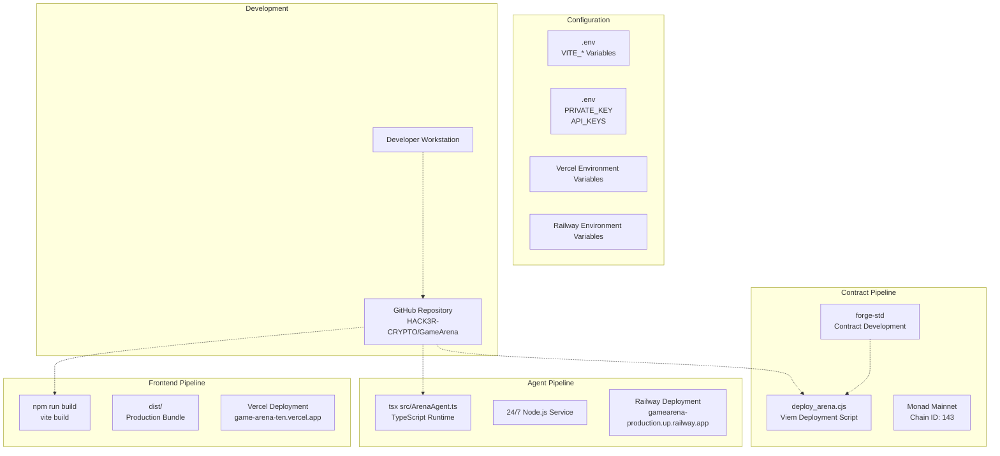
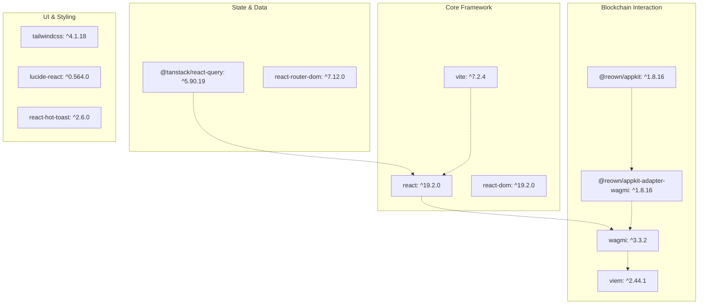
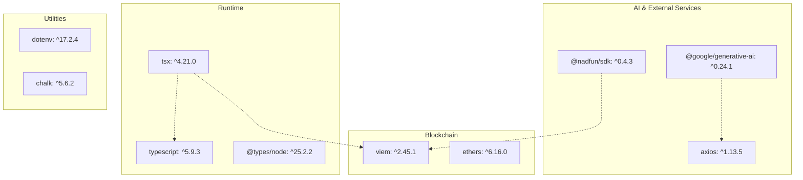
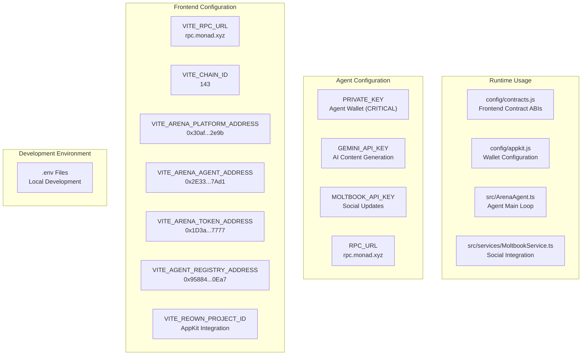

# Development & Deployment

> **Relevant source files**
> * [README.md](https://github.com/HACK3R-CRYPTO/GameArena/blob/30ace840/README.md)
> * [agent/package.json](https://github.com/HACK3R-CRYPTO/GameArena/blob/30ace840/agent/package.json)
> * [frontend/package-lock.json](https://github.com/HACK3R-CRYPTO/GameArena/blob/30ace840/frontend/package-lock.json)
> * [frontend/package.json](https://github.com/HACK3R-CRYPTO/GameArena/blob/30ace840/frontend/package.json)
> * [frontend/src/components/DocsModal.jsx](https://github.com/HACK3R-CRYPTO/GameArena/blob/30ace840/frontend/src/components/DocsModal.jsx)

## Purpose and Scope

This document provides technical guidance for developers working on or deploying the Arena AI Champion platform. It covers the three-tier deployment architecture, development environment setup, technology stack configuration, and deployment procedures for all system components.

For specific deployment procedures, see:

* [Deploying the Agent](/HACK3R-CRYPTO/GameArena/8.3-deploying-the-agent) - Railway deployment of autonomous AI agent
* [Deploying the Frontend](/HACK3R-CRYPTO/GameArena/8.4-deploying-the-frontend) - Vercel deployment of React application
* [Smart Contract Deployment](/HACK3R-CRYPTO/GameArena/8.5-smart-contract-deployment) - Monad mainnet contract deployment

For codebase organization details, see [Project Structure](/HACK3R-CRYPTO/GameArena/8.1-project-structure). For environment variable reference, see [Environment Configuration](/HACK3R-CRYPTO/GameArena/8.2-environment-configuration).

---

## System Architecture Overview

The Arena platform follows a three-tier deployment architecture where each component runs on specialized infrastructure:

| Component | Technology | Hosting Platform | Purpose |
| --- | --- | --- | --- |
| **Frontend** | React + Vite | Vercel (`game-arena-ten.vercel.app`) | User interface and wallet interaction |
| **Agent System** | Node.js + TypeScript | Railway (`gamearena-production.up.railway.app`) | 24/7 autonomous AI agent |
| **Smart Contracts** | Solidity + Foundry | Monad Mainnet (`143`) | On-chain game logic and escrow |

Each tier operates independently but communicates through the Monad RPC endpoint (`rpc.monad.xyz`), which serves as the single source of truth for blockchain state.

**Sources:** [README.md L52-L64](https://github.com/HACK3R-CRYPTO/GameArena/blob/30ace840/README.md#L52-L64)

 Diagram 6

---

## Deployment Pipeline Architecture



**Deployment Pipeline Architecture**

This diagram shows the complete deployment flow from development to production. The frontend uses Vite's build process to generate a static bundle deployed to Vercel. The agent runs as a long-lived Node.js process on Railway using `tsx` for TypeScript execution without compilation. Contracts are deployed via a custom script using Viem. Configuration flows through `.env` files into platform-specific secret managers.

**Sources:** [README.md L87-L131](https://github.com/HACK3R-CRYPTO/GameArena/blob/30ace840/README.md#L87-L131)

 [agent/package.json L7-L9](https://github.com/HACK3R-CRYPTO/GameArena/blob/30ace840/agent/package.json#L7-L9)

 [frontend/package.json L7-L10](https://github.com/HACK3R-CRYPTO/GameArena/blob/30ace840/frontend/package.json#L7-L10)

 Diagram 6

---

## Technology Stack by Component

### Frontend Dependencies



**Frontend Technology Stack**

The frontend uses React 19 with Vite for fast development and production builds. Blockchain interaction is handled through Wagmi hooks and Viem, with AppKit providing wallet connection UI. TanStack Query manages data fetching and caching. Tailwind CSS provides utility-first styling.

**Sources:** [frontend/package.json L12-L28](https://github.com/HACK3R-CRYPTO/GameArena/blob/30ace840/frontend/package.json#L12-L28)

### Agent System Dependencies



**Agent System Technology Stack**

The agent runs on Node.js using `tsx` for direct TypeScript execution. Viem handles blockchain interactions while Google Gemini AI provides content generation. The @nadfun/sdk integrates with the token trading platform. All API keys are loaded via `dotenv`.

**Sources:** [agent/package.json L14-L25](https://github.com/HACK3R-CRYPTO/GameArena/blob/30ace840/agent/package.json#L14-L25)

---

## Configuration Flow



**Configuration and Environment Variable Flow**

Environment variables follow a strict naming convention: frontend variables use `VITE_*` prefix for injection into the client bundle, while agent variables use plain names. Frontend configuration is public (contract addresses, RPC URLs), while agent configuration includes sensitive secrets (private keys, API keys). All blockchain addresses and RPC endpoints are shared between both systems.

**Sources:** [README.md L153-L161](https://github.com/HACK3R-CRYPTO/GameArena/blob/30ace840/README.md#L153-L161)

 Diagram 6

---

## Build Process Details

### Frontend Build

The frontend uses Vite's production build system:

```markdown
npm run build    # Executes vite build
```

This command performs:

1. **TypeScript Compilation** - Type-checks JSX/TSX files
2. **Module Bundling** - Rollup-based tree-shaking and code splitting
3. **Asset Optimization** - Minification, compression, hash-based caching
4. **Environment Injection** - `VITE_*` variables embedded into bundle

Output: `dist/` directory containing static HTML, CSS, JS, and assets ready for deployment to any static hosting platform.

**Sources:** [frontend/package.json L8](https://github.com/HACK3R-CRYPTO/GameArena/blob/30ace840/frontend/package.json#L8-L8)

### Agent Execution

The agent uses `tsx` for runtime TypeScript execution without a build step:

```markdown
npm start    # Executes tsx src/ArenaAgent.ts
```

The `tsx` package provides:

* **Direct TS Execution** - No compilation to JavaScript required
* **Fast Startup** - JIT compilation and caching
* **ESM Support** - Native ES modules via `"type": "module"` in package.json

The agent runs as a long-lived process with continuous event monitoring. Process restarts are handled by the Railway platform's process manager.

**Sources:** [agent/package.json L8](https://github.com/HACK3R-CRYPTO/GameArena/blob/30ace840/agent/package.json#L8-L8)

 [agent/package.json L6](https://github.com/HACK3R-CRYPTO/GameArena/blob/30ace840/agent/package.json#L6-L6)

---

## Deployment Infrastructure

### Live Deployment URLs

| Component | URL | Status |
| --- | --- | --- |
| Frontend | [https://game-arena-ten.vercel.app/](https://game-arena-ten.vercel.app/) | ✅ Live |
| Agent API | [https://gamearena-production.up.railway.app](https://gamearena-production.up.railway.app) | ✅ Live |
| Contracts | Monad Scan | ✅ Deployed |

### Contract Addresses (Monad Mainnet)

| Contract | Address | Purpose |
| --- | --- | --- |
| ArenaPlatform | `0x30af30ec392b881b009a0c6b520ebe6d15722e9b` | Match management & escrow |
| Arena Agent | `0x2E33d7D5Fa3eD4Dd6BEb95CdC41F51635C4b7Ad1` | Autonomous AI agent wallet |
| $ARENA Token | `0x1D3a53f0F52053D301374647e70B87279D5F7777` | Platform token |
| Agent Registry | `0x95884fe0d2a817326338735Eb4f24dD04Cf20Ea7` | EIP-8004 agent identity |

**Sources:** [README.md L20-L25](https://github.com/HACK3R-CRYPTO/GameArena/blob/30ace840/README.md#L20-L25)

 [README.md L153-L161](https://github.com/HACK3R-CRYPTO/GameArena/blob/30ace840/README.md#L153-L161)

---

## Development Workflow

### Local Development Setup

**Prerequisites:**

* Node.js v18+
* Git
* Metamask or compatible wallet configured for Monad Mainnet

**Frontend Development:**

```markdown
cd frontend
npm install
npm run dev    # Starts dev server at http://localhost:5173
```

The Vite dev server provides:

* Hot Module Replacement (HMR) for instant updates
* Fast refresh for React components
* Source maps for debugging
* Proxy configuration for API requests

**Agent Development:**

```sql
cd agent
npm install
# Create .env with PRIVATE_KEY, GEMINI_API_KEY, MOLTBOOK_API_KEY
npm start      # Starts agent with live blockchain monitoring
```

The agent immediately begins watching for `MatchProposed` events and will autonomously accept and play matches.

**Sources:** [README.md L87-L112](https://github.com/HACK3R-CRYPTO/GameArena/blob/30ace840/README.md#L87-L112)

---

## Deployment Configuration Details

### Frontend Environment Variables

All frontend environment variables must be prefixed with `VITE_` to be embedded into the client bundle:

| Variable | Example Value | Purpose |
| --- | --- | --- |
| `VITE_RPC_URL` | `https://rpc.monad.xyz` | Monad RPC endpoint |
| `VITE_CHAIN_ID` | `143` | Monad mainnet chain ID |
| `VITE_ARENA_PLATFORM_ADDRESS` | `0x30af...` | ArenaPlatform contract |
| `VITE_ARENA_AGENT_ADDRESS` | `0x2E33...` | AI agent wallet |
| `VITE_ARENA_TOKEN_ADDRESS` | `0x1D3a...` | $ARENA token |
| `VITE_AGENT_REGISTRY_ADDRESS` | `0x95884...` | EIP-8004 registry |
| `VITE_REOWN_PROJECT_ID` | `<project-id>` | AppKit wallet integration |

These variables are read by `frontend/config/contracts.js` and `frontend/config/appkit.js` at build time.

### Agent Environment Variables

Agent environment variables contain sensitive secrets:

| Variable | Purpose | Security Level |
| --- | --- | --- |
| `PRIVATE_KEY` | Agent wallet private key | **CRITICAL - NEVER COMMIT** |
| `GEMINI_API_KEY` | Google Gemini AI access | Secret |
| `MOLTBOOK_API_KEY` | Social feed posting | Secret |
| `RPC_URL` | Monad RPC endpoint | Public |

The `PRIVATE_KEY` controls the agent's wallet at `0x2E33d7D5Fa3eD4Dd6BEb95CdC41F51635C4b7Ad1` and must be secured in the Railway platform's environment variable manager.

**Sources:** Diagram 6

---

## Continuous Deployment

### Vercel Deployment (Frontend)

Vercel automatically deploys on git push to main branch:

1. **Build Trigger** - Push to `main` branch
2. **Build Execution** - `npm run build` in Vercel environment
3. **Environment Injection** - Vercel secrets injected as `VITE_*` variables
4. **CDN Distribution** - Static assets distributed to global edge network
5. **URL Assignment** - Live at `game-arena-ten.vercel.app`

Deployment takes approximately 1-2 minutes. Rollback is instant via Vercel dashboard.

### Railway Deployment (Agent)

Railway runs the agent as a persistent service:

1. **Process Start** - `npm start` command from package.json
2. **Environment Loading** - Railway secrets loaded as environment variables
3. **Health Monitoring** - Automatic restart on crashes
4. **Log Aggregation** - Stdout/stderr captured for debugging
5. **Port Exposure** - Optional HTTP endpoint at Railway-assigned URL

The agent process must remain running 24/7 to monitor blockchain events. Railway's process manager handles automatic restarts and scaling.

**Sources:** [README.md L20-L22](https://github.com/HACK3R-CRYPTO/GameArena/blob/30ace840/README.md#L20-L22)

 [agent/package.json L8](https://github.com/HACK3R-CRYPTO/GameArena/blob/30ace840/agent/package.json#L8-L8)

---

## Quick Reference Commands

### Frontend Commands

```markdown
# Development
cd frontend
npm install          # Install dependencies
npm run dev          # Start dev server (localhost:5173)
npm run build        # Production build → dist/
npm run preview      # Preview production build locally
npm run lint         # ESLint code checking
```

### Agent Commands

```markdown
# Development & Production
cd agent
npm install          # Install dependencies
npm start            # Run agent with tsx
npm test             # No tests configured currently
```

### Contract Development

```markdown
# Smart contract work uses Foundry + custom deployment
cd contracts
forge build          # Compile contracts
# Deployment via: node agent/deploy_arena.cjs
```

**Sources:** [frontend/package.json L6-L11](https://github.com/HACK3R-CRYPTO/GameArena/blob/30ace840/frontend/package.json#L6-L11)

 [agent/package.json L7-L9](https://github.com/HACK3R-CRYPTO/GameArena/blob/30ace840/agent/package.json#L7-L9)

 [README.md L52-L64](https://github.com/HACK3R-CRYPTO/GameArena/blob/30ace840/README.md#L52-L64)

---

## External Service Integration

The system integrates with several external services that require configuration:

### Monad Network

* **RPC Endpoint**: `rpc.monad.xyz`
* **Chain ID**: `143`
* **Block Explorer**: `monadscan.com`
* **Faucet**: Accessed via Moltbook (50 MON initial funding)

### Google Gemini AI

* **Purpose**: AI-generated content for social posts
* **Configuration**: `GEMINI_API_KEY` in agent environment
* **SDK**: `@google/generative-ai` package

### Moltbook Social Platform

* **Purpose**: Social feed updates and match announcements
* **Configuration**: `MOLTBOOK_API_KEY` in agent environment
* **Service**: `src/services/MoltbookService.ts`

### Reown AppKit (formerly WalletConnect)

* **Purpose**: Multi-wallet connection UI
* **Configuration**: `VITE_REOWN_PROJECT_ID` in frontend
* **Integration**: `frontend/config/appkit.js`

**Sources:** [README.md L26](https://github.com/HACK3R-CRYPTO/GameArena/blob/30ace840/README.md#L26-L26)

 [agent/package.json L15](https://github.com/HACK3R-CRYPTO/GameArena/blob/30ace840/agent/package.json#L15-L15)

 Diagram 1

---

## Security Considerations

### Private Key Management

The agent's private key controls significant funds and must never be:

* Committed to Git repositories
* Logged to console or files
* Transmitted over unencrypted channels
* Shared between environments

Use platform secret managers (Railway, Vercel) for secure storage. Rotate keys if compromise is suspected.

### Environment Variable Separation

Frontend `VITE_*` variables are **public** - embedded in client bundle and visible to all users. Only use for non-sensitive configuration like contract addresses and RPC URLs.

Agent environment variables are **private** - never transmitted to clients. Use for API keys, private keys, and sensitive configuration.

### RPC Endpoint Security

Both frontend and agent use `rpc.monad.xyz` as the single RPC endpoint. This creates a single point of failure. For production systems, consider:

* Multiple RPC endpoints with automatic failover
* Private RPC nodes for agent operations
* Rate limiting and error handling

**Sources:** Diagram 6

---

This completes the overview of the development and deployment architecture. For detailed procedures on deploying each component, see the subsections: [Project Structure](/HACK3R-CRYPTO/GameArena/8.1-project-structure), [Environment Configuration](/HACK3R-CRYPTO/GameArena/8.2-environment-configuration), [Deploying the Agent](/HACK3R-CRYPTO/GameArena/8.3-deploying-the-agent), [Deploying the Frontend](/HACK3R-CRYPTO/GameArena/8.4-deploying-the-frontend), [Smart Contract Deployment](/HACK3R-CRYPTO/GameArena/8.5-smart-contract-deployment), and [Utility Scripts](/HACK3R-CRYPTO/GameArena/8.6-utility-scripts).