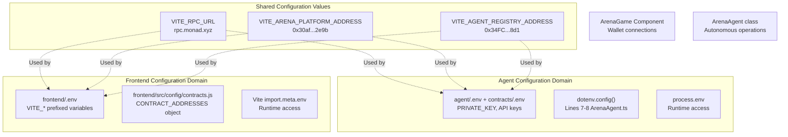
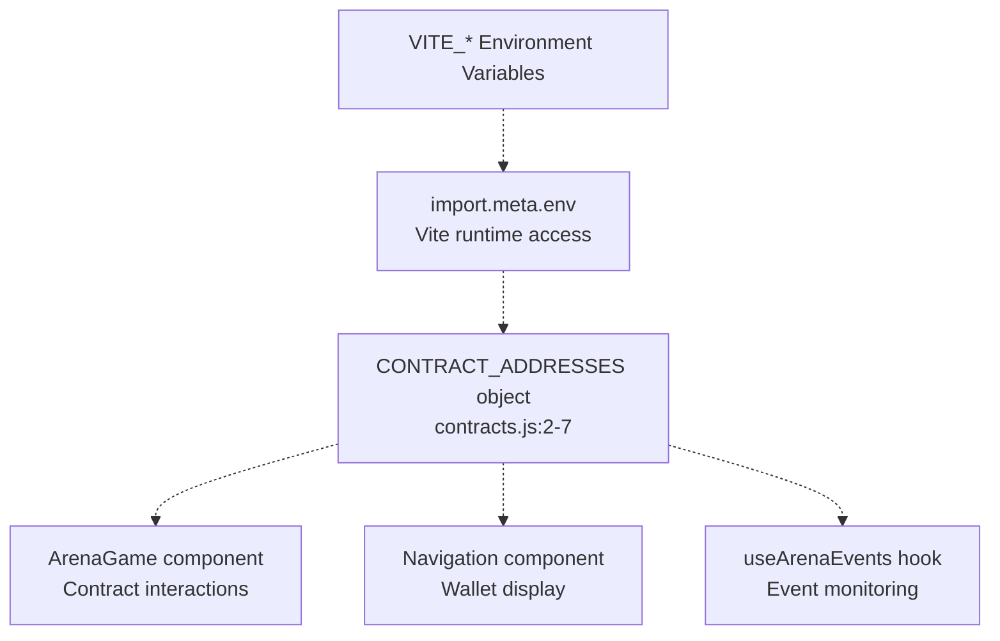
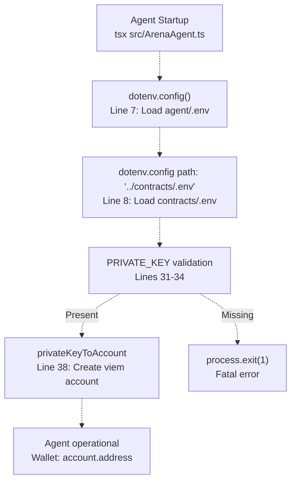
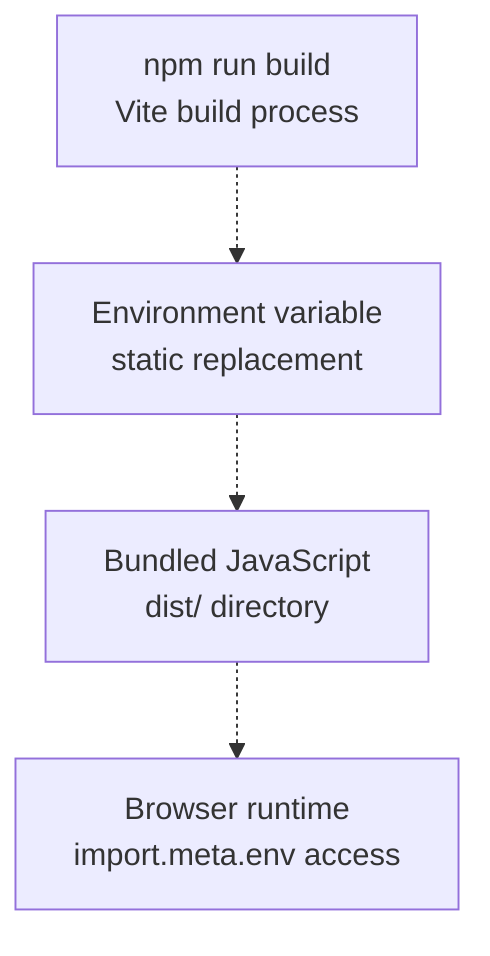
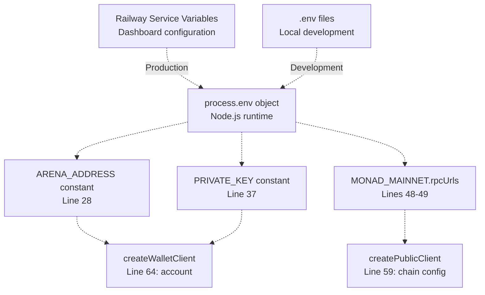
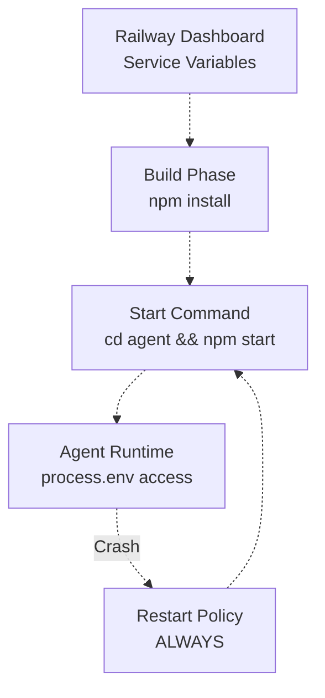
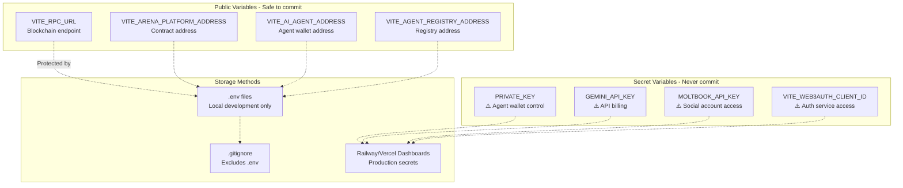

# Environment Configuration

> **Relevant source files**
> * [agent/package.json](https://github.com/HACK3R-CRYPTO/GameArena/blob/30ace840/agent/package.json)
> * [agent/src/ArenaAgent.ts](https://github.com/HACK3R-CRYPTO/GameArena/blob/30ace840/agent/src/ArenaAgent.ts)
> * [frontend/.env](https://github.com/HACK3R-CRYPTO/GameArena/blob/30ace840/frontend/.env)
> * [frontend/src/config/contracts.js](https://github.com/HACK3R-CRYPTO/GameArena/blob/30ace840/frontend/src/config/contracts.js)
> * [package.json](https://github.com/HACK3R-CRYPTO/GameArena/blob/30ace840/package.json)
> * [railway.json](https://github.com/HACK3R-CRYPTO/GameArena/blob/30ace840/railway.json)

This document describes the environment configuration system for the Arena AI Champion platform, including all required environment variables, their purposes, and how they are loaded across the frontend and agent systems. For deployment-specific instructions, see [Deploying the Agent](/HACK3R-CRYPTO/GameArena/8.3-deploying-the-agent) and [Deploying the Frontend](/HACK3R-CRYPTO/GameArena/8.4-deploying-the-frontend). For information about smart contract addresses referenced in configuration, see [Contract Addresses](/HACK3R-CRYPTO/GameArena/4.4-contract-addresses).

---

## Configuration Architecture

The Arena AI Champion platform uses two separate configuration domains that share some common values but serve different purposes. The **frontend configuration** provides public blockchain connection parameters and contract addresses for the React application, while the **agent configuration** includes both blockchain parameters and sensitive private keys for autonomous operation.



**Sources:** [frontend/.env L1-L13](https://github.com/HACK3R-CRYPTO/GameArena/blob/30ace840/frontend/.env#L1-L13)

 [agent/src/ArenaAgent.ts L3-L8](https://github.com/HACK3R-CRYPTO/GameArena/blob/30ace840/agent/src/ArenaAgent.ts#L3-L8)

 [frontend/src/config/contracts.js L1-L7](https://github.com/HACK3R-CRYPTO/GameArena/blob/30ace840/frontend/src/config/contracts.js#L1-L7)

---

## Frontend Environment Variables

The frontend uses Vite's environment variable system, which requires all variables to be prefixed with `VITE_` for security. These variables are bundled into the client-side JavaScript at build time and are publicly visible.

### Frontend Variable Reference

| Variable | Purpose | Example Value | Required |
| --- | --- | --- | --- |
| `VITE_WEB3AUTH_CLIENT_ID` | Web3Auth authentication service client ID | `BOP1piqYY0Tf10Q...` | Yes |
| `VITE_REOWN_PROJECT_ID` | Reown (formerly WalletConnect) project ID for wallet connections | `80ad617c75ff0a3e...` | Yes |
| `VITE_RPC_URL` | Monad blockchain RPC endpoint | `https://rpc.monad.xyz` | Yes |
| `VITE_ARENA_PLATFORM_ADDRESS` | Main ArenaPlatform contract address | `0x30af30ec392b881b009a0c6b520ebe6d15722e9b` | Yes |
| `VITE_AI_AGENT_ADDRESS` | Arena Champion AI wallet address | `0x2E33d7D5Fa3eD4Dd6BEb95CdC41F51635C4b7Ad1` | Yes |
| `VITE_AGENT_REGISTRY_ADDRESS` | EIP-8004 Agent Registry contract address | `0x34FCEE3eFaA15750B070836F19F3970Ad20fE8d1` | Yes |
| `VITE_ARENA_TOKEN_ADDRESS` | Arena Token (ERC20) contract address | `0x1D3a53f0F52053D301374647e70B87279D5F7777` | Optional |

### Frontend Configuration Usage

The frontend configuration is centralized in `contracts.js`, which imports environment variables and provides fallback defaults:



The configuration object structure in [frontend/src/config/contracts.js L2-L7](https://github.com/HACK3R-CRYPTO/GameArena/blob/30ace840/frontend/src/config/contracts.js#L2-L7)

:

* `ARENA_PLATFORM`: Main match management contract
* `AI_AGENT`: Arena Champion wallet address for identification
* `AGENT_REGISTRY`: EIP-8004 registry for agent metadata
* `ARENA_TOKEN`: Optional token contract address

**Sources:** [frontend/.env L1-L13](https://github.com/HACK3R-CRYPTO/GameArena/blob/30ace840/frontend/.env#L1-L13)

 [frontend/src/config/contracts.js L1-L7](https://github.com/HACK3R-CRYPTO/GameArena/blob/30ace840/frontend/src/config/contracts.js#L1-L7)

---

## Agent Environment Variables

The agent system requires sensitive private keys and API credentials that must never be committed to version control or exposed publicly. The agent loads configuration from two locations using `dotenv`: its own directory and the shared `contracts/` directory.

### Agent Variable Reference

| Variable | Purpose | Example Value | Required | Security Level |
| --- | --- | --- | --- | --- |
| `PRIVATE_KEY` | Agent wallet private key (with `0x` prefix) | `0x1234567890abcdef...` | **Yes** | **Critical** |
| `VITE_RPC_URL` | Monad blockchain RPC endpoint | `https://rpc.monad.xyz` | Yes | Public |
| `VITE_ARENA_PLATFORM_ADDRESS` | ArenaPlatform contract address | `0x30af30ec392b881b009a0c6b520ebe6d15722e9b` | Yes | Public |
| `GEMINI_API_KEY` | Google Gemini AI API key for content generation | `AIza...` | Optional | **Secret** |
| `MOLTBOOK_API_KEY` | Moltbook social platform API key | `molt_...` | Optional | **Secret** |

### Agent Configuration Loading Sequence

The agent loads environment variables using a dual-source strategy:



The validation logic at [agent/src/ArenaAgent.ts L31-L35](https://github.com/HACK3R-CRYPTO/GameArena/blob/30ace840/agent/src/ArenaAgent.ts#L31-L35)

 ensures the agent cannot start without a valid private key:

```javascript
if (!process.env.PRIVATE_KEY) {
    console.error(chalk.red("FATAL: PRIVATE_KEY environment variable is not set."));
    console.log(chalk.yellow("On Railway, please add PRIVATE_KEY to your Service variables in the Dashboard."));
    process.exit(1);
}
```

**Sources:** [agent/src/ArenaAgent.ts L3-L38](https://github.com/HACK3R-CRYPTO/GameArena/blob/30ace840/agent/src/ArenaAgent.ts#L3-L38)

---

## Configuration Access Patterns

### Frontend: Vite Environment System

The frontend accesses environment variables through Vite's `import.meta.env` object. Variables are statically replaced during build time, meaning changes require a rebuild.



Example usage pattern from [frontend/src/config/contracts.js L3-L4](https://github.com/HACK3R-CRYPTO/GameArena/blob/30ace840/frontend/src/config/contracts.js#L3-L4)

:

* `import.meta.env.VITE_ARENA_PLATFORM_ADDRESS` provides the contract address
* Fallback value: `'0x30af30ec392b881b009a0c6b520ebe6d15722e9b'`
* The `||` operator ensures the application works even if the variable is not set

### Agent: Node.js Process Environment

The agent accesses environment variables through Node.js `process.env` object at runtime. Variables are loaded during startup and remain immutable for the process lifetime.



Key access patterns from [agent/src/ArenaAgent.ts L28-L68](https://github.com/HACK3R-CRYPTO/GameArena/blob/30ace840/agent/src/ArenaAgent.ts#L28-L68)

:

1. **Contract Address**: `process.env.VITE_ARENA_PLATFORM_ADDRESS || '0x30af...'`
2. **Private Key**: `process.env.PRIVATE_KEY as`0x${string}``
3. **RPC URL**: `process.env.VITE_RPC_URL || 'https://rpc.monad.xyz'`

**Sources:** [agent/src/ArenaAgent.ts L28-L68](https://github.com/HACK3R-CRYPTO/GameArena/blob/30ace840/agent/src/ArenaAgent.ts#L28-L68)

 [frontend/src/config/contracts.js L1-L7](https://github.com/HACK3R-CRYPTO/GameArena/blob/30ace840/frontend/src/config/contracts.js#L1-L7)

---

## Deployment-Specific Configuration

### Local Development

For local development, create `.env` files in the respective directories:

**Frontend** (`frontend/.env`):

```
VITE_WEB3AUTH_CLIENT_ID=your_web3auth_client_id
VITE_REOWN_PROJECT_ID=your_reown_project_id
VITE_RPC_URL=https://rpc.monad.xyz
VITE_ARENA_PLATFORM_ADDRESS=0x30af30ec392b881b009a0c6b520ebe6d15722e9b
VITE_AI_AGENT_ADDRESS=0x2E33d7D5Fa3eD4Dd6BEb95CdC41F51635C4b7Ad1
VITE_AGENT_REGISTRY_ADDRESS=0x34FCEE3eFaA15750B070836F19F3970Ad20fE8d1
```

**Agent** (`agent/.env`):

```
PRIVATE_KEY=0x1234567890abcdef...
GEMINI_API_KEY=AIza...
MOLTBOOK_API_KEY=molt_...
```

### Railway Production Deployment

Railway uses environment variables configured through the service dashboard. The deployment configuration is defined in [railway.json L1-L11](https://github.com/HACK3R-CRYPTO/GameArena/blob/30ace840/railway.json#L1-L11)

:



The start command sequence from [railway.json L7](https://github.com/HACK3R-CRYPTO/GameArena/blob/30ace840/railway.json#L7-L7)

:

1. `cd agent` - Navigate to agent directory
2. `npm install` - Install dependencies
3. `npm start` - Execute `tsx src/ArenaAgent.ts` from [agent/package.json L8](https://github.com/HACK3R-CRYPTO/GameArena/blob/30ace840/agent/package.json#L8-L8)

**Critical Railway Variables:**

* `PRIVATE_KEY` - Must be set in Railway dashboard
* Other variables inherited from `.env` files or use fallback defaults

### Vercel Frontend Deployment

Vercel requires environment variables to be configured through the project settings dashboard. Build-time variables must be prefixed with `VITE_` to be accessible in the bundled code.

**Sources:** [railway.json L1-L11](https://github.com/HACK3R-CRYPTO/GameArena/blob/30ace840/railway.json#L1-L11)

 [agent/package.json L1-L29](https://github.com/HACK3R-CRYPTO/GameArena/blob/30ace840/agent/package.json#L1-L29)

---

## Security Considerations

### Variable Classification



### Protection Mechanisms

1. **Private Key Validation**: The agent performs fatal validation at startup [agent/src/ArenaAgent.ts L31-L35](https://github.com/HACK3R-CRYPTO/GameArena/blob/30ace840/agent/src/ArenaAgent.ts#L31-L35)  to prevent operation without credentials
2. **Vite Security Model**: The `VITE_` prefix requirement prevents accidental exposure of backend secrets in frontend bundles
3. **Build-Time vs Runtime**: Frontend variables are embedded at build time (public), agent variables are loaded at runtime (can remain secret)
4. **Fallback Defaults**: Public contract addresses have hardcoded fallbacks to ensure functionality even if configuration is incomplete

### Key Rotation Procedure

When rotating the agent's private key:

1. Generate new wallet with sufficient MON balance
2. Update `PRIVATE_KEY` in Railway service variables
3. Update `VITE_AI_AGENT_ADDRESS` in frontend environment
4. Rebuild frontend to update agent address displays
5. Register new agent in EIP-8004 registry (automatic on first startup)
6. Transfer remaining balance from old wallet

**Sources:** [agent/src/ArenaAgent.ts L31-L35](https://github.com/HACK3R-CRYPTO/GameArena/blob/30ace840/agent/src/ArenaAgent.ts#L31-L35)

 [frontend/.env L1-L13](https://github.com/HACK3R-CRYPTO/GameArena/blob/30ace840/frontend/.env#L1-L13)

---

## Environment Variable Resolution Order

Both systems follow a priority order for environment variable resolution:

### Frontend Resolution

```
1. Vite environment variables (VITE_* in .env)
2. Hardcoded defaults in contracts.js
```

Example from [frontend/src/config/contracts.js L3](https://github.com/HACK3R-CRYPTO/GameArena/blob/30ace840/frontend/src/config/contracts.js#L3-L3)

:

```yaml
ARENA_PLATFORM: import.meta.env.VITE_ARENA_PLATFORM_ADDRESS || '0x30af30ec392b881b009a0c6b520ebe6d15722e9b'
```

### Agent Resolution

```
1. Railway service variables (production)
2. agent/.env file (local development)
3. contracts/.env file (shared fallback)
4. Hardcoded defaults (public addresses only)
```

The dual-config load at [agent/src/ArenaAgent.ts L7-L8](https://github.com/HACK3R-CRYPTO/GameArena/blob/30ace840/agent/src/ArenaAgent.ts#L7-L8)

 enables this hierarchy:

```
dotenv.config();  // Load agent/.env
dotenv.config({ path: '../contracts/.env' });  // Fallback to contracts/.env
```

**Sources:** [frontend/src/config/contracts.js L1-L7](https://github.com/HACK3R-CRYPTO/GameArena/blob/30ace840/frontend/src/config/contracts.js#L1-L7)

 [agent/src/ArenaAgent.ts L7-L8](https://github.com/HACK3R-CRYPTO/GameArena/blob/30ace840/agent/src/ArenaAgent.ts#L7-L8)

---

## Configuration Debugging

### Frontend Configuration Check

Inspect `import.meta.env` in browser console to verify loaded variables. All `VITE_*` variables should be visible.

### Agent Configuration Check

The agent logs its configuration at startup [agent/src/ArenaAgent.ts L297](https://github.com/HACK3R-CRYPTO/GameArena/blob/30ace840/agent/src/ArenaAgent.ts#L297-L297)

:

```
Wallet: {account.address} | Platform: {ARENA_ADDRESS}
```

If the wallet address is incorrect, verify `PRIVATE_KEY`. If platform address is incorrect, verify `VITE_ARENA_PLATFORM_ADDRESS`.

### Common Issues

| Symptom | Likely Cause | Solution |
| --- | --- | --- |
| Agent crashes immediately | Missing `PRIVATE_KEY` | Add to Railway variables or local `.env` |
| Frontend shows wrong contract | Wrong `VITE_ARENA_PLATFORM_ADDRESS` | Update `.env` and rebuild |
| Wallet connection fails | Invalid `VITE_REOWN_PROJECT_ID` | Verify Reown project configuration |
| Agent can't read blockchain | Wrong `VITE_RPC_URL` | Verify Monad RPC endpoint |

**Sources:** [agent/src/ArenaAgent.ts L31-L35](https://github.com/HACK3R-CRYPTO/GameArena/blob/30ace840/agent/src/ArenaAgent.ts#L31-L35)

 [agent/src/ArenaAgent.ts L297](https://github.com/HACK3R-CRYPTO/GameArena/blob/30ace840/agent/src/ArenaAgent.ts#L297-L297)