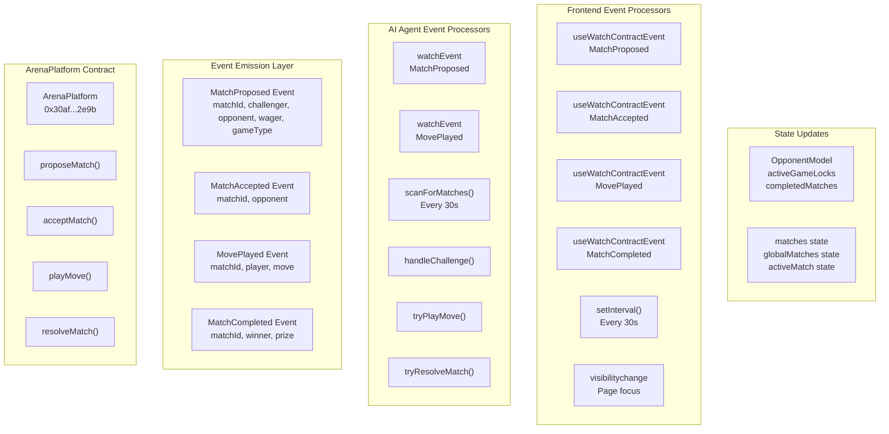
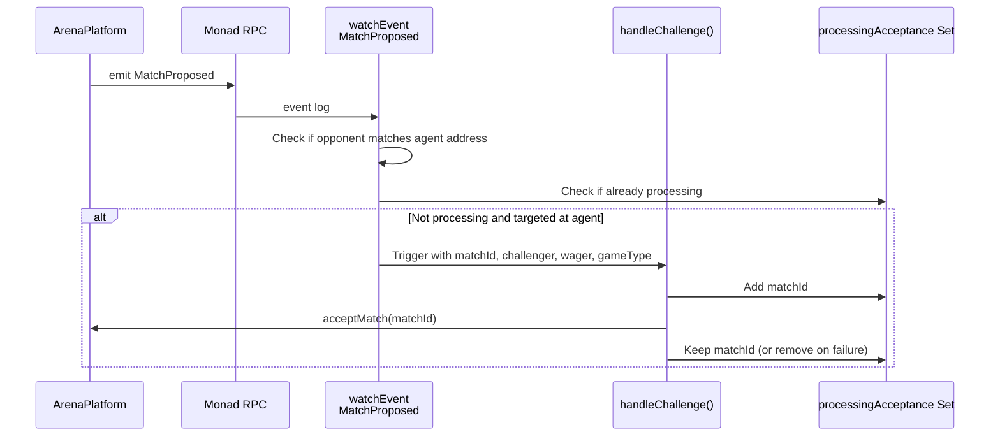
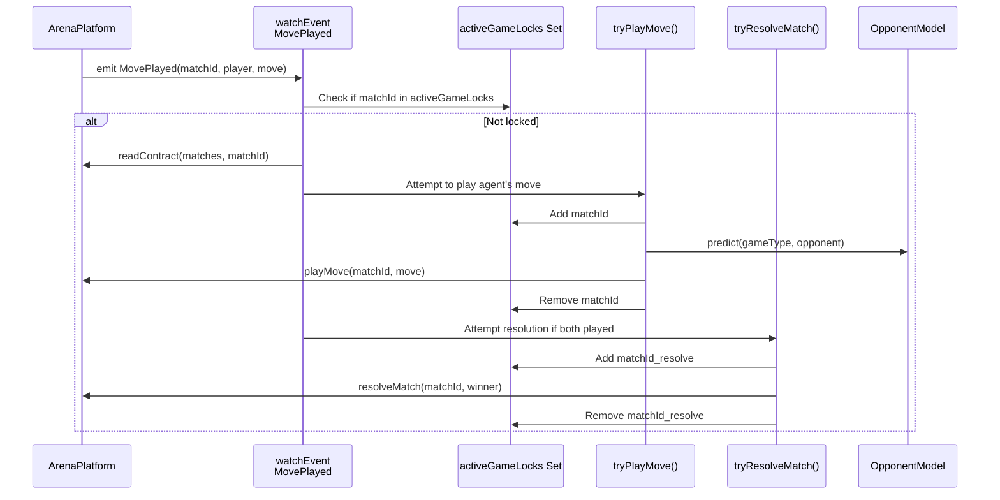
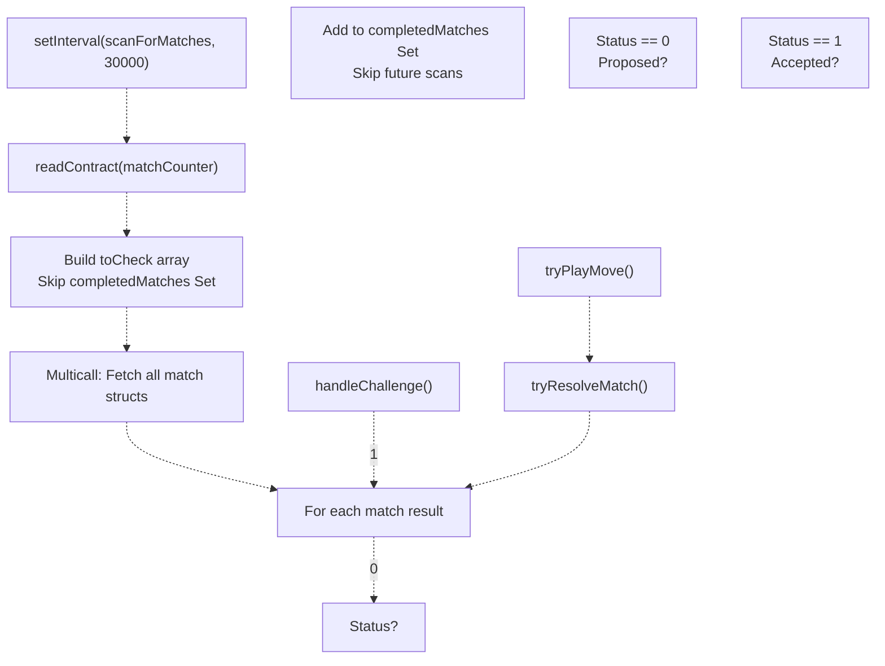
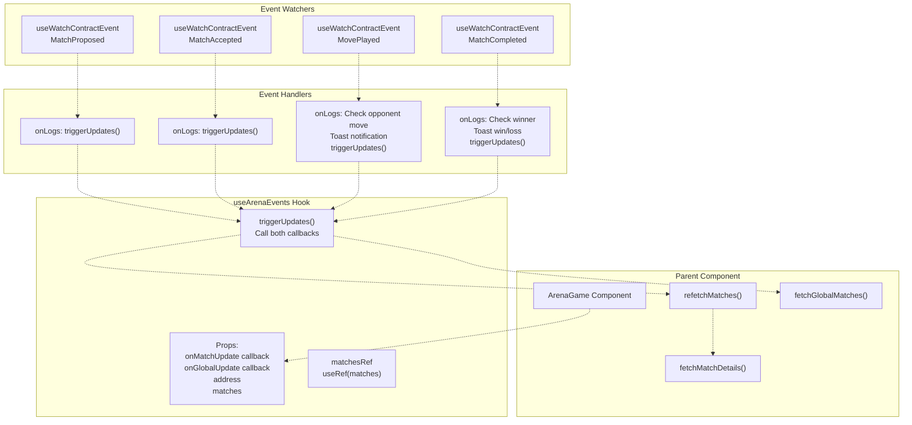
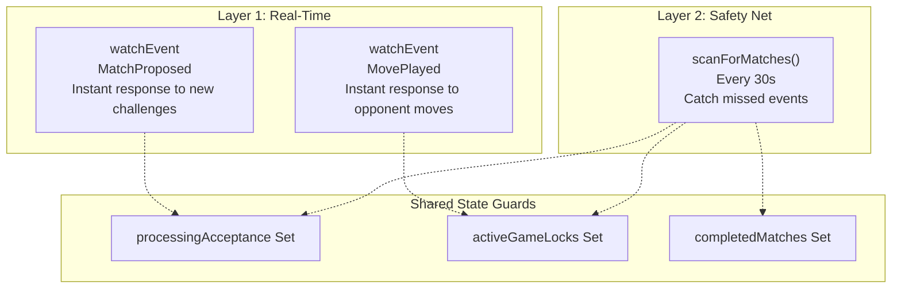
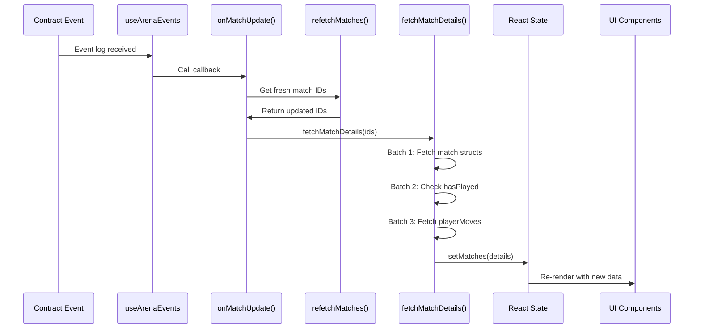

# Event-Driven Communication

> **Relevant source files**
> * [agent/src/ArenaAgent.ts](https://github.com/HACK3R-CRYPTO/GameArena/blob/30ace840/agent/src/ArenaAgent.ts)
> * [frontend/src/hooks/useArenaEvents.jsx](https://github.com/HACK3R-CRYPTO/GameArena/blob/30ace840/frontend/src/hooks/useArenaEvents.jsx)
> * [frontend/src/index.css](https://github.com/HACK3R-CRYPTO/GameArena/blob/30ace840/frontend/src/index.css)
> * [frontend/src/pages/ArenaGame.jsx](https://github.com/HACK3R-CRYPTO/GameArena/blob/30ace840/frontend/src/pages/ArenaGame.jsx)
> * [package.json](https://github.com/HACK3R-CRYPTO/GameArena/blob/30ace840/package.json)
> * [railway.json](https://github.com/HACK3R-CRYPTO/GameArena/blob/30ace840/railway.json)

## Purpose and Scope

This document explains the event-driven communication architecture that coordinates real-time interactions between the ArenaPlatform smart contract, the autonomous AI agent, and the frontend application. The system uses blockchain events as the primary coordination mechanism, enabling all participants to react instantly to match state changes without polling or centralized servers.

For information about the complete match state machine and transitions, see [Match Lifecycle](/HACK3R-CRYPTO/GameArena/3.1-match-lifecycle). For details on how different actors interact through the same interface, see [Multi-Actor Model](/HACK3R-CRYPTO/GameArena/3.3-multi-actor-model).

---

## Event Types and Contract Emission

The ArenaPlatform contract emits four events that drive all system coordination. These events are defined in the contract ABI and watched by both the agent and frontend systems.

### Event Definitions

| Event Name | Emitted When | Key Parameters |
| --- | --- | --- |
| `MatchProposed` | A new match challenge is created | `matchId`, `challenger`, `opponent`, `wager`, `gameType` |
| `MatchAccepted` | An opponent accepts a proposed match | `matchId`, `opponent` |
| `MovePlayed` | A player submits their move | `matchId`, `player`, `move` |
| `MatchCompleted` | A match is resolved with a winner | `matchId`, `winner`, `prize` |

These events are parsed from the contract ABI and used to construct event watchers on both the agent and frontend sides.

**Sources:** [agent/src/ArenaAgent.ts L10-L21](https://github.com/HACK3R-CRYPTO/GameArena/blob/30ace840/agent/src/ArenaAgent.ts#L10-L21)

 [frontend/src/config/contracts.js](https://github.com/HACK3R-CRYPTO/GameArena/blob/30ace840/frontend/src/config/contracts.js)

 [frontend/src/hooks/useArenaEvents.jsx L1-L112](https://github.com/HACK3R-CRYPTO/GameArena/blob/30ace840/frontend/src/hooks/useArenaEvents.jsx#L1-L112)

---

## System-Wide Event Flow

The following diagram illustrates how events flow from the ArenaPlatform contract to both the AI agent and frontend application, triggering coordinated state updates across all participants.



**Sources:** [agent/src/ArenaAgent.ts L302-L344](https://github.com/HACK3R-CRYPTO/GameArena/blob/30ace840/agent/src/ArenaAgent.ts#L302-L344)

 [frontend/src/hooks/useArenaEvents.jsx L24-L111](https://github.com/HACK3R-CRYPTO/GameArena/blob/30ace840/frontend/src/hooks/useArenaEvents.jsx#L24-L111)

 [frontend/src/pages/ArenaGame.jsx L311-L353](https://github.com/HACK3R-CRYPTO/GameArena/blob/30ace840/frontend/src/pages/ArenaGame.jsx#L311-L353)

---

## Agent Event Processing Architecture

The AI agent implements a sophisticated dual-layer event monitoring system combining real-time event watchers with periodic scanning to ensure no matches are missed even during network issues.

### Real-Time Event Watchers

The agent uses `publicClient.watchEvent()` from viem to subscribe to blockchain events as they occur.

#### MatchProposed Event Watcher

Monitors for new match proposals directed at the agent:



The watcher filters events where the `opponent` field matches the agent's address or is the zero address (open challenge). The implementation includes a lock mechanism using the `processingAcceptance` Set to prevent duplicate acceptance attempts.

**Sources:** [agent/src/ArenaAgent.ts L302-L317](https://github.com/HACK3R-CRYPTO/GameArena/blob/30ace840/agent/src/ArenaAgent.ts#L302-L317)

 [agent/src/ArenaAgent.ts L347-L385](https://github.com/HACK3R-CRYPTO/GameArena/blob/30ace840/agent/src/ArenaAgent.ts#L347-L385)

 [agent/src/ArenaAgent.ts L146-L148](https://github.com/HACK3R-CRYPTO/GameArena/blob/30ace840/agent/src/ArenaAgent.ts#L146-L148)

#### MovePlayed Event Watcher

Reacts to opponent moves in active matches:



The MovePlayed watcher triggers two potential actions: playing the agent's own move if it hasn't yet, and resolving the match if both players have now moved. Lock guards prevent race conditions from concurrent event processing.

**Sources:** [agent/src/ArenaAgent.ts L319-L344](https://github.com/HACK3R-CRYPTO/GameArena/blob/30ace840/agent/src/ArenaAgent.ts#L319-L344)

 [agent/src/ArenaAgent.ts L387-L446](https://github.com/HACK3R-CRYPTO/GameArena/blob/30ace840/agent/src/ArenaAgent.ts#L387-L446)

 [agent/src/ArenaAgent.ts L448-L513](https://github.com/HACK3R-CRYPTO/GameArena/blob/30ace840/agent/src/ArenaAgent.ts#L448-L513)

 [agent/src/ArenaAgent.ts L152](https://github.com/HACK3R-CRYPTO/GameArena/blob/30ace840/agent/src/ArenaAgent.ts#L152-L152)

### Periodic Scanner Safety Net

The `scanForMatches()` function runs every 30 seconds as a reliability layer to catch any missed events due to temporary network issues or RPC connection drops.



The scanner maintains a `completedMatches` Set to track matches that have reached terminal states (status 2=Completed or 3=Cancelled). These matches are permanently skipped in future scans, reducing unnecessary RPC calls.

**Key optimizations:**

* Uses multicall3 to batch-fetch all active match structs in a single RPC request
* Filters out completed matches before fetching to minimize data transfer
* Deduplicates work that may have already been handled by event watchers using lock Sets

**Sources:** [agent/src/ArenaAgent.ts L170-L242](https://github.com/HACK3R-CRYPTO/GameArena/blob/30ace840/agent/src/ArenaAgent.ts#L170-L242)

 [agent/src/ArenaAgent.ts L148-L149](https://github.com/HACK3R-CRYPTO/GameArena/blob/30ace840/agent/src/ArenaAgent.ts#L148-L149)

 [agent/src/ArenaAgent.ts L299](https://github.com/HACK3R-CRYPTO/GameArena/blob/30ace840/agent/src/ArenaAgent.ts#L299-L299)

---

## Frontend Event Processing Architecture

The frontend uses Wagmi's `useWatchContractEvent` hook to subscribe to events, integrating with React's state management for real-time UI updates.

### Event Hook Implementation

The `useArenaEvents` custom hook encapsulates all event subscriptions:



**Sources:** [frontend/src/hooks/useArenaEvents.jsx L1-L112](https://github.com/HACK3R-CRYPTO/GameArena/blob/30ace840/frontend/src/hooks/useArenaEvents.jsx#L1-L112)

 [frontend/src/pages/ArenaGame.jsx L311-L326](https://github.com/HACK3R-CRYPTO/GameArena/blob/30ace840/frontend/src/pages/ArenaGame.jsx#L311-L326)

### Event-Specific Behavior

Each event type triggers specific UI updates and user notifications:

| Event | Trigger Action | UI Update |
| --- | --- | --- |
| `MatchProposed` | Call `onMatchUpdate()` and `onGlobalUpdate()` | Refresh player matches and global feed |
| `MatchAccepted` | Call `onMatchUpdate()` and `onGlobalUpdate()` | Update match status from Proposed to Accepted |
| `MovePlayed` | Check if opponent moved, show toast with move icon, trigger updates | Display opponent's move in active match |
| `MatchCompleted` | Check if user won/lost, show win/loss toast, trigger updates | Update match to completed state, show result |

The `MovePlayed` event handler includes opponent move detection logic:

```javascript
// Only notify if opponent played against ME
if (playerAddr && address && playerAddr.toLowerCase() !== address.toLowerCase()) {
    const match = matchesRef.current.find(m => m.id === matchId);
    if (match) {
        const moveDisplay = getMoveDisplay(match.gameType, move);
        toast(`Opponent played ${moveDisplay.icon}`, { icon: '🤖' });
    }
}
```

This prevents the user from seeing notifications for their own moves and only shows opponent actions.

**Sources:** [frontend/src/hooks/useArenaEvents.jsx L48-L85](https://github.com/HACK3R-CRYPTO/GameArena/blob/30ace840/frontend/src/hooks/useArenaEvents.jsx#L48-L85)

 [frontend/src/hooks/useArenaEvents.jsx L88-L111](https://github.com/HACK3R-CRYPTO/GameArena/blob/30ace840/frontend/src/hooks/useArenaEvents.jsx#L88-L111)

---

## Dual Monitoring Strategy

Both the agent and frontend employ a dual monitoring strategy that combines real-time event watchers with periodic polling to ensure data consistency.

### Agent Monitoring Layers



**Layer 1 (Real-Time):** Event watchers provide sub-second response times for immediate actions like accepting challenges or playing moves.

**Layer 2 (Safety Net):** The periodic scanner ensures that if an event is missed due to WebSocket disconnection, RPC timeout, or other transient failures, the agent will still discover and process the match within 30 seconds.

**State Guards:** Three Sets prevent duplicate processing:

* `processingAcceptance`: Prevents accepting the same match twice
* `activeGameLocks`: Prevents playing multiple moves in the same match concurrently
* `completedMatches`: Prevents re-processing finished matches

**Sources:** [agent/src/ArenaAgent.ts L146-L152](https://github.com/HACK3R-CRYPTO/GameArena/blob/30ace840/agent/src/ArenaAgent.ts#L146-L152)

 [agent/src/ArenaAgent.ts L299-L344](https://github.com/HACK3R-CRYPTO/GameArena/blob/30ace840/agent/src/ArenaAgent.ts#L299-L344)

### Frontend Monitoring Layers

```mermaid
flowchart TD

E1["useWatchContractEvent<br>4 event types"]
E1_ACTION["Immediate UI update<br>Toast notifications"]
INTERVAL["setInterval(30s)"]
INT_ACTION["refetchMatches()<br>fetchMatchDetails()<br>fetchGlobalMatches()"]
VIS["visibilitychange event"]
VIS_ACTION["Refetch on tab focus"]
OPT["User action<br>e.g., playMove()"]
OPT_ACTION["Instant UI feedback<br>await confirmation"]
STATE["matches<br>globalMatches<br>activeMatch"]

subgraph subGraph4 ["React State"]
    STATE
end

subgraph subGraph3 ["Layer 4: Optimistic Updates"]
    OPT
    OPT_ACTION
    OPT -.-> OPT_ACTION
end

subgraph subGraph2 ["Layer 3: Visibility Sync"]
    VIS
    VIS_ACTION
    VIS -.-> VIS_ACTION
end

subgraph subGraph1 ["Layer 2: Interval Polling"]
    INTERVAL
    INT_ACTION
    INTERVAL -.-> INT_ACTION
end

subgraph subGraph0 ["Layer 1: Real-Time Events"]
    E1
    E1_ACTION
    E1 -.-> E1_ACTION
end
```



**Layer 1 (Real-Time Events):** Instant updates via Wagmi event watchers for all four event types.

**Layer 2 (Interval Polling):** 30-second interval that refetches all match data as a fallback. This interval is long enough to avoid excessive RPC usage but short enough to maintain acceptable freshness during event gaps.

**Layer 3 (Visibility Sync):** When the user returns to the tab (detected via `visibilitychange` event), the app immediately refetches data to show any updates that occurred while the tab was backgrounded.

**Layer 4 (Optimistic Updates):** User actions like submitting a move update the UI instantly before blockchain confirmation, providing responsive feedback. The state is then reconciled when the transaction confirms and events fire.

**Sources:** [frontend/src/pages/ArenaGame.jsx L311-L353](https://github.com/HACK3R-CRYPTO/GameArena/blob/30ace840/frontend/src/pages/ArenaGame.jsx#L311-L353)

 [frontend/src/hooks/useArenaEvents.jsx L1-L112](https://github.com/HACK3R-CRYPTO/GameArena/blob/30ace840/frontend/src/hooks/useArenaEvents.jsx#L1-L112)

---

## Event-Driven State Synchronization

The event-driven architecture enables multiple actors to maintain consistent state without central coordination.

### Agent State Updates from Events

```sql
#mermaid-r47hyyctsy{font-family:ui-sans-serif,-apple-system,system-ui,Segoe UI,Helvetica;font-size:16px;fill:#333;}@keyframes edge-animation-frame{from{stroke-dashoffset:0;}}@keyframes dash{to{stroke-dashoffset:0;}}#mermaid-r47hyyctsy .edge-animation-slow{stroke-dasharray:9,5!important;stroke-dashoffset:900;animation:dash 50s linear infinite;stroke-linecap:round;}#mermaid-r47hyyctsy .edge-animation-fast{stroke-dasharray:9,5!important;stroke-dashoffset:900;animation:dash 20s linear infinite;stroke-linecap:round;}#mermaid-r47hyyctsy .error-icon{fill:#dddddd;}#mermaid-r47hyyctsy .error-text{fill:#222222;stroke:#222222;}#mermaid-r47hyyctsy .edge-thickness-normal{stroke-width:1px;}#mermaid-r47hyyctsy .edge-thickness-thick{stroke-width:3.5px;}#mermaid-r47hyyctsy .edge-pattern-solid{stroke-dasharray:0;}#mermaid-r47hyyctsy .edge-thickness-invisible{stroke-width:0;fill:none;}#mermaid-r47hyyctsy .edge-pattern-dashed{stroke-dasharray:3;}#mermaid-r47hyyctsy .edge-pattern-dotted{stroke-dasharray:2;}#mermaid-r47hyyctsy .marker{fill:#999;stroke:#999;}#mermaid-r47hyyctsy .marker.cross{stroke:#999;}#mermaid-r47hyyctsy svg{font-family:ui-sans-serif,-apple-system,system-ui,Segoe UI,Helvetica;font-size:16px;}#mermaid-r47hyyctsy p{margin:0;}#mermaid-r47hyyctsy defs #statediagram-barbEnd{fill:#999;stroke:#999;}#mermaid-r47hyyctsy g.stateGroup text{fill:#dddddd;stroke:none;font-size:10px;}#mermaid-r47hyyctsy g.stateGroup text{fill:#333;stroke:none;font-size:10px;}#mermaid-r47hyyctsy g.stateGroup .state-title{font-weight:bolder;fill:#333;}#mermaid-r47hyyctsy g.stateGroup rect{fill:#ffffff;stroke:#dddddd;}#mermaid-r47hyyctsy g.stateGroup line{stroke:#999;stroke-width:1;}#mermaid-r47hyyctsy .transition{stroke:#999;stroke-width:1;fill:none;}#mermaid-r47hyyctsy .stateGroup .composit{fill:#f4f4f4;border-bottom:1px;}#mermaid-r47hyyctsy .stateGroup .alt-composit{fill:#e0e0e0;border-bottom:1px;}#mermaid-r47hyyctsy .state-note{stroke:#e6d280;fill:#fff5ad;}#mermaid-r47hyyctsy .state-note text{fill:#333;stroke:none;font-size:10px;}#mermaid-r47hyyctsy .stateLabel .box{stroke:none;stroke-width:0;fill:#ffffff;opacity:0.5;}#mermaid-r47hyyctsy .edgeLabel .label rect{fill:#ffffff;opacity:0.5;}#mermaid-r47hyyctsy .edgeLabel{background-color:#ffffff;text-align:center;}#mermaid-r47hyyctsy .edgeLabel p{background-color:#ffffff;}#mermaid-r47hyyctsy .edgeLabel rect{opacity:0.5;background-color:#ffffff;fill:#ffffff;}#mermaid-r47hyyctsy .edgeLabel .label text{fill:#333;}#mermaid-r47hyyctsy .label div .edgeLabel{color:#333;}#mermaid-r47hyyctsy .stateLabel text{fill:#333;font-size:10px;font-weight:bold;}#mermaid-r47hyyctsy .node circle.state-start{fill:#999;stroke:#999;}#mermaid-r47hyyctsy .node .fork-join{fill:#999;stroke:#999;}#mermaid-r47hyyctsy .node circle.state-end{fill:#dddddd;stroke:#f4f4f4;stroke-width:1.5;}#mermaid-r47hyyctsy .end-state-inner{fill:#f4f4f4;stroke-width:1.5;}#mermaid-r47hyyctsy .node rect{fill:#ffffff;stroke:#dddddd;stroke-width:1px;}#mermaid-r47hyyctsy .node polygon{fill:#ffffff;stroke:#dddddd;stroke-width:1px;}#mermaid-r47hyyctsy #statediagram-barbEnd{fill:#999;}#mermaid-r47hyyctsy .statediagram-cluster rect{fill:#ffffff;stroke:#dddddd;stroke-width:1px;}#mermaid-r47hyyctsy .cluster-label,#mermaid-r47hyyctsy .nodeLabel{color:#333;}#mermaid-r47hyyctsy .statediagram-cluster rect.outer{rx:5px;ry:5px;}#mermaid-r47hyyctsy .statediagram-state .divider{stroke:#dddddd;}#mermaid-r47hyyctsy .statediagram-state .title-state{rx:5px;ry:5px;}#mermaid-r47hyyctsy .statediagram-cluster.statediagram-cluster .inner{fill:#f4f4f4;}#mermaid-r47hyyctsy .statediagram-cluster.statediagram-cluster-alt .inner{fill:#f8f8f8;}#mermaid-r47hyyctsy .statediagram-cluster .inner{rx:0;ry:0;}#mermaid-r47hyyctsy .statediagram-state rect.basic{rx:5px;ry:5px;}#mermaid-r47hyyctsy .statediagram-state rect.divider{stroke-dasharray:10,10;fill:#f8f8f8;}#mermaid-r47hyyctsy .note-edge{stroke-dasharray:5;}#mermaid-r47hyyctsy .statediagram-note rect{fill:#fff5ad;stroke:#e6d280;stroke-width:1px;rx:0;ry:0;}#mermaid-r47hyyctsy .statediagram-note rect{fill:#fff5ad;stroke:#e6d280;stroke-width:1px;rx:0;ry:0;}#mermaid-r47hyyctsy .statediagram-note text{fill:#333;}#mermaid-r47hyyctsy .statediagram-note .nodeLabel{color:#333;}#mermaid-r47hyyctsy .statediagram .edgeLabel{color:red;}#mermaid-r47hyyctsy #dependencyStart,#mermaid-r47hyyctsy #dependencyEnd{fill:#999;stroke:#999;stroke-width:1;}#mermaid-r47hyyctsy .statediagramTitleText{text-anchor:middle;font-size:18px;fill:#333;}#mermaid-r47hyyctsy :root{--mermaid-font-family:"trebuchet ms",verdana,arial,sans-serif;}MatchProposed/MovePlayedCheck activeGameLocksAlready processingNot lockedMovePlayed eventmodel.update(gameType, player, move)MatchProposed/MovePlayedhandleChallenge()tryPlayMove()tryResolveMatch()EventReceivedLockCheckLockedProcessUpdateModelOpponentModelTakeActionAcceptMatchPlayMoveResolve
```

The agent updates its internal state in response to events:

1. **OpponentModel**: The `MovePlayed` event triggers `model.update()` to record the opponent's move in the Markov Chain transition matrix
2. **Match Locks**: Events add/remove entries from lock Sets to coordinate concurrent processing
3. **Completed Tracking**: Resolved matches are added to `completedMatches` Set to optimize future scans

**Sources:** [agent/src/ArenaAgent.ts L73-L143](https://github.com/HACK3R-CRYPTO/GameArena/blob/30ace840/agent/src/ArenaAgent.ts#L73-L143)

 [agent/src/ArenaAgent.ts L319-L344](https://github.com/HACK3R-CRYPTO/GameArena/blob/30ace840/agent/src/ArenaAgent.ts#L319-L344)

### Frontend State Updates from Events



The frontend's event-driven flow:

1. Event fires → `useArenaEvents` hook receives it
2. Hook calls `onMatchUpdate()` or `onGlobalUpdate()` callback
3. Callback triggers `refetchMatches()` to get latest match IDs from contract
4. `fetchMatchDetails()` executes three cascading multicall batches to efficiently fetch full match state
5. React state updates, triggering UI re-render with fresh data

This architecture ensures that the UI always reflects the latest blockchain state within milliseconds of an event occurring, while the cascading multicall approach minimizes RPC overhead by only fetching data that's actually needed (e.g., only fetching moves for players who have played).

**Sources:** [frontend/src/pages/ArenaGame.jsx L46-L191](https://github.com/HACK3R-CRYPTO/GameArena/blob/30ace840/frontend/src/pages/ArenaGame.jsx#L46-L191)

 [frontend/src/pages/ArenaGame.jsx L311-L326](https://github.com/HACK3R-CRYPTO/GameArena/blob/30ace840/frontend/src/pages/ArenaGame.jsx#L311-L326)

---

## Retry Mechanisms and Error Handling

Both systems implement retry logic to handle transient RPC failures without losing event processing capability.

### Agent Retry Helper

The `withRetry()` wrapper function provides exponential backoff for RPC calls:

```javascript
async function withRetry<T>(fn: () => Promise<T>, label: string, retries = 3): Promise<T> {
    for (let i = 0; i < retries; i++) {
        try {
            return await fn();
        } catch (e: any) {
            const isLast = i === retries - 1;
            console.log(chalk.yellow(`[${label}] RPC Error (attempt ${i + 1}/${retries})`));
            if (isLast) throw e;
            await sleep(2000 * (i + 1)); // Exponential backoff
        }
    }
}
```

This helper is used for all critical contract reads (matchCounter, matches, hasPlayed, playerMoves) to ensure the agent can recover from temporary network issues.

**Sources:** [agent/src/ArenaAgent.ts L156-L168](https://github.com/HACK3R-CRYPTO/GameArena/blob/30ace840/agent/src/ArenaAgent.ts#L156-L168)

### Frontend Error Handling

The frontend relies on Wagmi's built-in retry mechanisms for contract interactions and uses TanStack Query for caching and stale-while-revalidate patterns. Event watchers automatically reconnect if the WebSocket connection drops.

**Sources:** [frontend/src/pages/ArenaGame.jsx L1-L11](https://github.com/HACK3R-CRYPTO/GameArena/blob/30ace840/frontend/src/pages/ArenaGame.jsx#L1-L11)

---

## Performance Characteristics

The event-driven architecture provides significant performance advantages over polling-based approaches:

| Metric | Real-Time Events | Periodic Polling Only |
| --- | --- | --- |
| Response Latency | < 1 second | 30-60 seconds (poll interval) |
| RPC Request Load | Minimal (events only) | High (constant polling) |
| Missed Events | Near zero (with safety net) | Possible during failures |
| Resource Usage | Low (WebSocket subscription) | Moderate (repeated HTTP) |

The dual-layer approach (events + periodic scan) combines the best of both strategies: instant response times with guaranteed consistency.

**Sources:** [agent/src/ArenaAgent.ts L299](https://github.com/HACK3R-CRYPTO/GameArena/blob/30ace840/agent/src/ArenaAgent.ts#L299-L299)

 [frontend/src/pages/ArenaGame.jsx L328-L341](https://github.com/HACK3R-CRYPTO/GameArena/blob/30ace840/frontend/src/pages/ArenaGame.jsx#L328-L341)