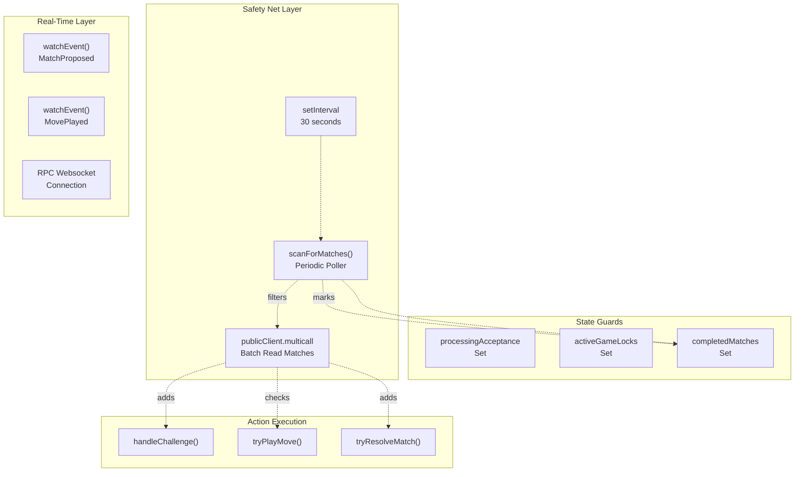
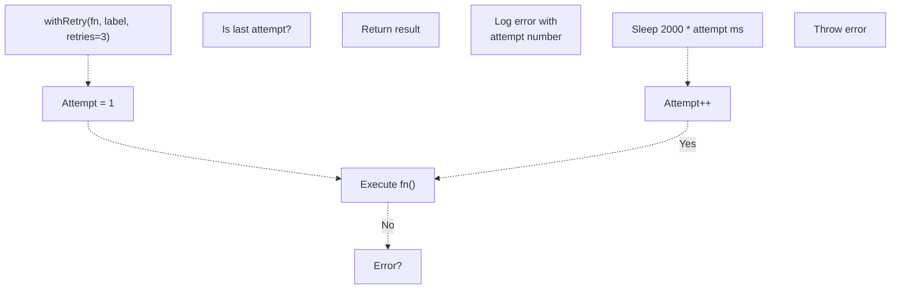
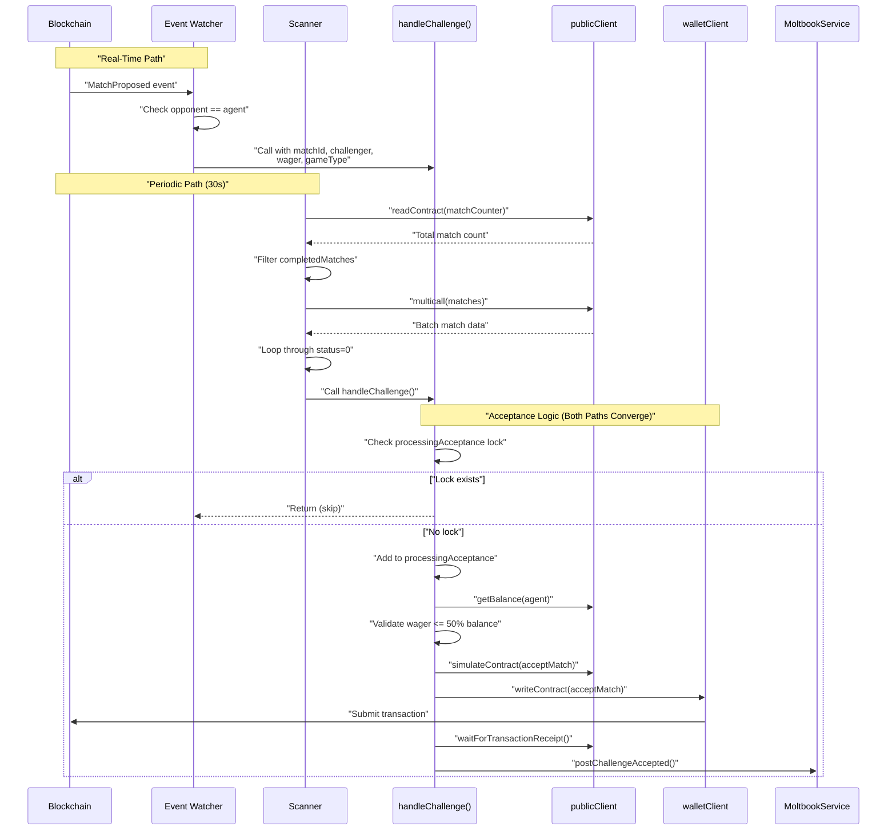
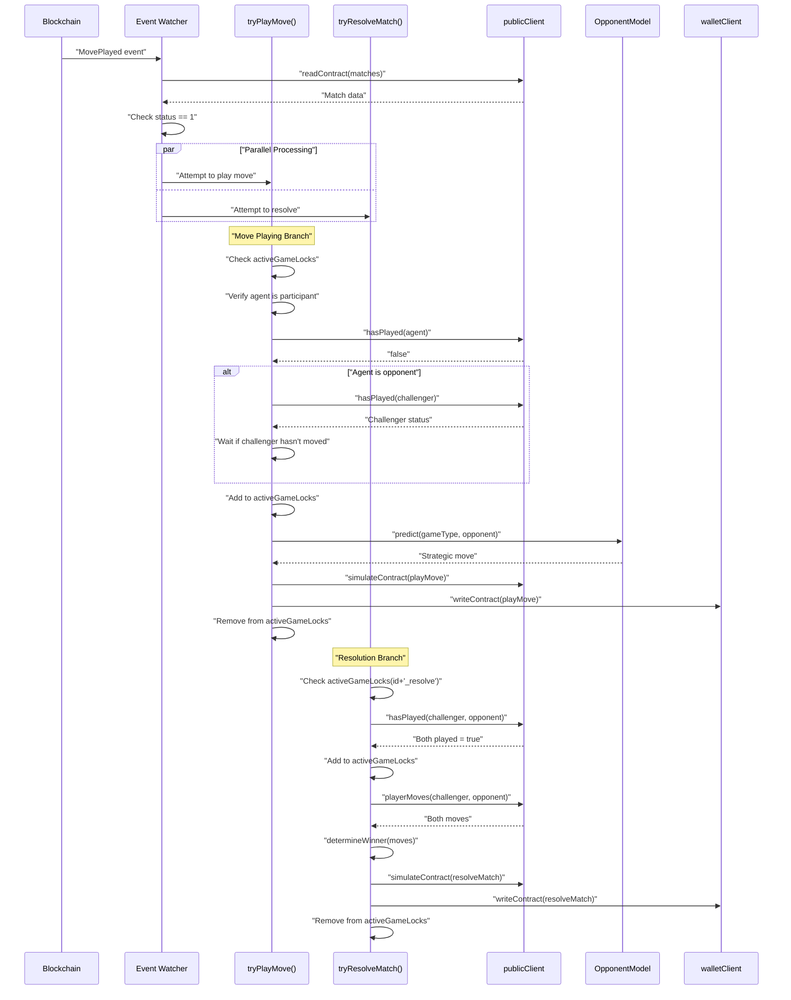

# Event Processing & Concurrency

> **Relevant source files**
> * [agent/src/ArenaAgent.ts](https://github.com/HACK3R-CRYPTO/GameArena/blob/30ace840/agent/src/ArenaAgent.ts)
> * [package.json](https://github.com/HACK3R-CRYPTO/GameArena/blob/30ace840/package.json)
> * [railway.json](https://github.com/HACK3R-CRYPTO/GameArena/blob/30ace840/railway.json)

## Purpose & Scope

This document explains the event processing and concurrency control mechanisms used by the Arena AI Agent to reliably monitor blockchain events and execute transactions without race conditions. It covers the dual monitoring system (real-time event watchers + periodic scanner), state guards (locks and completed match tracking), and retry mechanisms for handling network failures.

For the overall agent architecture and component organization, see [Agent Architecture](/HACK3R-CRYPTO/GameArena/5.1-agent-architecture). For game-specific decision logic that executes after event detection, see [Game Strategies](/HACK3R-CRYPTO/GameArena/5.3-game-strategies).

---

## Concurrency Challenges

The Arena AI Agent operates in a concurrent, asynchronous environment with several challenges:

| Challenge | Description | Impact Without Mitigation |
| --- | --- | --- |
| **Event Duplication** | Same event may be processed by both the real-time watcher and periodic scanner | Double acceptance of matches, wasted gas |
| **Race Conditions** | Multiple async operations may attempt to modify the same match simultaneously | Transaction failures, inconsistent state |
| **Network Failures** | RPC endpoints may timeout or return errors intermittently | Missed events, failed transactions |
| **Blockchain Reorganizations** | Block reorgs can cause events to appear, disappear, then reappear | Duplicate processing of the same match |
| **Concurrent Match Resolution** | Any participant can resolve a match, creating a race to claim resolution | Unnecessary transaction failures |

The agent addresses these challenges through a combination of state guards, lock mechanisms, and retry logic.

**Sources:** [agent/src/ArenaAgent.ts L1-L551](https://github.com/HACK3R-CRYPTO/GameArena/blob/30ace840/agent/src/ArenaAgent.ts#L1-L551)

---

## Dual Event Monitoring System

The agent uses two complementary monitoring strategies that work in parallel to ensure no matches are missed.

### Architecture Diagram



**Sources:** [agent/src/ArenaAgent.ts L299-L344](https://github.com/HACK3R-CRYPTO/GameArena/blob/30ace840/agent/src/ArenaAgent.ts#L299-L344)

 [agent/src/ArenaAgent.ts L170-L242](https://github.com/HACK3R-CRYPTO/GameArena/blob/30ace840/agent/src/ArenaAgent.ts#L170-L242)

### Real-Time Event Watchers

The agent registers two real-time event watchers using viem's `watchEvent` API:

**MatchProposed Watcher** [agent/src/ArenaAgent.ts L302-L317](https://github.com/HACK3R-CRYPTO/GameArena/blob/30ace840/agent/src/ArenaAgent.ts#L302-L317)

```javascript
publicClient.watchEvent({
    address: ARENA_ADDRESS,
    event: parseAbiItem('event MatchProposed(...)'),
    onLogs: async (logs) => {
        // Process new challenges immediately
    }
})
```

Triggers when:

* A new match is proposed where the agent is the named opponent
* An open challenge is created (opponent = `0x0000...0000`)

**MovePlayed Watcher** [agent/src/ArenaAgent.ts L319-L344](https://github.com/HACK3R-CRYPTO/GameArena/blob/30ace840/agent/src/ArenaAgent.ts#L319-L344)

```javascript
publicClient.watchEvent({
    address: ARENA_ADDRESS,
    event: parseAbiItem('event MovePlayed(...)'),
    onLogs: async (logs) => {
        // React to opponent moves
        // Attempt resolution if both played
    }
})
```

Triggers when:

* Any player submits a move in any match
* Agent checks if it should respond or resolve

**Sources:** [agent/src/ArenaAgent.ts L302-L344](https://github.com/HACK3R-CRYPTO/GameArena/blob/30ace840/agent/src/ArenaAgent.ts#L302-L344)

### Periodic Scanner (Safety Net)

The periodic scanner runs every 30 seconds as a backup mechanism [agent/src/ArenaAgent.ts L299](https://github.com/HACK3R-CRYPTO/GameArena/blob/30ace840/agent/src/ArenaAgent.ts#L299-L299)

:

```
setInterval(scanForMatches, 30000);
```

The `scanForMatches()` function [agent/src/ArenaAgent.ts L170-L242](https://github.com/HACK3R-CRYPTO/GameArena/blob/30ace840/agent/src/ArenaAgent.ts#L170-L242)

:

1. **Fetches match counter** - Determines total number of matches [agent/src/ArenaAgent.ts L172-L176](https://github.com/HACK3R-CRYPTO/GameArena/blob/30ace840/agent/src/ArenaAgent.ts#L172-L176)
2. **Filters completed matches** - Skips matches already marked as done [agent/src/ArenaAgent.ts L182-L187](https://github.com/HACK3R-CRYPTO/GameArena/blob/30ace840/agent/src/ArenaAgent.ts#L182-L187)
3. **Batch fetches match data** - Uses multicall for efficiency [agent/src/ArenaAgent.ts L203-L210](https://github.com/HACK3R-CRYPTO/GameArena/blob/30ace840/agent/src/ArenaAgent.ts#L203-L210)
4. **Processes each match** - Applies same logic as event watchers [agent/src/ArenaAgent.ts L212-L238](https://github.com/HACK3R-CRYPTO/GameArena/blob/30ace840/agent/src/ArenaAgent.ts#L212-L238)

#### Completed Match Tracking

The scanner maintains a `completedMatches` Set to avoid reprocessing finished matches [agent/src/ArenaAgent.ts L148](https://github.com/HACK3R-CRYPTO/GameArena/blob/30ace840/agent/src/ArenaAgent.ts#L148-L148)

:

```
// Mark matches with status 2 (Completed) or 3 (Cancelled)
if (m[5] === 2 || m[5] === 3) {
    completedMatches.add(matchIdStr);
    continue;
}
```

This optimization prevents the scanner from repeatedly fetching data for matches that are already settled.

**Sources:** [agent/src/ArenaAgent.ts L170-L242](https://github.com/HACK3R-CRYPTO/GameArena/blob/30ace840/agent/src/ArenaAgent.ts#L170-L242)

 [agent/src/ArenaAgent.ts L220-L224](https://github.com/HACK3R-CRYPTO/GameArena/blob/30ace840/agent/src/ArenaAgent.ts#L220-L224)

### Why Both Are Needed

| Scenario | Real-Time Watcher | Periodic Scanner |
| --- | --- | --- |
| Normal operation | ✅ Primary detection | ⏸️ Idle (no action needed) |
| Websocket disconnection | ❌ Misses events | ✅ Catches missed matches |
| High network latency | ⚠️ Delayed notification | ✅ Eventually consistent |
| Event log reorganization | ⚠️ May see duplicate | ✅ Deduplicated via state guards |
| Agent restart/deployment | ❌ Missed events during downtime | ✅ Catches up on startup |

The dual system provides **fault tolerance** while maintaining **low latency** for typical operations.

**Sources:** [agent/src/ArenaAgent.ts L299-L300](https://github.com/HACK3R-CRYPTO/GameArena/blob/30ace840/agent/src/ArenaAgent.ts#L299-L300)

---

## State Management & Guards

The agent uses five key state variables to prevent race conditions and track processing status:

### State Variables

| Variable | Type | Purpose | Lifecycle |
| --- | --- | --- | --- |
| `processingAcceptance` | `Set<string>` | Prevents duplicate match acceptances | Added on start, removed on failure [agent/src/ArenaAgent.ts L147](https://github.com/HACK3R-CRYPTO/GameArena/blob/30ace840/agent/src/ArenaAgent.ts#L147-L147) |
| `activeGameLocks` | `Set<string>` | Prevents concurrent move plays for the same match | Added before play, removed after completion [agent/src/ArenaAgent.ts L152](https://github.com/HACK3R-CRYPTO/GameArena/blob/30ace840/agent/src/ArenaAgent.ts#L152-L152) |
| `completedMatches` | `Set<string>` | Marks finished matches to skip in scanner | Added when status = 2 or 3, never removed [agent/src/ArenaAgent.ts L148](https://github.com/HACK3R-CRYPTO/GameArena/blob/30ace840/agent/src/ArenaAgent.ts#L148-L148) |
| `respondedMatches` | `Set<string>` | Legacy guard (currently unused in production) | Historical artifact [agent/src/ArenaAgent.ts L146](https://github.com/HACK3R-CRYPTO/GameArena/blob/30ace840/agent/src/ArenaAgent.ts#L146-L146) |
| `lastKnownMatchCount` | `bigint` | Tracks highest seen match ID for new match detection | Updated each scan [agent/src/ArenaAgent.ts L149](https://github.com/HACK3R-CRYPTO/GameArena/blob/30ace840/agent/src/ArenaAgent.ts#L149-L149) |

### State Guard Flow Diagram

```python
#mermaid-obamj9nclss{font-family:ui-sans-serif,-apple-system,system-ui,Segoe UI,Helvetica;font-size:16px;fill:#333;}@keyframes edge-animation-frame{from{stroke-dashoffset:0;}}@keyframes dash{to{stroke-dashoffset:0;}}#mermaid-obamj9nclss .edge-animation-slow{stroke-dasharray:9,5!important;stroke-dashoffset:900;animation:dash 50s linear infinite;stroke-linecap:round;}#mermaid-obamj9nclss .edge-animation-fast{stroke-dasharray:9,5!important;stroke-dashoffset:900;animation:dash 20s linear infinite;stroke-linecap:round;}#mermaid-obamj9nclss .error-icon{fill:#dddddd;}#mermaid-obamj9nclss .error-text{fill:#222222;stroke:#222222;}#mermaid-obamj9nclss .edge-thickness-normal{stroke-width:1px;}#mermaid-obamj9nclss .edge-thickness-thick{stroke-width:3.5px;}#mermaid-obamj9nclss .edge-pattern-solid{stroke-dasharray:0;}#mermaid-obamj9nclss .edge-thickness-invisible{stroke-width:0;fill:none;}#mermaid-obamj9nclss .edge-pattern-dashed{stroke-dasharray:3;}#mermaid-obamj9nclss .edge-pattern-dotted{stroke-dasharray:2;}#mermaid-obamj9nclss .marker{fill:#999;stroke:#999;}#mermaid-obamj9nclss .marker.cross{stroke:#999;}#mermaid-obamj9nclss svg{font-family:ui-sans-serif,-apple-system,system-ui,Segoe UI,Helvetica;font-size:16px;}#mermaid-obamj9nclss p{margin:0;}#mermaid-obamj9nclss defs #statediagram-barbEnd{fill:#999;stroke:#999;}#mermaid-obamj9nclss g.stateGroup text{fill:#dddddd;stroke:none;font-size:10px;}#mermaid-obamj9nclss g.stateGroup text{fill:#333;stroke:none;font-size:10px;}#mermaid-obamj9nclss g.stateGroup .state-title{font-weight:bolder;fill:#333;}#mermaid-obamj9nclss g.stateGroup rect{fill:#ffffff;stroke:#dddddd;}#mermaid-obamj9nclss g.stateGroup line{stroke:#999;stroke-width:1;}#mermaid-obamj9nclss .transition{stroke:#999;stroke-width:1;fill:none;}#mermaid-obamj9nclss .stateGroup .composit{fill:#f4f4f4;border-bottom:1px;}#mermaid-obamj9nclss .stateGroup .alt-composit{fill:#e0e0e0;border-bottom:1px;}#mermaid-obamj9nclss .state-note{stroke:#e6d280;fill:#fff5ad;}#mermaid-obamj9nclss .state-note text{fill:#333;stroke:none;font-size:10px;}#mermaid-obamj9nclss .stateLabel .box{stroke:none;stroke-width:0;fill:#ffffff;opacity:0.5;}#mermaid-obamj9nclss .edgeLabel .label rect{fill:#ffffff;opacity:0.5;}#mermaid-obamj9nclss .edgeLabel{background-color:#ffffff;text-align:center;}#mermaid-obamj9nclss .edgeLabel p{background-color:#ffffff;}#mermaid-obamj9nclss .edgeLabel rect{opacity:0.5;background-color:#ffffff;fill:#ffffff;}#mermaid-obamj9nclss .edgeLabel .label text{fill:#333;}#mermaid-obamj9nclss .label div .edgeLabel{color:#333;}#mermaid-obamj9nclss .stateLabel text{fill:#333;font-size:10px;font-weight:bold;}#mermaid-obamj9nclss .node circle.state-start{fill:#999;stroke:#999;}#mermaid-obamj9nclss .node .fork-join{fill:#999;stroke:#999;}#mermaid-obamj9nclss .node circle.state-end{fill:#dddddd;stroke:#f4f4f4;stroke-width:1.5;}#mermaid-obamj9nclss .end-state-inner{fill:#f4f4f4;stroke-width:1.5;}#mermaid-obamj9nclss .node rect{fill:#ffffff;stroke:#dddddd;stroke-width:1px;}#mermaid-obamj9nclss .node polygon{fill:#ffffff;stroke:#dddddd;stroke-width:1px;}#mermaid-obamj9nclss #statediagram-barbEnd{fill:#999;}#mermaid-obamj9nclss .statediagram-cluster rect{fill:#ffffff;stroke:#dddddd;stroke-width:1px;}#mermaid-obamj9nclss .cluster-label,#mermaid-obamj9nclss .nodeLabel{color:#333;}#mermaid-obamj9nclss .statediagram-cluster rect.outer{rx:5px;ry:5px;}#mermaid-obamj9nclss .statediagram-state .divider{stroke:#dddddd;}#mermaid-obamj9nclss .statediagram-state .title-state{rx:5px;ry:5px;}#mermaid-obamj9nclss .statediagram-cluster.statediagram-cluster .inner{fill:#f4f4f4;}#mermaid-obamj9nclss .statediagram-cluster.statediagram-cluster-alt .inner{fill:#f8f8f8;}#mermaid-obamj9nclss .statediagram-cluster .inner{rx:0;ry:0;}#mermaid-obamj9nclss .statediagram-state rect.basic{rx:5px;ry:5px;}#mermaid-obamj9nclss .statediagram-state rect.divider{stroke-dasharray:10,10;fill:#f8f8f8;}#mermaid-obamj9nclss .note-edge{stroke-dasharray:5;}#mermaid-obamj9nclss .statediagram-note rect{fill:#fff5ad;stroke:#e6d280;stroke-width:1px;rx:0;ry:0;}#mermaid-obamj9nclss .statediagram-note rect{fill:#fff5ad;stroke:#e6d280;stroke-width:1px;rx:0;ry:0;}#mermaid-obamj9nclss .statediagram-note text{fill:#333;}#mermaid-obamj9nclss .statediagram-note .nodeLabel{color:#333;}#mermaid-obamj9nclss .statediagram .edgeLabel{color:red;}#mermaid-obamj9nclss #dependencyStart,#mermaid-obamj9nclss #dependencyEnd{fill:#999;stroke:#999;stroke-width:1;}#mermaid-obamj9nclss .statediagramTitleText{text-anchor:middle;font-size:18px;fill:#333;}#mermaid-obamj9nclss :root{--mermaid-font-family:"trebuchet ms",verdana,arial,sans-serif;}"MatchProposed orScanner finds match""handleChallenge()""!processingAcceptance.has(id)""Already processing(skip)""Add to processingAcceptance""Transaction fails""Transaction succeeds(never removed)""Remove from processingAcceptanceAllow retry""Lock remains forever"EventDetectedCheckAcceptanceLockLockedForAcceptanceAcceptMatchUnlockOnFailureKeepLockedMove Processing"!activeGameLocks.has(id)""Already processing move""Add to activeGameLocks""Complete (success or fail)""Remove from activeGameLocks"CheckMoveLockLockedForMovePlayMoveUnlockMoveResolution Processing"!activeGameLocks.has(id+'_resolve')""Already resolving""Add to activeGameLocks""Complete (success or fail)""Remove from activeGameLocks"CheckResolveLockLockedForResolveResolveMatchUnlockResolve
```

**Sources:** [agent/src/ArenaAgent.ts L146-L152](https://github.com/HACK3R-CRYPTO/GameArena/blob/30ace840/agent/src/ArenaAgent.ts#L146-L152)

 [agent/src/ArenaAgent.ts L348-L349](https://github.com/HACK3R-CRYPTO/GameArena/blob/30ace840/agent/src/ArenaAgent.ts#L348-L349)

 [agent/src/ArenaAgent.ts L388-L389](https://github.com/HACK3R-CRYPTO/GameArena/blob/30ace840/agent/src/ArenaAgent.ts#L388-L389)

 [agent/src/ArenaAgent.ts L449-L450](https://github.com/HACK3R-CRYPTO/GameArena/blob/30ace840/agent/src/ArenaAgent.ts#L449-L450)

### Lock Pattern Implementation

#### Match Acceptance Lock

```
// Guard check
if (processingAcceptance.has(matchId.toString())) return;
processingAcceptance.add(matchId.toString());
```

**Behavior:**

* Lock is added **immediately** upon entry to `handleChallenge()` [agent/src/ArenaAgent.ts L348-L349](https://github.com/HACK3R-CRYPTO/GameArena/blob/30ace840/agent/src/ArenaAgent.ts#L348-L349)
* Lock is **removed only on transaction failure** to allow retry [agent/src/ArenaAgent.ts L378](https://github.com/HACK3R-CRYPTO/GameArena/blob/30ace840/agent/src/ArenaAgent.ts#L378-L378)
* Lock **persists forever on success** because match can only be accepted once

**Sources:** [agent/src/ArenaAgent.ts L347-L385](https://github.com/HACK3R-CRYPTO/GameArena/blob/30ace840/agent/src/ArenaAgent.ts#L347-L385)

#### Move Playing Lock

```sql
// Guard check
if (activeGameLocks.has(matchIdStr)) return;
activeGameLocks.add(matchIdStr);
try {
    // Play move logic
} finally {
    activeGameLocks.delete(matchIdStr);
}
```

**Behavior:**

* Uses try-finally to **guarantee lock release** [agent/src/ArenaAgent.ts L414-L444](https://github.com/HACK3R-CRYPTO/GameArena/blob/30ace840/agent/src/ArenaAgent.ts#L414-L444)
* Lock is removed regardless of success or failure
* Allows retry on subsequent event triggers

**Sources:** [agent/src/ArenaAgent.ts L387-L446](https://github.com/HACK3R-CRYPTO/GameArena/blob/30ace840/agent/src/ArenaAgent.ts#L387-L446)

#### Resolution Lock

```sql
// Guard check  
if (activeGameLocks.has(matchIdStr + '_resolve')) return;
activeGameLocks.add(matchIdStr + '_resolve');
try {
    // Resolution logic
} finally {
    activeGameLocks.delete(matchIdStr + '_resolve');
}
```

**Behavior:**

* Uses separate lock key suffix `'_resolve'` to avoid conflicts with move lock [agent/src/ArenaAgent.ts L449-L450](https://github.com/HACK3R-CRYPTO/GameArena/blob/30ace840/agent/src/ArenaAgent.ts#L449-L450)
* Multiple participants may race to resolve, lock prevents duplicate attempts from same agent
* Handles "already resolved" errors gracefully [agent/src/ArenaAgent.ts L491-L492](https://github.com/HACK3R-CRYPTO/GameArena/blob/30ace840/agent/src/ArenaAgent.ts#L491-L492)

**Sources:** [agent/src/ArenaAgent.ts L448-L513](https://github.com/HACK3R-CRYPTO/GameArena/blob/30ace840/agent/src/ArenaAgent.ts#L448-L513)

---

## Retry Mechanisms & Error Recovery

The agent implements exponential backoff retry logic to handle transient RPC and network failures.

### Retry Function

The `withRetry` helper [agent/src/ArenaAgent.ts L156-L168](https://github.com/HACK3R-CRYPTO/GameArena/blob/30ace840/agent/src/ArenaAgent.ts#L156-L168)

 wraps async operations with automatic retry logic:

```javascript
async function withRetry<T>(
    fn: () => Promise<T>, 
    label: string, 
    retries = 3
): Promise<T>
```

**Parameters:**

* `fn` - Async operation to execute
* `label` - Description for logging
* `retries` - Maximum attempts (default: 3)

**Behavior:**

1. Attempts operation up to `retries` times
2. On failure, logs error with attempt number [agent/src/ArenaAgent.ts L162](https://github.com/HACK3R-CRYPTO/GameArena/blob/30ace840/agent/src/ArenaAgent.ts#L162-L162)
3. Waits `2000 * (attempt_number)` ms before retry (exponential backoff) [agent/src/ArenaAgent.ts L164](https://github.com/HACK3R-CRYPTO/GameArena/blob/30ace840/agent/src/ArenaAgent.ts#L164-L164)
4. Throws error if all attempts fail [agent/src/ArenaAgent.ts L167](https://github.com/HACK3R-CRYPTO/GameArena/blob/30ace840/agent/src/ArenaAgent.ts#L167-L167)

### Retry Flow Diagram



**Sources:** [agent/src/ArenaAgent.ts L156-L168](https://github.com/HACK3R-CRYPTO/GameArena/blob/30ace840/agent/src/ArenaAgent.ts#L156-L168)

### Usage Examples

The `withRetry` function wraps all blockchain read operations:

**Reading match counter** [agent/src/ArenaAgent.ts L172-L176](https://github.com/HACK3R-CRYPTO/GameArena/blob/30ace840/agent/src/ArenaAgent.ts#L172-L176)

```javascript
const matchCounter = await withRetry(() => 
    publicClient.readContract({
        address: ARENA_ADDRESS,
        abi: ARENA_ABI,
        functionName: 'matchCounter',
    }), 
    "matchCounter"
) as bigint;
```

**Batch fetching matches** [agent/src/ArenaAgent.ts L210](https://github.com/HACK3R-CRYPTO/GameArena/blob/30ace840/agent/src/ArenaAgent.ts#L210-L210)

```javascript
const results = await withRetry(() => 
    publicClient.multicall({ contracts: matchContracts }), 
    "multicallMatches"
);
```

**Checking if both players have moved** [agent/src/ArenaAgent.ts L453-L456](https://github.com/HACK3R-CRYPTO/GameArena/blob/30ace840/agent/src/ArenaAgent.ts#L453-L456)

```javascript
const [challengerPlayed, opponentPlayed] = await withRetry(() => 
    Promise.all([
        publicClient.readContract({ ... }),
        publicClient.readContract({ ... })
    ]), 
    "checkBothPlayed"
) as [boolean, boolean];
```

### Error Handling Patterns

**Transaction failures with graceful degradation** [agent/src/ArenaAgent.ts L377-L383](https://github.com/HACK3R-CRYPTO/GameArena/blob/30ace840/agent/src/ArenaAgent.ts#L377-L383)

:

```javascript
try {
    // Accept match transaction
} catch (error: any) {
    processingAcceptance.delete(matchId.toString()); // Allow retry
    if (error.message?.includes('available')) {
        console.log('Already accepted by someone else');
    } else {
        console.error('Failed to accept match:', error.shortMessage);
    }
}
```

**Resolution race condition handling** [agent/src/ArenaAgent.ts L489-L509](https://github.com/HACK3R-CRYPTO/GameArena/blob/30ace840/agent/src/ArenaAgent.ts#L489-L509)

:

```javascript
catch (e: any) {
    const errMsg = e.shortMessage || e.message || '';
    if (errMsg.includes('Match not in progress')) {
        console.log('Match already resolved by another party');
        // Still attempt Moltbook post for completed match
    } else {
        console.error('Failed to resolve:', errMsg);
    }
}
```

**Sources:** [agent/src/ArenaAgent.ts L156-L168](https://github.com/HACK3R-CRYPTO/GameArena/blob/30ace840/agent/src/ArenaAgent.ts#L156-L168)

 [agent/src/ArenaAgent.ts L377-L383](https://github.com/HACK3R-CRYPTO/GameArena/blob/30ace840/agent/src/ArenaAgent.ts#L377-L383)

 [agent/src/ArenaAgent.ts L489-L509](https://github.com/HACK3R-CRYPTO/GameArena/blob/30ace840/agent/src/ArenaAgent.ts#L489-L509)

---

## Event Processing Pipeline

This section details how events flow through the agent's processing pipeline from detection to execution.

### MatchProposed Event Processing



**Key Steps:**

1. **Detection** - Event watcher or scanner identifies pending match [agent/src/ArenaAgent.ts L302-L317](https://github.com/HACK3R-CRYPTO/GameArena/blob/30ace840/agent/src/ArenaAgent.ts#L302-L317)  [agent/src/ArenaAgent.ts L229-L231](https://github.com/HACK3R-CRYPTO/GameArena/blob/30ace840/agent/src/ArenaAgent.ts#L229-L231)
2. **Lock Check** - Verify not already processing [agent/src/ArenaAgent.ts L348-L349](https://github.com/HACK3R-CRYPTO/GameArena/blob/30ace840/agent/src/ArenaAgent.ts#L348-L349)
3. **Balance Validation** - Ensure sufficient funds (max 50% of balance) [agent/src/ArenaAgent.ts L353-L360](https://github.com/HACK3R-CRYPTO/GameArena/blob/30ace840/agent/src/ArenaAgent.ts#L353-L360)
4. **Transaction Submission** - Simulate then execute acceptance [agent/src/ArenaAgent.ts L363-L368](https://github.com/HACK3R-CRYPTO/GameArena/blob/30ace840/agent/src/ArenaAgent.ts#L363-L368)
5. **Social Update** - Post to Moltbook on success [agent/src/ArenaAgent.ts L371-L376](https://github.com/HACK3R-CRYPTO/GameArena/blob/30ace840/agent/src/ArenaAgent.ts#L371-L376)

**Sources:** [agent/src/ArenaAgent.ts L347-L385](https://github.com/HACK3R-CRYPTO/GameArena/blob/30ace840/agent/src/ArenaAgent.ts#L347-L385)

 [agent/src/ArenaAgent.ts L302-L317](https://github.com/HACK3R-CRYPTO/GameArena/blob/30ace840/agent/src/ArenaAgent.ts#L302-L317)

 [agent/src/ArenaAgent.ts L229-L231](https://github.com/HACK3R-CRYPTO/GameArena/blob/30ace840/agent/src/ArenaAgent.ts#L229-L231)

### MovePlayed Event Processing



**Key Steps:**

1. **Event Trigger** - MovePlayed detected [agent/src/ArenaAgent.ts L319-L344](https://github.com/HACK3R-CRYPTO/GameArena/blob/30ace840/agent/src/ArenaAgent.ts#L319-L344)
2. **Parallel Paths** - Both play and resolve attempted simultaneously [agent/src/ArenaAgent.ts L338-L341](https://github.com/HACK3R-CRYPTO/GameArena/blob/30ace840/agent/src/ArenaAgent.ts#L338-L341)
3. **Fairness Check** - If opponent, wait for challenger to move first [agent/src/ArenaAgent.ts L406-L412](https://github.com/HACK3R-CRYPTO/GameArena/blob/30ace840/agent/src/ArenaAgent.ts#L406-L412)
4. **Strategy Execution** - Query OpponentModel for optimal move [agent/src/ArenaAgent.ts L422](https://github.com/HACK3R-CRYPTO/GameArena/blob/30ace840/agent/src/ArenaAgent.ts#L422-L422)
5. **Move Submission** - Play move with lock protection [agent/src/ArenaAgent.ts L414-L444](https://github.com/HACK3R-CRYPTO/GameArena/blob/30ace840/agent/src/ArenaAgent.ts#L414-L444)
6. **Resolution Check** - If both played, determine winner and resolve [agent/src/ArenaAgent.ts L448-L513](https://github.com/HACK3R-CRYPTO/GameArena/blob/30ace840/agent/src/ArenaAgent.ts#L448-L513)

**Sources:** [agent/src/ArenaAgent.ts L319-L344](https://github.com/HACK3R-CRYPTO/GameArena/blob/30ace840/agent/src/ArenaAgent.ts#L319-L344)

 [agent/src/ArenaAgent.ts L387-L446](https://github.com/HACK3R-CRYPTO/GameArena/blob/30ace840/agent/src/ArenaAgent.ts#L387-L446)

 [agent/src/ArenaAgent.ts L448-L513](https://github.com/HACK3R-CRYPTO/GameArena/blob/30ace840/agent/src/ArenaAgent.ts#L448-L513)

---

## Concurrency Guarantees

The combination of state guards and retry mechanisms provides the following guarantees:

| Guarantee | Mechanism | Code Reference |
| --- | --- | --- |
| **No duplicate acceptances** | `processingAcceptance` Set prevents concurrent calls to `handleChallenge()` | [agent/src/ArenaAgent.ts L348-L349](https://github.com/HACK3R-CRYPTO/GameArena/blob/30ace840/agent/src/ArenaAgent.ts#L348-L349) |
| **No concurrent moves** | `activeGameLocks` Set ensures one move attempt per match at a time | [agent/src/ArenaAgent.ts L388-L389](https://github.com/HACK3R-CRYPTO/GameArena/blob/30ace840/agent/src/ArenaAgent.ts#L388-L389) |
| **No duplicate resolutions** | `activeGameLocks` with `'_resolve'` suffix prevents concurrent resolution attempts | [agent/src/ArenaAgent.ts L449-L450](https://github.com/HACK3R-CRYPTO/GameArena/blob/30ace840/agent/src/ArenaAgent.ts#L449-L450) |
| **Idempotent scanning** | `completedMatches` Set ensures finished matches are never reprocessed | [agent/src/ArenaAgent.ts L220-L224](https://github.com/HACK3R-CRYPTO/GameArena/blob/30ace840/agent/src/ArenaAgent.ts#L220-L224) |
| **Resilient to RPC failures** | `withRetry` with exponential backoff recovers from transient errors | [agent/src/ArenaAgent.ts L156-L168](https://github.com/HACK3R-CRYPTO/GameArena/blob/30ace840/agent/src/ArenaAgent.ts#L156-L168) |
| **Lock cleanup on errors** | try-finally blocks guarantee lock release even on exception | [agent/src/ArenaAgent.ts L415-L444](https://github.com/HACK3R-CRYPTO/GameArena/blob/30ace840/agent/src/ArenaAgent.ts#L415-L444) |
| **Fairness enforcement** | Opponent waits for challenger move before submitting own move | [agent/src/ArenaAgent.ts L406-L412](https://github.com/HACK3R-CRYPTO/GameArena/blob/30ace840/agent/src/ArenaAgent.ts#L406-L412) |

### Thread Safety Model

The agent runs as a **single-threaded Node.js process** with an **asynchronous event loop**. JavaScript's event loop guarantees:

* Set operations (`add`, `has`, `delete`) are **atomic within a single tick**
* Lock checks and additions in the same synchronous block cannot be interleaved
* Async operations (network calls) may interleave between ticks

**Critical Sections:**
All lock checks and additions occur **synchronously before any await** [agent/src/ArenaAgent.ts L348-L349](https://github.com/HACK3R-CRYPTO/GameArena/blob/30ace840/agent/src/ArenaAgent.ts#L348-L349)

 [agent/src/ArenaAgent.ts L388-L389](https://github.com/HACK3R-CRYPTO/GameArena/blob/30ace840/agent/src/ArenaAgent.ts#L388-L389)

 [agent/src/ArenaAgent.ts L449-L450](https://github.com/HACK3R-CRYPTO/GameArena/blob/30ace840/agent/src/ArenaAgent.ts#L449-L450)

:

```
// These three lines execute atomically (no await between them)
if (processingAcceptance.has(matchId.toString())) return;
processingAcceptance.add(matchId.toString());
// Now safe to await async operations
```

**Sources:** [agent/src/ArenaAgent.ts L146-L152](https://github.com/HACK3R-CRYPTO/GameArena/blob/30ace840/agent/src/ArenaAgent.ts#L146-L152)

 [agent/src/ArenaAgent.ts L348-L349](https://github.com/HACK3R-CRYPTO/GameArena/blob/30ace840/agent/src/ArenaAgent.ts#L348-L349)

 [agent/src/ArenaAgent.ts L388-L389](https://github.com/HACK3R-CRYPTO/GameArena/blob/30ace840/agent/src/ArenaAgent.ts#L388-L389)

 [agent/src/ArenaAgent.ts L449-L450](https://github.com/HACK3R-CRYPTO/GameArena/blob/30ace840/agent/src/ArenaAgent.ts#L449-L450)

---

## Railway Deployment Configuration

The agent is deployed as a continuously running service on Railway with automatic restart policies.

**Configuration** [railway.json L1-L11](https://github.com/HACK3R-CRYPTO/GameArena/blob/30ace840/railway.json#L1-L11)

:

```json
{
  "deploy": {
    "startCommand": "cd agent && npm install && npm start",
    "restartPolicyType": "ALWAYS",
    "healthcheck": null
  }
}
```

**Restart Behavior:**

* `restartPolicyType: "ALWAYS"` ensures the agent restarts on crash
* On restart, the periodic scanner catches up on any missed matches
* State guards (`completedMatches`, etc.) are rebuilt from blockchain state

**Startup Sequence** [agent/src/ArenaAgent.ts L244-L301](https://github.com/HACK3R-CRYPTO/GameArena/blob/30ace840/agent/src/ArenaAgent.ts#L244-L301)

:

1. Connect to Monad RPC with 15-second timeout [agent/src/ArenaAgent.ts L247-L250](https://github.com/HACK3R-CRYPTO/GameArena/blob/30ace840/agent/src/ArenaAgent.ts#L247-L250)
2. Register with EIP-8004 registry if not already registered [agent/src/ArenaAgent.ts L264-L295](https://github.com/HACK3R-CRYPTO/GameArena/blob/30ace840/agent/src/ArenaAgent.ts#L264-L295)
3. Perform initial scan of all matches [agent/src/ArenaAgent.ts L300](https://github.com/HACK3R-CRYPTO/GameArena/blob/30ace840/agent/src/ArenaAgent.ts#L300-L300)
4. Start 30-second periodic scanner [agent/src/ArenaAgent.ts L299](https://github.com/HACK3R-CRYPTO/GameArena/blob/30ace840/agent/src/ArenaAgent.ts#L299-L299)
5. Register real-time event watchers [agent/src/ArenaAgent.ts L302-L344](https://github.com/HACK3R-CRYPTO/GameArena/blob/30ace840/agent/src/ArenaAgent.ts#L302-L344)

**Sources:** [railway.json L1-L11](https://github.com/HACK3R-CRYPTO/GameArena/blob/30ace840/railway.json#L1-L11)

 [agent/src/ArenaAgent.ts L244-L301](https://github.com/HACK3R-CRYPTO/GameArena/blob/30ace840/agent/src/ArenaAgent.ts#L244-L301)