# Frontend Application

> **Relevant source files**
> * [README.md](https://github.com/HACK3R-CRYPTO/GameArena/blob/30ace840/README.md)
> * [frontend/src/App.jsx](https://github.com/HACK3R-CRYPTO/GameArena/blob/30ace840/frontend/src/App.jsx)
> * [frontend/src/pages/ArenaGame.jsx](https://github.com/HACK3R-CRYPTO/GameArena/blob/30ace840/frontend/src/pages/ArenaGame.jsx)

The Frontend Application is a React-based web interface that allows users to interact with the Arena platform through their browser. It provides a complete user experience for challenging the AI agent, creating matches, submitting moves, and viewing real-time match history.

**Scope**: This page documents the frontend React application structure, component architecture, wallet integration, real-time update mechanisms, and blockchain optimization strategies. For backend AI agent implementation, see [AI Agent System](/HACK3R-CRYPTO/GameArena/5-ai-agent-system). For smart contract details, see [Smart Contracts](/HACK3R-CRYPTO/GameArena/4-smart-contracts).

---

## Purpose and Features

The frontend serves as the primary user interface for the Arena platform, enabling:

* **Wallet Connection**: Integration with Web3 wallets via AppKit/Reown
* **Match Creation**: Propose matches against the AI agent, specific opponents, or open challenges
* **Move Submission**: Interactive move selection for Rock-Paper-Scissors, Dice Roll, and Coin Flip games
* **Real-Time Updates**: Four-layer update strategy ensuring instant UI synchronization with blockchain state
* **Match History**: View personal matches and global arena activity
* **Social Integration**: Embedded Moltbook feed showing AI agent updates

The application is deployed at `https://game-arena-ten.vercel.app/` and operates entirely on Monad mainnet (Chain ID: 143).

**Sources**: [frontend/src/pages/ArenaGame.jsx L1-L859](https://github.com/HACK3R-CRYPTO/GameArena/blob/30ace840/frontend/src/pages/ArenaGame.jsx#L1-L859)

 [README.md L17-L26](https://github.com/HACK3R-CRYPTO/GameArena/blob/30ace840/README.md#L17-L26)

---

## Application Architecture

The frontend follows a provider-based architecture with React Router, Wagmi, and TanStack Query forming the core infrastructure.


**Component Hierarchy**:

| Layer | Component | Purpose |
| --- | --- | --- |
| **Root** | `App.jsx` | Application entry point, provider setup |
| **Layout** | `Navigation` | Wallet connection UI, network status |
| **Layout** | `LandingOverlay` | Initial splash screen on first visit |
| **Main** | `ArenaGame` | Primary game interface and match management |
| **Modal** | `DocsModal` | System documentation overlay |
| **Feed** | `MoltbookFeed` | Social activity stream from AI agent |

**Sources**: [frontend/src/App.jsx L1-L58](https://github.com/HACK3R-CRYPTO/GameArena/blob/30ace840/frontend/src/App.jsx#L1-L58)

 [frontend/src/pages/ArenaGame.jsx L1-L20](https://github.com/HACK3R-CRYPTO/GameArena/blob/30ace840/frontend/src/pages/ArenaGame.jsx#L1-L20)

---

## Provider Configuration

### Wagmi and AppKit Setup

The application uses Wagmi v2 for Ethereum interactions and AppKit (Reown) for wallet connectivity:


The configuration defines:

* **Chain**: Monad mainnet (Chain ID 143)
* **RPC Endpoint**: `https://rpc.monad.xyz`
* **Contract Addresses**: `ARENA_PLATFORM`, `AGENT_REGISTRY`, `AI_AGENT`
* **Wallet Options**: MetaMask, WalletConnect, Coinbase Wallet

**Key Configuration Properties**:

* `projectId`: Reown Cloud project identifier
* `metadata`: Application name, description, icons
* `networks`: Chain configuration including RPC URL, explorer, currency

**Sources**: [frontend/src/config/appkit.js](https://github.com/HACK3R-CRYPTO/GameArena/blob/30ace840/frontend/src/config/appkit.js)

 (referenced), [frontend/src/App.jsx L4-L6](https://github.com/HACK3R-CRYPTO/GameArena/blob/30ace840/frontend/src/App.jsx#L4-L6)

### TanStack Query Integration

TanStack Query (React Query) provides:

* **Automatic Caching**: Reduces redundant RPC calls
* **Background Refetching**: Keeps data fresh without user action
* **Optimistic Updates**: Instant UI response before blockchain confirmation
* **Request Deduplication**: Multiple components reading same data trigger single request

The `QueryClient` is configured in [frontend/src/App.jsx L12](https://github.com/HACK3R-CRYPTO/GameArena/blob/30ace840/frontend/src/App.jsx#L12-L12)

 and wraps the entire application.

**Sources**: [frontend/src/App.jsx L4-L5](https://github.com/HACK3R-CRYPTO/GameArena/blob/30ace840/frontend/src/App.jsx#L4-L5)

 [frontend/src/App.jsx L12](https://github.com/HACK3R-CRYPTO/GameArena/blob/30ace840/frontend/src/App.jsx#L12-L12)

---

## ArenaGame Component

The `ArenaGame` component at [frontend/src/pages/ArenaGame.jsx L17-L858](https://github.com/HACK3R-CRYPTO/GameArena/blob/30ace840/frontend/src/pages/ArenaGame.jsx#L17-L858)

 is the core interface, handling all game logic and user interactions.

### Component State Structure


**State Variables** (from [frontend/src/pages/ArenaGame.jsx L18-L31](https://github.com/HACK3R-CRYPTO/GameArena/blob/30ace840/frontend/src/pages/ArenaGame.jsx#L18-L31)

):

| Variable | Type | Purpose |
| --- | --- | --- |
| `address` | `Address` | Connected wallet address from `useAccount` |
| `balance` | `Balance` | MON balance from `useBalance` |
| `wager` | `string` | User input for match wager amount |
| `selectedGameType` | `number` | Game type ID (0=RPS, 1=Dice, 3=Coin) |
| `matches` | `Match[]` | Array of user's matches with full details |
| `globalMatches` | `Match[]` | Last 100 arena matches for feed |
| `activeMatch` | `Match \| null` | Currently selected match for move submission |
| `selectedMove` | `number \| null` | User's pending move selection |
| `activeTab` | `string` | Active feed tab ('chain', 'social', 'fame') |
| `leaderboard` | `Champion[]` | Top 5 winners by win count |

**Sources**: [frontend/src/pages/ArenaGame.jsx L18-L31](https://github.com/HACK3R-CRYPTO/GameArena/blob/30ace840/frontend/src/pages/ArenaGame.jsx#L18-L31)

### User Interface Layout

The interface uses a three-column responsive grid:

```mermaid
flowchart TD

TITLE["🦞 ARENA_1v1<br>Platform ID"]
STATS["Balance Display<br>Agent Status<br>Buy $ARENA Link"]
CHALLENGE["Challenge Card<br>- Game Type Selector<br>- Wager Input<br>- Challenge Button"]
PLAYER_MATCHES["Your Matches<br>Scrollable List<br>Play Move Buttons"]
TABS["Tab Switcher<br>chain | social | fame"]
FEED["Feed Content<br>- Global Matches<br>- Moltbook Posts<br>- Leaderboard"]

TITLE -.-> CHALLENGE
STATS -.-> PLAYER_MATCHES
CHALLENGE -.-> PLAYER_MATCHES

subgraph subGraph2 ["Right Column (1/3 width)"]
    PLAYER_MATCHES
    TABS
    FEED
    TABS -.-> FEED
end

subgraph subGraph1 ["Left Column (2/3 width)"]
    CHALLENGE
end

subgraph subGraph0 ["Header Bar"]
    TITLE
    STATS
end
```



**UI Sections**:

1. **Header**: Title, platform ID, wallet balance, agent status, token link ([lines 497-537](https://github.com/HACK3R-CRYPTO/GameArena/blob/30ace840/lines 497-537) )
2. **Challenge Card**: Game type selection, wager input, challenge button ([lines 544-606](https://github.com/HACK3R-CRYPTO/GameArena/blob/30ace840/lines 544-606) )
3. **Player Matches Panel**: Scrollable list of user's active/completed matches ([lines 611-681](https://github.com/HACK3R-CRYPTO/GameArena/blob/30ace840/lines 611-681) )
4. **Feed Panel**: Tabbed interface for global matches, social updates, leaderboard ([lines 684-802](https://github.com/HACK3R-CRYPTO/GameArena/blob/30ace840/lines 684-802) )
5. **Move Modal**: Overlay for submitting moves when match is active ([lines 807-852](https://github.com/HACK3R-CRYPTO/GameArena/blob/30ace840/lines 807-852) )

**Sources**: [frontend/src/pages/ArenaGame.jsx L492-L856](https://github.com/HACK3R-CRYPTO/GameArena/blob/30ace840/frontend/src/pages/ArenaGame.jsx#L492-L856)

---

## Real-Time Update Mechanisms

The application implements a four-layer update strategy to ensure data consistency:


### Layer 1: Event Watching

The `useArenaEvents` hook ([frontend/src/hooks/useArenaEvents.jsx](https://github.com/HACK3R-CRYPTO/GameArena/blob/30ace840/frontend/src/hooks/useArenaEvents.jsx)

) provides real-time blockchain event monitoring:


**Event Handlers** ([frontend/src/pages/ArenaGame.jsx L311-L326](https://github.com/HACK3R-CRYPTO/GameArena/blob/30ace840/frontend/src/pages/ArenaGame.jsx#L311-L326)

):

* `onMatchUpdate`: Triggered when any match event affects the user's matches
* `onGlobalUpdate`: Triggered when any global match event occurs

Events are filtered by:

* **Player Address**: Only events where `address` is challenger or opponent
* **Match State**: New proposals, acceptances, moves, completions

**Sources**: [frontend/src/pages/ArenaGame.jsx L311-L326](https://github.com/HACK3R-CRYPTO/GameArena/blob/30ace840/frontend/src/pages/ArenaGame.jsx#L311-L326)

### Layer 2: Safety Interval Polling

A 30-second interval provides a safety net for missed events ([frontend/src/pages/ArenaGame.jsx L329-L341](https://github.com/HACK3R-CRYPTO/GameArena/blob/30ace840/frontend/src/pages/ArenaGame.jsx#L329-L341)

):

```javascript
setInterval(() => {
    refetchMatches().then(({ data: freshIds }) => {
        if (freshIds) fetchMatchDetails(freshIds);
    });
    fetchGlobalMatches();
}, 30000);
```

This ensures data consistency even if:

* WebSocket connections drop
* Events are temporarily missed
* RPC endpoint experiences issues

**Sources**: [frontend/src/pages/ArenaGame.jsx L329-L341](https://github.com/HACK3R-CRYPTO/GameArena/blob/30ace840/frontend/src/pages/ArenaGame.jsx#L329-L341)

### Layer 3: Visibility Change Detection

When users return to the tab, data is automatically refreshed ([frontend/src/pages/ArenaGame.jsx L344-L353](https://github.com/HACK3R-CRYPTO/GameArena/blob/30ace840/frontend/src/pages/ArenaGame.jsx#L344-L353)

):

```javascript
document.addEventListener('visibilitychange', () => {
    if (!document.hidden && isConnected) {
        refetchMatches();
    }
});
```

This prevents stale data when the user was inactive or switched tabs.

**Sources**: [frontend/src/pages/ArenaGame.jsx L344-L353](https://github.com/HACK3R-CRYPTO/GameArena/blob/30ace840/frontend/src/pages/ArenaGame.jsx#L344-L353)

### Layer 4: Optimistic UI Updates

Upon user actions (propose match, play move), the UI updates immediately before blockchain confirmation:

**Example Flow**:

1. User clicks "Play Move" button
2. UI shows "Submitting move..." toast
3. Transaction sent to blockchain
4. UI updates immediately (optimistic)
5. Transaction confirmed
6. Success toast displayed
7. Data refetched to ensure accuracy

This provides instant feedback while maintaining eventual consistency.

**Sources**: [frontend/src/pages/ArenaGame.jsx L355-L401](https://github.com/HACK3R-CRYPTO/GameArena/blob/30ace840/frontend/src/pages/ArenaGame.jsx#L355-L401)

---

## Blockchain Data Optimization

The application uses an ultra-optimized three-stage batching strategy with Multicall3 to minimize RPC calls.

### Three-Stage Cascading Fetch


### Implementation Details

**Stage 1: Fetch Match Structs** ([frontend/src/pages/ArenaGame.jsx L54-L62](https://github.com/HACK3R-CRYPTO/GameArena/blob/30ace840/frontend/src/pages/ArenaGame.jsx#L54-L62)

):

```javascript
const matchContracts = ids.map(id => ({
    address: CONTRACT_ADDRESSES.ARENA_PLATFORM,
    abi: ARENA_PLATFORM_ABI,
    functionName: 'matches',
    args: [id]
}));
const matchResults = await publicClient.multicall({ contracts: matchContracts });
```

Returns tuple: `[id, challenger, opponent, wager, gameType, status, winner, createdAt]`

**Stage 2: Check Move Status** ([frontend/src/pages/ArenaGame.jsx L64-L99](https://github.com/HACK3R-CRYPTO/GameArena/blob/30ace840/frontend/src/pages/ArenaGame.jsx#L64-L99)

):

Only for matches with `status === 1 || status === 2` (Accepted or Completed):

```yaml
moveContractCalls.push({
    address: CONTRACT_ADDRESSES.ARENA_PLATFORM,
    abi: ARENA_PLATFORM_ABI,
    functionName: 'hasPlayed',
    args: [id, challenger]
});
```

Returns boolean indicating if player submitted a move.

**Stage 3: Fetch Actual Moves** ([frontend/src/pages/ArenaGame.jsx L101-L148](https://github.com/HACK3R-CRYPTO/GameArena/blob/30ace840/frontend/src/pages/ArenaGame.jsx#L101-L148)

):

Only for players where `hasPlayed === true`:

```yaml
actualMoveCalls.push({
    address: CONTRACT_ADDRESSES.ARENA_PLATFORM,
    abi: ARENA_PLATFORM_ABI,
    functionName: 'playerMoves',
    args: [id, player]
});
```

Returns move value (0-2 for RPS, 1-6 for Dice, 0-1 for Coin).

### Efficiency Gains

| Strategy | RPC Calls | Description |
| --- | --- | --- |
| **Naive Approach** | `n * 5` calls | One call per field per match |
| **Basic Multicall** | `n` calls | One multicall per match |
| **Cascading Filter** | `1 + active * 2 + moved * 1` | Three batches with filtering |

**Example**: For 10 matches (3 active, 5 players moved):

* Naive: 50 calls
* Basic: 10 calls
* Optimized: 1 + 6 + 5 = **12 calls** (but batched into 3 requests)

The actual number of network round trips is **3** regardless of match count.

**Sources**: [frontend/src/pages/ArenaGame.jsx L46-L191](https://github.com/HACK3R-CRYPTO/GameArena/blob/30ace840/frontend/src/pages/ArenaGame.jsx#L46-L191)

---

## Global Match Feed

The global feed displays the last 100 matches across all players for arena-wide visibility.

### Feed Implementation


**Fetch Strategy** ([frontend/src/pages/ArenaGame.jsx L194-L245](https://github.com/HACK3R-CRYPTO/GameArena/blob/30ace840/frontend/src/pages/ArenaGame.jsx#L194-L245)

):

1. Read `matchCounter()` to get total match count
2. Calculate range: last 100 matches
3. Use single multicall to fetch all 100 match structs
4. Sort by ID descending (newest first)

**Leaderboard Computation** ([frontend/src/pages/ArenaGame.jsx L247-L269](https://github.com/HACK3R-CRYPTO/GameArena/blob/30ace840/frontend/src/pages/ArenaGame.jsx#L247-L269)

):

```javascript
const wins = {};
globalMatches.forEach(m => {
    if (m.status === 2 && m.winner !== '0x0...') {
        wins[winner] = (wins[winner] || 0) + 1;
    }
});
const sorted = Object.entries(wins)
    .sort((a, b) => b.count - a.count)
    .slice(0, 5);
```

This calculates a real-time leaderboard based on completed matches, highlighting the AI agent with special styling.

**Sources**: [frontend/src/pages/ArenaGame.jsx L194-L269](https://github.com/HACK3R-CRYPTO/GameArena/blob/30ace840/frontend/src/pages/ArenaGame.jsx#L194-L269)

---

## Transaction Handling

The application uses `useWriteContract` from Wagmi for all blockchain transactions.

### Transaction Flow Pattern


### Transaction Functions

**1. Challenge AI Agent** ([frontend/src/pages/ArenaGame.jsx L403-L433](https://github.com/HACK3R-CRYPTO/GameArena/blob/30ace840/frontend/src/pages/ArenaGame.jsx#L403-L433)

):

```javascript
const hash = await writeArena({
    address: CONTRACT_ADDRESSES.ARENA_PLATFORM,
    abi: ARENA_PLATFORM_ABI,
    functionName: 'proposeMatch',
    args: [CONTRACT_ADDRESSES.AI_AGENT, selectedGameType],
    value: parseEther(wager)
});
```

**2. Create Open Challenge** ([frontend/src/pages/ArenaGame.jsx L435-L463](https://github.com/HACK3R-CRYPTO/GameArena/blob/30ace840/frontend/src/pages/ArenaGame.jsx#L435-L463)

):

```javascript
const hash = await writeArena({
    address: CONTRACT_ADDRESSES.ARENA_PLATFORM,
    abi: ARENA_PLATFORM_ABI,
    functionName: 'proposeMatch',
    args: ['0x0000000000000000000000000000000000000000', selectedGameType],
    value: parseEther(wager)
});
```

**3. Accept Match** ([frontend/src/pages/ArenaGame.jsx L465-L490](https://github.com/HACK3R-CRYPTO/GameArena/blob/30ace840/frontend/src/pages/ArenaGame.jsx#L465-L490)

):

```javascript
const hash = await writeArena({
    address: CONTRACT_ADDRESSES.ARENA_PLATFORM,
    abi: ARENA_PLATFORM_ABI,
    functionName: 'acceptMatch',
    args: [BigInt(matchId)],
    value: wagerAmount
});
```

**4. Play Move** ([frontend/src/pages/ArenaGame.jsx L355-L401](https://github.com/HACK3R-CRYPTO/GameArena/blob/30ace840/frontend/src/pages/ArenaGame.jsx#L355-L401)

):

```javascript
const hash = await writeArena({
    address: CONTRACT_ADDRESSES.ARENA_PLATFORM,
    abi: ARENA_PLATFORM_ABI,
    functionName: 'playMove',
    args: [BigInt(matchId), move]
});
```

Each transaction follows the same pattern:

1. Set loading state
2. Show loading toast
3. Call contract function
4. Wait for confirmation
5. Show success/error toast
6. Refetch data
7. Clear loading state

**Sources**: [frontend/src/pages/ArenaGame.jsx L355-L490](https://github.com/HACK3R-CRYPTO/GameArena/blob/30ace840/frontend/src/pages/ArenaGame.jsx#L355-L490)

---

## Supporting Components

### Navigation Component

The `Navigation` component provides wallet connection UI and network status.

**Features**:

* AppKit wallet modal integration
* Connected address display with truncation
* Balance display
* Disconnect functionality
* Responsive mobile menu

**Wallet Connection Flow**:


**Sources**: [frontend/src/components/Navigation.jsx](https://github.com/HACK3R-CRYPTO/GameArena/blob/30ace840/frontend/src/components/Navigation.jsx)

 (referenced in [frontend/src/App.jsx L38](https://github.com/HACK3R-CRYPTO/GameArena/blob/30ace840/frontend/src/App.jsx#L38-L38)

)

### LandingOverlay Component

The `LandingOverlay` provides an entry splash screen on first visit:

**Features**:

* Full-screen overlay with animated gradient
* Arena branding and tagline
* "Enter Arena" call-to-action
* Fades out and reveals main interface
* Controlled by `showSplash` state in `App.jsx`

**Transition Logic** ([frontend/src/App.jsx L16-L33](https://github.com/HACK3R-CRYPTO/GameArena/blob/30ace840/frontend/src/App.jsx#L16-L33)

):

1. `showSplash` defaults to `true`
2. Main content rendered with blur/grayscale
3. User clicks "Enter Arena"
4. `setShowSplash(false)` called
5. Overlay fades out, content unblurs

**Sources**: [frontend/src/App.jsx L16-L33](https://github.com/HACK3R-CRYPTO/GameArena/blob/30ace840/frontend/src/App.jsx#L16-L33)

 [frontend/src/components/LandingOverlay.jsx](https://github.com/HACK3R-CRYPTO/GameArena/blob/30ace840/frontend/src/components/LandingOverlay.jsx)

 (referenced)

### DocsModal Component

The `DocsModal` displays system documentation in an overlay modal:

**Features**:

* Markdown/HTML content rendering
* Scrollable content area
* Close button
* Semi-transparent backdrop
* Accessible via "SYSTEM_DOCS" button in header

**Trigger** ([frontend/src/pages/ArenaGame.jsx L502-L508](https://github.com/HACK3R-CRYPTO/GameArena/blob/30ace840/frontend/src/pages/ArenaGame.jsx#L502-L508)

):

```javascript
<button onClick={() => setShowDocs(true)}>
    <BookOpen size={12} />
    [ SYSTEM_DOCS ]
</button>
```

**Sources**: [frontend/src/pages/ArenaGame.jsx L29](https://github.com/HACK3R-CRYPTO/GameArena/blob/30ace840/frontend/src/pages/ArenaGame.jsx#L29-L29)

 [frontend/src/pages/ArenaGame.jsx L495](https://github.com/HACK3R-CRYPTO/GameArena/blob/30ace840/frontend/src/pages/ArenaGame.jsx#L495-L495)

### MoltbookFeed Component

The `MoltbookFeed` displays social updates from the AI agent:

**Features**:

* Fetches posts from Moltbook API
* Filters by agent address (`CONTRACT_ADDRESSES.AI_AGENT`)
* Displays timestamps, content, and engagement metrics
* Auto-refreshes periodically
* Embedded in "Social_Hub" tab of feed panel

**Integration** ([frontend/src/pages/ArenaGame.jsx L757](https://github.com/HACK3R-CRYPTO/GameArena/blob/30ace840/frontend/src/pages/ArenaGame.jsx#L757-L757)

):

```
<MoltbookFeed agentAddress={CONTRACT_ADDRESSES.AI_AGENT} />
```

**Sources**: [frontend/src/pages/ArenaGame.jsx L11](https://github.com/HACK3R-CRYPTO/GameArena/blob/30ace840/frontend/src/pages/ArenaGame.jsx#L11-L11)

 [frontend/src/pages/ArenaGame.jsx L757](https://github.com/HACK3R-CRYPTO/GameArena/blob/30ace840/frontend/src/pages/ArenaGame.jsx#L757-L757)

---

## Game Logic and Display

### Game Type Configuration

Game types are defined in `utils/gameLogic.js` and imported as constants:

```mermaid
flowchart TD

TYPES["GAME_TYPES Array"]
RPS["id: 0<br>label: RPS<br>icon: ✊✋✌️"]
DICE["id: 1<br>label: Dice<br>icon: 🎲"]
COIN["id: 3<br>label: Coin<br>icon: 🪙"]

TYPES -.-> RPS
TYPES -.-> DICE
TYPES -.-> COIN
```



**Move Definitions**:

| Game | Enum | Moves | Values |
| --- | --- | --- | --- |
| **RPS** | `0` | Rock, Paper, Scissors | `0`, `1`, `2` |
| **Dice** | `1` | Random Roll | `1-6` |
| **Coin** | `3` | Heads, Tails | `0`, `1` |

**Sources**: [frontend/src/utils/gameLogic.js](https://github.com/HACK3R-CRYPTO/GameArena/blob/30ace840/frontend/src/utils/gameLogic.js)

 (referenced in [frontend/src/pages/ArenaGame.jsx L9](https://github.com/HACK3R-CRYPTO/GameArena/blob/30ace840/frontend/src/pages/ArenaGame.jsx#L9-L9)

)

### Move Display Function

The `getMoveDisplay` utility function maps move IDs to display data:

```javascript
getMoveDisplay(gameType, moveId) => { icon, label }
```

**Example**:

* `getMoveDisplay(0, 0)` → `{ icon: '✊', label: 'Rock' }`
* `getMoveDisplay(1, 6)` → `{ icon: '🎲', label: 'Dice 6' }`
* `getMoveDisplay(3, 0)` → `{ icon: '🪙', label: 'Heads' }`

This is used in match history to show both players' moves after completion ([frontend/src/pages/ArenaGame.jsx L632-L636](https://github.com/HACK3R-CRYPTO/GameArena/blob/30ace840/frontend/src/pages/ArenaGame.jsx#L632-L636)

).

**Sources**: [frontend/src/pages/ArenaGame.jsx L9](https://github.com/HACK3R-CRYPTO/GameArena/blob/30ace840/frontend/src/pages/ArenaGame.jsx#L9-L9)

 [frontend/src/pages/ArenaGame.jsx L632-L649](https://github.com/HACK3R-CRYPTO/GameArena/blob/30ace840/frontend/src/pages/ArenaGame.jsx#L632-L649)

### Match Status Display

Match status is rendered using the `MATCH_STATUS` constant:


**Visual Indicators**:

* **Proposed**: Gray badge, "Accept Match" button for opponent
* **Accepted**: Purple badge, "Play Move" button for players
* **Completed**: Green/Red/Yellow badge showing win/loss/tie
* **Cancelled**: Red badge (rare, only if manually cancelled)

**Sources**: [frontend/src/pages/ArenaGame.jsx L9](https://github.com/HACK3R-CRYPTO/GameArena/blob/30ace840/frontend/src/pages/ArenaGame.jsx#L9-L9)

 [frontend/src/pages/ArenaGame.jsx L652](https://github.com/HACK3R-CRYPTO/GameArena/blob/30ace840/frontend/src/pages/ArenaGame.jsx#L652-L652)

---

## Styling and Theme

The frontend uses Tailwind CSS with a custom cyberpunk/glassmorphism theme.

### Color Palette

| Element | Tailwind Class | Hex Color |
| --- | --- | --- |
| **Background** | `bg-[#050505]` | `#050505` (Near black) |
| **Cards** | `bg-[#0a0a0a]` | `#0a0a0a` (Dark gray) |
| **Primary Accent** | `text-purple-400` | Purple spectrum |
| **Success** | `text-green-400` | Green spectrum |
| **Error** | `text-red-400` | Red spectrum |
| **Borders** | `border-white/10` | 10% opacity white |
| **Text Primary** | `text-white` | `#ffffff` |
| **Text Secondary** | `text-gray-500` | Gray spectrum |

### Design System

**Typography**:

* Primary Font: `font-mono` (System monospace)
* Headers: `uppercase`, `tracking-wider`, `font-bold`
* Small Text: `text-[10px]` or `text-xs`
* Code-like Labels: `font-mono`, `text-gray-500`

**Component Patterns**:

* **Cards**: Dark background, subtle border, hover effect
* **Buttons**: Purple gradient, uppercase text, shadow glow
* **Inputs**: Transparent background, bottom border only
* **Badges**: Small colored pills with icon + text

**Responsive Breakpoints**:

* Mobile: Default (single column)
* Tablet: `md:` breakpoint (stacked layout)
* Desktop: `lg:` breakpoint (three-column grid)

**Sources**: [frontend/src/pages/ArenaGame.jsx L492-L856](https://github.com/HACK3R-CRYPTO/GameArena/blob/30ace840/frontend/src/pages/ArenaGame.jsx#L492-L856)

 [frontend/src/App.jsx L21-L28](https://github.com/HACK3R-CRYPTO/GameArena/blob/30ace840/frontend/src/App.jsx#L21-L28)

---

## Performance Optimizations

### useCallback and useMemo

The component uses React hooks to prevent unnecessary re-renders:

**useCallback for Fetch Functions** ([frontend/src/pages/ArenaGame.jsx L46](https://github.com/HACK3R-CRYPTO/GameArena/blob/30ace840/frontend/src/pages/ArenaGame.jsx#L46-L46)

 [194](https://github.com/HACK3R-CRYPTO/GameArena/blob/30ace840/194)

):

```javascript
const fetchMatchDetails = useCallback(async (ids) => { ... }, [publicClient]);
const fetchGlobalMatches = useCallback(async () => { ... }, [publicClient]);
```

This ensures the functions are only recreated when `publicClient` changes, preventing effect dependency loops.

### Ref-Based State Tracking

To avoid stale closures in interval callbacks, refs are used alongside state ([frontend/src/pages/ArenaGame.jsx L289-L308](https://github.com/HACK3R-CRYPTO/GameArena/blob/30ace840/frontend/src/pages/ArenaGame.jsx#L289-L308)

):

```javascript
const playerMatchIdsRef = useRef(playerMatchIds);
const matchesRef = useRef(matches);

useEffect(() => {
    playerMatchIdsRef.current = playerMatchIds;
    matchesRef.current = matches;
}, [playerMatchIds, matches]);
```

This allows the interval to access current values without recreating the interval on every state change.

**Sources**: [frontend/src/pages/ArenaGame.jsx L46](https://github.com/HACK3R-CRYPTO/GameArena/blob/30ace840/frontend/src/pages/ArenaGame.jsx#L46-L46)

 [frontend/src/pages/ArenaGame.jsx L194](https://github.com/HACK3R-CRYPTO/GameArena/blob/30ace840/frontend/src/pages/ArenaGame.jsx#L194-L194)

 [frontend/src/pages/ArenaGame.jsx L289-L308](https://github.com/HACK3R-CRYPTO/GameArena/blob/30ace840/frontend/src/pages/ArenaGame.jsx#L289-L308)

### Duplicate ID Filtering

When fetching match details, duplicate IDs are removed to prevent redundant calls ([frontend/src/pages/ArenaGame.jsx L52](https://github.com/HACK3R-CRYPTO/GameArena/blob/30ace840/frontend/src/pages/ArenaGame.jsx#L52-L52)

):

```javascript
const uniqueIds = [...new Set(ids)];
```

This handles edge cases where a user plays against themselves (challenger = opponent).

**Sources**: [frontend/src/pages/ArenaGame.jsx L51-L52](https://github.com/HACK3R-CRYPTO/GameArena/blob/30ace840/frontend/src/pages/ArenaGame.jsx#L51-L52)

### Conditional Refetch Logic

The `useReadContract` hook for player matches disables automatic polling ([frontend/src/pages/ArenaGame.jsx L277-L286](https://github.com/HACK3R-CRYPTO/GameArena/blob/30ace840/frontend/src/pages/ArenaGame.jsx#L277-L286)

):

```javascript
const { data: playerMatchIds, refetch: refetchMatches } = useReadContract({
    query: {
        enabled: !!address,
        refetchInterval: false // Rely on events instead
    }
});
```

This prevents redundant RPC calls since the four-layer update system handles refreshing.

**Sources**: [frontend/src/pages/ArenaGame.jsx L277-L286](https://github.com/HACK3R-CRYPTO/GameArena/blob/30ace840/frontend/src/pages/ArenaGame.jsx#L277-L286)

---

## Error Handling

### Transaction Error Recovery

All transaction functions use try-catch blocks with toast notifications:

```javascript
try {
    const hash = await writeArena({ ... });
    toast.loading('Confirming...', { id: toastId });
    await publicClient.waitForTransactionReceipt({ hash });
    toast.success('Success!', { id: toastId });
} catch (error) {
    console.error(error);
    toast.error('Failed to process', { id: toastId });
} finally {
    setLoading(false);
}
```

**Error Categories**:

1. **User Rejection**: Wallet signature cancelled
2. **Insufficient Balance**: Not enough MON for wager
3. **Contract Revert**: Invalid move or match state
4. **Network Error**: RPC timeout or connection issue

**Sources**: [frontend/src/pages/ArenaGame.jsx L355-L401](https://github.com/HACK3R-CRYPTO/GameArena/blob/30ace840/frontend/src/pages/ArenaGame.jsx#L355-L401)

 [frontend/src/pages/ArenaGame.jsx L403-L490](https://github.com/HACK3R-CRYPTO/GameArena/blob/30ace840/frontend/src/pages/ArenaGame.jsx#L403-L490)

### Data Fetch Error Handling

Multicall errors are silently logged and filtered:

```javascript
const matchDetails = results.map((res, index) => {
    if (res.status === 'failure' || !res.result) {
        console.error(`Failed to fetch match ${ids[index]}`, res.error);
        return null;
    }
    // ... process result
}).filter(m => m !== null);
```

This ensures partial data is still displayed even if some RPC calls fail.

**Sources**: [frontend/src/pages/ArenaGame.jsx L151-L185](https://github.com/HACK3R-CRYPTO/GameArena/blob/30ace840/frontend/src/pages/ArenaGame.jsx#L151-L185)

 [frontend/src/pages/ArenaGame.jsx L223-L239](https://github.com/HACK3R-CRYPTO/GameArena/blob/30ace840/frontend/src/pages/ArenaGame.jsx#L223-L239)

---

## Configuration Files

### Contract Configuration

The `config/contracts.js` file exports:

```javascript
export const CONTRACT_ADDRESSES = {
    ARENA_PLATFORM: '0x30af30ec392b881b009a0c6b520ebe6d15722e9b',
    AGENT_REGISTRY: '0x95884fe0d2a817326338735Eb4f24dD04Cf20Ea7',
    AI_AGENT: '0x2E33d7D5Fa3eD4Dd6BEb95CdC41F51635C4b7Ad1',
    ARENA_TOKEN: '0x1D3a53f0F52053D301374647e70B87279D5F7777'
};

export const ARENA_PLATFORM_ABI = [ ... ];
export const AGENT_REGISTRY_ABI = [ ... ];
```

This centralizes contract addresses and ABIs for easy maintenance.

**Sources**: [frontend/src/config/contracts.js](https://github.com/HACK3R-CRYPTO/GameArena/blob/30ace840/frontend/src/config/contracts.js)

 (referenced in [frontend/src/pages/ArenaGame.jsx L6](https://github.com/HACK3R-CRYPTO/GameArena/blob/30ace840/frontend/src/pages/ArenaGame.jsx#L6-L6)

)

### AppKit Configuration

The `config/appkit.js` file initializes the wallet modal:

```javascript
import { createAppKit } from '@reown/appkit/react';
import { WagmiAdapter } from '@reown/appkit-adapter-wagmi';

const projectId = import.meta.env.VITE_REOWN_PROJECT_ID;

const networks = [monadMainnet]; // Custom chain config

const wagmiAdapter = new WagmiAdapter({ networks, projectId });

createAppKit({
    adapters: [wagmiAdapter],
    networks,
    projectId,
    metadata: { name: 'Arena Champion', ... }
});

export const config = wagmiAdapter.wagmiConfig;
```

**Sources**: [frontend/src/config/appkit.js](https://github.com/HACK3R-CRYPTO/GameArena/blob/30ace840/frontend/src/config/appkit.js)

 (referenced in [frontend/src/App.jsx L5](https://github.com/HACK3R-CRYPTO/GameArena/blob/30ace840/frontend/src/App.jsx#L5-L5)

)

---

## Deployment

The frontend is built with Vite and deployed to Vercel:

**Build Command**:

```
npm run build
```

**Output**: `dist/` directory with static assets

**Environment Variables Required**:

* `VITE_REOWN_PROJECT_ID`: AppKit project ID
* `VITE_RPC_URL`: Monad RPC endpoint (optional, defaults to `https://rpc.monad.xyz`)
* `VITE_ARENA_PLATFORM_ADDRESS`: Override contract address (optional)
* `VITE_AI_AGENT_ADDRESS`: Override agent address (optional)

**Vercel Configuration**:

* Framework: Vite
* Build Command: `npm run build`
* Output Directory: `dist`
* Node Version: 18.x

**Live URL**: `https://game-arena-ten.vercel.app/`

**Sources**: [README.md L20-L21](https://github.com/HACK3R-CRYPTO/GameArena/blob/30ace840/README.md#L20-L21)

 [frontend/package.json](https://github.com/HACK3R-CRYPTO/GameArena/blob/30ace840/frontend/package.json)

 (implied)

---

## Future Enhancements

Potential frontend improvements documented in codebase comments:

1. **Enhanced Leaderboard**: Add filters for game type, time period
2. **Match History Export**: Download CSV of user's match data
3. **Advanced Analytics**: Win rate graphs, move frequency heatmaps
4. **Mobile App**: React Native version using same Wagmi hooks
5. **Notifications**: Browser push notifications for match events
6. **Multi-Language**: i18n support for global audience
7. **Accessibility**: ARIA labels, keyboard navigation improvements

**Sources**: [frontend/src/pages/ArenaGame.jsx L1-L859](https://github.com/HACK3R-CRYPTO/GameArena/blob/30ace840/frontend/src/pages/ArenaGame.jsx#L1-L859)

 (general analysis)