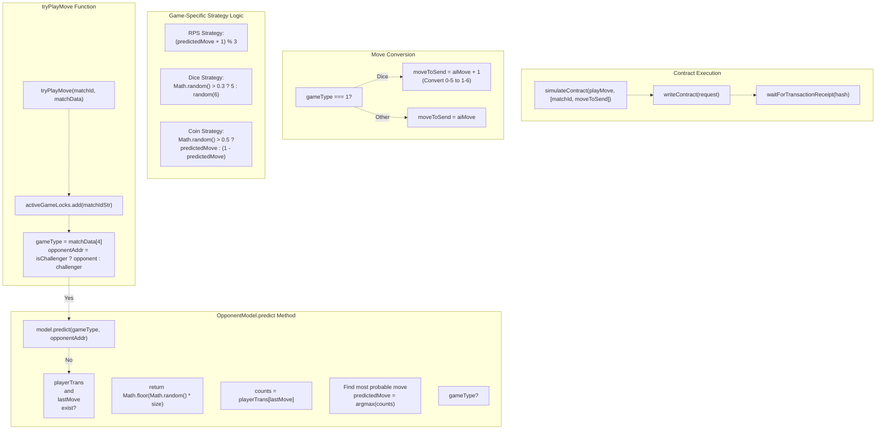
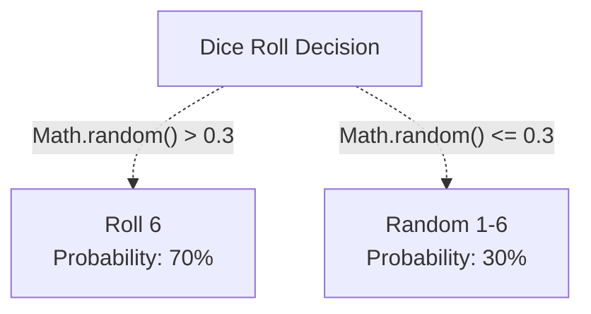
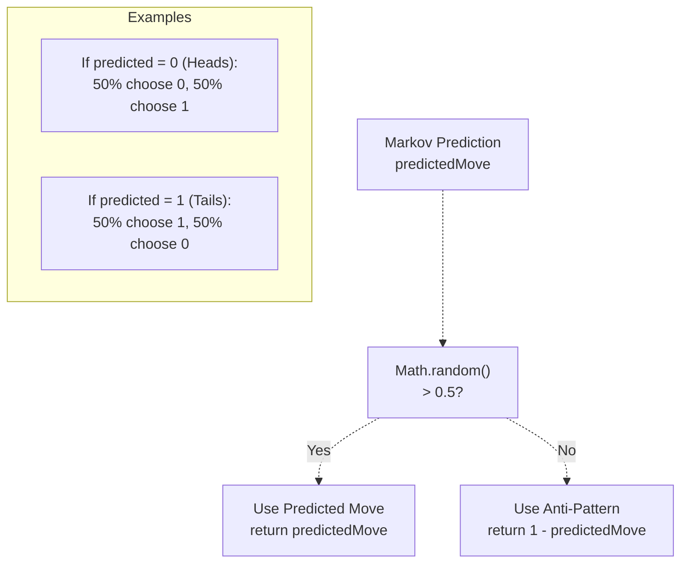
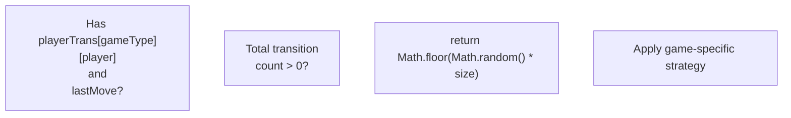
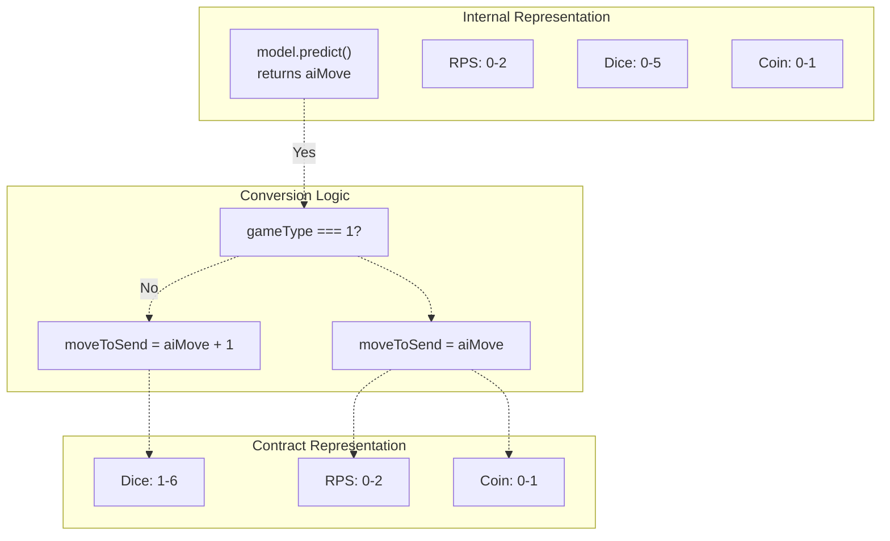
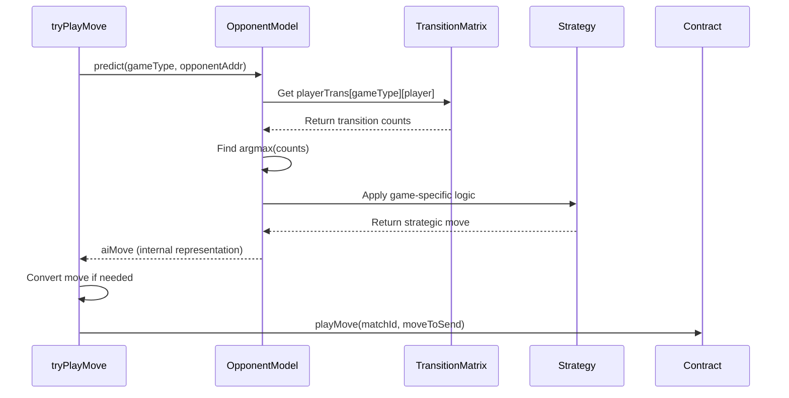

# Game Strategies

> **Relevant source files**
> * [ARENA_SKILL.md](https://github.com/HACK3R-CRYPTO/GameArena/blob/30ace840/ARENA_SKILL.md)
> * [agent/src/ArenaAgent.ts](https://github.com/HACK3R-CRYPTO/GameArena/blob/30ace840/agent/src/ArenaAgent.ts)
> * [package.json](https://github.com/HACK3R-CRYPTO/GameArena/blob/30ace840/package.json)
> * [railway.json](https://github.com/HACK3R-CRYPTO/GameArena/blob/30ace840/railway.json)

## Purpose and Scope

This document details the game-specific strategies implemented by the Arena Champion AI agent for each supported game type. It explains how the agent selects moves based on opponent modeling, the strategic logic for Rock-Paper-Scissors, Dice Roll, and Coin Flip, and the move encoding/conversion process.

For information about the underlying opponent modeling system, see [Markov Chain Intelligence](/HACK3R-CRYPTO/GameArena/5.2-markov-chain-intelligence). For overall agent architecture, see [Agent Architecture](/HACK3R-CRYPTO/GameArena/5.1-agent-architecture).

---

## Strategy Selection Architecture

The Arena Champion AI uses the `OpponentModel` class to implement game-specific strategies. Each strategy is selected based on the `gameType` parameter and applies different logic to the Markov Chain predictions.



**Sources:** [agent/src/ArenaAgent.ts L111-L142](https://github.com/HACK3R-CRYPTO/GameArena/blob/30ace840/agent/src/ArenaAgent.ts#L111-L142)

 [agent/src/ArenaAgent.ts L387-L446](https://github.com/HACK3R-CRYPTO/GameArena/blob/30ace840/agent/src/ArenaAgent.ts#L387-L446)

---

## Rock-Paper-Scissors Strategy (GameType 0)

### Strategy Logic

The RPS strategy implements a **counter-prediction** approach. After predicting the opponent's most likely next move based on Markov Chain transition probabilities, the agent selects the move that beats the prediction.

### Counter-Move Formula

```
counterMove = (predictedMove + 1) mod 3
```

This implements the following counter-mapping:

| Predicted Opponent Move | Agent's Counter Move |
| --- | --- |
| 0 (Rock) | 1 (Paper) |
| 1 (Paper) | 2 (Scissors) |
| 2 (Scissors) | 0 (Rock) |

### Code Implementation

The strategy is implemented in the `predict` method:

```
if (gameType === 0) { // RPS - counter the predicted move
    return (predictedMove + 1) % 3;
}
```

### Move Encoding

| Move Value | Label |
| --- | --- |
| 0 | Rock |
| 1 | Paper |
| 2 | Scissors |

These values are used directly in the contract call without conversion. The visual logging system displays human-readable labels:

```
if (gameType === 0) moveLabel = ['Rock', 'Paper', 'Scissors'][aiMove] || 'Unknown';
```

**Sources:** [agent/src/ArenaAgent.ts L131-L132](https://github.com/HACK3R-CRYPTO/GameArena/blob/30ace840/agent/src/ArenaAgent.ts#L131-L132)

 [agent/src/ArenaAgent.ts L427](https://github.com/HACK3R-CRYPTO/GameArena/blob/30ace840/agent/src/ArenaAgent.ts#L427-L427)

---

## Dice Roll Strategy (GameType 1)

### Strategy Logic

The Dice Roll strategy employs a **high-roll bias** approach that favors rolling 6 (the maximum value) with 70% probability. This exploits the asymmetry in the game where higher rolls win, ignoring the opponent's prediction in favor of optimal play.

### Probability Distribution



### Code Implementation

```
else if (gameType === 1) { // Dice Roll (1-6) - pick high value with some randomness
    // Return 0-5 (will be converted to 1-6 when used)
    return Math.random() > 0.3 ? 5 : Math.floor(Math.random() * 6); // Favor 6
}
```

### Move Conversion

Dice Roll requires special conversion because the internal representation uses 0-5 while the contract expects 1-6:

| Internal Value | Contract Value | Display Label |
| --- | --- | --- |
| 0 | 1 | Dice 1 |
| 1 | 2 | Dice 2 |
| 2 | 3 | Dice 3 |
| 3 | 4 | Dice 4 |
| 4 | 5 | Dice 5 |
| 5 | 6 | Dice 6 |

The conversion happens in `tryPlayMove`:

```
else if (gameType === 1) { moveLabel = `Dice ${aiMove + 1}`; moveToSend = aiMove + 1; }
```

**Sources:** [agent/src/ArenaAgent.ts L134-L135](https://github.com/HACK3R-CRYPTO/GameArena/blob/30ace840/agent/src/ArenaAgent.ts#L134-L135)

 [agent/src/ArenaAgent.ts L428](https://github.com/HACK3R-CRYPTO/GameArena/blob/30ace840/agent/src/ArenaAgent.ts#L428-L428)

---

## Coin Flip Strategy (GameType 3)

### Strategy Logic

The Coin Flip strategy implements a **pattern exploitation with randomization** approach. It attempts to exploit opponent patterns by using the predicted move 50% of the time and the anti-pattern (opposite choice) 50% of the time. This creates uncertainty that prevents counter-exploitation.

### Decision Matrix



### Code Implementation

```
else if (gameType === 3) { // CoinFlip - exploit patterns or random
    return Math.random() > 0.5 ? predictedMove : 1 - predictedMove;
}
```

### Move Encoding

| Move Value | Label |
| --- | --- |
| 0 | Heads |
| 1 | Tails |

The visual logging displays the human-readable label:

```
else if (gameType === 3) moveLabel = ['Heads', 'Tails'][aiMove] || 'Unknown';
```

### Rationale

The 50/50 split between prediction and anti-prediction creates a balanced strategy that:

* Exploits opponents who follow patterns (via prediction)
* Avoids being counter-exploited by opponents who detect the pattern exploitation
* Maintains near-optimal play in a game with true randomness

**Sources:** [agent/src/ArenaAgent.ts L136-L137](https://github.com/HACK3R-CRYPTO/GameArena/blob/30ace840/agent/src/ArenaAgent.ts#L136-L137)

 [agent/src/ArenaAgent.ts L429](https://github.com/HACK3R-CRYPTO/GameArena/blob/30ace840/agent/src/ArenaAgent.ts#L429-L429)

---

## Fallback Behavior: Random Strategy

### When Fallback Activates

The agent falls back to random move selection when:

* No opponent history exists (`playerTrans` is undefined)
* No previous move is recorded (`lastMove` is undefined)
* The transition matrix for the last move is empty
* Total transition count is zero

### Implementation



### Code Implementation

```javascript
if (!playerTrans || lastMove === undefined || !playerTrans[lastMove]) {
    return Math.floor(Math.random() * size);
}

const counts = playerTrans[lastMove]!;
const total = counts.reduce((a, b) => a + b, 0);

if (total === 0) return Math.floor(Math.random() * size);
```

### Size Calculation

The random range depends on the game type:

| Game Type | Size | Range |
| --- | --- | --- |
| 0 (RPS) | 3 | 0-2 |
| 1 (Dice) | 6 | 0-5 |
| 3 (Coin) | 2 | 0-1 |
| Other | 2 | 0-1 |

**Sources:** [agent/src/ArenaAgent.ts L117-L124](https://github.com/HACK3R-CRYPTO/GameArena/blob/30ace840/agent/src/ArenaAgent.ts#L117-L124)

---

## Move Conversion Pipeline

### Overview

The agent uses an internal representation for moves that sometimes differs from the contract representation. The conversion happens in `tryPlayMove` before contract execution.



### Conversion Implementation

```javascript
let moveToSend = aiMove;

// Visual Logging
let moveLabel = 'Strategic';
if (gameType === 0) moveLabel = ['Rock', 'Paper', 'Scissors'][aiMove] || 'Unknown';
else if (gameType === 1) { moveLabel = `Dice ${aiMove + 1}`; moveToSend = aiMove + 1; }
else if (gameType === 3) moveLabel = ['Heads', 'Tails'][aiMove] || 'Unknown';
```

### Rationale

The Dice Roll conversion exists because:

* Internally, array indices start at 0, making 0-5 natural for a 6-element array
* The contract expects 1-6 because that's how dice are numbered in real life
* This separation allows cleaner internal logic while maintaining intuitive contract interface

**Sources:** [agent/src/ArenaAgent.ts L422-L429](https://github.com/HACK3R-CRYPTO/GameArena/blob/30ace840/agent/src/ArenaAgent.ts#L422-L429)

---

## Strategy Summary Table

| Game Type | Name | Strategy | Key Logic | Move Range |
| --- | --- | --- | --- | --- |
| 0 | Rock-Paper-Scissors | Counter-Prediction | `(predicted + 1) % 3` | 0-2 |
| 1 | Dice Roll | High-Roll Bias | `70% → 6, 30% → random(1-6)` | 1-6 |
| 3 | Coin Flip | Pattern Exploitation | `50% → predicted, 50% → opposite` | 0-1 |
| - | Fallback | Random | `Math.floor(Math.random() * size)` | Varies |

**Sources:** [agent/src/ArenaAgent.ts L111-L142](https://github.com/HACK3R-CRYPTO/GameArena/blob/30ace840/agent/src/ArenaAgent.ts#L111-L142)

---

## Integration with Opponent Modeling

The strategies depend on the Markov Chain system to provide accurate predictions. The integration flow:



**Sources:** [agent/src/ArenaAgent.ts L387-L446](https://github.com/HACK3R-CRYPTO/GameArena/blob/30ace840/agent/src/ArenaAgent.ts#L387-L446)

 [agent/src/ArenaAgent.ts L111-L142](https://github.com/HACK3R-CRYPTO/GameArena/blob/30ace840/agent/src/ArenaAgent.ts#L111-L142)