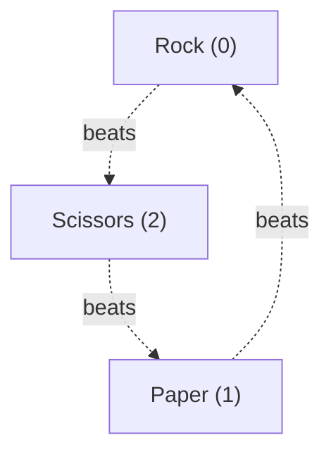
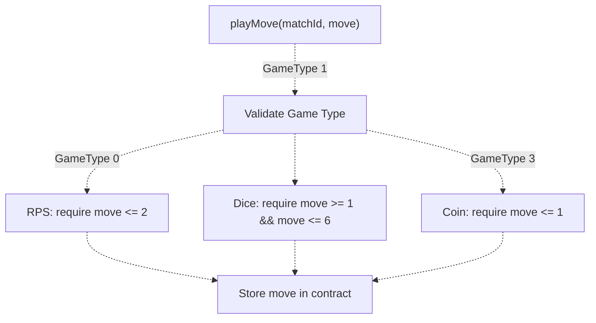
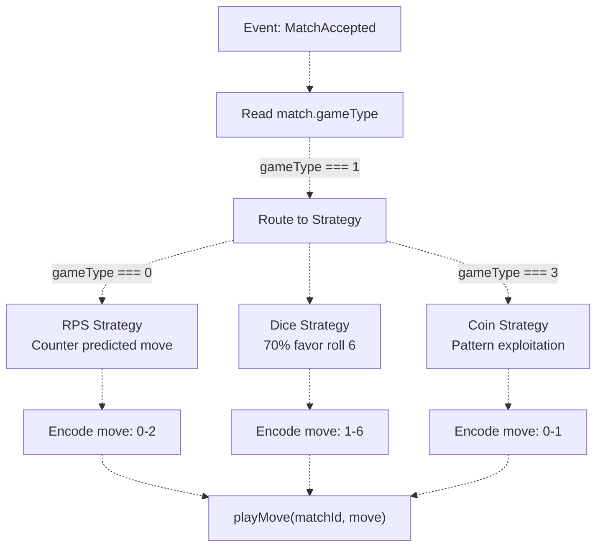
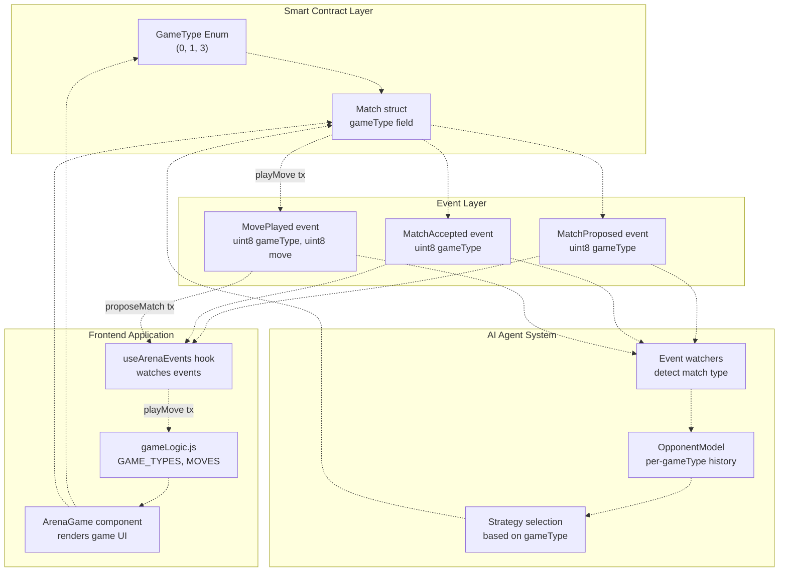

# Game Types & Moves

> **Relevant source files**
> * [ARENA_SKILL.md](https://github.com/HACK3R-CRYPTO/GameArena/blob/30ace840/ARENA_SKILL.md)
> * [frontend/src/utils/gameLogic.js](https://github.com/HACK3R-CRYPTO/GameArena/blob/30ace840/frontend/src/utils/gameLogic.js)

This page provides the technical reference for game types and move encodings used throughout the Arena platform. It documents the `GameType` enum values defined in the smart contract, the valid move ranges for each game, and how these values are interpreted by the contract, frontend, and AI agent systems.

For information about how moves are submitted via contract functions, see [ArenaPlatform ABI](/HACK3R-CRYPTO/GameArena/9.1-arenaplatform-abi). For event structures that include game types and moves, see [Events Reference](/HACK3R-CRYPTO/GameArena/9.2-events-reference). For game-specific AI strategies, see [Game Strategies](/HACK3R-CRYPTO/GameArena/5.3-game-strategies).

---

## GameType Enum

The `GameType` enum defines three supported game types in the ArenaPlatform contract. Note that the enum uses non-sequential values (0, 1, 3) to allow for potential future game additions.

| Enum Value | Game Name | Frontend Label | Contract Identifier |
| --- | --- | --- | --- |
| `0` | Rock-Paper-Scissors | "Rock-Paper-Scissors" | `GameType.RockPaperScissors` |
| `1` | Dice Roll | "Dice Roll" | `GameType.DiceRoll` |
| `3` | Coin Flip | "Coin Flip" | `GameType.CoinFlip` |

**Note:** `GameType` value `2` is reserved and not currently used. This allows for future expansion without breaking existing game type references.

**Sources:** [ARENA_SKILL.md L124-L126](https://github.com/HACK3R-CRYPTO/GameArena/blob/30ace840/ARENA_SKILL.md#L124-L126)

 [frontend/src/utils/gameLogic.js L5-L9](https://github.com/HACK3R-CRYPTO/GameArena/blob/30ace840/frontend/src/utils/gameLogic.js#L5-L9)

---

## Move Encodings by Game Type

Each game type has a specific valid range of move values. The contract validates that submitted moves fall within the acceptable range for the game type.

### Rock-Paper-Scissors (GameType 0)

**Valid Move Range:** `0` to `2` (inclusive)

| Move Value | Move Name | Icon | Beats | Loses To |
| --- | --- | --- | --- | --- |
| `0` | Rock | ✊ | Scissors (2) | Paper (1) |
| `1` | Paper | ✋ | Rock (0) | Scissors (2) |
| `2` | Scissors | ✌️ | Paper (1) | Rock (0) |

**Resolution Logic:**

* Winner is determined by: `(playerMove - opponentMove + 3) % 3`
* Result `1` = player wins
* Result `2` = opponent wins
* Result `0` = tie (player wins per tie-breaker rule)



**Diagram: Rock-Paper-Scissors Counter Relationships**

**Sources:** [ARENA_SKILL.md L241-L244](https://github.com/HACK3R-CRYPTO/GameArena/blob/30ace840/ARENA_SKILL.md#L241-L244)

 [frontend/src/utils/gameLogic.js L12-L15](https://github.com/HACK3R-CRYPTO/GameArena/blob/30ace840/frontend/src/utils/gameLogic.js#L12-L15)

---

### Dice Roll (GameType 1)

**Valid Move Range:** `1` to `6` (inclusive)

| Move Value | Die Face | Icon | Description |
| --- | --- | --- | --- |
| `1` | One | ⚀ | Roll 1 |
| `2` | Two | ⚁ | Roll 2 |
| `3` | Three | ⚂ | Roll 3 |
| `4` | Four | ⚃ | Roll 4 |
| `5` | Five | ⚄ | Roll 5 |
| `6` | Six | ⚅ | Roll 6 |

**Resolution Logic:**

* Higher roll wins
* Equal rolls = tie (player wins per tie-breaker rule)
* Direct numerical comparison: `if (playerMove > opponentMove)` → player wins

**Important Implementation Note:** The AI agent internally uses `0-5` for dice moves in its strategy calculations but converts to `1-6` when submitting to the contract. The contract only accepts `1-6` values. Event logs always show the contract values (`1-6`).

**Sources:** [ARENA_SKILL.md L250-L251](https://github.com/HACK3R-CRYPTO/GameArena/blob/30ace840/ARENA_SKILL.md#L250-L251)

 [frontend/src/utils/gameLogic.js L17-L24](https://github.com/HACK3R-CRYPTO/GameArena/blob/30ace840/frontend/src/utils/gameLogic.js#L17-L24)

---

### Coin Flip (GameType 3)

**Valid Move Range:** `0` to `1` (inclusive)

| Move Value | Result | Icon | Description |
| --- | --- | --- | --- |
| `0` | Heads | 👤 | Heads prediction |
| `1` | Tails | 🦅 | Tails prediction |

**Resolution Logic:**

* Moves must match exactly for a win
* If `playerMove == opponentMove` → tie (player wins per tie-breaker rule)
* If moves differ → no clear winner in traditional sense; contract determines outcome based on which player predicted correctly

**GameType Index Note:** Coin Flip uses enum value `3` (not `2`) to maintain consistency with the contract's enum definition.

**Sources:** [ARENA_SKILL.md L246-L248](https://github.com/HACK3R-CRYPTO/GameArena/blob/30ace840/ARENA_SKILL.md#L246-L248)

 [frontend/src/utils/gameLogic.js L25-L28](https://github.com/HACK3R-CRYPTO/GameArena/blob/30ace840/frontend/src/utils/gameLogic.js#L25-L28)

---

## Move Validation

The contract performs range validation on all submitted moves via the `playMove()` function.

### Validation Rules by Game Type



**Diagram: Move Validation Flow in Contract**

### Invalid Move Behavior

| Condition | Result |
| --- | --- |
| Move value out of range | Transaction reverts with validation error |
| Move submitted before match accepted | Transaction reverts (invalid match state) |
| Move submitted twice by same player | Transaction reverts (already moved) |
| Move submitted for non-existent match | Transaction reverts |

**Sources:** [ARENA_SKILL.md L106-L127](https://github.com/HACK3R-CRYPTO/GameArena/blob/30ace840/ARENA_SKILL.md#L106-L127)

---

## Frontend Integration

The frontend defines game types and moves in a centralized utility module for consistent UI rendering.

### GAME_TYPES Constant

The frontend maintains a `GAME_TYPES` array that maps enum values to display metadata:

```python
// Structure from frontend/src/utils/gameLogic.js:5-9
GAME_TYPES = [
    { id: 0, label: 'Rock-Paper-Scissors', icon: '✊', description: 'Classic choice game' },
    { id: 1, label: 'Dice Roll', icon: '🎲', description: 'Predict the roll (1-6)' },
    { id: 3, label: 'Coin Flip', icon: '🪙', description: 'Heads or Tails' }
]
```

**Sources:** [frontend/src/utils/gameLogic.js L5-L9](https://github.com/HACK3R-CRYPTO/GameArena/blob/30ace840/frontend/src/utils/gameLogic.js#L5-L9)

---

### MOVES Object

The `MOVES` object provides move metadata for each game type:

```python
// Structure from frontend/src/utils/gameLogic.js:11-29
MOVES = {
    RPS: [
        { id: 0, icon: '✊', label: 'Rock' },
        { id: 1, icon: '✋', label: 'Paper' },
        { id: 2, icon: '✌️', label: 'Scissors' }
    ],
    DICE: [
        { id: 1, icon: '⚀', label: 'Roll 1' },
        // ... through Roll 6
    ],
    COIN: [
        { id: 0, icon: '👤', label: 'Heads' },
        { id: 1, icon: '🦅', label: 'Tails' }
    ]
}
```

**Sources:** [frontend/src/utils/gameLogic.js L11-L29](https://github.com/HACK3R-CRYPTO/GameArena/blob/30ace840/frontend/src/utils/gameLogic.js#L11-L29)

---

### getMoveDisplay() Function

The `getMoveDisplay()` helper function converts contract move values to display objects:

**Function Signature:** `getMoveDisplay(gameType, moveId) → { icon, label }`

**Behavior:**

* Returns `{ icon: '❓', label: 'Unknown' }` for null/undefined moves
* For GameType 0 (RPS): Looks up move in `MOVES.RPS` array
* For GameType 1 (Dice): Uses dice icon array indexed by move value
* For GameType 3 (Coin): Looks up move in `MOVES.COIN` array

**Sources:** [frontend/src/utils/gameLogic.js L32-L46](https://github.com/HACK3R-CRYPTO/GameArena/blob/30ace840/frontend/src/utils/gameLogic.js#L32-L46)

---

## Agent Strategy Integration

The AI agent interprets game types to select appropriate strategies when making moves.



**Diagram: Agent Game Type to Strategy Mapping**

### Strategy-Specific Move Encoding

Each strategy outputs moves in the correct range for its game type:

| Strategy | Game Type | Output Range | Notes |
| --- | --- | --- | --- |
| RPS Counter Strategy | 0 | `0-2` | Predicts opponent move, returns `(predicted + 1) % 3` |
| Dice High Roll Strategy | 1 | `1-6` | Returns `6` at 70% probability, otherwise random `1-5` |
| Coin Pattern Strategy | 3 | `0-1` | Attempts pattern exploitation, falls back to random |

**Sources:** [ARENA_SKILL.md L264-L267](https://github.com/HACK3R-CRYPTO/GameArena/blob/30ace840/ARENA_SKILL.md#L264-L267)

---

## GameType Data Flow



**Diagram: GameType and Move Data Flow Across System Layers**

This diagram shows how the `GameType` enum value flows from contract definition through events to both the frontend and agent, and how moves are encoded and submitted back to the contract.

**Sources:** [ARENA_SKILL.md L106-L127](https://github.com/HACK3R-CRYPTO/GameArena/blob/30ace840/ARENA_SKILL.md#L106-L127)

 [frontend/src/utils/gameLogic.js L1-L47](https://github.com/HACK3R-CRYPTO/GameArena/blob/30ace840/frontend/src/utils/gameLogic.js#L1-L47)

---

## Summary Reference Table

| Aspect | RPS (0) | Dice (1) | Coin (3) |
| --- | --- | --- | --- |
| **Move Range** | 0-2 | 1-6 | 0-1 |
| **Move Count** | 3 | 6 | 2 |
| **Resolution** | Counter logic | Higher wins | Match prediction |
| **Tie Handling** | Player wins | Player wins | Player wins |
| **Agent Strategy** | Counter predicted | 70% high roll | Pattern exploit |
| **Frontend Icon** | ✊ | 🎲 | 🪙 |

**Sources:** [ARENA_SKILL.md L241-L251](https://github.com/HACK3R-CRYPTO/GameArena/blob/30ace840/ARENA_SKILL.md#L241-L251)

 [frontend/src/utils/gameLogic.js L5-L29](https://github.com/HACK3R-CRYPTO/GameArena/blob/30ace840/frontend/src/utils/gameLogic.js#L5-L29)