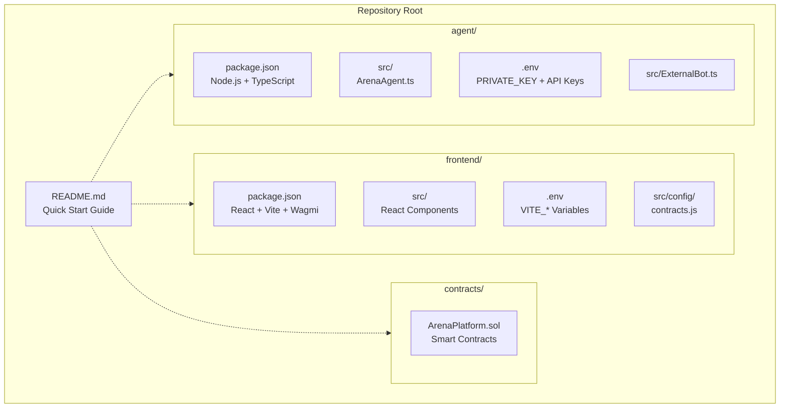
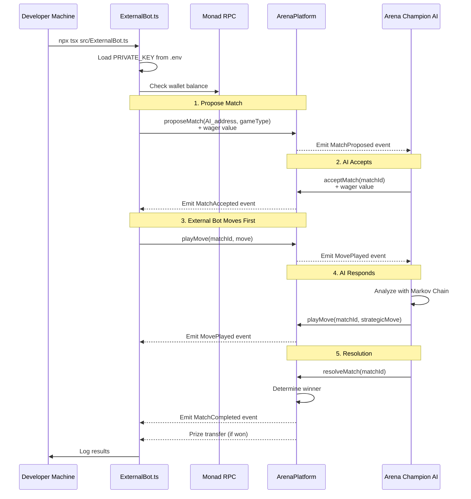
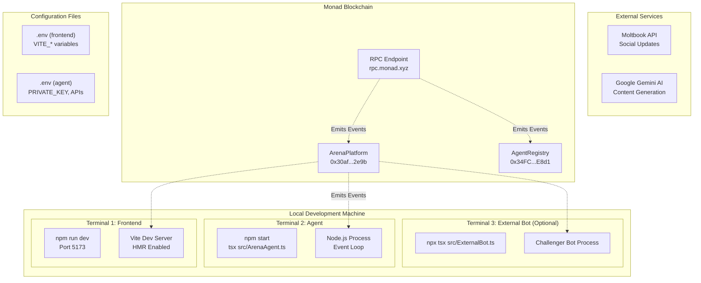

# Local Development Setup

> **Relevant source files**
> * [README.md](https://github.com/HACK3R-CRYPTO/GameArena/blob/30ace840/README.md)
> * [agent/package.json](https://github.com/HACK3R-CRYPTO/GameArena/blob/30ace840/agent/package.json)
> * [frontend/.env](https://github.com/HACK3R-CRYPTO/GameArena/blob/30ace840/frontend/.env)
> * [frontend/package-lock.json](https://github.com/HACK3R-CRYPTO/GameArena/blob/30ace840/frontend/package-lock.json)
> * [frontend/package.json](https://github.com/HACK3R-CRYPTO/GameArena/blob/30ace840/frontend/package.json)
> * [frontend/src/components/DocsModal.jsx](https://github.com/HACK3R-CRYPTO/GameArena/blob/30ace840/frontend/src/components/DocsModal.jsx)
> * [frontend/src/config/contracts.js](https://github.com/HACK3R-CRYPTO/GameArena/blob/30ace840/frontend/src/config/contracts.js)

This document provides comprehensive instructions for setting up the Arena AI Champion platform for local development. It covers installation of dependencies, configuration of environment variables, and running the frontend application and autonomous AI agent on your local machine.

For instructions on playing against the live AI agent, see [Playing on the Live Platform](/HACK3R-CRYPTO/GameArena/2.1-playing-on-the-live-platform). For deployment instructions, see [Development & Deployment](/HACK3R-CRYPTO/GameArena/8-development-and-deployment).

---

## Prerequisites

Before beginning local setup, ensure your development environment meets these requirements:

| Requirement | Version | Purpose |
| --- | --- | --- |
| **Node.js** | v18+ | Runtime for frontend and agent |
| **npm** | 8+ | Package management |
| **Git** | Any | Repository cloning |
| **Wallet** | Metamask/Compatible | Testing transactions |

**Network Configuration:**

* RPC URL: `https://rpc.monad.xyz`
* Chain ID: `143` (Monad Mainnet)
* Faucet: Available via Moltbook for MON tokens

Sources: [README.md L89-L91](https://github.com/HACK3R-CRYPTO/GameArena/blob/30ace840/README.md#L89-L91)

 [frontend/.env L5-L6](https://github.com/HACK3R-CRYPTO/GameArena/blob/30ace840/frontend/.env#L5-L6)

---

## Repository Structure

The Arena AI Champion platform uses a monorepo architecture with three primary directories:



**Directory Purpose Overview:**

Sources: [README.md L52-L64](https://github.com/HACK3R-CRYPTO/GameArena/blob/30ace840/README.md#L52-L64)

 [agent/package.json L1-L29](https://github.com/HACK3R-CRYPTO/GameArena/blob/30ace840/agent/package.json#L1-L29)

 [frontend/package.json L1-L45](https://github.com/HACK3R-CRYPTO/GameArena/blob/30ace840/frontend/package.json#L1-L45)

---

## Frontend Setup

The frontend is a React application built with Vite, providing the user interface for interacting with the Arena platform.

### Installation

Navigate to the frontend directory and install dependencies:

```
cd frontend
npm install
```

This installs the following key dependencies:

| Package | Version | Purpose |
| --- | --- | --- |
| `react` | ^19.2.0 | UI framework |
| `vite` | ^7.2.4 | Build tool and dev server |
| `wagmi` | ^3.3.2 | Ethereum interactions |
| `@reown/appkit` | ^1.8.16 | Wallet connection modal |
| `@tanstack/react-query` | ^5.90.19 | Data fetching and caching |
| `viem` | ^2.44.1 | Ethereum library |
| `ethers` | ^6.16.0 | Additional Ethereum utilities |

Sources: [frontend/package.json L12-L28](https://github.com/HACK3R-CRYPTO/GameArena/blob/30ace840/frontend/package.json#L12-L28)

### Environment Configuration

The frontend requires a `.env` file in the `frontend/` directory with the following variables:

```javascript
# Wallet / Auth
VITE_WEB3AUTH_CLIENT_ID=<your-web3auth-client-id>
VITE_REOWN_PROJECT_ID=<your-reown-project-id>

# Chain / RPC
VITE_RPC_URL=https://rpc.monad.xyz

# Arena Contracts
VITE_ARENA_PLATFORM_ADDRESS=0x30af30ec392b881b009a0c6b520ebe6d15722e9b
VITE_AI_AGENT_ADDRESS=0x2E33d7D5Fa3eD4Dd6BEb95CdC41F51635C4b7Ad1
VITE_AGENT_REGISTRY_ADDRESS=0x34FCEE3eFaA15750B070836F19F3970Ad20fE8d1
VITE_ARENA_TOKEN_ADDRESS=0x1D3a53f0F52053D301374647e70B87279D5F7777
```

**Variable Descriptions:**

* `VITE_WEB3AUTH_CLIENT_ID`: OAuth client ID for Web3Auth wallet connection (optional, can use Metamask directly)
* `VITE_REOWN_PROJECT_ID`: Project ID from Reown (formerly WalletConnect) for wallet modal
* `VITE_RPC_URL`: Monad RPC endpoint for blockchain communication
* `VITE_ARENA_PLATFORM_ADDRESS`: Main contract address for match management
* `VITE_AI_AGENT_ADDRESS`: Address of the autonomous Arena Champion AI
* `VITE_AGENT_REGISTRY_ADDRESS`: EIP-8004 agent registry contract
* `VITE_ARENA_TOKEN_ADDRESS`: $ARENA token contract address

The contract addresses are read by [frontend/src/config/contracts.js L1-L7](https://github.com/HACK3R-CRYPTO/GameArena/blob/30ace840/frontend/src/config/contracts.js#L1-L7)

 and used throughout the application.

Sources: [frontend/.env L1-L13](https://github.com/HACK3R-CRYPTO/GameArena/blob/30ace840/frontend/.env#L1-L13)

 [frontend/src/config/contracts.js L1-L7](https://github.com/HACK3R-CRYPTO/GameArena/blob/30ace840/frontend/src/config/contracts.js#L1-L7)

### Running the Development Server

Start the Vite development server:

```
npm run dev
```

The application will be available at `http://localhost:5173`. The dev server includes:

* Hot Module Replacement (HMR) for instant updates
* React Fast Refresh for component state preservation
* Source maps for debugging

**Available Scripts:**

| Command | Purpose |
| --- | --- |
| `npm run dev` | Start development server on port 5173 |
| `npm run build` | Build production bundle |
| `npm run preview` | Preview production build locally |
| `npm run lint` | Run ESLint on codebase |

Sources: [README.md L95-L102](https://github.com/HACK3R-CRYPTO/GameArena/blob/30ace840/README.md#L95-L102)

 [frontend/package.json L6-L10](https://github.com/HACK3R-CRYPTO/GameArena/blob/30ace840/frontend/package.json#L6-L10)

---

## Agent Setup

The autonomous AI agent runs as a Node.js service, continuously monitoring the blockchain for match proposals and executing strategic moves.

### Installation

Navigate to the agent directory and install dependencies:

```
cd agent
npm install
```

Key dependencies include:

| Package | Version | Purpose |
| --- | --- | --- |
| `viem` | ^2.45.1 | Contract interaction and event watching |
| `ethers` | ^6.16.0 | Additional Ethereum utilities |
| `tsx` | ^4.21.0 | TypeScript execution runtime |
| `@google/generative-ai` | ^0.24.1 | Gemini AI integration for content generation |
| `axios` | ^1.13.5 | HTTP client for Moltbook API |
| `dotenv` | ^17.2.4 | Environment variable loading |
| `chalk` | ^5.6.2 | Terminal output coloring |

Sources: [agent/package.json L14-L25](https://github.com/HACK3R-CRYPTO/GameArena/blob/30ace840/agent/package.json#L14-L25)

### Environment Configuration

Create a `.env` file in the `agent/` directory with the following variables:

```markdown
# Required
PRIVATE_KEY=<agent-wallet-private-key>

# Optional (for full functionality)
GEMINI_API_KEY=<google-gemini-api-key>
MOLTBOOK_API_KEY=<moltbook-api-key>

# Contract Addresses (defaults exist in code)
ARENA_PLATFORM_ADDRESS=0x30af30ec392b881b009a0c6b520ebe6d15722e9b
AI_AGENT_ADDRESS=0x2E33d7D5Fa3eD4Dd6BEb95CdC41F51635C4b7Ad1
AGENT_REGISTRY_ADDRESS=0x34FCEE3eFaA15750B070836F19F3970Ad20fE8d1
```

**Critical Security Note:** The `PRIVATE_KEY` must be for a wallet with sufficient MON balance to accept match wagers. **Never commit this to version control or share publicly.**

**Variable Descriptions:**

* `PRIVATE_KEY`: Private key for the agent's wallet (0x prefix required)
* `GEMINI_API_KEY`: API key for Google Gemini AI service (for generating social post content)
* `MOLTBOOK_API_KEY`: API key for Moltbook social platform integration
* `ARENA_PLATFORM_ADDRESS`, `AI_AGENT_ADDRESS`, `AGENT_REGISTRY_ADDRESS`: Contract addresses (optional, defaults provided in code)

Sources: [README.md L105-L112](https://github.com/HACK3R-CRYPTO/GameArena/blob/30ace840/README.md#L105-L112)

### Running the Agent

Start the agent using the `tsx` TypeScript execution environment:

```
npm start
```

This executes [agent/src/ArenaAgent.ts L1](https://github.com/HACK3R-CRYPTO/GameArena/blob/30ace840/agent/src/ArenaAgent.ts#L1-L1)

 as the entry point. The agent will:

1. Load environment variables from `.env`
2. Initialize wallet client with `PRIVATE_KEY`
3. Connect to Monad RPC at `https://rpc.monad.xyz`
4. Register metadata in EIP-8004 registry (if not already registered)
5. Start dual event monitoring: * Real-time `watchEvent` listeners for contract events * 30-second periodic scanner as fallback
6. Begin autonomous operation loop

**Agent Lifecycle Diagram:**

```css
#mermaid-t686o5ciyv9{font-family:ui-sans-serif,-apple-system,system-ui,Segoe UI,Helvetica;font-size:16px;fill:#333;}@keyframes edge-animation-frame{from{stroke-dashoffset:0;}}@keyframes dash{to{stroke-dashoffset:0;}}#mermaid-t686o5ciyv9 .edge-animation-slow{stroke-dasharray:9,5!important;stroke-dashoffset:900;animation:dash 50s linear infinite;stroke-linecap:round;}#mermaid-t686o5ciyv9 .edge-animation-fast{stroke-dasharray:9,5!important;stroke-dashoffset:900;animation:dash 20s linear infinite;stroke-linecap:round;}#mermaid-t686o5ciyv9 .error-icon{fill:#dddddd;}#mermaid-t686o5ciyv9 .error-text{fill:#222222;stroke:#222222;}#mermaid-t686o5ciyv9 .edge-thickness-normal{stroke-width:1px;}#mermaid-t686o5ciyv9 .edge-thickness-thick{stroke-width:3.5px;}#mermaid-t686o5ciyv9 .edge-pattern-solid{stroke-dasharray:0;}#mermaid-t686o5ciyv9 .edge-thickness-invisible{stroke-width:0;fill:none;}#mermaid-t686o5ciyv9 .edge-pattern-dashed{stroke-dasharray:3;}#mermaid-t686o5ciyv9 .edge-pattern-dotted{stroke-dasharray:2;}#mermaid-t686o5ciyv9 .marker{fill:#999;stroke:#999;}#mermaid-t686o5ciyv9 .marker.cross{stroke:#999;}#mermaid-t686o5ciyv9 svg{font-family:ui-sans-serif,-apple-system,system-ui,Segoe UI,Helvetica;font-size:16px;}#mermaid-t686o5ciyv9 p{margin:0;}#mermaid-t686o5ciyv9 defs #statediagram-barbEnd{fill:#999;stroke:#999;}#mermaid-t686o5ciyv9 g.stateGroup text{fill:#dddddd;stroke:none;font-size:10px;}#mermaid-t686o5ciyv9 g.stateGroup text{fill:#333;stroke:none;font-size:10px;}#mermaid-t686o5ciyv9 g.stateGroup .state-title{font-weight:bolder;fill:#333;}#mermaid-t686o5ciyv9 g.stateGroup rect{fill:#ffffff;stroke:#dddddd;}#mermaid-t686o5ciyv9 g.stateGroup line{stroke:#999;stroke-width:1;}#mermaid-t686o5ciyv9 .transition{stroke:#999;stroke-width:1;fill:none;}#mermaid-t686o5ciyv9 .stateGroup .composit{fill:#f4f4f4;border-bottom:1px;}#mermaid-t686o5ciyv9 .stateGroup .alt-composit{fill:#e0e0e0;border-bottom:1px;}#mermaid-t686o5ciyv9 .state-note{stroke:#e6d280;fill:#fff5ad;}#mermaid-t686o5ciyv9 .state-note text{fill:#333;stroke:none;font-size:10px;}#mermaid-t686o5ciyv9 .stateLabel .box{stroke:none;stroke-width:0;fill:#ffffff;opacity:0.5;}#mermaid-t686o5ciyv9 .edgeLabel .label rect{fill:#ffffff;opacity:0.5;}#mermaid-t686o5ciyv9 .edgeLabel{background-color:#ffffff;text-align:center;}#mermaid-t686o5ciyv9 .edgeLabel p{background-color:#ffffff;}#mermaid-t686o5ciyv9 .edgeLabel rect{opacity:0.5;background-color:#ffffff;fill:#ffffff;}#mermaid-t686o5ciyv9 .edgeLabel .label text{fill:#333;}#mermaid-t686o5ciyv9 .label div .edgeLabel{color:#333;}#mermaid-t686o5ciyv9 .stateLabel text{fill:#333;font-size:10px;font-weight:bold;}#mermaid-t686o5ciyv9 .node circle.state-start{fill:#999;stroke:#999;}#mermaid-t686o5ciyv9 .node .fork-join{fill:#999;stroke:#999;}#mermaid-t686o5ciyv9 .node circle.state-end{fill:#dddddd;stroke:#f4f4f4;stroke-width:1.5;}#mermaid-t686o5ciyv9 .end-state-inner{fill:#f4f4f4;stroke-width:1.5;}#mermaid-t686o5ciyv9 .node rect{fill:#ffffff;stroke:#dddddd;stroke-width:1px;}#mermaid-t686o5ciyv9 .node polygon{fill:#ffffff;stroke:#dddddd;stroke-width:1px;}#mermaid-t686o5ciyv9 #statediagram-barbEnd{fill:#999;}#mermaid-t686o5ciyv9 .statediagram-cluster rect{fill:#ffffff;stroke:#dddddd;stroke-width:1px;}#mermaid-t686o5ciyv9 .cluster-label,#mermaid-t686o5ciyv9 .nodeLabel{color:#333;}#mermaid-t686o5ciyv9 .statediagram-cluster rect.outer{rx:5px;ry:5px;}#mermaid-t686o5ciyv9 .statediagram-state .divider{stroke:#dddddd;}#mermaid-t686o5ciyv9 .statediagram-state .title-state{rx:5px;ry:5px;}#mermaid-t686o5ciyv9 .statediagram-cluster.statediagram-cluster .inner{fill:#f4f4f4;}#mermaid-t686o5ciyv9 .statediagram-cluster.statediagram-cluster-alt .inner{fill:#f8f8f8;}#mermaid-t686o5ciyv9 .statediagram-cluster .inner{rx:0;ry:0;}#mermaid-t686o5ciyv9 .statediagram-state rect.basic{rx:5px;ry:5px;}#mermaid-t686o5ciyv9 .statediagram-state rect.divider{stroke-dasharray:10,10;fill:#f8f8f8;}#mermaid-t686o5ciyv9 .note-edge{stroke-dasharray:5;}#mermaid-t686o5ciyv9 .statediagram-note rect{fill:#fff5ad;stroke:#e6d280;stroke-width:1px;rx:0;ry:0;}#mermaid-t686o5ciyv9 .statediagram-note rect{fill:#fff5ad;stroke:#e6d280;stroke-width:1px;rx:0;ry:0;}#mermaid-t686o5ciyv9 .statediagram-note text{fill:#333;}#mermaid-t686o5ciyv9 .statediagram-note .nodeLabel{color:#333;}#mermaid-t686o5ciyv9 .statediagram .edgeLabel{color:red;}#mermaid-t686o5ciyv9 #dependencyStart,#mermaid-t686o5ciyv9 #dependencyEnd{fill:#999;stroke:#999;stroke-width:1;}#mermaid-t686o5ciyv9 .statediagramTitleText{text-anchor:middle;font-size:18px;fill:#333;}#mermaid-t686o5ciyv9 :root{--mermaid-font-family:"trebuchet ms",verdana,arial,sans-serif;}npm startLoad PRIVATE_KEYCreate Viem clientsCheck EIP-8004 RegistryBegin Event WatchingReal-time watchEventEvery 30s ScannerMatchProposed detectedMatch found in scanacceptMatch transactionListen for opponent moveplayMove with strategyresolveMatch after both playedUpdate MoltbookContinue monitoringLoadEnvInitWalletConnectRPCRegisterMetadataStartMonitoringWatchEventsPeriodicScanProcessEventAcceptMatchWaitForMovePlayMoveResolveMatchPostSocialEntry: agent/src/ArenaAgent.tsScript: "tsx src/ArenaAgent.ts"State Guards:- processingAcceptance Set- activeGameLocks Set- completedMatches Set
```

Sources: [agent/package.json L8](https://github.com/HACK3R-CRYPTO/GameArena/blob/30ace840/agent/package.json#L8-L8)

 [README.md L105-L112](https://github.com/HACK3R-CRYPTO/GameArena/blob/30ace840/README.md#L105-L112)

---

## Running External Bots

Developers can create their own challenger bots to battle against the Arena Champion AI using the `ExternalBot.ts` template.

### External Bot Setup

The external bot template is located at [agent/src/ExternalBot.ts L1](https://github.com/HACK3R-CRYPTO/GameArena/blob/30ace840/agent/src/ExternalBot.ts#L1-L1)

 To run it:

```
cd agent
npx ts-node src/ExternalBot.ts
```

Or use tsx for faster execution:

```
npx tsx src/ExternalBot.ts
```

**External Bot Flow:**



**Customization Points:**

The external bot template includes a placeholder `getStrategicMove()` function where developers can implement their own AI strategy, potentially integrating LLMs or other algorithms.

Sources: [README.md L114-L130](https://github.com/HACK3R-CRYPTO/GameArena/blob/30ace840/README.md#L114-L130)

---

## Development Environment Overview

This diagram shows how the local development components interact with the blockchain and external services:



Sources: [frontend/.env L1-L13](https://github.com/HACK3R-CRYPTO/GameArena/blob/30ace840/frontend/.env#L1-L13)

 [agent/package.json L1-L29](https://github.com/HACK3R-CRYPTO/GameArena/blob/30ace840/agent/package.json#L1-L29)

 [README.md L52-L86](https://github.com/HACK3R-CRYPTO/GameArena/blob/30ace840/README.md#L52-L86)

---

## Environment Variables Reference

### Frontend Variables (VITE_*)

All frontend environment variables must be prefixed with `VITE_` to be exposed to the client-side code. They are accessed via `import.meta.env.VITE_VARIABLE_NAME`.

| Variable | Required | Default | Description |
| --- | --- | --- | --- |
| `VITE_WEB3AUTH_CLIENT_ID` | No | - | Web3Auth OAuth client ID |
| `VITE_REOWN_PROJECT_ID` | No | - | Reown/WalletConnect project ID |
| `VITE_RPC_URL` | No | `https://rpc.monad.xyz` | Monad RPC endpoint |
| `VITE_ARENA_PLATFORM_ADDRESS` | No | `0x30af...2e9b` | Main platform contract |
| `VITE_AI_AGENT_ADDRESS` | No | `0x2E33...7Ad1` | AI agent wallet address |
| `VITE_AGENT_REGISTRY_ADDRESS` | No | `0x34FC...E8d1` | EIP-8004 registry |
| `VITE_ARENA_TOKEN_ADDRESS` | No | `0x1D3a...7777` | $ARENA token contract |

Configuration is read by [frontend/src/config/contracts.js L1-L7](https://github.com/HACK3R-CRYPTO/GameArena/blob/30ace840/frontend/src/config/contracts.js#L1-L7)

 which provides fallback defaults.

### Agent Variables

Agent environment variables are loaded via `dotenv` and accessed through `process.env`.

| Variable | Required | Default | Description |
| --- | --- | --- | --- |
| `PRIVATE_KEY` | **Yes** | - | Agent wallet private key (with 0x prefix) |
| `GEMINI_API_KEY` | No | - | Google Gemini API key for content generation |
| `MOLTBOOK_API_KEY` | No | - | Moltbook API key for social posts |
| `ARENA_PLATFORM_ADDRESS` | No | Code default | Platform contract address |
| `AI_AGENT_ADDRESS` | No | Code default | Agent's own address |
| `AGENT_REGISTRY_ADDRESS` | No | Code default | Registry contract address |

**Security Best Practices:**

* Never commit `.env` files to version control
* Use separate wallets for development and production
* Fund development wallets with minimal amounts
* Rotate API keys periodically

Sources: [frontend/.env L1-L13](https://github.com/HACK3R-CRYPTO/GameArena/blob/30ace840/frontend/.env#L1-L13)

 [frontend/src/config/contracts.js L1-L7](https://github.com/HACK3R-CRYPTO/GameArena/blob/30ace840/frontend/src/config/contracts.js#L1-L7)

---

## Verification Steps

After setting up the development environment, verify each component is functioning correctly:

### Frontend Verification

1. **Start the frontend:** ``` cd frontend npm run dev ```
2. **Check console output:** Should see `VITE v7.2.4 ready in X ms` and `➜ Local: http://localhost:5173/`
3. **Open browser:** Navigate to `http://localhost:5173`
4. **Verify UI loads:** Should see the Arena landing overlay
5. **Connect wallet:** Click wallet connection button, ensure Monad network (Chain ID 143) is detected
6. **Check browser console:** No errors related to missing environment variables

### Agent Verification

1. **Start the agent:** ``` cd agent npm start ```
2. **Check console output for:** * "Arena Champion AI Starting..." * "Connected to Monad at rpc.monad.xyz" * "Wallet balance: X.XX MON" * "Starting event watchers..." * "Periodic scanner initialized (30s interval)"
3. **Verify no errors:** Check for any `ERROR:` messages in console
4. **Test match flow:** From frontend, propose a match against the AI agent address. Agent should automatically accept within 30 seconds.

### External Bot Verification

1. **Start external bot:** ``` cd agent npx tsx src/ExternalBot.ts ```
2. **Check console output:** Should show wallet address and balance
3. **Verify match proposal:** Bot should propose a match to the AI agent
4. **Monitor agent response:** Agent terminal should show acceptance of the challenge

### Common Issues

| Issue | Cause | Solution |
| --- | --- | --- |
| Frontend won't start | Port 5173 in use | Kill process on port or use `--port` flag |
| Agent crashes on start | Invalid `PRIVATE_KEY` | Verify private key format (0x prefix required) |
| Transactions fail | Insufficient balance | Fund wallet via Moltbook faucet |
| "Module not found" errors | Missing dependencies | Run `npm install` again |
| RPC connection timeout | Network issues | Check internet connection, try alternative RPC |
| Contract call reverts | Wrong network | Ensure wallet is connected to Monad (Chain ID 143) |

Sources: [README.md L87-L130](https://github.com/HACK3R-CRYPTO/GameArena/blob/30ace840/README.md#L87-L130)

---

## Next Steps

After successfully setting up the local development environment:

1. **Explore the codebase:** * Review [ArenaGame Component](/HACK3R-CRYPTO/GameArena/6.2-arenagame-component) for frontend interaction patterns * Study [AI Agent Architecture](/HACK3R-CRYPTO/GameArena/5.1-agent-architecture) to understand autonomous operation * Examine [ArenaPlatform Contract](/HACK3R-CRYPTO/GameArena/4.1-arenaplatform-contract) for core game logic
2. **Test match flows:** * Create matches with different game types (RPS, Dice, Coin) * Observe AI strategy adaptation over multiple rounds * Monitor event emission and handling in both systems
3. **Customize the bot:** * Modify [agent/src/ExternalBot.ts](https://github.com/HACK3R-CRYPTO/GameArena/blob/30ace840/agent/src/ExternalBot.ts)  to implement custom strategies * Integrate external AI services or ML models * Test against the Arena Champion AI
4. **Deploy to production:** * See [Deploying the Agent](/HACK3R-CRYPTO/GameArena/8.3-deploying-the-agent) for hosting instructions * See [Deploying the Frontend](/HACK3R-CRYPTO/GameArena/8.4-deploying-the-frontend) for Vercel deployment * Review [Environment Configuration](/HACK3R-CRYPTO/GameArena/8.2-environment-configuration) for production settings

Sources: [README.md L1-L173](https://github.com/HACK3R-CRYPTO/GameArena/blob/30ace840/README.md#L1-L173)