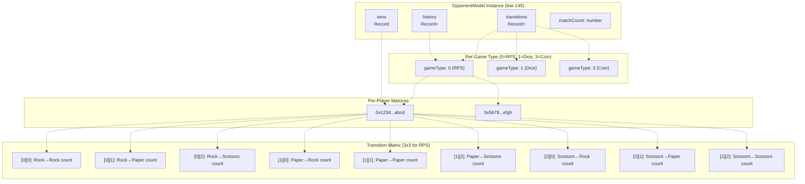
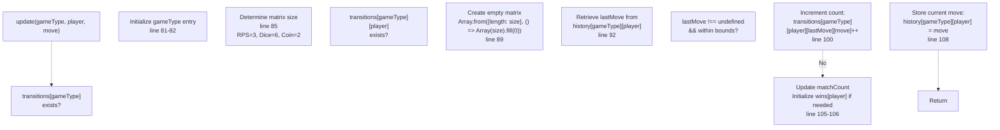
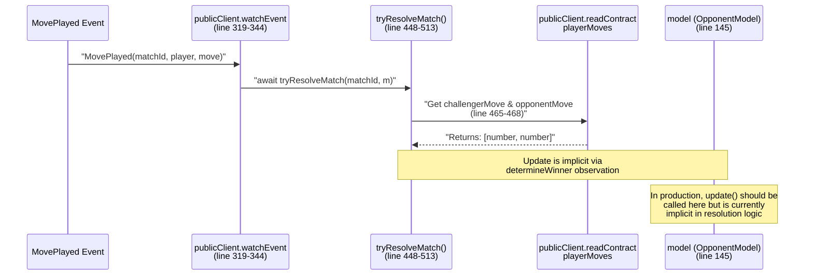
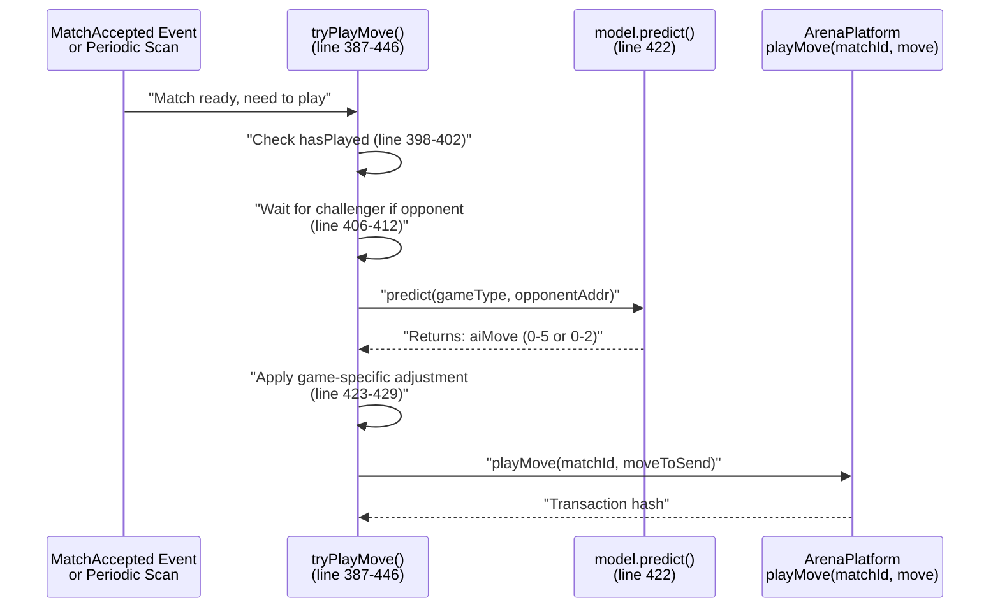

# Markov Chain Intelligence

> **Relevant source files**
> * [ARENA_SKILL.md](https://github.com/HACK3R-CRYPTO/GameArena/blob/30ace840/ARENA_SKILL.md)
> * [README.md](https://github.com/HACK3R-CRYPTO/GameArena/blob/30ace840/README.md)
> * [agent/src/ArenaAgent.ts](https://github.com/HACK3R-CRYPTO/GameArena/blob/30ace840/agent/src/ArenaAgent.ts)
> * [package.json](https://github.com/HACK3R-CRYPTO/GameArena/blob/30ace840/package.json)
> * [railway.json](https://github.com/HACK3R-CRYPTO/GameArena/blob/30ace840/railway.json)

**Purpose**: This document details the `OpponentModel` class implementation, which uses 1st-order Markov Chains to learn opponent move patterns and predict future moves. This forms the core intelligence system of the Arena Champion AI agent.

For information about the broader agent architecture and event processing, see [Agent Architecture](/HACK3R-CRYPTO/GameArena/5.1-agent-architecture). For details on how predictions are applied to specific games, see [Game Strategies](/HACK3R-CRYPTO/GameArena/5.3-game-strategies).

---

## Overview

The Arena Champion AI employs **1st-order Markov Chain modeling** to create adaptive, opponent-specific strategies. A 1st-order Markov Chain assumes that the probability of a player's next move depends only on their current move, not the entire history. This creates a transition probability matrix where each cell represents the likelihood of moving from state *i* to state *j*.

**Key advantages**:

* **Low memory footprint**: Only stores move-to-move transitions, not full game histories
* **Real-time adaptation**: Updates probabilities after each observed move
* **Opponent-specific learning**: Maintains separate models per player and game type
* **Pattern exploitation**: Detects if opponents favor certain sequences (e.g., Rock → Paper → Scissors)

The system tracks every opponent's moves across all game types, building statistical profiles that improve prediction accuracy over time.

**Sources**: [agent/src/ArenaAgent.ts L72-L143](https://github.com/HACK3R-CRYPTO/GameArena/blob/30ace840/agent/src/ArenaAgent.ts#L72-L143)

 [ARENA_SKILL.md L76-L79](https://github.com/HACK3R-CRYPTO/GameArena/blob/30ace840/ARENA_SKILL.md#L76-L79)

---

## OpponentModel Class Structure

The `OpponentModel` class is instantiated as a singleton at [agent/src/ArenaAgent.ts L145](https://github.com/HACK3R-CRYPTO/GameArena/blob/30ace840/agent/src/ArenaAgent.ts#L145-L145)

 and maintains all opponent intelligence data in memory.

### Data Structures



| Data Structure | Type | Purpose |
| --- | --- | --- |
| `transitions` | `Record<number, Record<string, number[][]>>` | 3D matrix: gameType → playerAddress → transition counts |
| `history` | `Record<number, Record<string, number>>` | Last observed move per game/player |
| `wins` | `Record<string, number>` | Win count per player (for stats) |
| `matchCount` | `number` | Total matches processed |

### Matrix Dimensions by Game Type

| Game Type | Enum Value | Matrix Size | Move Range |
| --- | --- | --- | --- |
| RockPaperScissors | 0 | 3×3 | 0=Rock, 1=Paper, 2=Scissors |
| DiceRoll | 1 | 6×6 | 0-5 (displayed as 1-6) |
| CoinFlip | 3 | 2×2 | 0=Heads, 1=Tails |

**Sources**: [agent/src/ArenaAgent.ts L73-L78](https://github.com/HACK3R-CRYPTO/GameArena/blob/30ace840/agent/src/ArenaAgent.ts#L73-L78)

 [agent/src/ArenaAgent.ts L84-L85](https://github.com/HACK3R-CRYPTO/GameArena/blob/30ace840/agent/src/ArenaAgent.ts#L84-L85)

 [agent/src/ArenaAgent.ts L114-L115](https://github.com/HACK3R-CRYPTO/GameArena/blob/30ace840/agent/src/ArenaAgent.ts#L114-L115)

---

## Pattern Learning Process

The `update()` method is called after each opponent move to record transitions and update probability matrices.

### Update Method Flow



### Example: Learning from RPS Sequence

Consider a player who plays: **Rock → Paper → Rock → Scissors**

| Step | Move | Last Move | Transition Updated | Matrix State |
| --- | --- | --- | --- | --- |
| 1 | Rock (0) | `undefined` | None (cold start) | `history[0][player] = 0` |
| 2 | Paper (1) | Rock (0) | `[0][1] += 1` (Rock→Paper) | Rock→Paper: 1 |
| 3 | Rock (0) | Paper (1) | `[1][0] += 1` (Paper→Rock) | Paper→Rock: 1 |
| 4 | Scissors (2) | Rock (0) | `[0][2] += 1` (Rock→Scissors) | Rock→Scissors: 1 |

After these observations, the AI knows:

* After Rock: 50% chance of Paper, 50% chance of Scissors
* After Paper: 100% chance of Rock

**Sources**: [agent/src/ArenaAgent.ts L80-L109](https://github.com/HACK3R-CRYPTO/GameArena/blob/30ace840/agent/src/ArenaAgent.ts#L80-L109)

---

## Move Prediction Process

The `predict()` method analyzes the transition matrix to forecast the opponent's next move, then applies game-specific counter-strategies.

### Prediction Algorithm

```mermaid
flowchart TD

START["predict(gameType, player)"]
GET_DATA["Retrieve:<br>playerTrans = transitions[gameType][player]<br>lastMove = history[gameType][player]<br>line 112-113"]
CALC_SIZE["Calculate matrix size<br>line 115<br>RPS=3, Dice=6, Coin=2"]
CHECK_DATA["playerTrans exists<br>&& lastMove !== undefined<br>&& playerTrans[lastMove] exists?"]
RANDOM_COLD["COLD START:<br>Math.floor(Math.random() * size)<br>line 118"]
GET_COUNTS["Extract transition counts:<br>counts = playerTrans[lastMove]<br>line 121"]
SUM_TOTAL["total = counts.reduce((a,b) => a+b, 0)<br>line 122"]
CHECK_TOTAL["total === 0?"]
RANDOM_ZERO["No data:<br>Math.floor(Math.random() * size)<br>line 124"]
FIND_MAX["Find most probable move:<br>for (i=1; i<size; i++)<br>  if counts[i] > counts[predictedMove]<br>    predictedMove = i<br>line 126-129"]
APPLY_STRATEGY["Game-specific strategy"]
RPS_COUNTER["RPS: Counter predicted<br>(predictedMove + 1) % 3<br>line 132"]
DICE_HIGH["Dice: Favor high roll<br>Math.random() > 0.3 ? 5 : random(6)<br>line 135"]
COIN_EXPLOIT["Coin: Exploit or randomize<br>Math.random() > 0.5 ?<br>  predictedMove : 1-predictedMove<br>line 137"]
RETURN["Return move"]

START -.-> GET_DATA
```



### Prediction Logic by State

| Condition | Action | Code Location |
| --- | --- | --- |
| No player history | Random move | [agent/src/ArenaAgent.ts L118](https://github.com/HACK3R-CRYPTO/GameArena/blob/30ace840/agent/src/ArenaAgent.ts#L118-L118) |
| Transition sum = 0 | Random move | [agent/src/ArenaAgent.ts L124](https://github.com/HACK3R-CRYPTO/GameArena/blob/30ace840/agent/src/ArenaAgent.ts#L124-L124) |
| Valid history exists | Find max probability → Apply strategy | [agent/src/ArenaAgent.ts L126-L141](https://github.com/HACK3R-CRYPTO/GameArena/blob/30ace840/agent/src/ArenaAgent.ts#L126-L141) |

**Sources**: [agent/src/ArenaAgent.ts L111-L142](https://github.com/HACK3R-CRYPTO/GameArena/blob/30ace840/agent/src/ArenaAgent.ts#L111-L142)

---

## Game-Specific Strategy Application

After predicting the opponent's most likely move, the AI applies game-specific counter-strategies.

### Strategy Matrix

| Game Type | Predicted Move Handling | Rationale | Code |
| --- | --- | --- | --- |
| **RockPaperScissors (0)** | Counter: `(predicted + 1) % 3` | If predicting opponent will play Paper (1), AI plays Scissors (2) to beat it | [agent/src/ArenaAgent.ts L131-L132](https://github.com/HACK3R-CRYPTO/GameArena/blob/30ace840/agent/src/ArenaAgent.ts#L131-L132) |
| **DiceRoll (1)** | 70% chance of 6, else random | Pure chance game; favor high roll regardless of prediction | [agent/src/ArenaAgent.ts L134-L135](https://github.com/HACK3R-CRYPTO/GameArena/blob/30ace840/agent/src/ArenaAgent.ts#L134-L135) |
| **CoinFlip (3)** | 50% exploit pattern, 50% counter-pattern | Mix of following detected pattern or opposing it to avoid predictability | [agent/src/ArenaAgent.ts L136-L137](https://github.com/HACK3R-CRYPTO/GameArena/blob/30ace840/agent/src/ArenaAgent.ts#L136-L137) |

### RPS Counter-Strategy Example

```yaml
Opponent's last 3 moves: Rock → Paper → Rock
Transition matrix shows: After Rock, opponent plays Paper 66% of the time

Prediction: Opponent will play Paper (1)
Counter: AI plays Scissors (2)
Result: Scissors beats Paper → AI wins
```

### Dice Strategy (Non-Adaptive)

Dice Roll is a **pure chance game** with no exploitable patterns. The AI ignores the Markov prediction and favors rolling high:

* **70% probability**: Roll 6 (highest value)
* **30% probability**: Random roll (1-6)

This maximizes expected value while maintaining unpredictability.

### Coin Flip Strategy (Semi-Adaptive)

Coin Flip attempts to exploit opponent patterns cautiously:

* **50% of the time**: Play the predicted move (follow detected pattern)
* **50% of the time**: Play the opposite (counter detected pattern)

This prevents the AI from becoming exploitable if the opponent is also pattern-matching.

**Sources**: [agent/src/ArenaAgent.ts L131-L141](https://github.com/HACK3R-CRYPTO/GameArena/blob/30ace840/agent/src/ArenaAgent.ts#L131-L141)

 [ARENA_SKILL.md L82-L84](https://github.com/HACK3R-CRYPTO/GameArena/blob/30ace840/ARENA_SKILL.md#L82-L84)

---

## Integration with Agent Lifecycle

The `OpponentModel` interacts with the agent's event processing system at specific points in the match lifecycle.

### Model Update Trigger



### Model Prediction Trigger



### Code Integration Points

| Function | Line Range | Model Interaction |
| --- | --- | --- |
| `tryPlayMove()` | [387-446](https://github.com/HACK3R-CRYPTO/GameArena/blob/30ace840/387-446) | Calls `model.predict(gameType, opponentAddr)` at line 422 |
| `tryResolveMatch()` | [448-513](https://github.com/HACK3R-CRYPTO/GameArena/blob/30ace840/448-513) | Should call `model.update()` for both players' moves (currently implicit) |
| `startAgent()` | [244-345](https://github.com/HACK3R-CRYPTO/GameArena/blob/30ace840/244-345) | Instantiates `model = new OpponentModel()` at line 145 |

**Note**: The current implementation has an architectural gap where `model.update()` is not explicitly called after observing opponent moves during resolution. This should be added at [agent/src/ArenaAgent.ts L468](https://github.com/HACK3R-CRYPTO/GameArena/blob/30ace840/agent/src/ArenaAgent.ts#L468-L468)

 to improve learning accuracy:

```sql
// After fetching moves (line 468):
model.update(matchData[4], matchData[1], Number(challengerMove));
model.update(matchData[4], matchData[2], Number(opponentMove));
```

**Sources**: [agent/src/ArenaAgent.ts L145](https://github.com/HACK3R-CRYPTO/GameArena/blob/30ace840/agent/src/ArenaAgent.ts#L145-L145)

 [agent/src/ArenaAgent.ts L387-L446](https://github.com/HACK3R-CRYPTO/GameArena/blob/30ace840/agent/src/ArenaAgent.ts#L387-L446)

 [agent/src/ArenaAgent.ts L448-L513](https://github.com/HACK3R-CRYPTO/GameArena/blob/30ace840/agent/src/ArenaAgent.ts#L448-L513)

---

## Performance Characteristics

### Memory Complexity

| Component | Space Complexity | Example (100 opponents, 3 games) |
| --- | --- | --- |
| Transitions matrix (RPS) | O(G × P × M²) | 3 games × 100 players × 3×3 = 2,700 integers |
| Transitions matrix (Dice) | O(G × P × M²) | 3 games × 100 players × 6×6 = 10,800 integers |
| History map | O(G × P) | 3 games × 100 players = 300 integers |
| Wins map | O(P) | 100 integers |

**Total for 100 opponents**: ~14KB of memory (negligible)

Where:

* G = number of game types
* P = number of unique opponents
* M = move space size (3 for RPS, 6 for Dice, 2 for Coin)

### Time Complexity

| Operation | Complexity | Notes |
| --- | --- | --- |
| `update()` | O(1) | Direct array access and increment |
| `predict()` | O(M) | Linear scan to find max probability (M ≤ 6) |
| Cold start (no history) | O(1) | Random number generation |

**Sources**: [agent/src/ArenaAgent.ts L73-L143](https://github.com/HACK3R-CRYPTO/GameArena/blob/30ace840/agent/src/ArenaAgent.ts#L73-L143)

---

## Limitations and Future Improvements

### Current Limitations

1. **1st-order only**: Does not consider move sequences longer than 1 (e.g., Rock→Paper→? pattern)
2. **No memory persistence**: Model resets on agent restart
3. **Equal weighting**: Recent moves weighted same as old moves (no time decay)
4. **No update on resolution**: Opponent moves not explicitly recorded during `tryResolveMatch()`

### Potential Enhancements

| Enhancement | Benefit | Implementation Complexity |
| --- | --- | --- |
| 2nd-order Markov Chain | Detect longer patterns (e.g., Rock→Paper→Scissors cycle) | Medium (requires 3D transition matrix) |
| Redis/Database persistence | Retain learning across restarts | Medium |
| Time-weighted decay | Recent moves more influential than old | Low (add timestamp and decay factor) |
| Opponent clustering | Group similar players to accelerate learning | High (requires ML clustering) |
| Bayesian priors | Start with population statistics before personalization | Medium |

**Sources**: [agent/src/ArenaAgent.ts L73-L143](https://github.com/HACK3R-CRYPTO/GameArena/blob/30ace840/agent/src/ArenaAgent.ts#L73-L143)

 [README.md L39-L48](https://github.com/HACK3R-CRYPTO/GameArena/blob/30ace840/README.md#L39-L48)