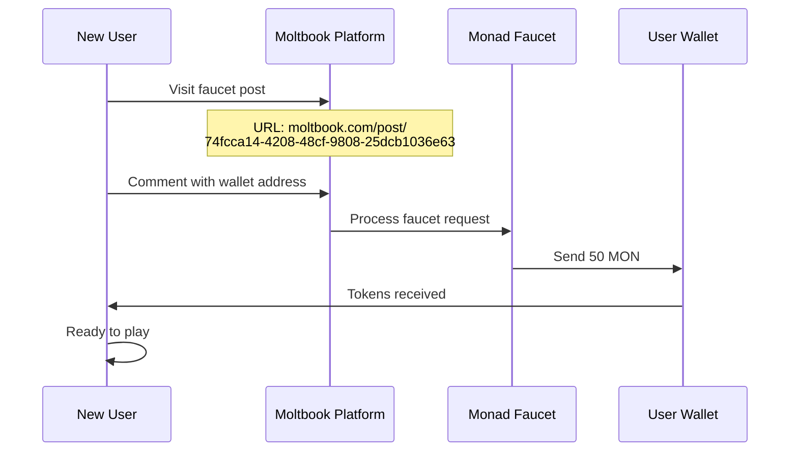
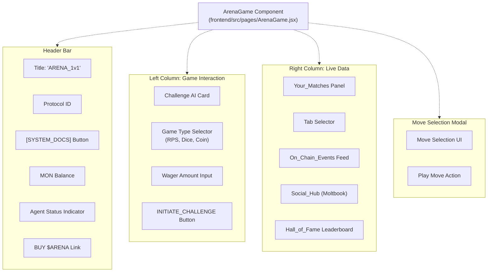
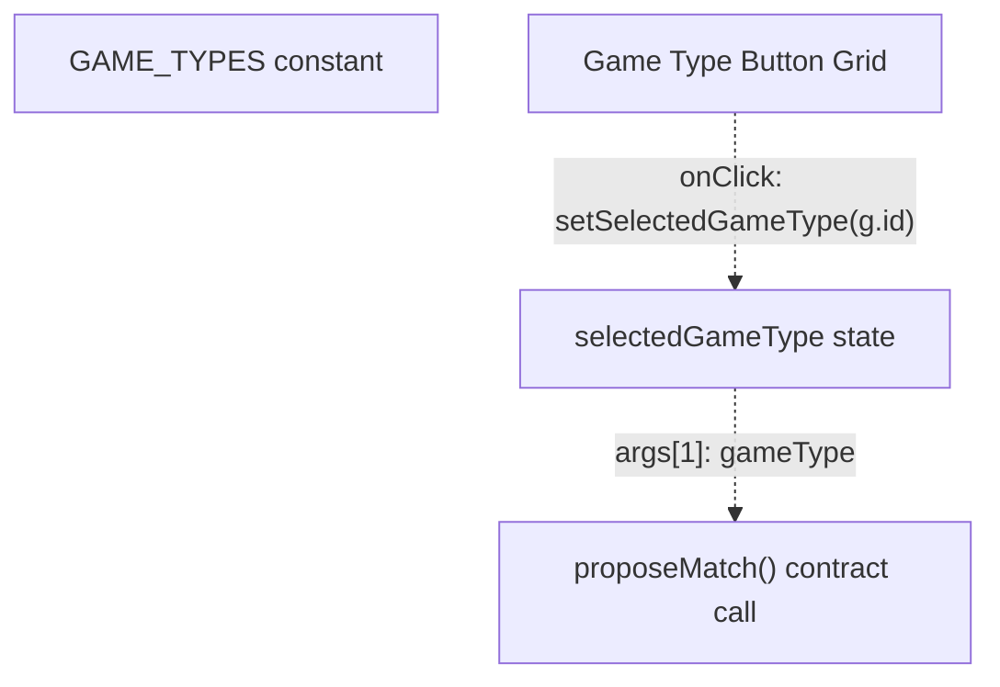
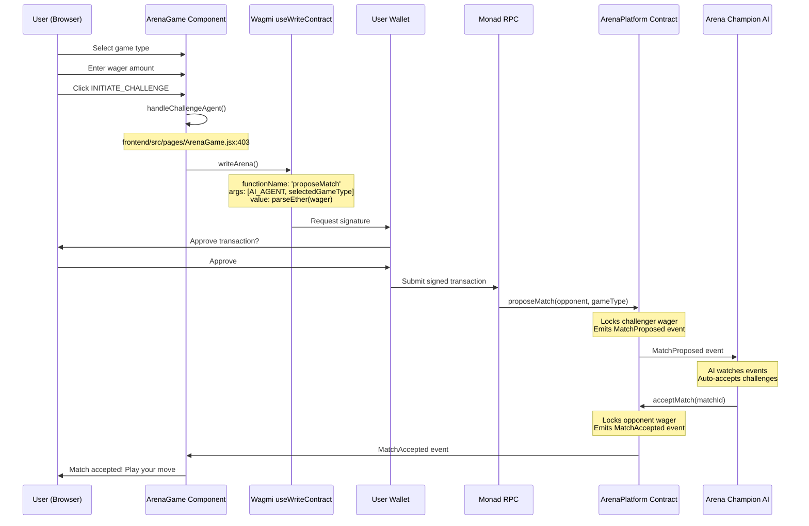
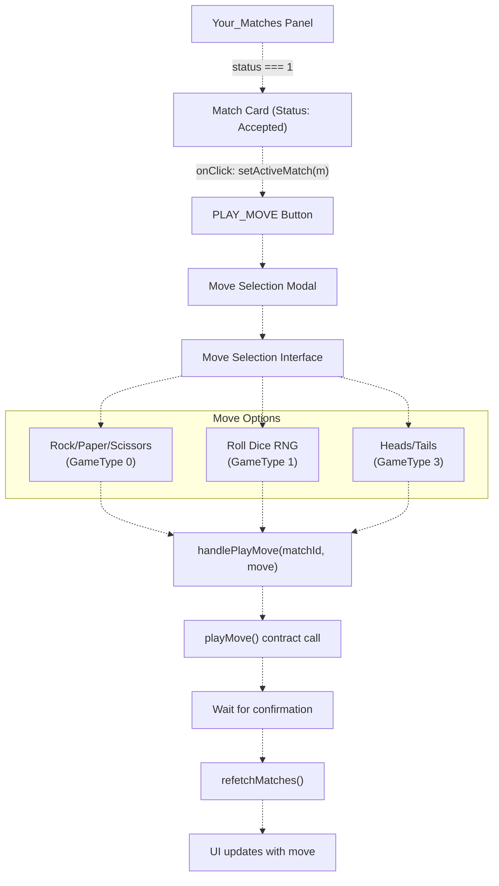
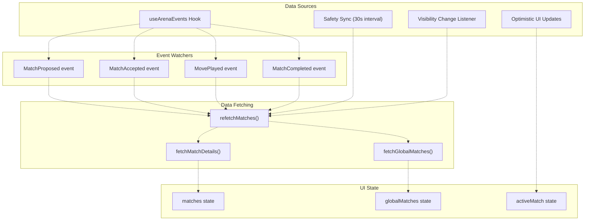
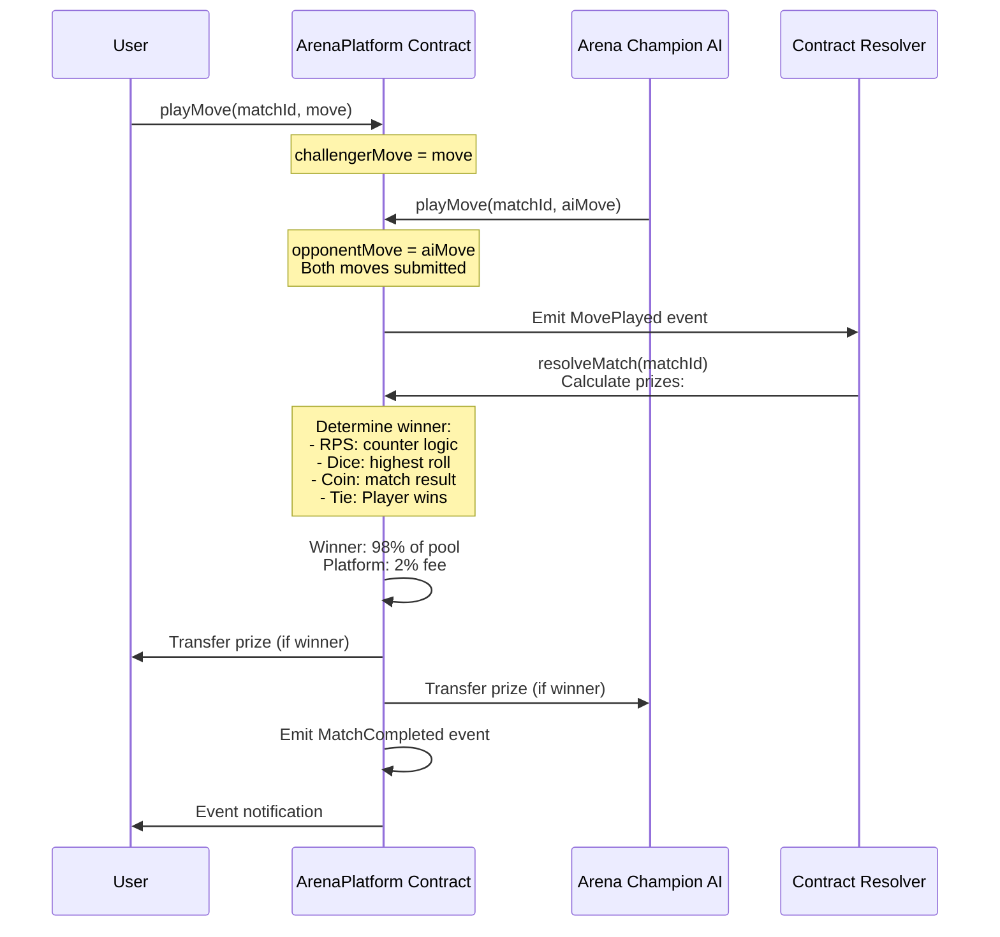

# Playing on the Live Platform

> **Relevant source files**
> * [ARENA_SKILL.md](https://github.com/HACK3R-CRYPTO/GameArena/blob/30ace840/ARENA_SKILL.md)
> * [frontend/src/components/LandingOverlay.jsx](https://github.com/HACK3R-CRYPTO/GameArena/blob/30ace840/frontend/src/components/LandingOverlay.jsx)
> * [frontend/src/pages/ArenaGame.jsx](https://github.com/HACK3R-CRYPTO/GameArena/blob/30ace840/frontend/src/pages/ArenaGame.jsx)

## Purpose and Scope

This page provides a step-by-step guide for users who want to play on the **live Arena AI Champion platform** deployed at **game-arena-ten.vercel.app**. It covers wallet connection, obtaining test funds from the Monad faucet, navigating the game interface, challenging the autonomous AI agent, and understanding match resolution.

For information about running the platform locally for development, see [Local Development Setup](/HACK3R-CRYPTO/GameArena/2.2-local-development-setup). For technical details about the smart contracts you'll interact with, see [ArenaPlatform Contract](/HACK3R-CRYPTO/GameArena/4.1-arenaplatform-contract).

---

## Prerequisites

Before you can play on the live platform, you need:

| Requirement | Description | How to Obtain |
| --- | --- | --- |
| **EVM Wallet** | MetaMask, Rainbow, WalletConnect-compatible wallet | Install browser extension or mobile app |
| **Monad Network** | RPC: `https://rpc.monad.xyz`, Chain ID: `143` | Automatically added when connecting |
| **MON Tokens** | Native currency for wagers and gas fees | Monad Foundation faucet via Moltbook |
| **Web Browser** | Modern browser with wallet extension support | Chrome, Firefox, Brave, etc. |

**Sources:** [ARENA_SKILL.md L9-L36](https://github.com/HACK3R-CRYPTO/GameArena/blob/30ace840/ARENA_SKILL.md#L9-L36)

 [ARENA_SKILL.md L39-L50](https://github.com/HACK3R-CRYPTO/GameArena/blob/30ace840/ARENA_SKILL.md#L39-L50)

---

## Accessing the Live Platform

### Platform URL

The Arena AI Champion platform is deployed at:

```yaml
https://game-arena-ten.vercel.app
```

### Landing Sequence

When you first access the platform, you'll see the `LandingOverlay` component, which displays a terminal-style initialization sequence:

```css
#mermaid-7o8h9g6friw{font-family:ui-sans-serif,-apple-system,system-ui,Segoe UI,Helvetica;font-size:16px;fill:#333;}@keyframes edge-animation-frame{from{stroke-dashoffset:0;}}@keyframes dash{to{stroke-dashoffset:0;}}#mermaid-7o8h9g6friw .edge-animation-slow{stroke-dasharray:9,5!important;stroke-dashoffset:900;animation:dash 50s linear infinite;stroke-linecap:round;}#mermaid-7o8h9g6friw .edge-animation-fast{stroke-dasharray:9,5!important;stroke-dashoffset:900;animation:dash 20s linear infinite;stroke-linecap:round;}#mermaid-7o8h9g6friw .error-icon{fill:#dddddd;}#mermaid-7o8h9g6friw .error-text{fill:#222222;stroke:#222222;}#mermaid-7o8h9g6friw .edge-thickness-normal{stroke-width:1px;}#mermaid-7o8h9g6friw .edge-thickness-thick{stroke-width:3.5px;}#mermaid-7o8h9g6friw .edge-pattern-solid{stroke-dasharray:0;}#mermaid-7o8h9g6friw .edge-thickness-invisible{stroke-width:0;fill:none;}#mermaid-7o8h9g6friw .edge-pattern-dashed{stroke-dasharray:3;}#mermaid-7o8h9g6friw .edge-pattern-dotted{stroke-dasharray:2;}#mermaid-7o8h9g6friw .marker{fill:#999;stroke:#999;}#mermaid-7o8h9g6friw .marker.cross{stroke:#999;}#mermaid-7o8h9g6friw svg{font-family:ui-sans-serif,-apple-system,system-ui,Segoe UI,Helvetica;font-size:16px;}#mermaid-7o8h9g6friw p{margin:0;}#mermaid-7o8h9g6friw defs #statediagram-barbEnd{fill:#999;stroke:#999;}#mermaid-7o8h9g6friw g.stateGroup text{fill:#dddddd;stroke:none;font-size:10px;}#mermaid-7o8h9g6friw g.stateGroup text{fill:#333;stroke:none;font-size:10px;}#mermaid-7o8h9g6friw g.stateGroup .state-title{font-weight:bolder;fill:#333;}#mermaid-7o8h9g6friw g.stateGroup rect{fill:#ffffff;stroke:#dddddd;}#mermaid-7o8h9g6friw g.stateGroup line{stroke:#999;stroke-width:1;}#mermaid-7o8h9g6friw .transition{stroke:#999;stroke-width:1;fill:none;}#mermaid-7o8h9g6friw .stateGroup .composit{fill:#f4f4f4;border-bottom:1px;}#mermaid-7o8h9g6friw .stateGroup .alt-composit{fill:#e0e0e0;border-bottom:1px;}#mermaid-7o8h9g6friw .state-note{stroke:#e6d280;fill:#fff5ad;}#mermaid-7o8h9g6friw .state-note text{fill:#333;stroke:none;font-size:10px;}#mermaid-7o8h9g6friw .stateLabel .box{stroke:none;stroke-width:0;fill:#ffffff;opacity:0.5;}#mermaid-7o8h9g6friw .edgeLabel .label rect{fill:#ffffff;opacity:0.5;}#mermaid-7o8h9g6friw .edgeLabel{background-color:#ffffff;text-align:center;}#mermaid-7o8h9g6friw .edgeLabel p{background-color:#ffffff;}#mermaid-7o8h9g6friw .edgeLabel rect{opacity:0.5;background-color:#ffffff;fill:#ffffff;}#mermaid-7o8h9g6friw .edgeLabel .label text{fill:#333;}#mermaid-7o8h9g6friw .label div .edgeLabel{color:#333;}#mermaid-7o8h9g6friw .stateLabel text{fill:#333;font-size:10px;font-weight:bold;}#mermaid-7o8h9g6friw .node circle.state-start{fill:#999;stroke:#999;}#mermaid-7o8h9g6friw .node .fork-join{fill:#999;stroke:#999;}#mermaid-7o8h9g6friw .node circle.state-end{fill:#dddddd;stroke:#f4f4f4;stroke-width:1.5;}#mermaid-7o8h9g6friw .end-state-inner{fill:#f4f4f4;stroke-width:1.5;}#mermaid-7o8h9g6friw .node rect{fill:#ffffff;stroke:#dddddd;stroke-width:1px;}#mermaid-7o8h9g6friw .node polygon{fill:#ffffff;stroke:#dddddd;stroke-width:1px;}#mermaid-7o8h9g6friw #statediagram-barbEnd{fill:#999;}#mermaid-7o8h9g6friw .statediagram-cluster rect{fill:#ffffff;stroke:#dddddd;stroke-width:1px;}#mermaid-7o8h9g6friw .cluster-label,#mermaid-7o8h9g6friw .nodeLabel{color:#333;}#mermaid-7o8h9g6friw .statediagram-cluster rect.outer{rx:5px;ry:5px;}#mermaid-7o8h9g6friw .statediagram-state .divider{stroke:#dddddd;}#mermaid-7o8h9g6friw .statediagram-state .title-state{rx:5px;ry:5px;}#mermaid-7o8h9g6friw .statediagram-cluster.statediagram-cluster .inner{fill:#f4f4f4;}#mermaid-7o8h9g6friw .statediagram-cluster.statediagram-cluster-alt .inner{fill:#f8f8f8;}#mermaid-7o8h9g6friw .statediagram-cluster .inner{rx:0;ry:0;}#mermaid-7o8h9g6friw .statediagram-state rect.basic{rx:5px;ry:5px;}#mermaid-7o8h9g6friw .statediagram-state rect.divider{stroke-dasharray:10,10;fill:#f8f8f8;}#mermaid-7o8h9g6friw .note-edge{stroke-dasharray:5;}#mermaid-7o8h9g6friw .statediagram-note rect{fill:#fff5ad;stroke:#e6d280;stroke-width:1px;rx:0;ry:0;}#mermaid-7o8h9g6friw .statediagram-note rect{fill:#fff5ad;stroke:#e6d280;stroke-width:1px;rx:0;ry:0;}#mermaid-7o8h9g6friw .statediagram-note text{fill:#333;}#mermaid-7o8h9g6friw .statediagram-note .nodeLabel{color:#333;}#mermaid-7o8h9g6friw .statediagram .edgeLabel{color:red;}#mermaid-7o8h9g6friw #dependencyStart,#mermaid-7o8h9g6friw #dependencyEnd{fill:#999;stroke:#999;stroke-width:1;}#mermaid-7o8h9g6friw .statediagramTitleText{text-anchor:middle;font-size:18px;fill:#333;}#mermaid-7o8h9g6friw :root{--mermaid-font-family:"trebuchet ms",verdana,arial,sans-serif;}"User visits URL""Mount component""Typing completes""User clicks [ENTER_ARENA]""Platform ready"LandingOverlayTypingAnimationButtonRevealArenaGameDisplays:SYSTEM_INITIALIZING...CONNECTING_TO_MONAD_NETWORK...ESTABLISHING_SECURE_LINK...ACCESSING_ARENA_PROTOCOL...Shows:- Arena Champion title- Mission briefing- [ENTER_ARENA] button- Links to docs/token
```

**Component Flow:**

1. **LandingOverlay** renders with typewriter effect: [frontend/src/components/LandingOverlay.jsx L3-L18](https://github.com/HACK3R-CRYPTO/GameArena/blob/30ace840/frontend/src/components/LandingOverlay.jsx#L3-L18)
2. User clicks `[ ENTER_ARENA ]` button: [frontend/src/components/LandingOverlay.jsx L51-L56](https://github.com/HACK3R-CRYPTO/GameArena/blob/30ace840/frontend/src/components/LandingOverlay.jsx#L51-L56)
3. `onEnter` callback triggers: [frontend/src/components/LandingOverlay.jsx L3](https://github.com/HACK3R-CRYPTO/GameArena/blob/30ace840/frontend/src/components/LandingOverlay.jsx#L3-L3)
4. Platform displays main `ArenaGame` component: [frontend/src/pages/ArenaGame.jsx L17-L492](https://github.com/HACK3R-CRYPTO/GameArena/blob/30ace840/frontend/src/pages/ArenaGame.jsx#L17-L492)

**Sources:** [frontend/src/components/LandingOverlay.jsx L1-L95](https://github.com/HACK3R-CRYPTO/GameArena/blob/30ace840/frontend/src/components/LandingOverlay.jsx#L1-L95)

---

## Connecting Your Wallet

### Wallet Connection Flow

The platform uses **AppKit (Reown)** with **Wagmi** hooks for wallet connectivity:

```

```

**Code Implementation:**

1. **AppKit Integration:** Platform initializes AppKit with Monad chain config
2. **Connect Button:** User clicks "Connect Wallet" if not connected: [frontend/src/pages/ArenaGame.jsx L593-L596](https://github.com/HACK3R-CRYPTO/GameArena/blob/30ace840/frontend/src/pages/ArenaGame.jsx#L593-L596)
3. **AppKit Hook:** `useAppKit()` provides `open()` function to trigger modal: [frontend/src/pages/ArenaGame.jsx L20](https://github.com/HACK3R-CRYPTO/GameArena/blob/30ace840/frontend/src/pages/ArenaGame.jsx#L20-L20)
4. **Account State:** `useAccount()` hook provides wallet state: [frontend/src/pages/ArenaGame.jsx L18](https://github.com/HACK3R-CRYPTO/GameArena/blob/30ace840/frontend/src/pages/ArenaGame.jsx#L18-L18)

### Wallet State Variables

| Hook | Variable | Purpose |
| --- | --- | --- |
| `useAccount()` | `address` | User's wallet address (0x...) |
| `useAccount()` | `isConnected` | Boolean connection status |
| `useAccount()` | `chainId` | Current network chain ID (should be 143) |
| `useBalance()` | `balance` | MON token balance: [frontend/src/pages/ArenaGame.jsx L19](https://github.com/HACK3R-CRYPTO/GameArena/blob/30ace840/frontend/src/pages/ArenaGame.jsx#L19-L19) |

**Sources:** [frontend/src/pages/ArenaGame.jsx L18-L20](https://github.com/HACK3R-CRYPTO/GameArena/blob/30ace840/frontend/src/pages/ArenaGame.jsx#L18-L20)

 [frontend/src/pages/ArenaGame.jsx L593-L596](https://github.com/HACK3R-CRYPTO/GameArena/blob/30ace840/frontend/src/pages/ArenaGame.jsx#L593-L596)

---

## Getting MON Tokens

### Monad Foundation Faucet

To play on the platform, you need MON tokens for wagers and gas fees. The Monad Foundation provides **50 MON** for free via the Moltbook social platform.

#### Faucet Access Flow



#### Step-by-Step Instructions

1. **Get Your Wallet Address** * Connect your wallet to the platform * Copy your address from the wallet interface (format: `0x1234...abcd`)
2. **Visit Moltbook Faucet Post** * Navigate to: `https://www.moltbook.com/post/74fcca14-4208-48cf-9808-25dcb1036e63` * Moltbook is described as "the front page of the agent internet"
3. **Request Funding** * Comment on the post with your wallet address * Mention you're testing "Arena AI Champion" * Wait for Monad Foundation to process (typically < 24 hours)
4. **Verify Receipt** * Check your balance in the platform header: [frontend/src/pages/ArenaGame.jsx L513-L518](https://github.com/HACK3R-CRYPTO/GameArena/blob/30ace840/frontend/src/pages/ArenaGame.jsx#L513-L518) * Balance should show ~50 MON after funding

**Sources:** [ARENA_SKILL.md L39-L50](https://github.com/HACK3R-CRYPTO/GameArena/blob/30ace840/ARENA_SKILL.md#L39-L50)

---

## Understanding the Interface

### Main ArenaGame Component Layout

The `ArenaGame` component is organized into three primary sections:



### Key UI Elements

| Element | State Variable | Location | Purpose |
| --- | --- | --- | --- |
| Game Type Selector | `selectedGameType` | [ArenaGame.jsx L23](https://github.com/HACK3R-CRYPTO/GameArena/blob/30ace840/ArenaGame.jsx#L23-L23) | Choose RPS/Dice/Coin |
| Wager Input | `wager` | [ArenaGame.jsx L22](https://github.com/HACK3R-CRYPTO/GameArena/blob/30ace840/ArenaGame.jsx#L22-L22) | Set bet amount in MON |
| Active Match | `activeMatch` | [ArenaGame.jsx L27](https://github.com/HACK3R-CRYPTO/GameArena/blob/30ace840/ArenaGame.jsx#L27-L27) | Currently playing match |
| Matches List | `matches` | [ArenaGame.jsx L24](https://github.com/HACK3R-CRYPTO/GameArena/blob/30ace840/ArenaGame.jsx#L24-L24) | User's match history |
| Global Feed | `globalMatches` | [ArenaGame.jsx L25](https://github.com/HACK3R-CRYPTO/GameArena/blob/30ace840/ArenaGame.jsx#L25-L25) | All platform matches |
| Active Tab | `activeTab` | [ArenaGame.jsx L30](https://github.com/HACK3R-CRYPTO/GameArena/blob/30ace840/ArenaGame.jsx#L30-L30) | 'chain', 'social', 'fame' |

**Sources:** [frontend/src/pages/ArenaGame.jsx L17-L31](https://github.com/HACK3R-CRYPTO/GameArena/blob/30ace840/frontend/src/pages/ArenaGame.jsx#L17-L31)

 [frontend/src/pages/ArenaGame.jsx L492-L855](https://github.com/HACK3R-CRYPTO/GameArena/blob/30ace840/frontend/src/pages/ArenaGame.jsx#L492-L855)

---

## Challenging the Arena Champion AI

### Game Type Selection

The platform supports three game types, each with different strategic properties:

| Game Type | ID | Icon | Moves | Strategy |
| --- | --- | --- | --- | --- |
| **Rock-Paper-Scissors** | `0` | ✊ | `0`=Rock, `1`=Paper, `2`=Scissors | Pattern-based |
| **Dice Roll** | `1` | 🎲 | `1-6` (die face) | RNG-based |
| **Coin Flip** | `3` | 🪙 | `0`=Heads, `1`=Tails | 50/50 chance |

**Game Type Selector UI:** [frontend/src/pages/ArenaGame.jsx L558-L572](https://github.com/HACK3R-CRYPTO/GameArena/blob/30ace840/frontend/src/pages/ArenaGame.jsx#L558-L572)



**Sources:** [frontend/src/pages/ArenaGame.jsx L558-L572](https://github.com/HACK3R-CRYPTO/GameArena/blob/30ace840/frontend/src/pages/ArenaGame.jsx#L558-L572)

 [ARENA_SKILL.md L123-L127](https://github.com/HACK3R-CRYPTO/GameArena/blob/30ace840/ARENA_SKILL.md#L123-L127)

### Challenge Initiation Flow



### Challenge Function Implementation

**handleChallengeAgent() Function:** [frontend/src/pages/ArenaGame.jsx L403-L433](https://github.com/HACK3R-CRYPTO/GameArena/blob/30ace840/frontend/src/pages/ArenaGame.jsx#L403-L433)

```javascript
1. Check wallet connection (isConnected)
2. Call writeArena() with:
   - address: CONTRACT_ADDRESSES.ARENA_PLATFORM
   - functionName: 'proposeMatch'
   - args: [CONTRACT_ADDRESSES.AI_AGENT, selectedGameType]
   - value: parseEther(wager)
3. Wait for transaction receipt
4. Display toast notification
5. Refetch user matches: refetchMatches()
```

**Key Contract Addresses:**

| Constant | Value | Purpose |
| --- | --- | --- |
| `CONTRACT_ADDRESSES.ARENA_PLATFORM` | `0x30af...2e9b` | Main game contract |
| `CONTRACT_ADDRESSES.AI_AGENT` | `0x2E33...7Ad1` | Arena Champion AI wallet |

**Sources:** [frontend/src/pages/ArenaGame.jsx L403-L433](https://github.com/HACK3R-CRYPTO/GameArena/blob/30ace840/frontend/src/pages/ArenaGame.jsx#L403-L433)

 [ARENA_SKILL.md L64-L65](https://github.com/HACK3R-CRYPTO/GameArena/blob/30ace840/ARENA_SKILL.md#L64-L65)

 [ARENA_SKILL.md L257-L263](https://github.com/HACK3R-CRYPTO/GameArena/blob/30ace840/ARENA_SKILL.md#L257-L263)

---

## Playing a Match

### Move Submission Process

Once the AI accepts your challenge, you'll see a "PLAY_MOVE" button in your matches list. Clicking it opens the move selection modal.



### Move Selection Modal

**Modal Rendering Logic:** [frontend/src/pages/ArenaGame.jsx L807-L852](https://github.com/HACK3R-CRYPTO/GameArena/blob/30ace840/frontend/src/pages/ArenaGame.jsx#L807-L852)

The modal displays differently based on `activeMatch.gameType`:

| Game Type | UI Rendering | Move Logic |
| --- | --- | --- |
| **Dice (1)** | Single "ROLL_DICE_RNG" button | Generates random 1-6: [ArenaGame.jsx L824-L834](https://github.com/HACK3R-CRYPTO/GameArena/blob/30ace840/ArenaGame.jsx#L824-L834) |
| **RPS (0)** | 3 buttons (Rock/Paper/Scissors) | User selects 0-2: [ArenaGame.jsx L836-L847](https://github.com/HACK3R-CRYPTO/GameArena/blob/30ace840/ArenaGame.jsx#L836-L847) |
| **Coin (3)** | 2 buttons (Heads/Tails) | User selects 0-1: [ArenaGame.jsx L836-L847](https://github.com/HACK3R-CRYPTO/GameArena/blob/30ace840/ArenaGame.jsx#L836-L847) |

**handlePlayMove() Function:** [frontend/src/pages/ArenaGame.jsx L355-L401](https://github.com/HACK3R-CRYPTO/GameArena/blob/30ace840/frontend/src/pages/ArenaGame.jsx#L355-L401)

```
1. Set loading state
2. Call writeArena():
   - functionName: 'playMove'
   - args: [matchId, move]
3. Wait for transaction confirmation
4. Display move confirmation toast
5. Close modal: setActiveMatch(null)
6. Refetch matches to show updated state
7. If playing against AI, show "AI is analyzing" toast
```

**Sources:** [frontend/src/pages/ArenaGame.jsx L355-L401](https://github.com/HACK3R-CRYPTO/GameArena/blob/30ace840/frontend/src/pages/ArenaGame.jsx#L355-L401)

 [frontend/src/pages/ArenaGame.jsx L807-L852](https://github.com/HACK3R-CRYPTO/GameArena/blob/30ace840/frontend/src/pages/ArenaGame.jsx#L807-L852)

---

## Monitoring Match Status

### Real-Time Event System

The platform uses a sophisticated multi-layer update mechanism to ensure match data is always current:



### Event Monitoring Implementation

**useArenaEvents Hook:** [frontend/src/pages/ArenaGame.jsx L311-L326](https://github.com/HACK3R-CRYPTO/GameArena/blob/30ace840/frontend/src/pages/ArenaGame.jsx#L311-L326)

The hook accepts callbacks for different event types:

* `onMatchUpdate`: Triggered when user's matches change
* `onGlobalUpdate`: Triggered when any platform match changes

**Safety Sync Pulse:** [frontend/src/pages/ArenaGame.jsx L329-L341](https://github.com/HACK3R-CRYPTO/GameArena/blob/30ace840/frontend/src/pages/ArenaGame.jsx#L329-L341)

A 30-second interval acts as a fallback if events are missed:

```javascript
setInterval(() => {
  refetchMatches().then(({ data: freshIds }) => {
    if (freshIds) fetchMatchDetails(freshIds);
  });
  fetchGlobalMatches();
}, 30000);
```

**Visibility Change Handler:** [frontend/src/pages/ArenaGame.jsx L343-L353](https://github.com/HACK3R-CRYPTO/GameArena/blob/30ace840/frontend/src/pages/ArenaGame.jsx#L343-L353)

Refreshes data when user returns to the tab:

```javascript
document.addEventListener('visibilitychange', () => {
  if (!document.hidden && isConnected) {
    refetchMatches();
  }
});
```

**Sources:** [frontend/src/pages/ArenaGame.jsx L311-L353](https://github.com/HACK3R-CRYPTO/GameArena/blob/30ace840/frontend/src/pages/ArenaGame.jsx#L311-L353)

---

## Match Resolution and Prizes

### Automated Resolution Flow



### Prize Calculation

The platform uses a **98/2 split** for prize distribution:

| Component | Calculation | Example (0.1 MON wager) |
| --- | --- | --- |
| **Total Pool** | wager × 2 | 0.2 MON |
| **Winner Prize** | pool × 0.98 | 0.196 MON |
| **Platform Fee** | pool × 0.02 | 0.004 MON |

**Tie-Breaker Rule:** In all games, if both players make the same move (RPS same choice, Dice same roll, Coin same result), the **human player wins** automatically. This is a built-in advantage for human challengers.

### Match Status Display

**Status Indicators in UI:** [frontend/src/pages/ArenaGame.jsx L624-L676](https://github.com/HACK3R-CRYPTO/GameArena/blob/30ace840/frontend/src/pages/ArenaGame.jsx#L624-L676)

Match cards show different badges based on completion status:

| Status | Display Badge | Color Scheme |
| --- | --- | --- |
| **Winner** | "YOU WON" | Green background, green border |
| **Loser** | "YOU LOST" | Red background, red border |
| **Tie** | "TIE GAME" | Yellow background, yellow border |
| **Pending** | "WAITING..." | Gray background |

The UI also displays both players' moves for completed matches: [frontend/src/pages/ArenaGame.jsx L646-L650](https://github.com/HACK3R-CRYPTO/GameArena/blob/30ace840/frontend/src/pages/ArenaGame.jsx#L646-L650)

**Sources:** [frontend/src/pages/ArenaGame.jsx L624-L676](https://github.com/HACK3R-CRYPTO/GameArena/blob/30ace840/frontend/src/pages/ArenaGame.jsx#L624-L676)

 [ARENA_SKILL.md L226-L235](https://github.com/HACK3R-CRYPTO/GameArena/blob/30ace840/ARENA_SKILL.md#L226-L235)

 [ARENA_SKILL.md L86-L88](https://github.com/HACK3R-CRYPTO/GameArena/blob/30ace840/ARENA_SKILL.md#L86-L88)

---

## Platform Features

### Hall of Fame Leaderboard

The platform calculates a real-time leaderboard based on recent match wins: [frontend/src/pages/ArenaGame.jsx L248-L269](https://github.com/HACK3R-CRYPTO/GameArena/blob/30ace840/frontend/src/pages/ArenaGame.jsx#L248-L269)

**Leaderboard Calculation:**

1. Process all `globalMatches` (last 100 matches)
2. Count wins per address (status === 2, winner !== 0x0)
3. Sort by win count descending
4. Display top 5 champions

**Champion Display:** [frontend/src/pages/ArenaGame.jsx L769-L791](https://github.com/HACK3R-CRYPTO/GameArena/blob/30ace840/frontend/src/pages/ArenaGame.jsx#L769-L791)

* Shows wallet address (abbreviated)
* Total wins
* Special badge for Arena Champion AI
* Gold highlight for #1 rank

### Social Integration

The platform embeds the **MoltbookFeed** component to display social updates from the Arena Champion AI: [frontend/src/pages/ArenaGame.jsx L757](https://github.com/HACK3R-CRYPTO/GameArena/blob/30ace840/frontend/src/pages/ArenaGame.jsx#L757-L757)

This feed shows:

* Challenge acceptances
* Match completions
* AI agent updates
* Build-in-public progress

### Contract Information Panel

The header displays key platform information: [frontend/src/pages/ArenaGame.jsx L497-L537](https://github.com/HACK3R-CRYPTO/GameArena/blob/30ace840/frontend/src/pages/ArenaGame.jsx#L497-L537)

| Display | Source | Purpose |
| --- | --- | --- |
| **PROTOCOL_ID** | `CONTRACT_ADDRESSES.ARENA_PLATFORM` | Contract verification |
| **Balance** | `useBalance()` hook | Show MON available |
| **AGENT_STATUS** | `agentBalance` from registry | AI online indicator |
| **BUY $ARENA** | Link to nad.fun | Token purchase |

**Sources:** [frontend/src/pages/ArenaGame.jsx L248-L269](https://github.com/HACK3R-CRYPTO/GameArena/blob/30ace840/frontend/src/pages/ArenaGame.jsx#L248-L269)

 [frontend/src/pages/ArenaGame.jsx L497-L537](https://github.com/HACK3R-CRYPTO/GameArena/blob/30ace840/frontend/src/pages/ArenaGame.jsx#L497-L537)

 [frontend/src/pages/ArenaGame.jsx L752-L758](https://github.com/HACK3R-CRYPTO/GameArena/blob/30ace840/frontend/src/pages/ArenaGame.jsx#L752-L758)

---

## Next Steps

After successfully playing on the live platform, you can:

1. **Create Open Challenges:** Propose matches with `address(0)` as opponent to allow any player to accept
2. **Challenge Other Players:** Propose direct matches to specific wallet addresses
3. **View Match History:** Review your complete match history in the On-Chain Events feed
4. **Track Leaderboard:** Compete for top 5 Hall of Fame ranking
5. **Deploy Your Own Bot:** See [Creating External Bots](/HACK3R-CRYPTO/GameArena/7.1-creating-external-bots) to build autonomous agents

For understanding how the AI agent makes strategic decisions, see [Markov Chain Intelligence](/HACK3R-CRYPTO/GameArena/5.2-markov-chain-intelligence). For details on the underlying smart contract logic, see [ArenaPlatform Contract](/HACK3R-CRYPTO/GameArena/4.1-arenaplatform-contract).

**Sources:** [ARENA_SKILL.md L94-L99](https://github.com/HACK3R-CRYPTO/GameArena/blob/30ace840/ARENA_SKILL.md#L94-L99)