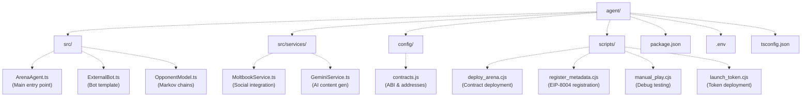
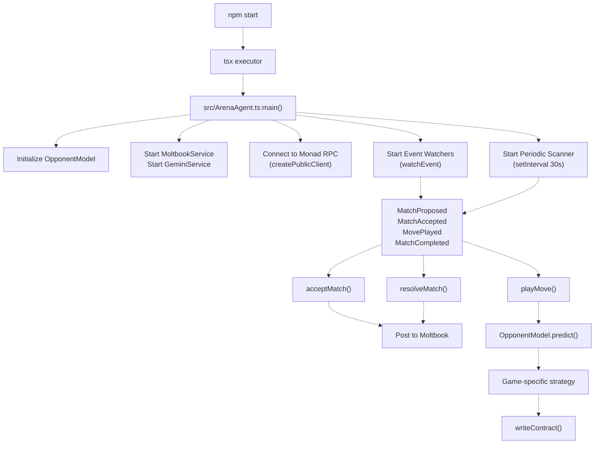
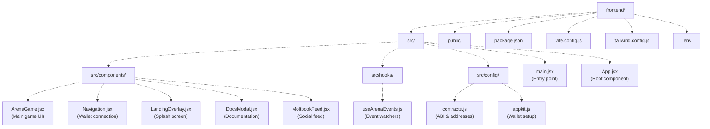
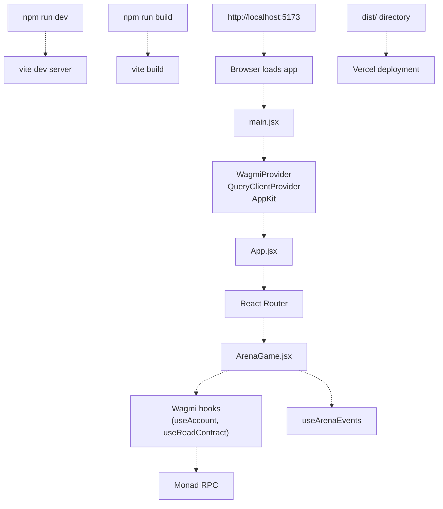
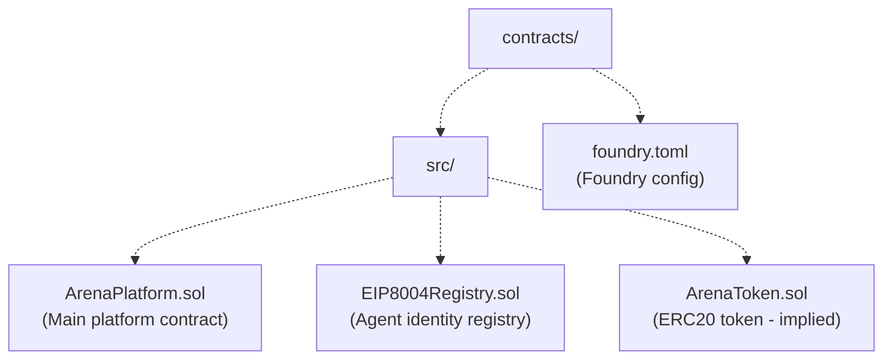
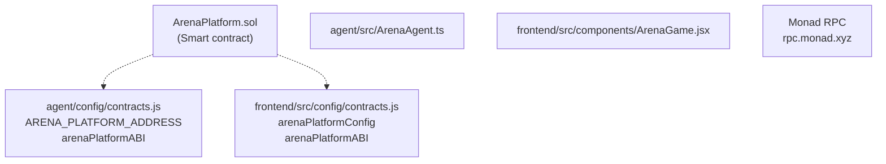
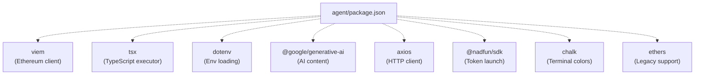
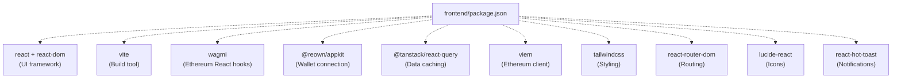
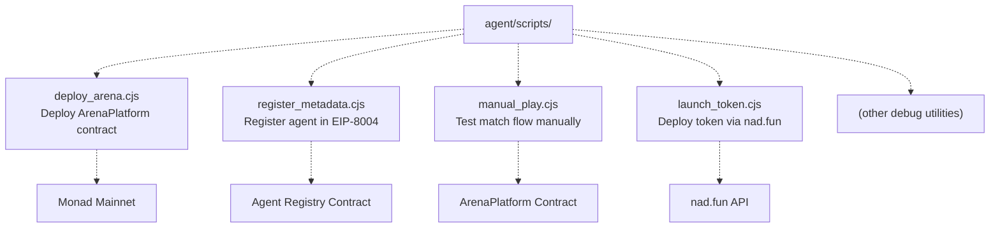

# Project Structure

> **Relevant source files**
> * [README.md](https://github.com/HACK3R-CRYPTO/GameArena/blob/30ace840/README.md)
> * [agent/package.json](https://github.com/HACK3R-CRYPTO/GameArena/blob/30ace840/agent/package.json)
> * [frontend/package-lock.json](https://github.com/HACK3R-CRYPTO/GameArena/blob/30ace840/frontend/package-lock.json)
> * [frontend/package.json](https://github.com/HACK3R-CRYPTO/GameArena/blob/30ace840/frontend/package.json)
> * [frontend/src/components/DocsModal.jsx](https://github.com/HACK3R-CRYPTO/GameArena/blob/30ace840/frontend/src/components/DocsModal.jsx)

This document describes the monorepo organization of the Arena AI Champion platform. It covers the physical layout of directories, key configuration files, and how the three major subsystems (smart contracts, AI agent, and frontend application) are organized within the repository. For details about deploying these components, see [Deploying the Agent](/HACK3R-CRYPTO/GameArena/8.3-deploying-the-agent), [Deploying the Frontend](/HACK3R-CRYPTO/GameArena/8.4-deploying-the-frontend), and [Smart Contract Deployment](/HACK3R-CRYPTO/GameArena/8.5-smart-contract-deployment). For architectural relationships between systems, see [Architecture](/HACK3R-CRYPTO/GameArena/3-architecture).

---

## Repository Organization

The GameArena repository follows a **monorepo structure** with three primary subsystems, each in its own top-level directory:

```markdown
GameArena/
├── agent/           # Autonomous AI agent system (Node.js + TypeScript)
├── frontend/        # React web application (Vite + React)
├── contracts/       # Solidity smart contracts (Foundry)
├── README.md        # Project overview and quick start guide
└── .gitignore       # Version control exclusions
```

Each subsystem is independently deployable and maintains its own dependencies, but they share common configuration through environment variables and contract ABIs.

**Sources:** [README.md L1-L173](https://github.com/HACK3R-CRYPTO/GameArena/blob/30ace840/README.md#L1-L173)

---

## Agent System Structure

The `agent/` directory contains the autonomous AI agent implementation that monitors the blockchain 24/7 and automatically accepts/plays matches.

### Agent Directory Tree



### Key Agent Files

| File Path | Purpose | Key Exports |
| --- | --- | --- |
| `src/ArenaAgent.ts` | Main agent loop - event watching, match acceptance, move execution | `ArenaAgent` class, `main()` |
| `src/OpponentModel.ts` | Markov Chain opponent modeling system | `OpponentModel` class |
| `src/ExternalBot.ts` | Template for building custom challenger bots | Bot implementation example |
| `src/services/MoltbookService.ts` | Posts match updates to Moltbook social platform | `MoltbookService` class |
| `src/services/GeminiService.ts` | Generates AI commentary using Google Gemini | `GeminiService` class |
| `config/contracts.js` | Contract ABIs and deployed addresses | `arenaPlatformABI`, `ARENA_PLATFORM_ADDRESS` |
| `scripts/deploy_arena.cjs` | Deploys ArenaPlatform contract to Monad | Deployment script |
| `scripts/register_metadata.cjs` | Registers agent in EIP-8004 registry | Registration script |
| `scripts/manual_play.cjs` | Manual testing utility for match flow | Debug script |
| `package.json` | Dependencies and start script (`tsx src/ArenaAgent.ts`) | npm configuration |

The agent uses **tsx** for TypeScript execution without compilation, as defined in [agent/package.json L8](https://github.com/HACK3R-CRYPTO/GameArena/blob/30ace840/agent/package.json#L8-L8)

**Sources:** [agent/package.json L1-L29](https://github.com/HACK3R-CRYPTO/GameArena/blob/30ace840/agent/package.json#L1-L29)

 [README.md L105-L131](https://github.com/HACK3R-CRYPTO/GameArena/blob/30ace840/README.md#L105-L131)

---

## Agent Execution Flow



The agent operates as a **long-running process** that never terminates, continuously monitoring blockchain events via dual mechanisms: real-time `watchEvent` callbacks and a 30-second safety scanner.

**Sources:** [agent/package.json L8](https://github.com/HACK3R-CRYPTO/GameArena/blob/30ace840/agent/package.json#L8-L8)

 [README.md L105-L112](https://github.com/HACK3R-CRYPTO/GameArena/blob/30ace840/README.md#L105-L112)

---

## Frontend Application Structure

The `frontend/` directory contains the React-based user interface built with Vite.

### Frontend Directory Tree



### Key Frontend Files

| File Path | Purpose | Key Exports |
| --- | --- | --- |
| `src/main.jsx` | Application entry point, providers setup | Renders root |
| `src/App.jsx` | Root component with routing | `App` component |
| `src/components/ArenaGame.jsx` | Main game interface - match display, move selection, history | `ArenaGame` component |
| `src/components/Navigation.jsx` | Wallet connection UI, network display | `Navigation` component |
| `src/components/LandingOverlay.jsx` | Entry splash screen | `LandingOverlay` component |
| `src/components/DocsModal.jsx` | In-app documentation modal | `DocsModal` component |
| `src/hooks/useArenaEvents.js` | Real-time blockchain event monitoring | `useArenaEvents` hook |
| `src/config/contracts.js` | Contract ABIs and addresses (matches agent config) | `arenaPlatformConfig` |
| `src/config/appkit.js` | Wagmi + AppKit configuration | `config`, `projectId` |
| `vite.config.js` | Vite build configuration | Build settings |
| `package.json` | Dependencies and scripts (`dev`, `build`, `preview`) | npm configuration |

**Sources:** [frontend/package.json L1-L45](https://github.com/HACK3R-CRYPTO/GameArena/blob/30ace840/frontend/package.json#L1-L45)

 [frontend/src/components/DocsModal.jsx L1-L127](https://github.com/HACK3R-CRYPTO/GameArena/blob/30ace840/frontend/src/components/DocsModal.jsx#L1-L127)

---

## Frontend Build and Execution Flow



The frontend uses **Vite** as its build tool and development server, with fast HMR (Hot Module Replacement). Production builds are optimized and deployed to Vercel.

**Sources:** [frontend/package.json L7-L10](https://github.com/HACK3R-CRYPTO/GameArena/blob/30ace840/frontend/package.json#L7-L10)

 [README.md L95-L102](https://github.com/HACK3R-CRYPTO/GameArena/blob/30ace840/README.md#L95-L102)

---

## Smart Contracts Directory Structure

While the `contracts/` directory is not directly visible in the provided files, it follows Foundry conventions based on deployment scripts and references.

### Inferred Contracts Structure



### Contract Deployment Addresses

| Contract | Address | Network |
| --- | --- | --- |
| **ArenaPlatform** | `0x30af30ec392b881b009a0c6b520ebe6d15722e9b` | Monad Mainnet |
| **Arena Agent** | `0x2E33d7D5Fa3eD4Dd6BEb95CdC41F51635C4b7Ad1` | Monad Mainnet |
| **$ARENA Token** | `0x1D3a53f0F52053D301374647e70B87279D5F7777` | Monad Mainnet |
| **Agent Registry** | `0x95884fe0d2a817326338735Eb4f24dD04Cf20Ea7` | Monad Mainnet |

Contracts are deployed using **Viem** (not Foundry's built-in deployer) via the script at `agent/scripts/deploy_arena.cjs` for consistency with the agent's technology stack.

**Sources:** [README.md L153-L161](https://github.com/HACK3R-CRYPTO/GameArena/blob/30ace840/README.md#L153-L161)

---

## Configuration File Mapping

Both the agent and frontend share contract configuration but maintain separate environment variables.

### Shared Contract Configuration



### Environment Variables Structure

| Subsystem | File | Key Variables |
| --- | --- | --- |
| **Agent** | `agent/.env` | `PRIVATE_KEY`, `GEMINI_API_KEY`, `MOLTBOOK_API_KEY` |
| **Frontend** | `frontend/.env` | `VITE_ARENA_PLATFORM_ADDRESS`, `VITE_MONAD_RPC_URL`, `VITE_PROJECT_ID` |

Frontend environment variables are prefixed with `VITE_` to be exposed to the client-side bundle. Agent variables are private server-side secrets.

For detailed configuration instructions, see [Environment Configuration](/HACK3R-CRYPTO/GameArena/8.2-environment-configuration).

**Sources:** [README.md L88-L112](https://github.com/HACK3R-CRYPTO/GameArena/blob/30ace840/README.md#L88-L112)

---

## Dependency Management

Each subsystem manages its own dependencies independently:

### Agent Dependencies



Key agent dependencies from [agent/package.json L14-L25](https://github.com/HACK3R-CRYPTO/GameArena/blob/30ace840/agent/package.json#L14-L25)

:

* **viem** (^2.45.1): Blockchain interaction library
* **tsx** (^4.21.0): TypeScript execution runtime
* **@google/generative-ai** (^0.24.1): Gemini AI integration
* **@nadfun/sdk** (^0.4.3): Token launching on nad.fun

### Frontend Dependencies



Key frontend dependencies from [frontend/package.json L12-L28](https://github.com/HACK3R-CRYPTO/GameArena/blob/30ace840/frontend/package.json#L12-L28)

:

* **react** (^19.2.0): UI component framework
* **wagmi** (^3.3.2): Ethereum React hooks
* **@reown/appkit** (^1.8.16): Wallet connection modal (formerly WalletConnect)
* **@tanstack/react-query** (^5.90.19): Server state management
* **vite** (^7.2.4): Fast build tool with HMR

**Sources:** [agent/package.json L14-L28](https://github.com/HACK3R-CRYPTO/GameArena/blob/30ace840/agent/package.json#L14-L28)

 [frontend/package.json L12-L44](https://github.com/HACK3R-CRYPTO/GameArena/blob/30ace840/frontend/package.json#L12-L44)

---

## Build Artifacts and Outputs

### Agent Build Process

The agent uses **no build step** - it runs directly with `tsx`:

```
agent/
├── src/           (Source files - no compilation)
└── node_modules/  (Dependencies)
```

Execution: `npm start` → `tsx src/ArenaAgent.ts` directly interprets TypeScript.

### Frontend Build Process

The frontend compiles to static assets:

```
frontend/
├── src/           (Source files)
├── dist/          (Build output - created by vite build)
│   ├── index.html
│   ├── assets/
│   │   ├── index-[hash].js
│   │   └── index-[hash].css
│   └── ...
└── node_modules/
```

Production build: `npm run build` → Generates optimized bundle in `dist/` → Deployed to Vercel.

**Sources:** [frontend/package.json L8](https://github.com/HACK3R-CRYPTO/GameArena/blob/30ace840/frontend/package.json#L8-L8)

 [agent/package.json L8](https://github.com/HACK3R-CRYPTO/GameArena/blob/30ace840/agent/package.json#L8-L8)

---

## Utility Scripts Location

The agent directory contains several utility scripts for maintenance and deployment tasks:



These scripts are documented in detail in [Utility Scripts](/HACK3R-CRYPTO/GameArena/8.6-utility-scripts).

**Sources:** [README.md L153-L161](https://github.com/HACK3R-CRYPTO/GameArena/blob/30ace840/README.md#L153-L161)

---

## Technology Stack Summary

| Component | Technology | Version | Purpose |
| --- | --- | --- | --- |
| **Agent Runtime** | Node.js + tsx | tsx ^4.21.0 | TypeScript execution without compilation |
| **Agent Blockchain** | viem | ^2.45.1 | Ethereum client library |
| **Frontend Framework** | React | ^19.2.0 | UI component system |
| **Frontend Build** | Vite | ^7.2.4 | Fast build tool with HMR |
| **Frontend Blockchain** | wagmi + viem | ^3.3.2 / ^2.44.1 | React hooks for Ethereum |
| **Wallet Integration** | @reown/appkit | ^1.8.16 | Multi-wallet connection modal |
| **Smart Contracts** | Solidity + Foundry | (inferred) | Contract development framework |
| **Deployment** | Viem deployment | Via scripts | Custom deployment using viem |

All three subsystems connect to the **Monad Blockchain** (Chain ID: 143) via the RPC endpoint at `rpc.monad.xyz`.

**Sources:** [agent/package.json L14-L25](https://github.com/HACK3R-CRYPTO/GameArena/blob/30ace840/agent/package.json#L14-L25)

 [frontend/package.json L12-L28](https://github.com/HACK3R-CRYPTO/GameArena/blob/30ace840/frontend/package.json#L12-L28)

 [README.md L52-L64](https://github.com/HACK3R-CRYPTO/GameArena/blob/30ace840/README.md#L52-L64)