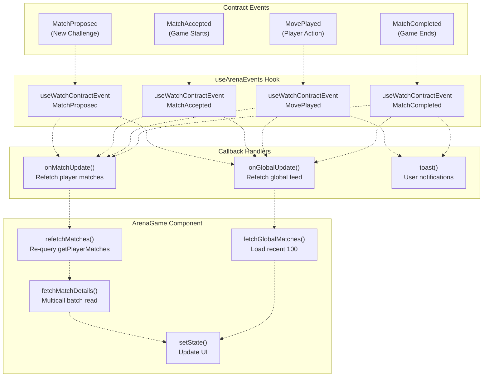
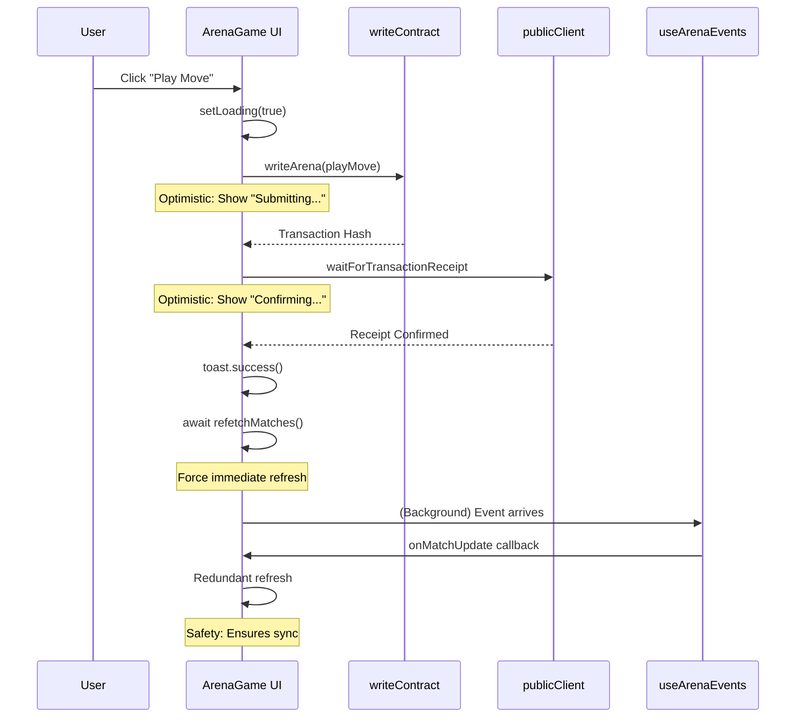
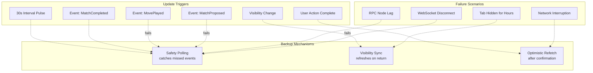

# Real-Time Updates

> **Relevant source files**
> * [frontend/src/hooks/useArenaEvents.jsx](https://github.com/HACK3R-CRYPTO/GameArena/blob/30ace840/frontend/src/hooks/useArenaEvents.jsx)
> * [frontend/src/index.css](https://github.com/HACK3R-CRYPTO/GameArena/blob/30ace840/frontend/src/index.css)
> * [frontend/src/pages/ArenaGame.jsx](https://github.com/HACK3R-CRYPTO/GameArena/blob/30ace840/frontend/src/pages/ArenaGame.jsx)

This page documents the frontend's real-time data synchronization architecture, explaining how the ArenaGame component stays synchronized with blockchain state through a multi-layered update strategy. The system combines event-driven updates, periodic polling, visibility detection, and optimistic UI patterns to ensure users always see current match data despite network latency and blockchain finality delays.

For information about blockchain data optimization and batch reading strategies, see [Blockchain Data Optimization](/HACK3R-CRYPTO/GameArena/6.5-blockchain-data-optimization). For details on wallet connectivity and transaction signing, see [Wallet Integration](/HACK3R-CRYPTO/GameArena/6.3-wallet-integration).

---

## Overview of Update Strategy

The frontend implements a **four-layer update mechanism** that works in parallel to maximize responsiveness and reliability:

| Layer | Mechanism | Latency | Purpose |
| --- | --- | --- | --- |
| **Real-Time Events** | `useWatchContractEvent` | ~1-2 seconds | Primary update path for new blockchain events |
| **Safety Polling** | `setInterval` every 30s | 30 seconds | Catch missed events due to network issues |
| **Visibility Sync** | `visibilitychange` listener | Immediate on focus | Refresh stale data when user returns to tab |
| **Optimistic UI** | Immediate state updates | 0ms | Instant feedback before blockchain confirmation |

This redundant approach ensures data is always visible even if one mechanism fails. The event-driven layer provides speed, polling provides reliability, visibility sync handles tab switching, and optimistic updates provide immediate user feedback.

**Sources:** [frontend/src/pages/ArenaGame.jsx L310-L353](https://github.com/HACK3R-CRYPTO/GameArena/blob/30ace840/frontend/src/pages/ArenaGame.jsx#L310-L353)

---

## Event-Driven Architecture

### useArenaEvents Hook

The `useArenaEvents` hook provides the primary real-time update mechanism by watching for four contract events:



**Sources:** [frontend/src/hooks/useArenaEvents.jsx L1-L112](https://github.com/HACK3R-CRYPTO/GameArena/blob/30ace840/frontend/src/hooks/useArenaEvents.jsx#L1-L112)

 [frontend/src/pages/ArenaGame.jsx L310-L326](https://github.com/HACK3R-CRYPTO/GameArena/blob/30ace840/frontend/src/pages/ArenaGame.jsx#L310-L326)

### Event Watcher Implementation

Each event watcher uses Wagmi's `useWatchContractEvent` to subscribe to specific contract events:

```javascript
// From useArenaEvents.jsx:24-32
useWatchContractEvent({
    address: CONTRACT_ADDRESSES.ARENA_PLATFORM,
    abi: ARENA_PLATFORM_ABI,
    eventName: 'MatchProposed',
    onLogs(logs) {
        console.log('⚡ Match Proposed:', logs);
        triggerUpdates();
    },
});
```

The `triggerUpdates()` helper [frontend/src/hooks/useArenaEvents.jsx L17-L21](https://github.com/HACK3R-CRYPTO/GameArena/blob/30ace840/frontend/src/hooks/useArenaEvents.jsx#L17-L21)

 invokes both `onMatchUpdate` and `onGlobalUpdate` callbacks, which are provided by the ArenaGame component to trigger data refetches.

**Event-Specific Behaviors:**

* **MatchProposed/MatchAccepted**: Trigger full data refresh for both player matches and global feed
* **MovePlayed**: Triggers refresh + shows toast notification if opponent played [frontend/src/hooks/useArenaEvents.jsx L48-L85](https://github.com/HACK3R-CRYPTO/GameArena/blob/30ace840/frontend/src/hooks/useArenaEvents.jsx#L48-L85)
* **MatchCompleted**: Triggers refresh + shows win/loss toast [frontend/src/hooks/useArenaEvents.jsx L87-L111](https://github.com/HACK3R-CRYPTO/GameArena/blob/30ace840/frontend/src/hooks/useArenaEvents.jsx#L87-L111)

**Sources:** [frontend/src/hooks/useArenaEvents.jsx L24-L111](https://github.com/HACK3R-CRYPTO/GameArena/blob/30ace840/frontend/src/hooks/useArenaEvents.jsx#L24-L111)

---

## Safety Polling Mechanism

A 30-second interval provides a reliability backstop in case events are missed due to RPC issues or network connectivity problems:

```javascript
// From ArenaGame.jsx:329-341
useEffect(() => {
    if (!isConnected || !address) return;

    const interval = setInterval(() => {
        console.log('⏱️ Safety sync pulse...');
        refetchMatches().then(({ data: freshIds }) => {
            if (freshIds) fetchMatchDetails(freshIds);
        });
        fetchGlobalMatches();
    }, 30000); // 30 seconds

    return () => clearInterval(interval);
}, [address, isConnected, refetchMatches, fetchMatchDetails, fetchGlobalMatches]);
```

This mechanism:

1. Only runs when wallet is connected
2. Refetches player match IDs via `getPlayerMatches` contract call
3. Fetches full match details using multicall batching
4. Refreshes global feed independently
5. Cleans up interval on component unmount

The 30-second interval was chosen to balance data freshness with RPC load. Combined with event watchers, this ensures data is never more than 30 seconds stale even if all events fail to arrive.

**Sources:** [frontend/src/pages/ArenaGame.jsx L328-L341](https://github.com/HACK3R-CRYPTO/GameArena/blob/30ace840/frontend/src/pages/ArenaGame.jsx#L328-L341)

---

## Visibility Change Synchronization

When users switch browser tabs and return, stale data can persist. The visibility change handler immediately refreshes data when the tab regains focus:

```javascript
// From ArenaGame.jsx:343-353
useEffect(() => {
    const handleVisibilityChange = () => {
        if (!document.hidden && isConnected) {
            refetchMatches();
        }
    };

    document.addEventListener('visibilitychange', handleVisibilityChange);
    return () => document.removeEventListener('visibilitychange', handleVisibilityChange);
}, [refetchMatches, isConnected]);
```

This ensures that:

* Users returning after minutes/hours see fresh data immediately
* No resources are wasted refetching while tab is hidden
* The handler only triggers when connected (avoids errors)

**Sources:** [frontend/src/pages/ArenaGame.jsx L343-L353](https://github.com/HACK3R-CRYPTO/GameArena/blob/30ace840/frontend/src/pages/ArenaGame.jsx#L343-L353)

---

## Optimistic UI Pattern

The frontend implements optimistic updates to provide instant feedback before blockchain confirmation:



### Implementation Details

After each user action (propose, accept, playMove), the code immediately refetches data:

```sql
// From ArenaGame.jsx:382-388
toast.success(`Selected ${moveLabel}! Move confirmed on chain.`, { id: toastId });
setActiveMatch(null);
setSelectedMove(null);

// Immediate refetch to update UI with user's move
await refetchMatches();
```

This pattern appears after:

* `handlePlayMove()` [frontend/src/pages/ArenaGame.jsx L382-L394](https://github.com/HACK3R-CRYPTO/GameArena/blob/30ace840/frontend/src/pages/ArenaGame.jsx#L382-L394)
* `handleChallengeAgent()` [frontend/src/pages/ArenaGame.jsx L425-L426](https://github.com/HACK3R-CRYPTO/GameArena/blob/30ace840/frontend/src/pages/ArenaGame.jsx#L425-L426)
* `handleCreateMatch()` [frontend/src/pages/ArenaGame.jsx L455-L456](https://github.com/HACK3R-CRYPTO/GameArena/blob/30ace840/frontend/src/pages/ArenaGame.jsx#L455-L456)
* `handleAcceptMatch()` [frontend/src/pages/ArenaGame.jsx L481-L483](https://github.com/HACK3R-CRYPTO/GameArena/blob/30ace840/frontend/src/pages/ArenaGame.jsx#L481-L483)

The optimistic refetch runs **before** the event watcher fires, ensuring users see their own actions reflected immediately rather than waiting for event propagation (1-2 seconds).

**Sources:** [frontend/src/pages/ArenaGame.jsx L355-L490](https://github.com/HACK3R-CRYPTO/GameArena/blob/30ace840/frontend/src/pages/ArenaGame.jsx#L355-L490)

---

## State Synchronization Techniques

### Avoiding Stale Closures with Refs

The component uses refs to maintain fresh references to state within intervals and event handlers:

```javascript
// From ArenaGame.jsx:289-291
const playerMatchIdsRef = useRef(playerMatchIds);
const matchesRef = useRef(matches);
```

These refs prevent stale closures when:

* The 30-second interval accesses dependency arrays
* Event handlers need current match data for toast messages
* Avoiding unnecessary effect re-runs

The `matchesRef` is particularly important in `useArenaEvents` [frontend/src/hooks/useArenaEvents.jsx L11-L15](https://github.com/HACK3R-CRYPTO/GameArena/blob/30ace840/frontend/src/hooks/useArenaEvents.jsx#L11-L15)

 where it allows event handlers to access current matches without recreating watchers on every state change.

**Sources:** [frontend/src/pages/ArenaGame.jsx L289-L291](https://github.com/HACK3R-CRYPTO/GameArena/blob/30ace840/frontend/src/pages/ArenaGame.jsx#L289-L291)

 [frontend/src/hooks/useArenaEvents.jsx L11-L15](https://github.com/HACK3R-CRYPTO/GameArena/blob/30ace840/frontend/src/hooks/useArenaEvents.jsx#L11-L15)

### Conditional Fetching Logic

The component implements smart conditional fetching to avoid redundant requests:

```javascript
// From ArenaGame.jsx:292-308
useEffect(() => {
    const prevIds = playerMatchIdsRef.current;
    const currentIds = playerMatchIds;

    const hasChanged = !prevIds || !currentIds ||
        prevIds.length !== currentIds.length ||
        !prevIds.every((val, index) => val === currentIds[index]);

    playerMatchIdsRef.current = playerMatchIds;
    matchesRef.current = matches;

    // Initial fetch or update
    if (playerMatchIds && (matches.length === 0 || hasChanged)) {
        fetchMatchDetails(playerMatchIds);
    }
}, [playerMatchIds, matches.length, fetchMatchDetails]);
```

This logic ensures `fetchMatchDetails` only runs when:

1. Initial load (`matches.length === 0`)
2. Match IDs array actually changed (length or content)

This prevents infinite loops and unnecessary multicall requests.

**Sources:** [frontend/src/pages/ArenaGame.jsx L292-L308](https://github.com/HACK3R-CRYPTO/GameArena/blob/30ace840/frontend/src/pages/ArenaGame.jsx#L292-L308)

---

## Event Notification System

### Toast Notification Flow

The system provides contextual notifications for blockchain events that involve the user:

```css
#mermaid-2dqvevob4c6{font-family:ui-sans-serif,-apple-system,system-ui,Segoe UI,Helvetica;font-size:16px;fill:#333;}@keyframes edge-animation-frame{from{stroke-dashoffset:0;}}@keyframes dash{to{stroke-dashoffset:0;}}#mermaid-2dqvevob4c6 .edge-animation-slow{stroke-dasharray:9,5!important;stroke-dashoffset:900;animation:dash 50s linear infinite;stroke-linecap:round;}#mermaid-2dqvevob4c6 .edge-animation-fast{stroke-dasharray:9,5!important;stroke-dashoffset:900;animation:dash 20s linear infinite;stroke-linecap:round;}#mermaid-2dqvevob4c6 .error-icon{fill:#dddddd;}#mermaid-2dqvevob4c6 .error-text{fill:#222222;stroke:#222222;}#mermaid-2dqvevob4c6 .edge-thickness-normal{stroke-width:1px;}#mermaid-2dqvevob4c6 .edge-thickness-thick{stroke-width:3.5px;}#mermaid-2dqvevob4c6 .edge-pattern-solid{stroke-dasharray:0;}#mermaid-2dqvevob4c6 .edge-thickness-invisible{stroke-width:0;fill:none;}#mermaid-2dqvevob4c6 .edge-pattern-dashed{stroke-dasharray:3;}#mermaid-2dqvevob4c6 .edge-pattern-dotted{stroke-dasharray:2;}#mermaid-2dqvevob4c6 .marker{fill:#999;stroke:#999;}#mermaid-2dqvevob4c6 .marker.cross{stroke:#999;}#mermaid-2dqvevob4c6 svg{font-family:ui-sans-serif,-apple-system,system-ui,Segoe UI,Helvetica;font-size:16px;}#mermaid-2dqvevob4c6 p{margin:0;}#mermaid-2dqvevob4c6 defs #statediagram-barbEnd{fill:#999;stroke:#999;}#mermaid-2dqvevob4c6 g.stateGroup text{fill:#dddddd;stroke:none;font-size:10px;}#mermaid-2dqvevob4c6 g.stateGroup text{fill:#333;stroke:none;font-size:10px;}#mermaid-2dqvevob4c6 g.stateGroup .state-title{font-weight:bolder;fill:#333;}#mermaid-2dqvevob4c6 g.stateGroup rect{fill:#ffffff;stroke:#dddddd;}#mermaid-2dqvevob4c6 g.stateGroup line{stroke:#999;stroke-width:1;}#mermaid-2dqvevob4c6 .transition{stroke:#999;stroke-width:1;fill:none;}#mermaid-2dqvevob4c6 .stateGroup .composit{fill:#f4f4f4;border-bottom:1px;}#mermaid-2dqvevob4c6 .stateGroup .alt-composit{fill:#e0e0e0;border-bottom:1px;}#mermaid-2dqvevob4c6 .state-note{stroke:#e6d280;fill:#fff5ad;}#mermaid-2dqvevob4c6 .state-note text{fill:#333;stroke:none;font-size:10px;}#mermaid-2dqvevob4c6 .stateLabel .box{stroke:none;stroke-width:0;fill:#ffffff;opacity:0.5;}#mermaid-2dqvevob4c6 .edgeLabel .label rect{fill:#ffffff;opacity:0.5;}#mermaid-2dqvevob4c6 .edgeLabel{background-color:#ffffff;text-align:center;}#mermaid-2dqvevob4c6 .edgeLabel p{background-color:#ffffff;}#mermaid-2dqvevob4c6 .edgeLabel rect{opacity:0.5;background-color:#ffffff;fill:#ffffff;}#mermaid-2dqvevob4c6 .edgeLabel .label text{fill:#333;}#mermaid-2dqvevob4c6 .label div .edgeLabel{color:#333;}#mermaid-2dqvevob4c6 .stateLabel text{fill:#333;font-size:10px;font-weight:bold;}#mermaid-2dqvevob4c6 .node circle.state-start{fill:#999;stroke:#999;}#mermaid-2dqvevob4c6 .node .fork-join{fill:#999;stroke:#999;}#mermaid-2dqvevob4c6 .node circle.state-end{fill:#dddddd;stroke:#f4f4f4;stroke-width:1.5;}#mermaid-2dqvevob4c6 .end-state-inner{fill:#f4f4f4;stroke-width:1.5;}#mermaid-2dqvevob4c6 .node rect{fill:#ffffff;stroke:#dddddd;stroke-width:1px;}#mermaid-2dqvevob4c6 .node polygon{fill:#ffffff;stroke:#dddddd;stroke-width:1px;}#mermaid-2dqvevob4c6 #statediagram-barbEnd{fill:#999;}#mermaid-2dqvevob4c6 .statediagram-cluster rect{fill:#ffffff;stroke:#dddddd;stroke-width:1px;}#mermaid-2dqvevob4c6 .cluster-label,#mermaid-2dqvevob4c6 .nodeLabel{color:#333;}#mermaid-2dqvevob4c6 .statediagram-cluster rect.outer{rx:5px;ry:5px;}#mermaid-2dqvevob4c6 .statediagram-state .divider{stroke:#dddddd;}#mermaid-2dqvevob4c6 .statediagram-state .title-state{rx:5px;ry:5px;}#mermaid-2dqvevob4c6 .statediagram-cluster.statediagram-cluster .inner{fill:#f4f4f4;}#mermaid-2dqvevob4c6 .statediagram-cluster.statediagram-cluster-alt .inner{fill:#f8f8f8;}#mermaid-2dqvevob4c6 .statediagram-cluster .inner{rx:0;ry:0;}#mermaid-2dqvevob4c6 .statediagram-state rect.basic{rx:5px;ry:5px;}#mermaid-2dqvevob4c6 .statediagram-state rect.divider{stroke-dasharray:10,10;fill:#f8f8f8;}#mermaid-2dqvevob4c6 .note-edge{stroke-dasharray:5;}#mermaid-2dqvevob4c6 .statediagram-note rect{fill:#fff5ad;stroke:#e6d280;stroke-width:1px;rx:0;ry:0;}#mermaid-2dqvevob4c6 .statediagram-note rect{fill:#fff5ad;stroke:#e6d280;stroke-width:1px;rx:0;ry:0;}#mermaid-2dqvevob4c6 .statediagram-note text{fill:#333;}#mermaid-2dqvevob4c6 .statediagram-note .nodeLabel{color:#333;}#mermaid-2dqvevob4c6 .statediagram .edgeLabel{color:red;}#mermaid-2dqvevob4c6 #dependencyStart,#mermaid-2dqvevob4c6 #dependencyEnd{fill:#999;stroke:#999;stroke-width:1;}#mermaid-2dqvevob4c6 .statediagramTitleText{text-anchor:middle;font-size:18px;fill:#333;}#mermaid-2dqvevob4c6 :root{--mermaid-font-family:"trebuchet ms",verdana,arial,sans-serif;}Event Log ArrivesParse event argsMovePlayed by opponentMatchCompleted (I won)MatchCompleted (I lost)Event doesn't involve me"Opponent played [move] vs Your [move]""You Won! 🎉""Match Completed - You Lost 💀"EventReceivedCheckRelevanceNotifyMoveNotifyWinNotifyLossIgnoreShowToast
```

### Move Notification Implementation

When an opponent plays a move, the system shows their move and (if available) the user's move for context:

```javascript
// From useArenaEvents.jsx:53-82
onLogs: async (logs) => {
    const playerAddr = logs[0].args.player;
    const move = Number(logs[0].args.move);
    const matchId = Number(logs[0].args.matchId);

    // Only notify if opponent played against ME
    if (playerAddr && address && playerAddr.toLowerCase() !== address.toLowerCase()) {
        const currentMatches = matchesRef.current;
        let match = currentMatches.find(m => m.id === matchId);

        if (match) {
            const moveDisplay = getMoveDisplay(match.gameType, move);
            const isChallenger = match.challenger.toLowerCase() === address.toLowerCase();
            const playerMoveVal = isChallenger ? match.challengerMove : match.opponentMove;

            let extraMsg = '';
            if (playerMoveVal !== null && playerMoveVal !== undefined) {
                const playerMoveDisplay = getMoveDisplay(match.gameType, playerMoveVal);
                extraMsg = ` vs Your ${playerMoveDisplay.icon}`;
            }

            toast(`Opponent played ${moveDisplay.icon}${extraMsg}`, {
                icon: '🤖',
                duration: 4000,
                style: { border: '1px solid #7c3aed', background: '#1a1f3a', color: '#fff' }
            });
        }
    }
}
```

The notification:

1. Filters to only show opponent moves (not user's own)
2. Finds the relevant match from current state
3. Uses `getMoveDisplay` to convert numeric move to icon/label
4. Includes user's move if already played
5. Styled with purple theme to match application

**Sources:** [frontend/src/hooks/useArenaEvents.jsx L48-L85](https://github.com/HACK3R-CRYPTO/GameArena/blob/30ace840/frontend/src/hooks/useArenaEvents.jsx#L48-L85)

### Win/Loss Notifications

Match completion events trigger result notifications:

```javascript
// From useArenaEvents.jsx:92-109
const winner = logs[0].args.winner;
const matchId = Number(logs[0].args.matchId);
const winnerAddr = winner ? winner.toLowerCase() : null;

if (winnerAddr === address?.toLowerCase()) {
    toast.success('🎉 You Won a Match! Check history for details.', { duration: 5000 });
} else if (address) {
    const currentMatches = matchesRef.current;
    const match = currentMatches.find(m => m.id === matchId);
    if (match && (match.challenger.toLowerCase() === address.toLowerCase() || 
                  match.opponent.toLowerCase() === address.toLowerCase())) {
        toast.error('💀 Match Completed - You Lost.', { duration: 5000 });
    }
}
```

The system checks:

1. If user is the winner → success toast
2. If user was in the match but didn't win → error toast
3. Otherwise (match doesn't involve user) → no notification

**Sources:** [frontend/src/hooks/useArenaEvents.jsx L87-L111](https://github.com/HACK3R-CRYPTO/GameArena/blob/30ace840/frontend/src/hooks/useArenaEvents.jsx#L87-L111)

---

## Integration with Data Fetching

### Callback-Based Architecture

The `useArenaEvents` hook accepts callback functions that bridge event detection to data fetching:

```javascript
// From ArenaGame.jsx:311-326
useArenaEvents({
    onMatchUpdate: async () => {
        console.log('⚡ Event received: Refreshing Player Matches');
        const { data: freshIds } = await refetchMatches();
        if (freshIds) {
            console.log('🔄 Re-fetching details for IDs:', freshIds.map(id => id.toString()));
            fetchMatchDetails(freshIds);
        }
    },
    onGlobalUpdate: () => {
        console.log('⚡ Event received: Refreshing Global Feed');
        fetchGlobalMatches();
    },
    address,
    matches
});
```

**Flow:**

1. Event watcher detects blockchain event
2. `triggerUpdates()` called inside hook
3. `onMatchUpdate` refetches player's match ID list
4. If IDs returned, `fetchMatchDetails` performs multicall batch read
5. `onGlobalUpdate` refetches last 100 matches for global feed
6. State updates trigger React re-render

This separation of concerns keeps the event watching logic reusable while allowing the component to control data fetching strategy.

**Sources:** [frontend/src/pages/ArenaGame.jsx L310-L326](https://github.com/HACK3R-CRYPTO/GameArena/blob/30ace840/frontend/src/pages/ArenaGame.jsx#L310-L326)

---

## Performance Considerations

### Update Frequency Management

The system balances responsiveness with performance:

| Update Type | Frequency | Cost | Trade-off |
| --- | --- | --- | --- |
| Event watchers | Real-time | Free (WebSocket) | Primary path, may miss events |
| Safety polling | 30s | 2-3 RPC calls | Safety net, prevents stale data |
| Visibility sync | On focus | 1-2 RPC calls | Zero cost when hidden |
| Optimistic refetch | After user action | 2-3 RPC calls | Better UX, some duplication |

The 30-second polling interval was increased from an earlier 15-second version [frontend/src/pages/ArenaGame.jsx L338](https://github.com/HACK3R-CRYPTO/GameArena/blob/30ace840/frontend/src/pages/ArenaGame.jsx#L338-L338)

 for stability. Combined with event watchers providing 1-2 second updates, 30 seconds is sufficient for safety without excessive RPC load.

### Multicall Batching

All data fetches use `publicClient.multicall()` to minimize RPC round-trips. See [Blockchain Data Optimization](/HACK3R-CRYPTO/GameArena/6.5-blockchain-data-optimization) for full details on the cascading batch read strategy that enables this system to efficiently fetch hundreds of matches.

**Sources:** [frontend/src/pages/ArenaGame.jsx L46-L191](https://github.com/HACK3R-CRYPTO/GameArena/blob/30ace840/frontend/src/pages/ArenaGame.jsx#L46-L191)

---

## Reliability Mechanisms

### Redundant Update Paths

The four-layer strategy creates redundancy:



**Reliability Guarantees:**

1. **Event Failure**: Safety polling catches within 30s
2. **Long Tab Absence**: Visibility sync refreshes immediately on return
3. **Transaction Confirmation**: Optimistic refetch ensures user sees their action
4. **RPC Issues**: Multiple mechanisms attempt refresh independently

**Sources:** [frontend/src/pages/ArenaGame.jsx L310-L353](https://github.com/HACK3R-CRYPTO/GameArena/blob/30ace840/frontend/src/pages/ArenaGame.jsx#L310-L353)

### Console Logging

The system includes extensive logging for debugging update flow:

* `⚡ Event received: Refreshing Player Matches` - Event detected
* `🔄 Re-fetching details for IDs: [...]` - Multicall batch starting
* `⏱️ Safety sync pulse...` - Interval tick
* `📊 Global Match Count: X` - Global feed refresh

These logs help developers trace the update path and identify which mechanism triggered a refresh.

**Sources:** [frontend/src/pages/ArenaGame.jsx L313-L337](https://github.com/HACK3R-CRYPTO/GameArena/blob/30ace840/frontend/src/pages/ArenaGame.jsx#L313-L337)

---

## Summary Table

| Mechanism | File Location | Trigger | Latency | Purpose |
| --- | --- | --- | --- | --- |
| `useArenaEvents` | [frontend/src/hooks/useArenaEvents.jsx](https://github.com/HACK3R-CRYPTO/GameArena/blob/30ace840/frontend/src/hooks/useArenaEvents.jsx) | Contract events | 1-2s | Real-time updates |
| Safety Polling | [frontend/src/pages/ArenaGame.jsx L328-L341](https://github.com/HACK3R-CRYPTO/GameArena/blob/30ace840/frontend/src/pages/ArenaGame.jsx#L328-L341) | 30s interval | 30s | Catch missed events |
| Visibility Sync | [frontend/src/pages/ArenaGame.jsx L343-L353](https://github.com/HACK3R-CRYPTO/GameArena/blob/30ace840/frontend/src/pages/ArenaGame.jsx#L343-L353) | Tab focus | Immediate | Refresh stale data |
| Optimistic Refetch | [frontend/src/pages/ArenaGame.jsx L355-L490](https://github.com/HACK3R-CRYPTO/GameArena/blob/30ace840/frontend/src/pages/ArenaGame.jsx#L355-L490) | After tx confirm | 0s perceived | Instant user feedback |
| Toast Notifications | [frontend/src/hooks/useArenaEvents.jsx L48-L111](https://github.com/HACK3R-CRYPTO/GameArena/blob/30ace840/frontend/src/hooks/useArenaEvents.jsx#L48-L111) | Relevant events | 1-2s | User awareness |
| Multicall Batching | [frontend/src/pages/ArenaGame.jsx L46-L191](https://github.com/HACK3R-CRYPTO/GameArena/blob/30ace840/frontend/src/pages/ArenaGame.jsx#L46-L191) | All data fetches | ~200ms | Optimize RPC calls |

This multi-layered approach ensures the frontend remains synchronized with blockchain state through redundancy, providing users with a responsive and reliable experience despite the inherent challenges of blockchain data synchronization.