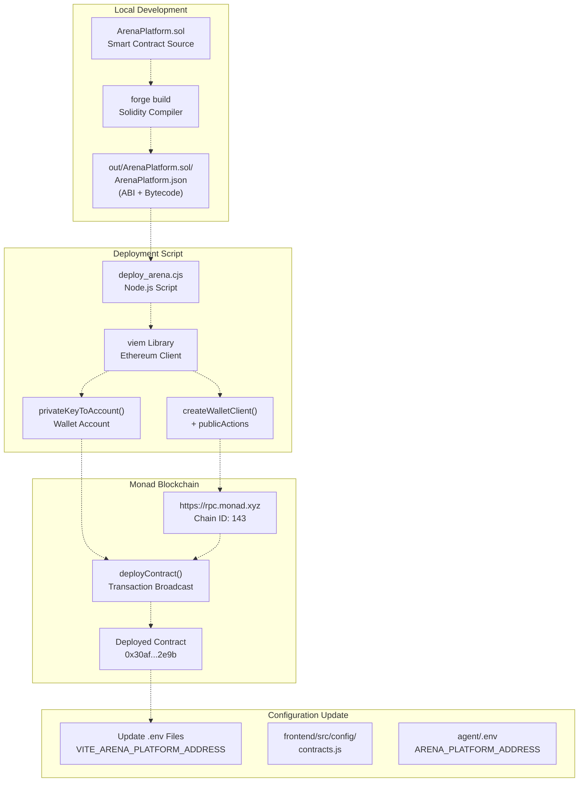
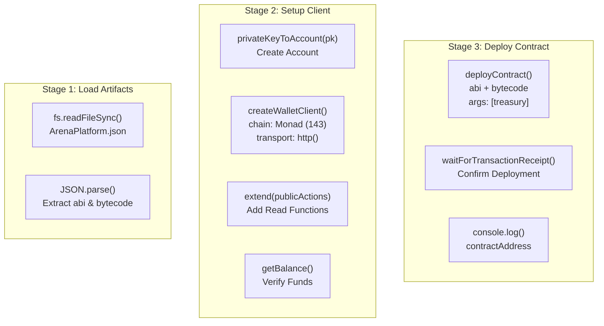
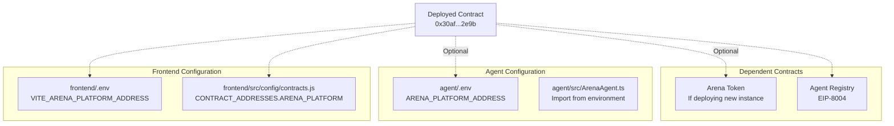

# Smart Contract Deployment

> **Relevant source files**
> * [agent/deploy_arena.cjs](https://github.com/HACK3R-CRYPTO/GameArena/blob/30ace840/agent/deploy_arena.cjs)
> * [agent/src/temp_gen_key.ts](https://github.com/HACK3R-CRYPTO/GameArena/blob/30ace840/agent/src/temp_gen_key.ts)
> * [debug_chain.js](https://github.com/HACK3R-CRYPTO/GameArena/blob/30ace840/debug_chain.js)
> * [frontend/.env](https://github.com/HACK3R-CRYPTO/GameArena/blob/30ace840/frontend/.env)
> * [frontend/src/config/contracts.js](https://github.com/HACK3R-CRYPTO/GameArena/blob/30ace840/frontend/src/config/contracts.js)

This document explains the process for deploying smart contracts to the Monad blockchain using the `deploy_arena.cjs` script. It covers prerequisites, the deployment workflow, post-deployment configuration, and security best practices.

For information about the deployed contract's functionality, see [ArenaPlatform Contract](/HACK3R-CRYPTO/GameArena/4.1-arenaplatform-contract). For instructions on running the agent and frontend after deployment, see [Deploying the Agent](/HACK3R-CRYPTO/GameArena/8.3-deploying-the-agent) and [Deploying the Frontend](/HACK3R-CRYPTO/GameArena/8.4-deploying-the-frontend).

---

## Overview

The Arena platform uses a custom deployment script (`agent/deploy_arena.cjs`) built with Viem to deploy the `ArenaPlatform` smart contract to Monad mainnet. The deployment process reads compiled artifacts from Foundry's output directory, configures the contract constructor parameters, and broadcasts the deployment transaction.

Sources: [agent/deploy_arena.cjs L1-L60](https://github.com/HACK3R-CRYPTO/GameArena/blob/30ace840/agent/deploy_arena.cjs#L1-L60)

---

## Deployment Architecture



**Deployment Workflow**: The deployment process begins with Solidity source files compiled by Foundry into JSON artifacts containing ABI and bytecode. The `deploy_arena.cjs` script reads these artifacts, creates a wallet client using Viem, and deploys the contract to Monad mainnet. After deployment, the contract address must be updated in environment configuration files for both the frontend and agent systems.

Sources: [agent/deploy_arena.cjs L1-L60](https://github.com/HACK3R-CRYPTO/GameArena/blob/30ace840/agent/deploy_arena.cjs#L1-L60)

 [frontend/.env L8-L12](https://github.com/HACK3R-CRYPTO/GameArena/blob/30ace840/frontend/.env#L8-L12)

 [frontend/src/config/contracts.js L1-L7](https://github.com/HACK3R-CRYPTO/GameArena/blob/30ace840/frontend/src/config/contracts.js#L1-L7)

---

## Prerequisites

Before deploying contracts, ensure the following requirements are met:

| Requirement | Description | Verification |
| --- | --- | --- |
| **Foundry Installation** | Solidity compilation toolchain | `forge --version` |
| **Node.js & npm** | JavaScript runtime for deployment script | `node --version` |
| **Compiled Contracts** | Foundry build artifacts | Check `contracts/out/ArenaPlatform.sol/ArenaPlatform.json` exists |
| **Deployment Wallet** | Private key with MON balance | Check balance > gas fees (≈0.01 MON) |
| **RPC Access** | Connection to Monad mainnet | Test with `curl https://rpc.monad.xyz` |

### Compilation

Compile the smart contracts using Foundry:

```
cd contracts
forge build
```

This generates the artifact file at `contracts/out/ArenaPlatform.sol/ArenaPlatform.json` which contains the ABI and bytecode required for deployment.

Sources: [agent/deploy_arena.cjs L10-L17](https://github.com/HACK3R-CRYPTO/GameArena/blob/30ace840/agent/deploy_arena.cjs#L10-L17)

---

## Deployment Script Structure

The `deploy_arena.cjs` script follows a three-stage process: artifact loading, client setup, and contract deployment.



**Script Flow**: The deployment script loads the compiled artifact from the Foundry output directory, parses the ABI and bytecode, creates a Viem wallet client connected to Monad mainnet, verifies the deployer account has sufficient balance, broadcasts the deployment transaction with constructor arguments, waits for transaction confirmation, and outputs the deployed contract address.

Sources: [agent/deploy_arena.cjs L7-L59](https://github.com/HACK3R-CRYPTO/GameArena/blob/30ace840/agent/deploy_arena.cjs#L7-L59)

---

## Key Code Components

### Artifact Loading

The script reads the compiled contract artifact from Foundry's output:

[agent/deploy_arena.cjs L10-L17](https://github.com/HACK3R-CRYPTO/GameArena/blob/30ace840/agent/deploy_arena.cjs#L10-L17)

```javascript
const artifactPath = path.resolve(__dirname, "../contracts/out/ArenaPlatform.sol/ArenaPlatform.json");
const artifact = JSON.parse(fs.readFileSync(artifactPath, "utf8"));
const abi = artifact.abi;
const bytecode = artifact.bytecode.object;
```

### Wallet Client Configuration

The deployment wallet is configured with Monad mainnet parameters:

[agent/deploy_arena.cjs L19-L32](https://github.com/HACK3R-CRYPTO/GameArena/blob/30ace840/agent/deploy_arena.cjs#L19-L32)

```javascript
const account = privateKeyToAccount(pk);

const client = createWalletClient({
    account,
    chain: {
        id: 143,
        name: "Monad Mainnet",
        nativeCurrency: { name: "Monad", symbol: "MON", decimals: 18 },
        rpcUrls: { default: { http: ["https://rpc.monad.xyz"] } }
    },
    transport: http()
}).extend(publicActions);
```

### Constructor Arguments

The `ArenaPlatform` contract requires a treasury address for platform fee collection:

[agent/deploy_arena.cjs L39-L46](https://github.com/HACK3R-CRYPTO/GameArena/blob/30ace840/agent/deploy_arena.cjs#L39-L46)

```javascript
const treasury = "0x56717540445F1B6727266935261f8bf63065DF60";

const hash = await client.deployContract({
    abi,
    bytecode,
    args: [treasury],
});
```

### Transaction Receipt Handling

The script waits for deployment confirmation and extracts the contract address:

[agent/deploy_arena.cjs L48-L56](https://github.com/HACK3R-CRYPTO/GameArena/blob/30ace840/agent/deploy_arena.cjs#L48-L56)

```javascript
const receipt = await client.waitForTransactionReceipt({ hash });

if (receipt.contractAddress) {
    console.log("Deployed ArenaPlatform to:", receipt.contractAddress);
}
```

Sources: [agent/deploy_arena.cjs L10-L56](https://github.com/HACK3R-CRYPTO/GameArena/blob/30ace840/agent/deploy_arena.cjs#L10-L56)

---

## Deployment Process

### Step 1: Prepare Private Key

Generate a new private key for deployment or use an existing one. The current script uses a hardcoded private key (see Security Considerations below).

To generate a new keypair:

```
cd agent
npx tsx src/temp_gen_key.ts
```

This script generates a new private key and corresponding address using Viem's `generatePrivateKey()` and `privateKeyToAccount()` functions.

Sources: [agent/src/temp_gen_key.ts L1-L6](https://github.com/HACK3R-CRYPTO/GameArena/blob/30ace840/agent/src/temp_gen_key.ts#L1-L6)

### Step 2: Fund Deployment Account

Ensure the deployment account has sufficient MON tokens for:

* Gas fees (typically 0.001-0.01 MON)
* Initial contract funding if needed

Check balance using the Monad faucet at [moltbook.com](https://moltbook.com) or transfer from another wallet.

Sources: [agent/deploy_arena.cjs L34-L36](https://github.com/HACK3R-CRYPTO/GameArena/blob/30ace840/agent/deploy_arena.cjs#L34-L36)

### Step 3: Update Treasury Address

Modify the treasury address in the deployment script to specify where platform fees (2% of each match) will be sent:

[agent/deploy_arena.cjs L40](https://github.com/HACK3R-CRYPTO/GameArena/blob/30ace840/agent/deploy_arena.cjs#L40-L40)

```javascript
const treasury = "0x56717540445F1B6727266935261f8bf63065DF60";
```

### Step 4: Execute Deployment

Run the deployment script:

```
cd agent
node deploy_arena.cjs
```

Expected output:

```yaml
Starting deployment...
Deploying from: 0x2E33d7D5Fa3eD4Dd6BEb95CdC41F51635C4b7Ad1
Balance: 50000000000000000000
Deployment Tx: 0x...
Deployed ArenaPlatform to: 0x30af30ec392b881b009a0c6b520ebe6d15722e9b
```

### Step 5: Verify Deployment

Verify the contract was deployed successfully by reading the `matchCounter`:

```javascript
const { createPublicClient, http } = require('viem');

const client = createPublicClient({
    chain: { id: 143, rpcUrls: { default: { http: ['https://rpc.monad.xyz'] } } },
    transport: http()
});

const count = await client.readContract({
    address: '0x30af30ec392b881b009a0c6b520ebe6d15722e9b',
    abi: [{ name: "matchCounter", type: "function", stateMutability: "view", outputs: [{ type: "uint256" }] }],
    functionName: 'matchCounter'
});
```

Sources: [agent/deploy_arena.cjs L42-L56](https://github.com/HACK3R-CRYPTO/GameArena/blob/30ace840/agent/deploy_arena.cjs#L42-L56)

 [debug_chain.js L30-L37](https://github.com/HACK3R-CRYPTO/GameArena/blob/30ace840/debug_chain.js#L30-L37)

---

## Post-Deployment Configuration

After successful deployment, update all configuration files with the new contract address.



**Configuration Update Flow**: After deployment, the contract address must be propagated to multiple configuration files. The frontend reads from both `.env` and `contracts.js`, while the agent reads from its own `.env` file. If deploying a complete new instance, related contracts like the Arena Token and Agent Registry must also be deployed and configured.

Sources: [frontend/.env L8-L12](https://github.com/HACK3R-CRYPTO/GameArena/blob/30ace840/frontend/.env#L8-L12)

 [frontend/src/config/contracts.js L1-L7](https://github.com/HACK3R-CRYPTO/GameArena/blob/30ace840/frontend/src/config/contracts.js#L1-L7)

### Update Frontend Environment

Edit `frontend/.env`:

```
VITE_ARENA_PLATFORM_ADDRESS=0x30af30ec392b881b009a0c6b520ebe6d15722e9b
```

Sources: [frontend/.env L9](https://github.com/HACK3R-CRYPTO/GameArena/blob/30ace840/frontend/.env#L9-L9)

### Update Frontend Configuration

Update the fallback address in `frontend/src/config/contracts.js`:

[frontend/src/config/contracts.js L3](https://github.com/HACK3R-CRYPTO/GameArena/blob/30ace840/frontend/src/config/contracts.js#L3-L3)

```javascript
export const CONTRACT_ADDRESSES = {
  ARENA_PLATFORM: import.meta.env.VITE_ARENA_PLATFORM_ADDRESS || '0x30af30ec392b881b009a0c6b520ebe6d15722e9b',
  // ... other addresses
};
```

### Update Agent Environment

Edit `agent/.env` to include the new contract address:

```
ARENA_PLATFORM_ADDRESS=0x30af30ec392b881b009a0c6b520ebe6d15722e9b
```

### Rebuild and Redeploy

After updating configuration:

1. **Frontend**: `cd frontend && npm run build` (see [Deploying the Frontend](/HACK3R-CRYPTO/GameArena/8.4-deploying-the-frontend))
2. **Agent**: Restart the agent service (see [Deploying the Agent](/HACK3R-CRYPTO/GameArena/8.3-deploying-the-agent))

Sources: [frontend/.env L8-L12](https://github.com/HACK3R-CRYPTO/GameArena/blob/30ace840/frontend/.env#L8-L12)

 [frontend/src/config/contracts.js L1-L7](https://github.com/HACK3R-CRYPTO/GameArena/blob/30ace840/frontend/src/config/contracts.js#L1-L7)

---

## Current Deployed Addresses

The following addresses are currently deployed on Monad mainnet (Chain ID: 143):

| Contract | Address | Purpose |
| --- | --- | --- |
| **ArenaPlatform** | `0x30af30ec392b881b009a0c6b520ebe6d15722e9b` | Main match coordination and escrow |
| **AI Agent** | `0x2E33d7D5Fa3eD4Dd6BEb95CdC41F51635C4b7Ad1` | Arena Champion AI wallet address |
| **Agent Registry** | `0x34FCEE3eFaA15750B070836F19F3970Ad20fE8d1` | EIP-8004 agent metadata registry |
| **Arena Token** | `0x1D3a53f0F52053D301374647e70B87279D5F7777` | $ARENA token for wagers |

These addresses are configured in:

* [frontend/.env L8-L12](https://github.com/HACK3R-CRYPTO/GameArena/blob/30ace840/frontend/.env#L8-L12)
* [frontend/src/config/contracts.js L2-L7](https://github.com/HACK3R-CRYPTO/GameArena/blob/30ace840/frontend/src/config/contracts.js#L2-L7)

Sources: [frontend/.env L8-L12](https://github.com/HACK3R-CRYPTO/GameArena/blob/30ace840/frontend/.env#L8-L12)

 [frontend/src/config/contracts.js L2-L7](https://github.com/HACK3R-CRYPTO/GameArena/blob/30ace840/frontend/src/config/contracts.js#L2-L7)

---

## Security Considerations

### Private Key Management

⚠️ **CRITICAL**: The current deployment script contains a **hardcoded private key** at [agent/deploy_arena.cjs L20](https://github.com/HACK3R-CRYPTO/GameArena/blob/30ace840/agent/deploy_arena.cjs#L20-L20)

 This is acceptable for testnet/demo purposes but is **insecure for production deployments**.

Best practices:

| Method | Security Level | Implementation |
| --- | --- | --- |
| **Environment Variable** | Medium | Read from `process.env.DEPLOYER_PRIVATE_KEY` |
| **Hardware Wallet** | High | Use Ledger/Trezor with Viem's wallet client |
| **Encrypted Keystore** | High | Use `@ethereumjs/wallet` with password |
| **Deployment Service** | Highest | Use managed deployment services (e.g., Tenderly) |

### Recommended Approach

Replace the hardcoded private key with environment variable loading:

```javascript
// Secure version
const pk = process.env.DEPLOYER_PRIVATE_KEY;
if (!pk) {
    throw new Error("DEPLOYER_PRIVATE_KEY environment variable not set");
}
const account = privateKeyToAccount(pk);
```

### Treasury Address Verification

Before deployment, verify the treasury address is correct and controlled by authorized parties. The treasury receives 2% of all match wagers.

Current treasury: `0x56717540445F1B6727266935261f8bf63065DF60` [agent/deploy_arena.cjs L40](https://github.com/HACK3R-CRYPTO/GameArena/blob/30ace840/agent/deploy_arena.cjs#L40-L40)

### Post-Deployment Security

After deployment:

1. **Remove deployment private key** from the codebase
2. **Verify contract source** matches deployed bytecode
3. **Test core functions** (proposeMatch, acceptMatch, playMove, resolveMatch)
4. **Monitor initial transactions** for unexpected behavior
5. **Document contract address** in secure location

Sources: [agent/deploy_arena.cjs L20](https://github.com/HACK3R-CRYPTO/GameArena/blob/30ace840/agent/deploy_arena.cjs#L20-L20)

 [agent/deploy_arena.cjs L40](https://github.com/HACK3R-CRYPTO/GameArena/blob/30ace840/agent/deploy_arena.cjs#L40-L40)

---

## Upgrading Contracts

The `ArenaPlatform` contract is **not upgradeable** by default. To upgrade the system:

### Option 1: Deploy New Contract

1. Deploy new contract instance with updated logic
2. Pause/deprecate old contract
3. Migrate users to new contract address
4. Update all configuration files

### Option 2: Implement Proxy Pattern

For future upgradability, implement an ERC-1967 transparent proxy:

```
// Would require contract refactoring
contract ArenaPlatformV2 is Initializable, UUPSUpgradeable {
    // Implementation
}
```

### Migration Checklist

When deploying a new contract version:

* Compile updated contract with Foundry
* Run deployment script with new treasury (if changed)
* Update frontend `.env` and `contracts.js`
* Update agent `.env`
* Redeploy frontend to Vercel
* Restart agent on Railway
* Notify users of new contract address
* Archive old contract data if needed

Sources: [agent/deploy_arena.cjs L1-L60](https://github.com/HACK3R-CRYPTO/GameArena/blob/30ace840/agent/deploy_arena.cjs#L1-L60)

---

## Troubleshooting

### Common Issues

| Issue | Cause | Solution |
| --- | --- | --- |
| **"Artifact not found"** | Contracts not compiled | Run `forge build` in contracts directory |
| **"Insufficient funds"** | Low MON balance | Fund deployment account from faucet |
| **Transaction timeout** | RPC congestion | Increase gas price or retry |
| **"Contract deployment failed"** | Constructor reverted | Check treasury address validity |
| **Address mismatch** | Wrong network | Verify chain ID is 143 (Monad mainnet) |

### Debugging Contract Reads

Test contract deployment with a simple read operation:

[debug_chain.js L30-L39](https://github.com/HACK3R-CRYPTO/GameArena/blob/30ace840/debug_chain.js#L30-L39)

```javascript
const count = await client.readContract({
    address: '0x30af...2e9b',
    abi: ARENA_ABI,
    functionName: 'matchCounter'
});
console.log('Match Counter:', count.toString());
```

### RPC Connection Testing

Verify RPC connectivity:

```
curl -X POST https://rpc.monad.xyz \
  -H "Content-Type: application/json" \
  -d '{"jsonrpc":"2.0","method":"eth_blockNumber","params":[],"id":1}'
```

### Transaction Hash Lookup

If deployment completes but address is unclear, look up the transaction hash on Monad explorer or via RPC:

```javascript
const receipt = await client.getTransactionReceipt({ hash: '0x...' });
console.log('Contract Address:', receipt.contractAddress);
```

Sources: [agent/deploy_arena.cjs L48-L56](https://github.com/HACK3R-CRYPTO/GameArena/blob/30ace840/agent/deploy_arena.cjs#L48-L56)

 [debug_chain.js L30-L39](https://github.com/HACK3R-CRYPTO/GameArena/blob/30ace840/debug_chain.js#L30-L39)

---

## Additional Resources

* **Foundry Documentation**: For contract compilation and testing
* **Viem Documentation**: For deployment client API reference
* **Monad RPC**: [https://rpc.monad.xyz](https://rpc.monad.xyz) for mainnet interaction
* **Contract Source**: [ArenaPlatform Contract](/HACK3R-CRYPTO/GameArena/4.1-arenaplatform-contract) for implementation details
* **Utility Scripts**: [Utility Scripts](/HACK3R-CRYPTO/GameArena/8.6-utility-scripts) for post-deployment operations

Sources: [agent/deploy_arena.cjs L1-L60](https://github.com/HACK3R-CRYPTO/GameArena/blob/30ace840/agent/deploy_arena.cjs#L1-L60)

 [frontend/.env L1-L13](https://github.com/HACK3R-CRYPTO/GameArena/blob/30ace840/frontend/.env#L1-L13)

 [frontend/src/config/contracts.js L1-L7](https://github.com/HACK3R-CRYPTO/GameArena/blob/30ace840/frontend/src/config/contracts.js#L1-L7)