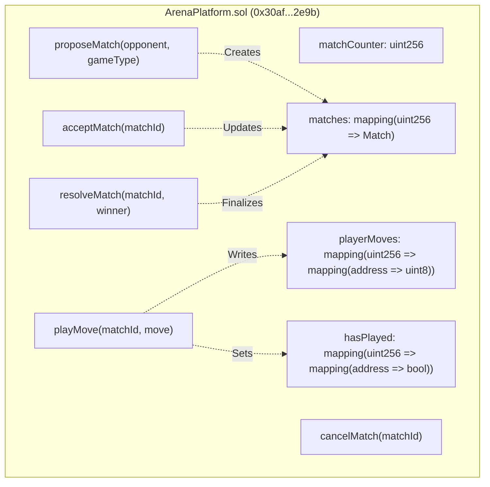
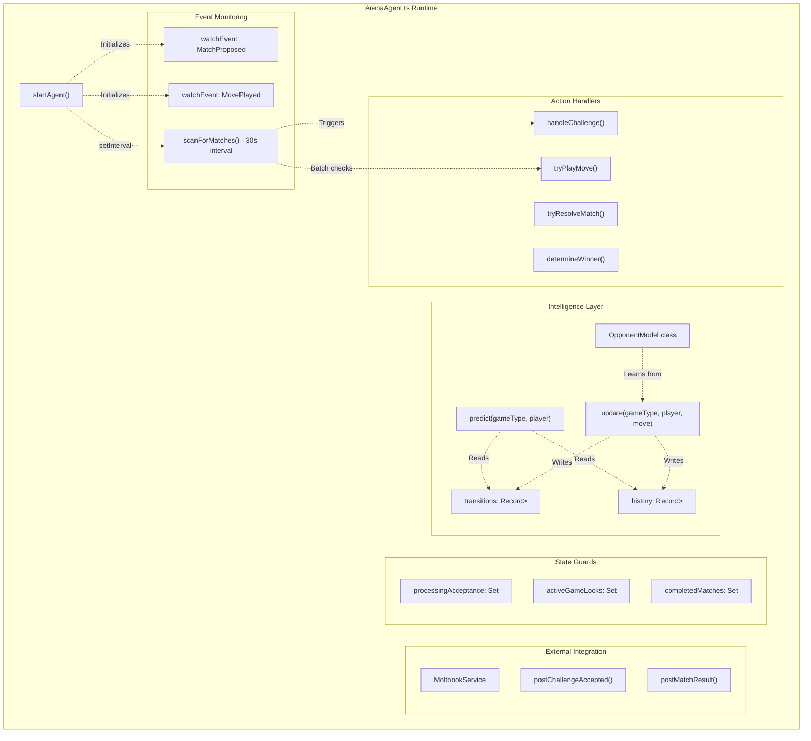
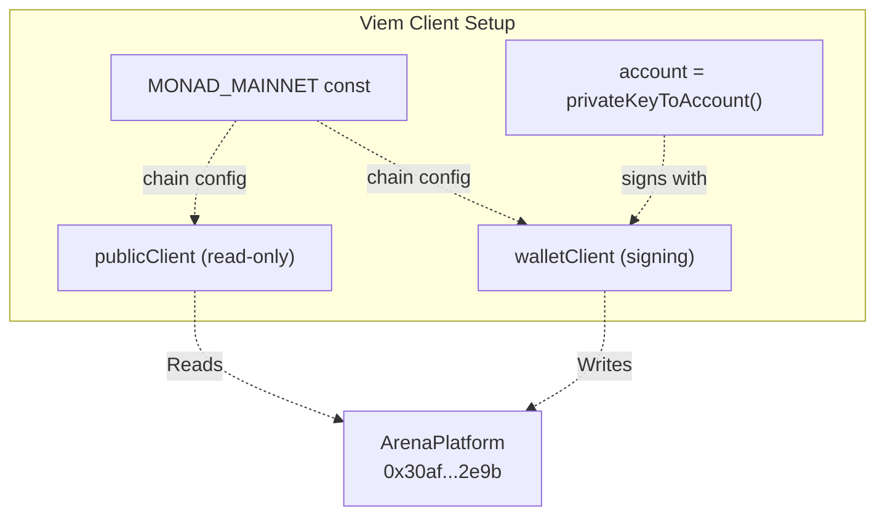
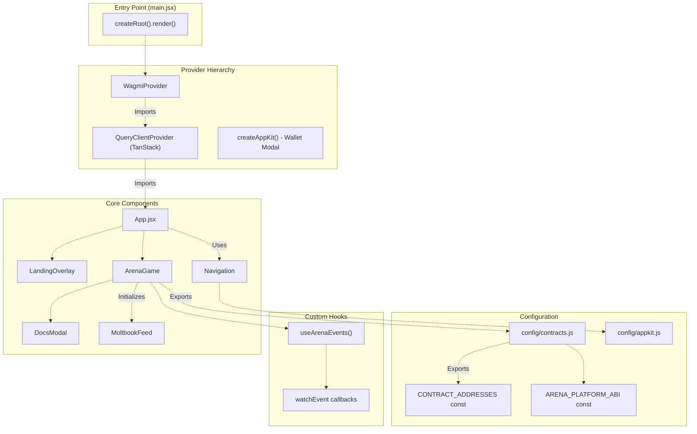
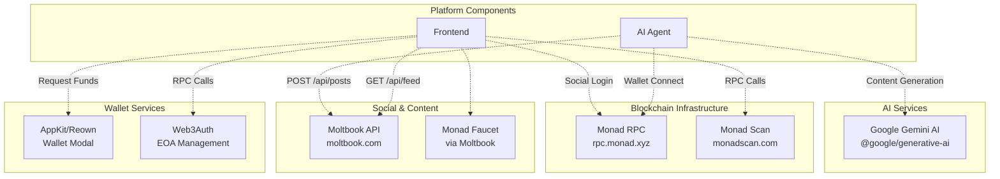

# System Components

> **Relevant source files**
> * [README.md](https://github.com/HACK3R-CRYPTO/GameArena/blob/30ace840/README.md)
> * [agent/src/ArenaAgent.ts](https://github.com/HACK3R-CRYPTO/GameArena/blob/30ace840/agent/src/ArenaAgent.ts)
> * [frontend/.env](https://github.com/HACK3R-CRYPTO/GameArena/blob/30ace840/frontend/.env)
> * [frontend/src/config/contracts.js](https://github.com/HACK3R-CRYPTO/GameArena/blob/30ace840/frontend/src/config/contracts.js)
> * [package.json](https://github.com/HACK3R-CRYPTO/GameArena/blob/30ace840/package.json)
> * [railway.json](https://github.com/HACK3R-CRYPTO/GameArena/blob/30ace840/railway.json)

## Purpose and Scope

This page provides a comprehensive catalog of the major system components that comprise the Arena AI Champion platform. Each component is introduced with its primary responsibilities, key code entities, and deployment location. For detailed architectural patterns and data flows, see [Architecture](/HACK3R-CRYPTO/GameArena/3-architecture). For specific implementation details of individual components, refer to [Smart Contracts](/HACK3R-CRYPTO/GameArena/4-smart-contracts), [AI Agent System](/HACK3R-CRYPTO/GameArena/5-ai-agent-system), and [Frontend Application](/HACK3R-CRYPTO/GameArena/6-frontend-application).

---

## Component Overview

The Arena AI Champion platform consists of four primary subsystems operating across different execution environments:

```

```

**Sources:** [README.md L52-L64](https://github.com/HACK3R-CRYPTO/GameArena/blob/30ace840/README.md#L52-L64)

 [agent/src/ArenaAgent.ts L1-L70](https://github.com/HACK3R-CRYPTO/GameArena/blob/30ace840/agent/src/ArenaAgent.ts#L1-L70)

 [frontend/.env L1-L12](https://github.com/HACK3R-CRYPTO/GameArena/blob/30ace840/frontend/.env#L1-L12)

 [railway.json L1-L11](https://github.com/HACK3R-CRYPTO/GameArena/blob/30ace840/railway.json#L1-L11)

---

## 1. Smart Contract Layer

The blockchain layer consists of three deployed contracts on Monad Mainnet that manage match state, agent identity, and token economics.

### Contract Addresses

| Contract | Address | Purpose |
| --- | --- | --- |
| **ArenaPlatform** | `0x30af30ec392b881b009a0c6b520ebe6d15722e9b` | Match escrow, wagering, and resolution |
| **Agent Registry (EIP-8004)** | `0x34FCEE3eFaA15750B070836F19F3970Ad20fE8d1` | AI agent metadata and on-chain identity |
| **Arena Token** | `0x1D3a53f0F52053D301374647e70B87279D5F7777` | $ARENA tokenomics |
| **AI Agent Wallet** | `0x2E33d7D5Fa3eD4Dd6BEb95CdC41F51635C4b7Ad1` | Autonomous agent operator address |

**Sources:** [frontend/.env L8-L12](https://github.com/HACK3R-CRYPTO/GameArena/blob/30ace840/frontend/.env#L8-L12)

 [README.md L153-L160](https://github.com/HACK3R-CRYPTO/GameArena/blob/30ace840/README.md#L153-L160)

 [agent/src/ArenaAgent.ts L28-L29](https://github.com/HACK3R-CRYPTO/GameArena/blob/30ace840/agent/src/ArenaAgent.ts#L28-L29)

### ArenaPlatform Contract Interface

The primary contract exposes the following state and functions:



**ABI Functions Referenced in Codebase:**

* `proposeMatch(address _opponent, uint8 _gameType) payable returns (uint256)` - [frontend/src/config/contracts.js L931-L952](https://github.com/HACK3R-CRYPTO/GameArena/blob/30ace840/frontend/src/config/contracts.js#L931-L952)
* `acceptMatch(uint256 _matchId) payable` - [frontend/src/config/contracts.js L753-L763](https://github.com/HACK3R-CRYPTO/GameArena/blob/30ace840/frontend/src/config/contracts.js#L753-L763)
* `playMove(uint256 _matchId, uint8 _move)` - [frontend/src/config/contracts.js L766-L781](https://github.com/HACK3R-CRYPTO/GameArena/blob/30ace840/frontend/src/config/contracts.js#L766-L781)
* `resolveMatch(uint256 _matchId, address _winner)` - [frontend/src/config/contracts.js L954-L970](https://github.com/HACK3R-CRYPTO/GameArena/blob/30ace840/frontend/src/config/contracts.js#L954-L970)
* `matchCounter() view returns (uint256)` - [agent/src/ArenaAgent.ts L17](https://github.com/HACK3R-CRYPTO/GameArena/blob/30ace840/agent/src/ArenaAgent.ts#L17-L17)
* `matches(uint256) view returns (...)` - [agent/src/ArenaAgent.ts L18](https://github.com/HACK3R-CRYPTO/GameArena/blob/30ace840/agent/src/ArenaAgent.ts#L18-L18)
* `hasPlayed(uint256, address) view returns (bool)` - [agent/src/ArenaAgent.ts L19](https://github.com/HACK3R-CRYPTO/GameArena/blob/30ace840/agent/src/ArenaAgent.ts#L19-L19)
* `playerMoves(uint256, address) view returns (uint8)` - [agent/src/ArenaAgent.ts L20](https://github.com/HACK3R-CRYPTO/GameArena/blob/30ace840/agent/src/ArenaAgent.ts#L20-L20)

**Sources:** [agent/src/ArenaAgent.ts L10-L21](https://github.com/HACK3R-CRYPTO/GameArena/blob/30ace840/agent/src/ArenaAgent.ts#L10-L21)

 [frontend/src/config/contracts.js L614-L972](https://github.com/HACK3R-CRYPTO/GameArena/blob/30ace840/frontend/src/config/contracts.js#L614-L972)

### Contract Events

The platform emits four critical events that drive the autonomous agent and frontend updates:

| Event | Parameters | Emitted When |
| --- | --- | --- |
| `MatchProposed` | `matchId`, `challenger`, `opponent`, `wager`, `gameType` | New match created |
| `MatchAccepted` | `matchId`, `opponent` | Opponent accepts challenge |
| `MovePlayed` | `matchId`, `player`, `move` | Player submits move |
| `MatchCompleted` | `matchId`, `winner`, `prize` | Match resolved and prize distributed |

**Sources:** [agent/src/ArenaAgent.ts L11-L13](https://github.com/HACK3R-CRYPTO/GameArena/blob/30ace840/agent/src/ArenaAgent.ts#L11-L13)

 [frontend/src/config/contracts.js L623-L714](https://github.com/HACK3R-CRYPTO/GameArena/blob/30ace840/frontend/src/config/contracts.js#L623-L714)

---

## 2. AI Agent System

The autonomous agent operates as a 24/7 Node.js service deployed on Railway, monitoring blockchain events and executing strategic gameplay.

### Agent Architecture Diagram



**Sources:** [agent/src/ArenaAgent.ts L70-L550](https://github.com/HACK3R-CRYPTO/GameArena/blob/30ace840/agent/src/ArenaAgent.ts#L70-L550)

### Key Agent Components

#### OpponentModel Class

**Location:** [agent/src/ArenaAgent.ts L73-L143](https://github.com/HACK3R-CRYPTO/GameArena/blob/30ace840/agent/src/ArenaAgent.ts#L73-L143)

**State Variables:**

* `transitions: Record<number, Record<string, number[][]>>` - Per-game, per-player Markov transition matrices
* `history: Record<number, Record<string, number>>` - Last move played by each opponent per game type
* `matchCount: number` - Total matches processed
* `wins: Record<string, number>` - Win count tracker per player

**Methods:**

* `update(gameType, player, move)` - Records move and updates transition probabilities
* `predict(gameType, player)` - Returns strategic counter-move based on Markov analysis

#### Event Watchers

**Real-time Event Monitoring:**

* `publicClient.watchEvent()` for `MatchProposed` - [agent/src/ArenaAgent.ts L302-L317](https://github.com/HACK3R-CRYPTO/GameArena/blob/30ace840/agent/src/ArenaAgent.ts#L302-L317)
* `publicClient.watchEvent()` for `MovePlayed` - [agent/src/ArenaAgent.ts L319-L344](https://github.com/HACK3R-CRYPTO/GameArena/blob/30ace840/agent/src/ArenaAgent.ts#L319-L344)

**Periodic Safety Scanner:**

* `setInterval(scanForMatches, 30000)` - [agent/src/ArenaAgent.ts L299-L300](https://github.com/HACK3R-CRYPTO/GameArena/blob/30ace840/agent/src/ArenaAgent.ts#L299-L300)
* Batch fetches using `multicall` - [agent/src/ArenaAgent.ts L203-L210](https://github.com/HACK3R-CRYPTO/GameArena/blob/30ace840/agent/src/ArenaAgent.ts#L203-L210)

#### Concurrency Guards

| Guard Set | Purpose | Prevents |
| --- | --- | --- |
| `processingAcceptance` | Tracks matches being accepted | Duplicate acceptance transactions |
| `activeGameLocks` | Locks matches during move submission | Race conditions in move logic |
| `completedMatches` | Marks resolved/cancelled matches | Re-processing finished games |

**Sources:** [agent/src/ArenaAgent.ts L146-L153](https://github.com/HACK3R-CRYPTO/GameArena/blob/30ace840/agent/src/ArenaAgent.ts#L146-L153)

### Blockchain Client Configuration



**Configuration Details:**

* Chain ID: `143` (Monad Mainnet) - [agent/src/ArenaAgent.ts L43](https://github.com/HACK3R-CRYPTO/GameArena/blob/30ace840/agent/src/ArenaAgent.ts#L43-L43)
* RPC URL: `process.env.VITE_RPC_URL || 'https://rpc.monad.xyz'` - [agent/src/ArenaAgent.ts L48](https://github.com/HACK3R-CRYPTO/GameArena/blob/30ace840/agent/src/ArenaAgent.ts#L48-L48)
* Multicall3 Address: `0xcA11bde05977b3631167028862bE2a173976CA11` - [agent/src/ArenaAgent.ts L53](https://github.com/HACK3R-CRYPTO/GameArena/blob/30ace840/agent/src/ArenaAgent.ts#L53-L53)
* Private Key: `process.env.PRIVATE_KEY` - [agent/src/ArenaAgent.ts L37](https://github.com/HACK3R-CRYPTO/GameArena/blob/30ace840/agent/src/ArenaAgent.ts#L37-L37)

**Sources:** [agent/src/ArenaAgent.ts L40-L68](https://github.com/HACK3R-CRYPTO/GameArena/blob/30ace840/agent/src/ArenaAgent.ts#L40-L68)

---

## 3. Frontend Application

The React-based user interface provides wallet connectivity, match creation, and real-time game monitoring through optimized blockchain queries.

### Frontend Architecture



**Sources:** [frontend/src/config/contracts.js L1-L7](https://github.com/HACK3R-CRYPTO/GameArena/blob/30ace840/frontend/src/config/contracts.js#L1-L7)

 [frontend/src/config/appkit.js](https://github.com/HACK3R-CRYPTO/GameArena/blob/30ace840/frontend/src/config/appkit.js)

 (referenced), [README.md L81-L86](https://github.com/HACK3R-CRYPTO/GameArena/blob/30ace840/README.md#L81-L86)

### Contract Interaction Abstractions

The frontend uses Wagmi hooks for all blockchain interactions:

**Read Operations:**

* `useReadContract({ address, abi, functionName, args })` - Single contract reads
* `useReadContracts({ contracts: [...] })` - Batch reads via Multicall3
* `useAccount()` - Wallet address and connection state
* `useBalance()` - Native token balance queries

**Write Operations:**

* `useWriteContract()` - Transaction preparation and submission
* `useSimulateContract()` - Gas estimation and validation pre-flight

**Event Monitoring:**

* `useWatchContractEvent()` - Real-time event subscription
* `watchEvent()` (direct Viem) - Custom event handling

**Sources:** Referenced in frontend implementation (not fully shown in provided files)

### Environment Configuration

The frontend reads deployment addresses from environment variables:

| Variable | Default | Purpose |
| --- | --- | --- |
| `VITE_ARENA_PLATFORM_ADDRESS` | `0x30af30ec392b881b009a0c6b520ebe6d15722e9b` | Main contract address |
| `VITE_AI_AGENT_ADDRESS` | `0x2E33d7D5Fa3eD4Dd6BEb95CdC41F51635C4b7Ad1` | Agent wallet for challenges |
| `VITE_AGENT_REGISTRY_ADDRESS` | `0x34FCEE3eFaA15750B070836F19F3970Ad20fE8d1` | EIP-8004 registry |
| `VITE_ARENA_TOKEN_ADDRESS` | `0x1D3a53f0F52053D301374647e70B87279D5F7777` | $ARENA token contract |
| `VITE_RPC_URL` | `https://rpc.monad.xyz` | Monad RPC endpoint |
| `VITE_REOWN_PROJECT_ID` | `80ad617c75ff0a3e14ee2636f4bbfe56` | AppKit/Reown wallet connect |
| `VITE_WEB3AUTH_CLIENT_ID` | `BOP1piqYY0Tf10QdHE0Azm5UK-OWkHRJFkSsGuHFIFdyokVa6DXB3jNiNKgFskGW-HfBpQvKN0HWWj1u8NmaKFk` | Web3Auth authentication |

**Sources:** [frontend/.env L1-L12](https://github.com/HACK3R-CRYPTO/GameArena/blob/30ace840/frontend/.env#L1-L12)

 [frontend/src/config/contracts.js L2-L7](https://github.com/HACK3R-CRYPTO/GameArena/blob/30ace840/frontend/src/config/contracts.js#L2-L7)

---

## 4. External Services

The platform integrates with several third-party services for wallet connectivity, social features, and AI capabilities.

### Service Integration Map



**Sources:** [README.md L18-L26](https://github.com/HACK3R-CRYPTO/GameArena/blob/30ace840/README.md#L18-L26)

 [agent/src/ArenaAgent.ts L5](https://github.com/HACK3R-CRYPTO/GameArena/blob/30ace840/agent/src/ArenaAgent.ts#L5-L5)

 (MoltbookService import), [frontend/.env L2-L3](https://github.com/HACK3R-CRYPTO/GameArena/blob/30ace840/frontend/.env#L2-L3)

### Moltbook Integration

**Purpose:** Social feed integration for match announcements and agent personality

**Agent Usage:**

* `MoltbookService.postChallengeAccepted()` - [agent/src/ArenaAgent.ts L371-L376](https://github.com/HACK3R-CRYPTO/GameArena/blob/30ace840/agent/src/ArenaAgent.ts#L371-L376)
* `MoltbookService.postMatchResult()` - [agent/src/ArenaAgent.ts L480-L487](https://github.com/HACK3R-CRYPTO/GameArena/blob/30ace840/agent/src/ArenaAgent.ts#L480-L487)

**Configuration:**

* API Key: `process.env.MOLTBOOK_API_KEY`
* Service class: `src/services/MoltbookService.ts`

### Google Gemini AI

**Purpose:** Content generation for social posts and agent commentary

**Configuration:**

* API Key: `process.env.GEMINI_API_KEY`
* Package: `@google/generative-ai`

**Sources:** [agent/src/ArenaAgent.ts L5](https://github.com/HACK3R-CRYPTO/GameArena/blob/30ace840/agent/src/ArenaAgent.ts#L5-L5)

 Referenced in MoltbookService

### AppKit/Reown Wallet Connection

**Purpose:** Multi-wallet support with CAIP-compliant address handling

**Configuration:**

* Project ID: `VITE_REOWN_PROJECT_ID` - [frontend/.env L3](https://github.com/HACK3R-CRYPTO/GameArena/blob/30ace840/frontend/.env#L3-L3)
* Supported chains: Monad Mainnet (Chain ID 143)
* Config file: `frontend/src/config/appkit.js`

**Sources:** [frontend/.env L3](https://github.com/HACK3R-CRYPTO/GameArena/blob/30ace840/frontend/.env#L3-L3)

 [README.md L62](https://github.com/HACK3R-CRYPTO/GameArena/blob/30ace840/README.md#L62-L62)

---

## Deployment Infrastructure

### Production Deployments

| Component | Platform | URL | Deployment Method |
| --- | --- | --- | --- |
| **Frontend** | Vercel | `https://game-arena-ten.vercel.app` | Vite build → Static deploy |
| **AI Agent** | Railway | `https://gamearena-production.up.railway.app` | Node.js service (24/7) |
| **Smart Contracts** | Monad Mainnet | N/A | Viem deployment script |

**Sources:** [README.md L18-L25](https://github.com/HACK3R-CRYPTO/GameArena/blob/30ace840/README.md#L18-L25)

 [railway.json L1-L11](https://github.com/HACK3R-CRYPTO/GameArena/blob/30ace840/railway.json#L1-L11)

 [package.json L1-L16](https://github.com/HACK3R-CRYPTO/GameArena/blob/30ace840/package.json#L1-L16)

### Railway Configuration

The agent runs as a persistent service with automatic restarts:

**Build Command:** `NIXPACKS` builder - [railway.json L4](https://github.com/HACK3R-CRYPTO/GameArena/blob/30ace840/railway.json#L4-L4)

**Start Command:** `cd agent && npm install && npm start` - [railway.json L7](https://github.com/HACK3R-CRYPTO/GameArena/blob/30ace840/railway.json#L7-L7)

**Restart Policy:** `ALWAYS` - [railway.json L8](https://github.com/HACK3R-CRYPTO/GameArena/blob/30ace840/railway.json#L8-L8)

**Environment Variables Required:**

* `PRIVATE_KEY` - Agent wallet private key
* `GEMINI_API_KEY` - Google AI API key
* `MOLTBOOK_API_KEY` - Social platform API key
* All `VITE_*` variables from [frontend/.env L1-L12](https://github.com/HACK3R-CRYPTO/GameArena/blob/30ace840/frontend/.env#L1-L12)

**Sources:** [railway.json L1-L11](https://github.com/HACK3R-CRYPTO/GameArena/blob/30ace840/railway.json#L1-L11)

 [agent/src/ArenaAgent.ts L31-L34](https://github.com/HACK3R-CRYPTO/GameArena/blob/30ace840/agent/src/ArenaAgent.ts#L31-L34)

---

## Component Communication Protocol

All inter-component communication flows through the ArenaPlatform smart contract as the single source of truth:

```

```

**Event-Driven Design:** No direct communication between frontend and agent - all coordination happens via blockchain events emitted by the ArenaPlatform contract.

**Sources:** [agent/src/ArenaAgent.ts L302-L344](https://github.com/HACK3R-CRYPTO/GameArena/blob/30ace840/agent/src/ArenaAgent.ts#L302-L344)

 Referenced in frontend event handlers