# UI Components

> **Relevant source files**
> * [frontend/package-lock.json](https://github.com/HACK3R-CRYPTO/GameArena/blob/30ace840/frontend/package-lock.json)
> * [frontend/package.json](https://github.com/HACK3R-CRYPTO/GameArena/blob/30ace840/frontend/package.json)
> * [frontend/src/components/DocsModal.jsx](https://github.com/HACK3R-CRYPTO/GameArena/blob/30ace840/frontend/src/components/DocsModal.jsx)
> * [frontend/src/components/LandingOverlay.jsx](https://github.com/HACK3R-CRYPTO/GameArena/blob/30ace840/frontend/src/components/LandingOverlay.jsx)
> * [frontend/src/components/MoltbookFeed.jsx](https://github.com/HACK3R-CRYPTO/GameArena/blob/30ace840/frontend/src/components/MoltbookFeed.jsx)
> * [frontend/src/hooks/useArenaEvents.jsx](https://github.com/HACK3R-CRYPTO/GameArena/blob/30ace840/frontend/src/hooks/useArenaEvents.jsx)
> * [frontend/src/index.css](https://github.com/HACK3R-CRYPTO/GameArena/blob/30ace840/frontend/src/index.css)

This page documents the supporting UI components that provide entry experience, documentation, social integration, real-time event monitoring, and styling infrastructure for the Arena platform. These components work alongside the main ArenaGame interface (see [ArenaGame Component](/HACK3R-CRYPTO/GameArena/6.2-arenagame-component)) to create a complete user experience.

For the overall application structure and routing, see [Application Structure](/HACK3R-CRYPTO/GameArena/6.1-application-structure). For wallet integration components, see [Wallet Integration](/HACK3R-CRYPTO/GameArena/6.3-wallet-integration).

---

## Component Architecture Overview

The UI component system consists of three presentation components, one custom hook for blockchain events, and a global styling system:


Sources: [frontend/src/components/LandingOverlay.jsx L1-L95](https://github.com/HACK3R-CRYPTO/GameArena/blob/30ace840/frontend/src/components/LandingOverlay.jsx#L1-L95)

 [frontend/src/components/DocsModal.jsx L1-L127](https://github.com/HACK3R-CRYPTO/GameArena/blob/30ace840/frontend/src/components/DocsModal.jsx#L1-L127)

 [frontend/src/components/MoltbookFeed.jsx L1-L173](https://github.com/HACK3R-CRYPTO/GameArena/blob/30ace840/frontend/src/components/MoltbookFeed.jsx#L1-L173)

 [frontend/src/hooks/useArenaEvents.jsx L1-L113](https://github.com/HACK3R-CRYPTO/GameArena/blob/30ace840/frontend/src/hooks/useArenaEvents.jsx#L1-L113)

 [frontend/src/index.css L1-L115](https://github.com/HACK3R-CRYPTO/GameArena/blob/30ace840/frontend/src/index.css#L1-L115)

---

## LandingOverlay Component

**Purpose:** Provides an immersive terminal-style entry experience with typewriter animation before users access the main Arena interface.

### Component Structure

| Property | Type | Description |
| --- | --- | --- |
| `onEnter` | Function | Callback invoked when user clicks "ENTER_ARENA" button |
| `text` | State | Current typewriter text being displayed |
| `showButton` | State | Controls button visibility after animation completes |
| `fullText` | Constant | Complete system initialization message |

### Implementation Details

The component implements a typewriter effect using a `setInterval` timer that increments through the `fullText` string character by character at 30ms intervals:

**Text Animation:** [frontend/src/components/LandingOverlay.jsx L8-L19](https://github.com/HACK3R-CRYPTO/GameArena/blob/30ace840/frontend/src/components/LandingOverlay.jsx#L8-L19)

```
useEffect with setInterval
→ Updates text state every 30ms
→ On completion: setShowButton(true)
→ Cleanup: clearInterval on unmount
```

**Visual Elements:**

* Terminal window mockup with status indicators (red/yellow/green dots)
* Animated lobster emoji (🦞) with bounce animation
* Gradient text title "ARENA_CHAMPION"
* External links to Arena Token, Skill Docs, and Monad Network

```css
#mermaid-o6r63eyck9l{font-family:ui-sans-serif,-apple-system,system-ui,Segoe UI,Helvetica;font-size:16px;fill:#333;}@keyframes edge-animation-frame{from{stroke-dashoffset:0;}}@keyframes dash{to{stroke-dashoffset:0;}}#mermaid-o6r63eyck9l .edge-animation-slow{stroke-dasharray:9,5!important;stroke-dashoffset:900;animation:dash 50s linear infinite;stroke-linecap:round;}#mermaid-o6r63eyck9l .edge-animation-fast{stroke-dasharray:9,5!important;stroke-dashoffset:900;animation:dash 20s linear infinite;stroke-linecap:round;}#mermaid-o6r63eyck9l .error-icon{fill:#dddddd;}#mermaid-o6r63eyck9l .error-text{fill:#222222;stroke:#222222;}#mermaid-o6r63eyck9l .edge-thickness-normal{stroke-width:1px;}#mermaid-o6r63eyck9l .edge-thickness-thick{stroke-width:3.5px;}#mermaid-o6r63eyck9l .edge-pattern-solid{stroke-dasharray:0;}#mermaid-o6r63eyck9l .edge-thickness-invisible{stroke-width:0;fill:none;}#mermaid-o6r63eyck9l .edge-pattern-dashed{stroke-dasharray:3;}#mermaid-o6r63eyck9l .edge-pattern-dotted{stroke-dasharray:2;}#mermaid-o6r63eyck9l .marker{fill:#999;stroke:#999;}#mermaid-o6r63eyck9l .marker.cross{stroke:#999;}#mermaid-o6r63eyck9l svg{font-family:ui-sans-serif,-apple-system,system-ui,Segoe UI,Helvetica;font-size:16px;}#mermaid-o6r63eyck9l p{margin:0;}#mermaid-o6r63eyck9l defs #statediagram-barbEnd{fill:#999;stroke:#999;}#mermaid-o6r63eyck9l g.stateGroup text{fill:#dddddd;stroke:none;font-size:10px;}#mermaid-o6r63eyck9l g.stateGroup text{fill:#333;stroke:none;font-size:10px;}#mermaid-o6r63eyck9l g.stateGroup .state-title{font-weight:bolder;fill:#333;}#mermaid-o6r63eyck9l g.stateGroup rect{fill:#ffffff;stroke:#dddddd;}#mermaid-o6r63eyck9l g.stateGroup line{stroke:#999;stroke-width:1;}#mermaid-o6r63eyck9l .transition{stroke:#999;stroke-width:1;fill:none;}#mermaid-o6r63eyck9l .stateGroup .composit{fill:#f4f4f4;border-bottom:1px;}#mermaid-o6r63eyck9l .stateGroup .alt-composit{fill:#e0e0e0;border-bottom:1px;}#mermaid-o6r63eyck9l .state-note{stroke:#e6d280;fill:#fff5ad;}#mermaid-o6r63eyck9l .state-note text{fill:#333;stroke:none;font-size:10px;}#mermaid-o6r63eyck9l .stateLabel .box{stroke:none;stroke-width:0;fill:#ffffff;opacity:0.5;}#mermaid-o6r63eyck9l .edgeLabel .label rect{fill:#ffffff;opacity:0.5;}#mermaid-o6r63eyck9l .edgeLabel{background-color:#ffffff;text-align:center;}#mermaid-o6r63eyck9l .edgeLabel p{background-color:#ffffff;}#mermaid-o6r63eyck9l .edgeLabel rect{opacity:0.5;background-color:#ffffff;fill:#ffffff;}#mermaid-o6r63eyck9l .edgeLabel .label text{fill:#333;}#mermaid-o6r63eyck9l .label div .edgeLabel{color:#333;}#mermaid-o6r63eyck9l .stateLabel text{fill:#333;font-size:10px;font-weight:bold;}#mermaid-o6r63eyck9l .node circle.state-start{fill:#999;stroke:#999;}#mermaid-o6r63eyck9l .node .fork-join{fill:#999;stroke:#999;}#mermaid-o6r63eyck9l .node circle.state-end{fill:#dddddd;stroke:#f4f4f4;stroke-width:1.5;}#mermaid-o6r63eyck9l .end-state-inner{fill:#f4f4f4;stroke-width:1.5;}#mermaid-o6r63eyck9l .node rect{fill:#ffffff;stroke:#dddddd;stroke-width:1px;}#mermaid-o6r63eyck9l .node polygon{fill:#ffffff;stroke:#dddddd;stroke-width:1px;}#mermaid-o6r63eyck9l #statediagram-barbEnd{fill:#999;}#mermaid-o6r63eyck9l .statediagram-cluster rect{fill:#ffffff;stroke:#dddddd;stroke-width:1px;}#mermaid-o6r63eyck9l .cluster-label,#mermaid-o6r63eyck9l .nodeLabel{color:#333;}#mermaid-o6r63eyck9l .statediagram-cluster rect.outer{rx:5px;ry:5px;}#mermaid-o6r63eyck9l .statediagram-state .divider{stroke:#dddddd;}#mermaid-o6r63eyck9l .statediagram-state .title-state{rx:5px;ry:5px;}#mermaid-o6r63eyck9l .statediagram-cluster.statediagram-cluster .inner{fill:#f4f4f4;}#mermaid-o6r63eyck9l .statediagram-cluster.statediagram-cluster-alt .inner{fill:#f8f8f8;}#mermaid-o6r63eyck9l .statediagram-cluster .inner{rx:0;ry:0;}#mermaid-o6r63eyck9l .statediagram-state rect.basic{rx:5px;ry:5px;}#mermaid-o6r63eyck9l .statediagram-state rect.divider{stroke-dasharray:10,10;fill:#f8f8f8;}#mermaid-o6r63eyck9l .note-edge{stroke-dasharray:5;}#mermaid-o6r63eyck9l .statediagram-note rect{fill:#fff5ad;stroke:#e6d280;stroke-width:1px;rx:0;ry:0;}#mermaid-o6r63eyck9l .statediagram-note rect{fill:#fff5ad;stroke:#e6d280;stroke-width:1px;rx:0;ry:0;}#mermaid-o6r63eyck9l .statediagram-note text{fill:#333;}#mermaid-o6r63eyck9l .statediagram-note .nodeLabel{color:#333;}#mermaid-o6r63eyck9l .statediagram .edgeLabel{color:red;}#mermaid-o6r63eyck9l #dependencyStart,#mermaid-o6r63eyck9l #dependencyEnd{fill:#999;stroke:#999;stroke-width:1;}#mermaid-o6r63eyck9l .statediagramTitleText{text-anchor:middle;font-size:18px;fill:#333;}#mermaid-o6r63eyck9l :root{--mermaid-font-family:"trebuchet ms",verdana,arial,sans-serif;}Component loadsStart intervaltext += char (every 30ms)All chars displayedsetShowButton(true)onEnter() calledMountingTypingCompleteButtonVisiblefullText sliced to i charsAnimated cursor (_) displaysButton fades in withopacity transition (1s)
```

Sources: [frontend/src/components/LandingOverlay.jsx L3-L19](https://github.com/HACK3R-CRYPTO/GameArena/blob/30ace840/frontend/src/components/LandingOverlay.jsx#L3-L19)

 [frontend/src/components/LandingOverlay.jsx L38-L56](https://github.com/HACK3R-CRYPTO/GameArena/blob/30ace840/frontend/src/components/LandingOverlay.jsx#L38-L56)

### Styling Approach

The component uses a cyberpunk aesthetic with:

* Fixed full-screen overlay with `z-[100]` to appear above all content
* Dark background `#050505` with blur and semi-transparent borders
* Purple gradient shadows `rgba(139,92,246,0.1)` for depth
* Monospace font from global `font-mono` class

**Key CSS Classes:** [frontend/src/components/LandingOverlay.jsx L22-L90](https://github.com/HACK3R-CRYPTO/GameArena/blob/30ace840/frontend/src/components/LandingOverlay.jsx#L22-L90)

* `fixed inset-0 z-[100]` - Full screen overlay
* `bg-black/50 backdrop-blur` - Glass morphism effect
* `shadow-[0_0_50px_rgba(139,92,246,0.1)]` - Purple glow
* `animate-pulse` - Cursor blink effect
* `animate-bounce` - Lobster emoji animation

Sources: [frontend/src/components/LandingOverlay.jsx L22-L90](https://github.com/HACK3R-CRYPTO/GameArena/blob/30ace840/frontend/src/components/LandingOverlay.jsx#L22-L90)

---

## DocsModal Component

**Purpose:** Renders an in-application documentation modal explaining game rules, AI behavior, and developer integration examples without leaving the interface.

### Component Props and State

| Property | Type | Description |
| --- | --- | --- |
| `isOpen` | Boolean | Controls modal visibility |
| `onClose` | Function | Callback to dismiss modal |

### Content Sections

The modal is organized into three primary documentation sections:

**1. Mission Brief** [frontend/src/components/DocsModal.jsx L28-L44](https://github.com/HACK3R-CRYPTO/GameArena/blob/30ace840/frontend/src/components/DocsModal.jsx#L28-L44)

* Platform overview
* Core features list (1v1, winner takes all, Markov learning)
* Emphasis on "YOU WIN ALL TIES" rule

**2. Game Protocols** [frontend/src/components/DocsModal.jsx L47-L75](https://github.com/HACK3R-CRYPTO/GameArena/blob/30ace840/frontend/src/components/DocsModal.jsx#L47-L75)

* Three game type explanations in grid layout: * Rock-Paper-Scissors (0=Rock, 1=Paper, 2=Scissors) * Dice Roll (1-6, highest wins, ties go to player) * Coin Flip (0=Heads, 1=Tails, pattern-based AI)

**3. Agent Integration** [frontend/src/components/DocsModal.jsx L78-L118](https://github.com/HACK3R-CRYPTO/GameArena/blob/30ace840/frontend/src/components/DocsModal.jsx#L78-L118)

* JavaScript/Viem code example for bot developers
* Event watching pattern
* Contract interaction flow
* Link to full ARENA_SKILL.md documentation

```mermaid
flowchart TD

MODAL["DocsModal Component"]
SECTION1["Mission Brief<br>Feature List"]
SECTION2["Game Protocols<br>3-Column Grid"]
SECTION3["Agent Integration<br>Code Example"]
RPS["Rock-Paper-Scissors<br>✊ Move: 0-2"]
DICE["Dice Roll<br>🎲 Move: 1-6"]
COIN["Coin Flip<br>🪙 Move: 0-1"]
EVENT["watchEvent Pattern"]
ACCEPT["acceptMatch() Call"]
PLAY["playMove() Call"]
LINK["External Link<br>/ARENA_SKILL.md"]

MODAL -.-> SECTION1
MODAL -.-> SECTION2
MODAL -.-> SECTION3
SECTION2 -.-> RPS
SECTION2 -.-> DICE
SECTION2 -.-> COIN
SECTION3 -.-> EVENT
SECTION3 -.-> ACCEPT
SECTION3 -.-> PLAY
SECTION3 -.-> LINK
```



Sources: [frontend/src/components/DocsModal.jsx L25-L121](https://github.com/HACK3R-CRYPTO/GameArena/blob/30ace840/frontend/src/components/DocsModal.jsx#L25-L121)

### Modal Implementation

The modal uses a portal-like approach with full-screen backdrop:

**Layout Structure:**

* Fixed positioning with `z-[200]` (higher than LandingOverlay)
* Black backdrop with 80% opacity and blur: `bg-black/80 backdrop-blur-sm`
* Scrollable content area with custom scrollbar styling
* Close button in header with `X` icon from lucide-react

**Conditional Rendering:** [frontend/src/components/DocsModal.jsx L4-L5](https://github.com/HACK3R-CRYPTO/GameArena/blob/30ace840/frontend/src/components/DocsModal.jsx#L4-L5)

```
if (!isOpen) return null;
```

This early return prevents rendering when modal is closed, improving performance.

Sources: [frontend/src/components/DocsModal.jsx L4-L22](https://github.com/HACK3R-CRYPTO/GameArena/blob/30ace840/frontend/src/components/DocsModal.jsx#L4-L22)

---

## MoltbookFeed Component

**Purpose:** Displays real-time social feed updates from the Moltbook platform, showing Arena Champion AI posts and battle announcements in the game-arena submolt.

### Component Architecture


Sources: [frontend/src/components/MoltbookFeed.jsx L4-L23](https://github.com/HACK3R-CRYPTO/GameArena/blob/30ace840/frontend/src/components/MoltbookFeed.jsx#L4-L23)

 [frontend/src/components/MoltbookFeed.jsx L25-L52](https://github.com/HACK3R-CRYPTO/GameArena/blob/30ace840/frontend/src/components/MoltbookFeed.jsx#L25-L52)

### Error Boundary Implementation

The component uses a React Error Boundary class component to prevent feed crashes from affecting the main game interface:

**Error Boundary:** [frontend/src/components/MoltbookFeed.jsx L4-L23](https://github.com/HACK3R-CRYPTO/GameArena/blob/30ace840/frontend/src/components/MoltbookFeed.jsx#L4-L23)

* `getDerivedStateFromError()` sets `hasError: true` on any child error
* Renders fallback UI: `FEED_RENDER_ERROR — Refresh page to retry`
* Styled with red theme: `border-red-500/20 bg-red-500/5`

This isolation ensures MoltbookFeed failures don't crash the entire application.

### Data Fetching and State Management

| State Variable | Type | Description |
| --- | --- | --- |
| `posts` | Array | Fetched post objects from Moltbook API |
| `loading` | Boolean | Indicates initial fetch in progress |
| `error` | String/Null | Error message if fetch fails |

**API Endpoint:** [frontend/src/components/MoltbookFeed.jsx L30-L52](https://github.com/HACK3R-CRYPTO/GameArena/blob/30ace840/frontend/src/components/MoltbookFeed.jsx#L30-L52)

```
GET https://www.moltbook.com/api/v1/posts
Query Parameters: submolt=game-arena&limit=10
```

**Polling Strategy:**

* Initial fetch on mount via `useEffect`
* 60-second interval refresh: `setInterval(fetchPosts, 60000)`
* Cleanup on unmount: `clearInterval(interval)`

Sources: [frontend/src/components/MoltbookFeed.jsx L54-L58](https://github.com/HACK3R-CRYPTO/GameArena/blob/30ace840/frontend/src/components/MoltbookFeed.jsx#L54-L58)

### Content Rendering Helpers

The component includes safe helper functions to handle variable API response structures:

**Helper Functions:** [frontend/src/components/MoltbookFeed.jsx L60-L86](https://github.com/HACK3R-CRYPTO/GameArena/blob/30ace840/frontend/src/components/MoltbookFeed.jsx#L60-L86)

| Function | Purpose |
| --- | --- |
| `getSubmoltName(post)` | Extracts submolt name, handles string or object types |
| `getAuthorName(post)` | Gets author name from `agent.name` or `author.name` |
| `getTimeString(post)` | Formats `created_at` timestamp, catches parsing errors |
| `formatContent(content)` | Truncates long Ethereum addresses (0x...7Ad1 format) |

**Address Truncation Pattern:** [frontend/src/components/MoltbookFeed.jsx L81-L85](https://github.com/HACK3R-CRYPTO/GameArena/blob/30ace840/frontend/src/components/MoltbookFeed.jsx#L81-L85)

```javascript
content.replace(/0x[a-fA-F0-9]{20,}/g, (addr) =>
    `${addr.slice(0, 6)}...${addr.slice(-4)}`
)
```

This regex finds Ethereum addresses and shortens them to first 6 and last 4 characters.

### Post Card Layout

Each post renders as a card with hover effects:

**Visual Structure:** [frontend/src/components/MoltbookFeed.jsx L113-L149](https://github.com/HACK3R-CRYPTO/GameArena/blob/30ace840/frontend/src/components/MoltbookFeed.jsx#L113-L149)

* Background: `bg-white/5` with `border-white/5`
* Hover: `hover:border-purple-500/30` transition
* Avatar: Purple circle with user icon
* Metadata: Author name, submolt (m/game-arena), timestamp
* Content: Monospace text with left border accent
* Actions: Comment, Heart, Repost icons with counts

Sources: [frontend/src/components/MoltbookFeed.jsx L105-L162](https://github.com/HACK3R-CRYPTO/GameArena/blob/30ace840/frontend/src/components/MoltbookFeed.jsx#L105-L162)

---

## useArenaEvents Hook

**Purpose:** Custom React hook that monitors Arena Platform contract events in real-time and triggers UI updates and toast notifications based on blockchain activity.

### Hook Interface

```javascript
function useArenaEvents({
    onMatchUpdate: Function,    // Callback to refresh match data
    onGlobalUpdate: Function,   // Callback for global state refresh
    address: string,            // Connected user's wallet address
    matches: Array              // Current matches for notification context
}): void
```

### Event Monitoring Architecture


Sources: [frontend/src/hooks/useArenaEvents.jsx L1-L113](https://github.com/HACK3R-CRYPTO/GameArena/blob/30ace840/frontend/src/hooks/useArenaEvents.jsx#L1-L113)

### Event Watchers

The hook establishes four parallel event watchers using wagmi's `useWatchContractEvent`:

**1. MatchProposed** [frontend/src/hooks/useArenaEvents.jsx L23-L32](https://github.com/HACK3R-CRYPTO/GameArena/blob/30ace840/frontend/src/hooks/useArenaEvents.jsx#L23-L32)

* Fires when new challenge is created
* Triggers `triggerUpdates()` to refresh match list
* No toast notification (too noisy)

**2. MatchAccepted** [frontend/src/hooks/useArenaEvents.jsx L34-L46](https://github.com/HACK3R-CRYPTO/GameArena/blob/30ace840/frontend/src/hooks/useArenaEvents.jsx#L34-L46)

* Fires when opponent accepts challenge
* Triggers `triggerUpdates()`
* Optional toast notification (currently commented out)

**3. MovePlayed** [frontend/src/hooks/useArenaEvents.jsx L48-L85](https://github.com/HACK3R-CRYPTO/GameArena/blob/30ace840/frontend/src/hooks/useArenaEvents.jsx#L48-L85)

* Fires when either player submits move
* **Most Complex Handler** - includes opponent notification logic
* Extracts `playerAddr`, `move`, `matchId` from event args
* Shows toast only if opponent (not current user) played
* Displays move icon and optional player's move for comparison

**4. MatchCompleted** [frontend/src/hooks/useArenaEvents.jsx L87-L111](https://github.com/HACK3R-CRYPTO/GameArena/blob/30ace840/frontend/src/hooks/useArenaEvents.jsx#L87-L111)

* Fires when match resolves
* Shows victory toast if user won: `🎉 You Won a Match!`
* Shows defeat toast if user lost: `💀 Match Completed - You Lost.`
* Checks if user was participant before showing defeat notification

### Toast Notification Logic

**Opponent Move Notification:** [frontend/src/hooks/useArenaEvents.jsx L62-L82](https://github.com/HACK3R-CRYPTO/GameArena/blob/30ace840/frontend/src/hooks/useArenaEvents.jsx#L62-L82)

```javascript
// Only notify if opponent played (not current user)
if (playerAddr.toLowerCase() !== address.toLowerCase()) {
    const match = matchesRef.current.find(m => m.id === matchId);
    const moveDisplay = getMoveDisplay(match.gameType, move);
    
    // Show opponent's move icon
    toast(`Opponent played ${moveDisplay.icon}`, {
        icon: '🤖',
        duration: 4000,
        style: { border: '1px solid #7c3aed', ... }
    });
}
```

The notification includes:

* Opponent's move as icon (🪨, 📄, ✂️, etc.)
* Optional comparison with user's move if already played
* Custom purple styling matching Arena theme
* 4-second duration

Sources: [frontend/src/hooks/useArenaEvents.jsx L48-L85](https://github.com/HACK3R-CRYPTO/GameArena/blob/30ace840/frontend/src/hooks/useArenaEvents.jsx#L48-L85)

### State Synchronization Pattern

The hook uses a `useRef` to maintain stable access to the current matches array:

**matchesRef Pattern:** [frontend/src/hooks/useArenaEvents.jsx L11-L15](https://github.com/HACK3R-CRYPTO/GameArena/blob/30ace840/frontend/src/hooks/useArenaEvents.jsx#L11-L15)

```javascript
const matchesRef = useRef(matches);

useEffect(() => {
    matchesRef.current = matches;
}, [matches]);
```

This pattern is necessary because:

1. Event watchers are created once on mount
2. Their closures capture initial `matches` value
3. `useRef` provides mutable reference that updates without recreating watchers
4. Avoids stale closure problem in async event handlers

Sources: [frontend/src/hooks/useArenaEvents.jsx L10-L15](https://github.com/HACK3R-CRYPTO/GameArena/blob/30ace840/frontend/src/hooks/useArenaEvents.jsx#L10-L15)

---

## Global Styling System

**Purpose:** Establishes design tokens, typography, utility classes, and theming infrastructure used across all components.

### Stylesheet Organization

| Section | Purpose | Line Range |
| --- | --- | --- |
| Imports | Tailwind and Google Fonts | [1-2](https://github.com/HACK3R-CRYPTO/GameArena/blob/30ace840/1-2) |
| Box Model | Global box-sizing | [4-6](https://github.com/HACK3R-CRYPTO/GameArena/blob/30ace840/4-6) |
| HTML/Body | Background gradients, base colors | [8-22](https://github.com/HACK3R-CRYPTO/GameArena/blob/30ace840/8-22) |
| Scrollbar | Custom scrollbar styling | [24-40](https://github.com/HACK3R-CRYPTO/GameArena/blob/30ace840/24-40) |
| Typography | Font families, heading styles | [42-54](https://github.com/HACK3R-CRYPTO/GameArena/blob/30ace840/42-54) |
| Utilities | Neon colors, glass effects | [56-74](https://github.com/HACK3R-CRYPTO/GameArena/blob/30ace840/56-74) |
| Buttons | Cyberpunk button styles | [88-108](https://github.com/HACK3R-CRYPTO/GameArena/blob/30ace840/88-108) |
| Layout | Container utilities | [110-115](https://github.com/HACK3R-CRYPTO/GameArena/blob/30ace840/110-115) |

Sources: [frontend/src/index.css L1-L115](https://github.com/HACK3R-CRYPTO/GameArena/blob/30ace840/frontend/src/index.css#L1-L115)

### Typography System

**Font Stack:** [frontend/src/index.css L2](https://github.com/HACK3R-CRYPTO/GameArena/blob/30ace840/frontend/src/index.css#L2-L2)

```javascript
@import url('https://fonts.googleapis.com/css2?family=Inter:wght@300;400;500;600;700&family=JetBrains+Mono:wght@400;500;700&display=swap');
```

| Font | Usage | Class |
| --- | --- | --- |
| Inter | Body text, UI elements | Default body font |
| JetBrains Mono | Code, headings, terminal UI | `.font-mono`, `.font-cyber` |

**Heading Configuration:** [frontend/src/index.css L43-L50](https://github.com/HACK3R-CRYPTO/GameArena/blob/30ace840/frontend/src/index.css#L43-L50)

* All headings use JetBrains Mono for cyberpunk aesthetic
* Tight letter spacing: `-0.02em`
* Applied to `h1, h2, h3, h4` and `.font-cyber` class

### Color Design Tokens

**Neon Color Utilities:** [frontend/src/index.css L57-L66](https://github.com/HACK3R-CRYPTO/GameArena/blob/30ace840/frontend/src/index.css#L57-L66)

| Class | Color | Hex | Usage |
| --- | --- | --- | --- |
| `.text-neon-cyan` | Cyan | `#00d4ff` | Accent highlights |
| `.text-neon-purple` | Purple | `#8b5cf6` | Primary brand color |
| `.text-neon-green` | Green | `#10b981` | Success states |

### Glass Morphism Effects

**Glass Panel Classes:** [frontend/src/index.css L69-L86](https://github.com/HACK3R-CRYPTO/GameArena/blob/30ace840/frontend/src/index.css#L69-L86)

```css
.glass-panel {
    background: rgba(10, 10, 15, 0.6);
    backdrop-filter: blur(8px);
    border: 1px solid rgba(255, 255, 255, 0.05);
    box-shadow: 0 4px 6px -1px rgba(0, 0, 0, 0.1);
}

.glass-card {
    background: #0a0a0a;
    border: 1px solid rgba(255, 255, 255, 0.05);
    transition: all 0.2s ease;
}

.glass-card:hover {
    border-color: rgba(139, 92, 246, 0.5);  /* Purple glow */
    box-shadow: 0 0 15px rgba(139, 92, 246, 0.1);
}
```

These utilities create the translucent panel effects seen throughout the Arena interface.

### Button System

**Cyberpunk Button Base:** [frontend/src/index.css L89-L96](https://github.com/HACK3R-CRYPTO/GameArena/blob/30ace840/frontend/src/index.css#L89-L96)

```
.btn-cyber {
    font-family: 'JetBrains Mono', monospace;
    font-weight: 600;
    text-transform: uppercase;
    letter-spacing: 0.05em;
    transition: all 0.2s;
}
```

**Primary Button Style:** [frontend/src/index.css L98-L107](https://github.com/HACK3R-CRYPTO/GameArena/blob/30ace840/frontend/src/index.css#L98-L107)

* Background: `#8b5cf6` (purple)
* Shadow: `0 0 10px rgba(139, 92, 246, 0.3)` (purple glow)
* Hover: Darker purple + increased glow + slight lift
* Transform: `translateY(-1px)` on hover for depth

### Background System

**Radial Gradient Background:** [frontend/src/index.css L16-L21](https://github.com/HACK3R-CRYPTO/GameArena/blob/30ace840/frontend/src/index.css#L16-L21)

```css
body {
    background-color: #050505;  /* Deep black fallback */
    background-image: radial-gradient(
        circle at 50% 0%, 
        #1a1a2e 0%,      /* Dark navy at top */
        #050505 60%      /* Deep black at bottom */
    );
    min-height: 100vh;
}
```

This creates a subtle top-to-bottom gradient that gives depth without being distracting.

### Custom Scrollbar

**Webkit Scrollbar Styling:** [frontend/src/index.css L25-L40](https://github.com/HACK3R-CRYPTO/GameArena/blob/30ace840/frontend/src/index.css#L25-L40)

| Element | Style | Value |
| --- | --- | --- |
| Width | `::-webkit-scrollbar` | 6px |
| Track | `::-webkit-scrollbar-track` | `#050505` (black) |
| Thumb | `::-webkit-scrollbar-thumb` | `#333` with 3px radius |
| Thumb Hover | `::-webkit-scrollbar-thumb:hover` | `#555` (lighter) |

This creates a minimal, unobtrusive scrollbar matching the dark theme.

Sources: [frontend/src/index.css L1-L115](https://github.com/HACK3R-CRYPTO/GameArena/blob/30ace840/frontend/src/index.css#L1-L115)

---

## Component Integration Pattern

All supporting components integrate with the main application through a consistent pattern:


**Key Pattern:** All modals and overlays use boolean state + callback pattern for clean integration without prop drilling.

Sources: [frontend/src/components/LandingOverlay.jsx L3](https://github.com/HACK3R-CRYPTO/GameArena/blob/30ace840/frontend/src/components/LandingOverlay.jsx#L3-L3)

 [frontend/src/components/DocsModal.jsx L4](https://github.com/HACK3R-CRYPTO/GameArena/blob/30ace840/frontend/src/components/DocsModal.jsx#L4-L4)

 [frontend/src/components/MoltbookFeed.jsx L166-L170](https://github.com/HACK3R-CRYPTO/GameArena/blob/30ace840/frontend/src/components/MoltbookFeed.jsx#L166-L170)

 [frontend/src/hooks/useArenaEvents.jsx L10](https://github.com/HACK3R-CRYPTO/GameArena/blob/30ace840/frontend/src/hooks/useArenaEvents.jsx#L10-L10)