# Utility Scripts

> **Relevant source files**
> * [agent/check_description.cjs](https://github.com/HACK3R-CRYPTO/GameArena/blob/30ace840/agent/check_description.cjs)
> * [agent/check_matches.cjs](https://github.com/HACK3R-CRYPTO/GameArena/blob/30ace840/agent/check_matches.cjs)
> * [agent/deploy_arena.cjs](https://github.com/HACK3R-CRYPTO/GameArena/blob/30ace840/agent/deploy_arena.cjs)
> * [agent/play_manual.cjs](https://github.com/HACK3R-CRYPTO/GameArena/blob/30ace840/agent/play_manual.cjs)
> * [agent/src/LaunchArenaToken.ts](https://github.com/HACK3R-CRYPTO/GameArena/blob/30ace840/agent/src/LaunchArenaToken.ts)
> * [agent/src/temp_gen_key.ts](https://github.com/HACK3R-CRYPTO/GameArena/blob/30ace840/agent/src/temp_gen_key.ts)
> * [agent/sync_metadata.cjs](https://github.com/HACK3R-CRYPTO/GameArena/blob/30ace840/agent/sync_metadata.cjs)
> * [debug_chain.js](https://github.com/HACK3R-CRYPTO/GameArena/blob/30ace840/debug_chain.js)

The `agent/` and root directories contain several standalone utility scripts that support development, deployment, debugging, and manual testing of the Arena platform. These scripts provide command-line interfaces for operations that would otherwise require custom code or complex blockchain interactions.

For information about deploying the main AI agent application, see [Deploying the Agent](/HACK3R-CRYPTO/GameArena/8.3-deploying-the-agent). For frontend deployment, see [Deploying the Frontend](/HACK3R-CRYPTO/GameArena/8.4-deploying-the-frontend). This page focuses on one-time or occasional utility scripts rather than production deployment processes.

## Overview

The utility scripts fall into five categories:

| Category | Scripts | Purpose |
| --- | --- | --- |
| **Contract Deployment** | `deploy_arena.cjs` | Deploy ArenaPlatform contract to Monad |
| **Agent Metadata Management** | `sync_metadata.cjs`, `check_description.cjs` | Update and verify EIP-8004 registry data |
| **Manual Testing** | `play_manual.cjs`, `check_matches.cjs` | Manually interact with matches for testing |
| **Debugging** | `debug_chain.js` | Verify RPC connectivity and contract state |
| **Key Management** | `temp_gen_key.ts` | Generate new wallet addresses |
| **Token Launch** | `LaunchArenaToken.ts` | Deploy ARENA token via nad.fun |

All scripts use `viem` for blockchain interaction and read credentials from environment variables (see [Environment Configuration](/HACK3R-CRYPTO/GameArena/8.2-environment-configuration)).


**Diagram**: Utility Script Architecture - Each script interacts with specific contracts or services through the Monad RPC endpoint.

Sources: [agent/deploy_arena.cjs L1-L60](https://github.com/HACK3R-CRYPTO/GameArena/blob/30ace840/agent/deploy_arena.cjs#L1-L60)

 [agent/sync_metadata.cjs L1-L60](https://github.com/HACK3R-CRYPTO/GameArena/blob/30ace840/agent/sync_metadata.cjs#L1-L60)

 [agent/check_description.cjs L1-L15](https://github.com/HACK3R-CRYPTO/GameArena/blob/30ace840/agent/check_description.cjs#L1-L15)

 [agent/play_manual.cjs L1-L59](https://github.com/HACK3R-CRYPTO/GameArena/blob/30ace840/agent/play_manual.cjs#L1-L59)

 [agent/check_matches.cjs L1-L15](https://github.com/HACK3R-CRYPTO/GameArena/blob/30ace840/agent/check_matches.cjs#L1-L15)

 [agent/src/LaunchArenaToken.ts L1-L67](https://github.com/HACK3R-CRYPTO/GameArena/blob/30ace840/agent/src/LaunchArenaToken.ts#L1-L67)

---

## Contract Deployment Script

### deploy_arena.cjs

The `deploy_arena.cjs` script deploys the ArenaPlatform contract to Monad mainnet using `viem` as the deployment library.

**Key Components:**

* **Artifact Loading**: Reads compiled contract from [agent/deploy_arena.cjs L11-L17](https://github.com/HACK3R-CRYPTO/GameArena/blob/30ace840/agent/deploy_arena.cjs#L11-L17)
* **Wallet Setup**: Creates wallet client from private key [agent/deploy_arena.cjs L20-L32](https://github.com/HACK3R-CRYPTO/GameArena/blob/30ace840/agent/deploy_arena.cjs#L20-L32)
* **Constructor Arguments**: Deploys with treasury address parameter [agent/deploy_arena.cjs L40-L46](https://github.com/HACK3R-CRYPTO/GameArena/blob/30ace840/agent/deploy_arena.cjs#L40-L46)
* **Receipt Handling**: Waits for transaction and outputs contract address [agent/deploy_arena.cjs L50-L56](https://github.com/HACK3R-CRYPTO/GameArena/blob/30ace840/agent/deploy_arena.cjs#L50-L56)

**Usage:**

```
cd agent
node deploy_arena.cjs
```

**Configuration:**

The script uses hardcoded values for Monad mainnet:

| Parameter | Value | Source |
| --- | --- | --- |
| Chain ID | `143` | [agent/deploy_arena.cjs L26](https://github.com/HACK3R-CRYPTO/GameArena/blob/30ace840/agent/deploy_arena.cjs#L26-L26) |
| RPC URL | `https://rpc.monad.xyz` | [agent/deploy_arena.cjs L29](https://github.com/HACK3R-CRYPTO/GameArena/blob/30ace840/agent/deploy_arena.cjs#L29-L29) |
| Treasury Address | `0x56717540445F1B6727266935261f8bf63065DF60` | [agent/deploy_arena.cjs L40](https://github.com/HACK3R-CRYPTO/GameArena/blob/30ace840/agent/deploy_arena.cjs#L40-L40) |
| Private Key | Hardcoded in script | [agent/deploy_arena.cjs L20](https://github.com/HACK3R-CRYPTO/GameArena/blob/30ace840/agent/deploy_arena.cjs#L20-L20) |

**Output:**

```yaml
Deploying from: 0x2E33d7D5Fa3eD4Dd6BEb95CdC41F51635C4b7Ad1
Balance: 50000000000000000000
Deployment Tx: 0x...
Deployed ArenaPlatform to: 0x30af30ec392b881b009a0c6b520ebe6d15722e9b
```

**Note**: The private key is hardcoded in [agent/deploy_arena.cjs L20](https://github.com/HACK3R-CRYPTO/GameArena/blob/30ace840/agent/deploy_arena.cjs#L20-L20)

 For production deployments, this should be moved to environment variables.

Sources: [agent/deploy_arena.cjs L1-L60](https://github.com/HACK3R-CRYPTO/GameArena/blob/30ace840/agent/deploy_arena.cjs#L1-L60)

---

## Agent Metadata Management

### sync_metadata.cjs

Updates the AI agent's metadata in the EIP-8004 AgentRegistry contract. This script is used to register or update the agent's profile information that appears in the frontend UI.

**Registration Parameters:**

```yaml
registerAgent(
    name: "Arena Champion AI",
    model: "Markov-1 (Adaptive Pattern Learning)",
    description: "Autonomous Gaming Agent mastering 3 game types...",
    metadataUri: "https://moltiverse.dev"
)
```

Source: [agent/sync_metadata.cjs L42-L47](https://github.com/HACK3R-CRYPTO/GameArena/blob/30ace840/agent/sync_metadata.cjs#L42-L47)

**Workflow:**

```mermaid
sequenceDiagram
  participant p1 as Developer
  participant p2 as sync_metadata.cjs
  participant p3 as PublicClient
  participant p4 as WalletClient
  participant p5 as AgentRegistry<br/>0x95884...0Ea7

  p1->>p2: node sync_metadata.cjs
  p2->>p2: Load PRIVATE_KEY from .env
  p2->>p3: simulateContract()<br/>registerAgent()
  p3->>p5: Simulate transaction
  p5-->>p3: Validation passed
  p3-->>p2: Request object
  p2->>p4: writeContract(request)
  p4->>p5: Submit transaction
  p5-->>p4: Transaction hash
  p4-->>p2: Hash
  p2->>p1: "✅ Update Transaction Sent!"
```



**Diagram**: Metadata Sync Flow - The script simulates the transaction before submitting to catch errors early.

**Usage:**

```
cd agent
node sync_metadata.cjs
```

**Environment Requirements:**

* `PRIVATE_KEY`: Agent wallet private key
* `VITE_RPC_URL` (optional): Custom RPC endpoint

**Configuration Constants:**

| Constant | Value | Line Reference |
| --- | --- | --- |
| `REGISTRY_ADDRESS` | `0x95884fe0d2a817326338735Eb4f24dD04Cf20Ea7` | [agent/sync_metadata.cjs L9](https://github.com/HACK3R-CRYPTO/GameArena/blob/30ace840/agent/sync_metadata.cjs#L9-L9) |
| `MONAD_MAINNET.id` | `143` | [agent/sync_metadata.cjs L20](https://github.com/HACK3R-CRYPTO/GameArena/blob/30ace840/agent/sync_metadata.cjs#L20-L20) |

**Output:**

```sql
📝 Updating On-Chain AI Agent Metadata (3 Games)...
Agent Address: 0x2E33d7D5Fa3eD4Dd6BEb95CdC41F51635C4b7Ad1
✅ Update Transaction Sent! Hash: 0x...
Wait 5-10 seconds for the UI to update.
```

Sources: [agent/sync_metadata.cjs L1-L60](https://github.com/HACK3R-CRYPTO/GameArena/blob/30ace840/agent/sync_metadata.cjs#L1-L60)

### check_description.cjs

Queries the current agent description from the AgentRegistry without making any transactions. Useful for verifying that metadata updates have propagated.

**Contract Read:**

```yaml
readContract({
    address: '0x95884fe0d2a817326338735Eb4f24dD04Cf20Ea7',
    functionName: 'agents',
    args: ['0x2E33d7D5Fa3eD4Dd6BEb95CdC41F51635C4b7Ad1']
})
```

Source: [agent/check_description.cjs L6-L11](https://github.com/HACK3R-CRYPTO/GameArena/blob/30ace840/agent/check_description.cjs#L6-L11)

**Usage:**

```
node agent/check_description.cjs
```

**Output:**

```
Current Profile Description: Autonomous Gaming Agent mastering 3 game types: Rock-Paper-Scissors, Dice Roll, and Coin Flip with real-time opponent modeling.
```

The script extracts `profile[2]` which corresponds to the description field in the `agents` mapping return tuple [agent/check_description.cjs L12](https://github.com/HACK3R-CRYPTO/GameArena/blob/30ace840/agent/check_description.cjs#L12-L12)

Sources: [agent/check_description.cjs L1-L15](https://github.com/HACK3R-CRYPTO/GameArena/blob/30ace840/agent/check_description.cjs#L1-L15)

---

## Manual Testing Scripts

### play_manual.cjs

Manually accepts and plays matches using the configured private key. This script is critical for testing match flows without running the full AI agent.

**Supported Operations:**

1. **Accept Match**: If match status is `0` (Proposed), calls `acceptMatch()` with required wager
2. **Play Move**: If match status is `1` (Accepted), calls `playMove()` with move `0` (Heads in CoinFlip)

**Match Status Flow:**

```css
#mermaid-1w2v09uj3fs{font-family:ui-sans-serif,-apple-system,system-ui,Segoe UI,Helvetica;font-size:16px;fill:#333;}@keyframes edge-animation-frame{from{stroke-dashoffset:0;}}@keyframes dash{to{stroke-dashoffset:0;}}#mermaid-1w2v09uj3fs .edge-animation-slow{stroke-dasharray:9,5!important;stroke-dashoffset:900;animation:dash 50s linear infinite;stroke-linecap:round;}#mermaid-1w2v09uj3fs .edge-animation-fast{stroke-dasharray:9,5!important;stroke-dashoffset:900;animation:dash 20s linear infinite;stroke-linecap:round;}#mermaid-1w2v09uj3fs .error-icon{fill:#dddddd;}#mermaid-1w2v09uj3fs .error-text{fill:#222222;stroke:#222222;}#mermaid-1w2v09uj3fs .edge-thickness-normal{stroke-width:1px;}#mermaid-1w2v09uj3fs .edge-thickness-thick{stroke-width:3.5px;}#mermaid-1w2v09uj3fs .edge-pattern-solid{stroke-dasharray:0;}#mermaid-1w2v09uj3fs .edge-thickness-invisible{stroke-width:0;fill:none;}#mermaid-1w2v09uj3fs .edge-pattern-dashed{stroke-dasharray:3;}#mermaid-1w2v09uj3fs .edge-pattern-dotted{stroke-dasharray:2;}#mermaid-1w2v09uj3fs .marker{fill:#999;stroke:#999;}#mermaid-1w2v09uj3fs .marker.cross{stroke:#999;}#mermaid-1w2v09uj3fs svg{font-family:ui-sans-serif,-apple-system,system-ui,Segoe UI,Helvetica;font-size:16px;}#mermaid-1w2v09uj3fs p{margin:0;}#mermaid-1w2v09uj3fs defs #statediagram-barbEnd{fill:#999;stroke:#999;}#mermaid-1w2v09uj3fs g.stateGroup text{fill:#dddddd;stroke:none;font-size:10px;}#mermaid-1w2v09uj3fs g.stateGroup text{fill:#333;stroke:none;font-size:10px;}#mermaid-1w2v09uj3fs g.stateGroup .state-title{font-weight:bolder;fill:#333;}#mermaid-1w2v09uj3fs g.stateGroup rect{fill:#ffffff;stroke:#dddddd;}#mermaid-1w2v09uj3fs g.stateGroup line{stroke:#999;stroke-width:1;}#mermaid-1w2v09uj3fs .transition{stroke:#999;stroke-width:1;fill:none;}#mermaid-1w2v09uj3fs .stateGroup .composit{fill:#f4f4f4;border-bottom:1px;}#mermaid-1w2v09uj3fs .stateGroup .alt-composit{fill:#e0e0e0;border-bottom:1px;}#mermaid-1w2v09uj3fs .state-note{stroke:#e6d280;fill:#fff5ad;}#mermaid-1w2v09uj3fs .state-note text{fill:#333;stroke:none;font-size:10px;}#mermaid-1w2v09uj3fs .stateLabel .box{stroke:none;stroke-width:0;fill:#ffffff;opacity:0.5;}#mermaid-1w2v09uj3fs .edgeLabel .label rect{fill:#ffffff;opacity:0.5;}#mermaid-1w2v09uj3fs .edgeLabel{background-color:#ffffff;text-align:center;}#mermaid-1w2v09uj3fs .edgeLabel p{background-color:#ffffff;}#mermaid-1w2v09uj3fs .edgeLabel rect{opacity:0.5;background-color:#ffffff;fill:#ffffff;}#mermaid-1w2v09uj3fs .edgeLabel .label text{fill:#333;}#mermaid-1w2v09uj3fs .label div .edgeLabel{color:#333;}#mermaid-1w2v09uj3fs .stateLabel text{fill:#333;font-size:10px;font-weight:bold;}#mermaid-1w2v09uj3fs .node circle.state-start{fill:#999;stroke:#999;}#mermaid-1w2v09uj3fs .node .fork-join{fill:#999;stroke:#999;}#mermaid-1w2v09uj3fs .node circle.state-end{fill:#dddddd;stroke:#f4f4f4;stroke-width:1.5;}#mermaid-1w2v09uj3fs .end-state-inner{fill:#f4f4f4;stroke-width:1.5;}#mermaid-1w2v09uj3fs .node rect{fill:#ffffff;stroke:#dddddd;stroke-width:1px;}#mermaid-1w2v09uj3fs .node polygon{fill:#ffffff;stroke:#dddddd;stroke-width:1px;}#mermaid-1w2v09uj3fs #statediagram-barbEnd{fill:#999;}#mermaid-1w2v09uj3fs .statediagram-cluster rect{fill:#ffffff;stroke:#dddddd;stroke-width:1px;}#mermaid-1w2v09uj3fs .cluster-label,#mermaid-1w2v09uj3fs .nodeLabel{color:#333;}#mermaid-1w2v09uj3fs .statediagram-cluster rect.outer{rx:5px;ry:5px;}#mermaid-1w2v09uj3fs .statediagram-state .divider{stroke:#dddddd;}#mermaid-1w2v09uj3fs .statediagram-state .title-state{rx:5px;ry:5px;}#mermaid-1w2v09uj3fs .statediagram-cluster.statediagram-cluster .inner{fill:#f4f4f4;}#mermaid-1w2v09uj3fs .statediagram-cluster.statediagram-cluster-alt .inner{fill:#f8f8f8;}#mermaid-1w2v09uj3fs .statediagram-cluster .inner{rx:0;ry:0;}#mermaid-1w2v09uj3fs .statediagram-state rect.basic{rx:5px;ry:5px;}#mermaid-1w2v09uj3fs .statediagram-state rect.divider{stroke-dasharray:10,10;fill:#f8f8f8;}#mermaid-1w2v09uj3fs .note-edge{stroke-dasharray:5;}#mermaid-1w2v09uj3fs .statediagram-note rect{fill:#fff5ad;stroke:#e6d280;stroke-width:1px;rx:0;ry:0;}#mermaid-1w2v09uj3fs .statediagram-note rect{fill:#fff5ad;stroke:#e6d280;stroke-width:1px;rx:0;ry:0;}#mermaid-1w2v09uj3fs .statediagram-note text{fill:#333;}#mermaid-1w2v09uj3fs .statediagram-note .nodeLabel{color:#333;}#mermaid-1w2v09uj3fs .statediagram .edgeLabel{color:red;}#mermaid-1w2v09uj3fs #dependencyStart,#mermaid-1w2v09uj3fs #dependencyEnd{fill:#999;stroke:#999;stroke-width:1;}#mermaid-1w2v09uj3fs .statediagramTitleText{text-anchor:middle;font-size:18px;fill:#333;}#mermaid-1w2v09uj3fs :root{--mermaid-font-family:"trebuchet ms",verdana,arial,sans-serif;}Match ID existsplay_manual.cjsacceptMatch()play_manual.cjsplayMove(0)Opponent resolvesProposedAcceptedActiveStatus: 0Script checks m[5] === 0Status: 1Script checks m[5] === 1Hardcoded move: 0 (Heads)
```

**Diagram**: Manual Play Script State Handling - The script determines action based on match status field.

**Implementation Details:**

The script uses [agent/play_manual.cjs L18-L51](https://github.com/HACK3R-CRYPTO/GameArena/blob/30ace840/agent/play_manual.cjs#L18-L51)

 for the core `play()` function:

| Step | Code Reference | Action |
| --- | --- | --- |
| Read match data | [agent/play_manual.cjs L20](https://github.com/HACK3R-CRYPTO/GameArena/blob/30ace840/agent/play_manual.cjs#L20-L20) | `readContract('matches', [matchId])` |
| Check status | [agent/play_manual.cjs L22](https://github.com/HACK3R-CRYPTO/GameArena/blob/30ace840/agent/play_manual.cjs#L22-L22) | `if (m[5] === 0)` (Proposed) |
| Accept logic | [agent/play_manual.cjs L23-L34](https://github.com/HACK3R-CRYPTO/GameArena/blob/30ace840/agent/play_manual.cjs#L23-L34) | `simulateContract` + `writeContract` |
| Check status | [agent/play_manual.cjs L35](https://github.com/HACK3R-CRYPTO/GameArena/blob/30ace840/agent/play_manual.cjs#L35-L35) | `else if (m[5] === 1)` (Accepted) |
| Play logic | [agent/play_manual.cjs L36-L47](https://github.com/HACK3R-CRYPTO/GameArena/blob/30ace840/agent/play_manual.cjs#L36-L47) | `playMove(matchId, 0)` (CoinFlip Heads) |

**Usage:**

```
cd agent
node play_manual.cjs
```

The script hardcodes match IDs `25` and `26` in [agent/play_manual.cjs L54-L55](https://github.com/HACK3R-CRYPTO/GameArena/blob/30ace840/agent/play_manual.cjs#L54-L55)

 Edit these values to test different matches.

**Example Output:**

```
--- Processing Match #25 ---
Match is PROPOSED. Attempting to ACCEPT as 0x2E33...7Ad1...
Successfully Accepted! TX: 0xabc...
--- Processing Match #26 ---
Match is ACCEPTED. Attempting to PLAY MOVE (CoinFlip: Heads)...
Move Played! TX: 0xdef...
```

**Configuration:**

* `ARENA_ADDRESS`: `0x30af30ec392b881b009a0c6b520ebe6d15722e9b` [agent/play_manual.cjs L5](https://github.com/HACK3R-CRYPTO/GameArena/blob/30ace840/agent/play_manual.cjs#L5-L5)
* `PRIVATE_KEY`: Read from environment [agent/play_manual.cjs L12](https://github.com/HACK3R-CRYPTO/GameArena/blob/30ace840/agent/play_manual.cjs#L12-L12)
* Move selection: Hardcoded to `0` (CoinFlip Heads) [agent/play_manual.cjs L40](https://github.com/HACK3R-CRYPTO/GameArena/blob/30ace840/agent/play_manual.cjs#L40-L40)

Sources: [agent/play_manual.cjs L1-L59](https://github.com/HACK3R-CRYPTO/GameArena/blob/30ace840/agent/play_manual.cjs#L1-L59)

### check_matches.cjs

Queries match data from the ArenaPlatform contract for debugging purposes. Returns the full match struct as an array.

**Match Struct Fields:**

```
matches(uint256) returns (
    uint256 id,           // [0] Match ID
    address challenger,   // [1] Challenger address
    address opponent,     // [2] Opponent address
    uint256 wager,        // [3] Wager amount (wei)
    uint8 gameType,       // [4] Game type enum
    uint8 status,         // [5] Match status enum
    address winner,       // [6] Winner address
    uint256 createdAt     // [7] Block timestamp
)
```

Source: [agent/check_matches.cjs L3-L5](https://github.com/HACK3R-CRYPTO/GameArena/blob/30ace840/agent/check_matches.cjs#L3-L5)

**Usage:**

```
node agent/check_matches.cjs
```

**Output Format:**

```
Match 25: ['25', '0x2E33...7Ad1', '0x0000...0000', '100000000000000000', '2', '0', '0x0000...0000', '1734567890']
Match 26: ['26', '0x5678...ABCD', '0x2E33...7Ad1', '50000000000000000', '0', '1', '0x0000...0000', '1734567900']
```

The script queries matches `25` and `26` by default [agent/check_matches.cjs L9-L10](https://github.com/HACK3R-CRYPTO/GameArena/blob/30ace840/agent/check_matches.cjs#L9-L10)

 Modify these values to inspect different matches.

Sources: [agent/check_matches.cjs L1-L15](https://github.com/HACK3R-CRYPTO/GameArena/blob/30ace840/agent/check_matches.cjs#L1-L15)

---

## Debugging Scripts

### debug_chain.js

Verifies RPC connectivity and contract accessibility by attempting to read the `matchCounter` from the ArenaPlatform contract.

**Purpose:**

* Confirm RPC endpoint is reachable
* Verify contract address is correct
* Test basic read operations
* Troubleshoot connection issues

**Implementation:**

The script defines a minimal ABI with only the `matchCounter` view function [debug_chain.js L5-L13](https://github.com/HACK3R-CRYPTO/GameArena/blob/30ace840/debug_chain.js#L5-L13)

 and creates a public client pointing to Monad testnet [debug_chain.js L15-L28](https://github.com/HACK3R-CRYPTO/GameArena/blob/30ace840/debug_chain.js#L15-L28)

**Chain Definition:**

```yaml
defineChain({
    id: 10143,                              // Testnet chain ID
    name: 'Monad Testnet',
    nativeCurrency: { name: 'Monad', symbol: 'MON', decimals: 18 },
    rpcUrls: {
        default: { http: ['https://testnet-rpc.monad.xyz'] }
    },
    testnet: true,
})
```

Source: [debug_chain.js L16-L26](https://github.com/HACK3R-CRYPTO/GameArena/blob/30ace840/debug_chain.js#L16-L26)

**Usage:**

```
node debug_chain.js
```

**Expected Output:**

```
Match Counter: 127
```

If the script fails, check:

1. RPC URL is accessible
2. Contract address exists on the network
3. Network connectivity is stable

**Note**: This script uses testnet configuration [debug_chain.js L17-L18](https://github.com/HACK3R-CRYPTO/GameArena/blob/30ace840/debug_chain.js#L17-L18)

 Update chain ID and RPC URL for mainnet debugging.

Sources: [debug_chain.js L1-L40](https://github.com/HACK3R-CRYPTO/GameArena/blob/30ace840/debug_chain.js#L1-L40)

---

## Key Management

### temp_gen_key.ts

Generates a new Ethereum private key and address pair using `viem/accounts`. Useful for creating new agent wallets or test accounts.

**Implementation:**

```javascript
import { generatePrivateKey, privateKeyToAccount } from 'viem/accounts';
const pk = generatePrivateKey();
const addr = privateKeyToAccount(pk).address;
```

Source: [agent/src/temp_gen_key.ts L1-L5](https://github.com/HACK3R-CRYPTO/GameArena/blob/30ace840/agent/src/temp_gen_key.ts#L1-L5)

**Usage:**

```
cd agent/src
npx tsx temp_gen_key.ts
```

**Output:**

```yaml
PK:0x1234567890abcdef1234567890abcdef1234567890abcdef1234567890abcdef
ADDR:0xABCDEF1234567890ABCDEF1234567890ABCDEF12
```

**Security Warning:**

⚠️ Generated keys are displayed in plaintext. Do not use this script in production environments. For production key generation:

1. Use hardware wallets or secure key management systems
2. Generate keys offline on air-gapped machines
3. Store keys in encrypted vaults (e.g., HashiCorp Vault, AWS KMS)
4. Never commit generated keys to version control

The script is intended for local testing only.

Sources: [agent/src/temp_gen_key.ts L1-L6](https://github.com/HACK3R-CRYPTO/GameArena/blob/30ace840/agent/src/temp_gen_key.ts#L1-L6)

---

## Token Launch Script

### LaunchArenaToken.ts

Deploys the ARENA token using the nad.fun SDK, which provides a streamlined token launch platform on Monad.

**Key Features:**


**Diagram**: Token Launch Flow - The script bundles metadata and image before calling nad.fun SDK.

**Token Metadata:**

| Field | Value | Line Reference |
| --- | --- | --- |
| Name | `"Arena Agent"` | [agent/src/LaunchArenaToken.ts L42](https://github.com/HACK3R-CRYPTO/GameArena/blob/30ace840/agent/src/LaunchArenaToken.ts#L42-L42) |
| Symbol | `"ARENA"` | [agent/src/LaunchArenaToken.ts L43](https://github.com/HACK3R-CRYPTO/GameArena/blob/30ace840/agent/src/LaunchArenaToken.ts#L43-L43) |
| Description | AI Gaming Agent tagline | [agent/src/LaunchArenaToken.ts L44](https://github.com/HACK3R-CRYPTO/GameArena/blob/30ace840/agent/src/LaunchArenaToken.ts#L44-L44) |
| Image Path | `../arena_token_icon.png` | [agent/src/LaunchArenaToken.ts L37](https://github.com/HACK3R-CRYPTO/GameArena/blob/30ace840/agent/src/LaunchArenaToken.ts#L37-L37) |
| Twitter | `https://x.com/TournamentChain` | [agent/src/LaunchArenaToken.ts L47](https://github.com/HACK3R-CRYPTO/GameArena/blob/30ace840/agent/src/LaunchArenaToken.ts#L47-L47) |
| Website | `https://moltiverse.dev` | [agent/src/LaunchArenaToken.ts L48](https://github.com/HACK3R-CRYPTO/GameArena/blob/30ace840/agent/src/LaunchArenaToken.ts#L48-L48) |
| Initial Buy | `0n` (no immediate purchase) | [agent/src/LaunchArenaToken.ts L49](https://github.com/HACK3R-CRYPTO/GameArena/blob/30ace840/agent/src/LaunchArenaToken.ts#L49-L49) |

**SDK Configuration:**

The script initializes nad.fun SDK with [agent/src/LaunchArenaToken.ts L26-L32](https://github.com/HACK3R-CRYPTO/GameArena/blob/30ace840/agent/src/LaunchArenaToken.ts#L26-L32)

:

```yaml
initSDK({
    rpcUrl: process.env.VITE_RPC_URL || 'https://rpc.monad.xyz',
    privateKey: process.env.PRIVATE_KEY,
    network: process.env.NADFUN_NETWORK || 'mainnet',
    apiKey: process.env.NADFUN_API_KEY,
    apiUrl: process.env.NADFUN_API_URL
})
```

**Environment Variables:**

| Variable | Required | Purpose |
| --- | --- | --- |
| `PRIVATE_KEY` | Yes | Wallet for paying deployment fees |
| `VITE_RPC_URL` | No | Custom RPC endpoint (defaults to Monad mainnet) |
| `NADFUN_NETWORK` | No | Network selection (defaults to 'mainnet') |
| `NADFUN_API_KEY` | No | nad.fun API authentication |
| `NADFUN_API_URL` | No | Custom API endpoint |

**Usage:**

```
cd agent/src
npx tsx LaunchArenaToken.ts
```

**Output:**

```yaml
🚀 Initializing Arena AI Agent Token Launch (ARENA) on nad.fun...
✅ SDK Initialized. Preparing metadata...
📤 Deploying token to nad.fun...

🎉 ARENA TOKEN DEPLOYED! 🎉
-----------------------------------------
Token Address:  0x1D3aE4fe99B5ab58C14A0c49EE9f30C4A2397777
Transaction:    0xabc123def456...
-----------------------------------------
Saved address to arena_token_address.txt
```

The deployed token address is automatically saved to `agent/arena_token_address.txt` [agent/src/LaunchArenaToken.ts L58](https://github.com/HACK3R-CRYPTO/GameArena/blob/30ace840/agent/src/LaunchArenaToken.ts#L58-L58)

 for easy reference.

**Error Handling:**

If deployment fails, the script catches and logs the error [agent/src/LaunchArenaToken.ts L61-L63](https://github.com/HACK3R-CRYPTO/GameArena/blob/30ace840/agent/src/LaunchArenaToken.ts#L61-L63)

:

```
❌ Token Launch Failed: [error details]
```

Common failure reasons:

* Insufficient balance for gas fees
* Invalid API key or network configuration
* Image file not found or corrupted
* nad.fun service unavailable

Sources: [agent/src/LaunchArenaToken.ts L1-L67](https://github.com/HACK3R-CRYPTO/GameArena/blob/30ace840/agent/src/LaunchArenaToken.ts#L1-L67)

---

## Script Execution Reference

### Running TypeScript Scripts

TypeScript scripts (`.ts` extension) use `tsx` for direct execution without compilation:

```
npx tsx path/to/script.ts
```

### Running CommonJS Scripts

JavaScript scripts (`.cjs` extension) use Node.js directly:

```
node path/to/script.cjs
```

### Environment Setup

All scripts expect a `.env` file in the `agent/` directory with appropriate credentials:

```markdown
# agent/.env
PRIVATE_KEY=0x...
VITE_RPC_URL=https://rpc.monad.xyz
NADFUN_API_KEY=your_api_key_here
```

Scripts use `dotenv.config()` to load these variables [agent/sync_metadata.cjs L3](https://github.com/HACK3R-CRYPTO/GameArena/blob/30ace840/agent/sync_metadata.cjs#L3-L3)

 [agent/play_manual.cjs L3](https://github.com/HACK3R-CRYPTO/GameArena/blob/30ace840/agent/play_manual.cjs#L3-L3)

 [agent/src/LaunchArenaToken.ts L8](https://github.com/HACK3R-CRYPTO/GameArena/blob/30ace840/agent/src/LaunchArenaToken.ts#L8-L8)

### Common Viem Patterns

All scripts follow consistent viem patterns:

**Public Client (Read-only):**

```javascript
const client = createPublicClient({ 
    transport: http('https://rpc.monad.xyz') 
});
```

**Wallet Client (Transactions):**

```javascript
const account = privateKeyToAccount(process.env.PRIVATE_KEY);
const wallet = createWalletClient({ 
    account, 
    transport: http('https://rpc.monad.xyz') 
});
```

**Simulate + Write Pattern:**

```javascript
const { request } = await client.simulateContract({ ...params });
const hash = await wallet.writeContract(request);
await client.waitForTransactionReceipt({ hash });
```

This pattern appears in [agent/play_manual.cjs L25-L31](https://github.com/HACK3R-CRYPTO/GameArena/blob/30ace840/agent/play_manual.cjs#L25-L31)

 and [agent/sync_metadata.cjs L38-L52](https://github.com/HACK3R-CRYPTO/GameArena/blob/30ace840/agent/sync_metadata.cjs#L38-L52)

Sources: [agent/sync_metadata.cjs L1-L60](https://github.com/HACK3R-CRYPTO/GameArena/blob/30ace840/agent/sync_metadata.cjs#L1-L60)

 [agent/play_manual.cjs L1-L59](https://github.com/HACK3R-CRYPTO/GameArena/blob/30ace840/agent/play_manual.cjs#L1-L59)

 [agent/src/LaunchArenaToken.ts L1-L67](https://github.com/HACK3R-CRYPTO/GameArena/blob/30ace840/agent/src/LaunchArenaToken.ts#L1-L67)