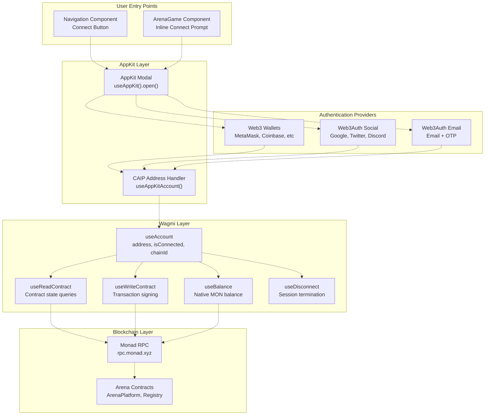
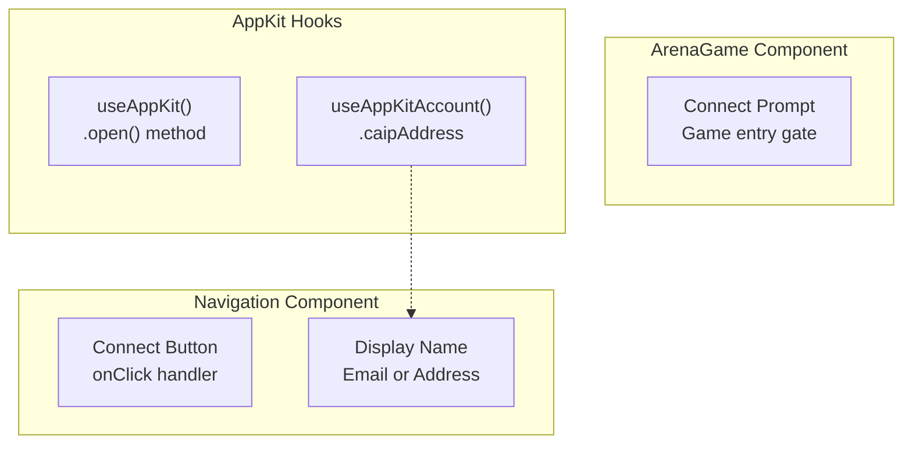
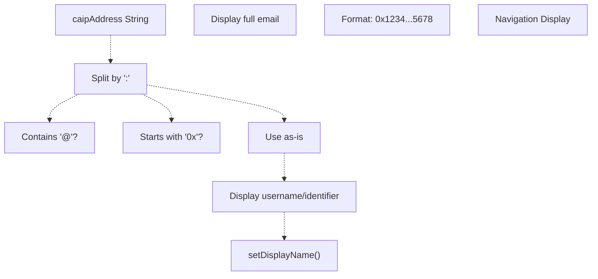
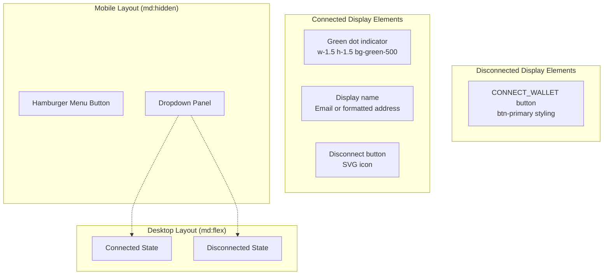
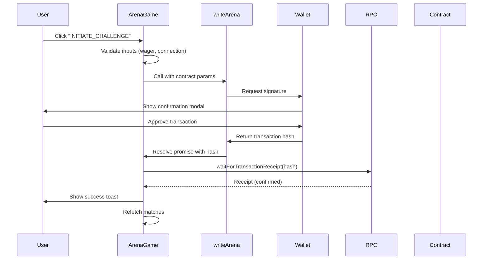

# Wallet Integration

> **Relevant source files**
> * [frontend/.env](https://github.com/HACK3R-CRYPTO/GameArena/blob/30ace840/frontend/.env)
> * [frontend/src/components/Navigation.jsx](https://github.com/HACK3R-CRYPTO/GameArena/blob/30ace840/frontend/src/components/Navigation.jsx)
> * [frontend/src/config/contracts.js](https://github.com/HACK3R-CRYPTO/GameArena/blob/30ace840/frontend/src/config/contracts.js)
> * [frontend/src/pages/ArenaGame.jsx](https://github.com/HACK3R-CRYPTO/GameArena/blob/30ace840/frontend/src/pages/ArenaGame.jsx)

This page documents the wallet connection system in the Arena frontend application. The integration uses AppKit (Reown) for wallet modal management and Wagmi hooks for blockchain interactions. For broader application structure and provider setup, see [Application Structure](/HACK3R-CRYPTO/GameArena/6.1-application-structure). For how wallet state is used in the main game interface, see [ArenaGame Component](/HACK3R-CRYPTO/GameArena/6.2-arenagame-component).

---

## Wallet Provider Stack

The Arena frontend implements a multi-layered wallet integration combining AppKit (Reown), Wagmi, and Web3Auth for comprehensive wallet support including Web3 wallets, social logins, and email authentication.



**Sources:** [frontend/src/components/Navigation.jsx L1-L13](https://github.com/HACK3R-CRYPTO/GameArena/blob/30ace840/frontend/src/components/Navigation.jsx#L1-L13)

 [frontend/src/pages/ArenaGame.jsx L1-L20](https://github.com/HACK3R-CRYPTO/GameArena/blob/30ace840/frontend/src/pages/ArenaGame.jsx#L1-L20)

---

## AppKit Configuration

AppKit (formerly WalletConnect v3, now Reown) provides the wallet connection modal and manages multi-wallet support. Configuration is environment-driven with support for CAIP-10 address formats.

### Environment Variables

| Variable | Purpose | Example Value |
| --- | --- | --- |
| `VITE_REOWN_PROJECT_ID` | AppKit project identifier from cloud.reown.com | `80ad617c75ff0a3e14ee2636f4bbfe56` |
| `VITE_WEB3AUTH_CLIENT_ID` | Web3Auth client ID for social login | `BOP1piqYY0Tf...` |
| `VITE_RPC_URL` | Monad RPC endpoint | `https://rpc.monad.xyz` |

**Sources:** [frontend/.env L1-L6](https://github.com/HACK3R-CRYPTO/GameArena/blob/30ace840/frontend/.env#L1-L6)

### AppKit Hooks Usage

The application uses two primary AppKit hooks:



**`useAppKit()` - Modal Control**

[frontend/src/components/Navigation.jsx L12](https://github.com/HACK3R-CRYPTO/GameArena/blob/30ace840/frontend/src/components/Navigation.jsx#L12-L12)

 and [frontend/src/pages/ArenaGame.jsx L20](https://github.com/HACK3R-CRYPTO/GameArena/blob/30ace840/frontend/src/pages/ArenaGame.jsx#L20-L20)

 extract the `open()` method to trigger the wallet connection modal:

```javascript
const { open } = useAppKit();
```

This method is called when users click connection buttons:

* Navigation: [frontend/src/components/Navigation.jsx L130](https://github.com/HACK3R-CRYPTO/GameArena/blob/30ace840/frontend/src/components/Navigation.jsx#L130-L130)
* ArenaGame: [frontend/src/pages/ArenaGame.jsx L594](https://github.com/HACK3R-CRYPTO/GameArena/blob/30ace840/frontend/src/pages/ArenaGame.jsx#L594-L594)

**`useAppKitAccount()` - CAIP Address Resolution**

[frontend/src/components/Navigation.jsx L10](https://github.com/HACK3R-CRYPTO/GameArena/blob/30ace840/frontend/src/components/Navigation.jsx#L10-L10)

 accesses the `caipAddress` for displaying user-friendly identifiers:

```javascript
const { caipAddress } = useAppKitAccount();
```

**Sources:** [frontend/src/components/Navigation.jsx L4-L12](https://github.com/HACK3R-CRYPTO/GameArena/blob/30ace840/frontend/src/components/Navigation.jsx#L4-L12)

 [frontend/src/pages/ArenaGame.jsx L4-L20](https://github.com/HACK3R-CRYPTO/GameArena/blob/30ace840/frontend/src/pages/ArenaGame.jsx#L4-L20)

---

## CAIP Address Handling

CAIP (Chain Agnostic Improvement Proposal) addresses allow AppKit to represent various account types uniformly. The Navigation component implements parsing logic to extract human-readable identifiers.



### Address Parsing Logic

[frontend/src/components/Navigation.jsx L15-L37](https://github.com/HACK3R-CRYPTO/GameArena/blob/30ace840/frontend/src/components/Navigation.jsx#L15-L37)

 implements CAIP address extraction:

1. **Split CAIP format:** `eip155:143:0x2E33...7Ad1` → parts array
2. **Extract last segment:** `parts[parts.length - 1]`
3. **Type detection:** * Contains `@` → Email address (Web3Auth social/email login) * Starts with `0x` → Ethereum address (Web3 wallet) * Otherwise → Username or custom identifier
4. **Formatting:** * Email: Display full string * Address: Format as `0x1234...5678` * Username: Display unmodified

This allows the UI to show "[user@gmail.com](mailto:user@gmail.com)" for social logins or "0x2E33...7Ad1" for wallet connections.

**Sources:** [frontend/src/components/Navigation.jsx L15-L37](https://github.com/HACK3R-CRYPTO/GameArena/blob/30ace840/frontend/src/components/Navigation.jsx#L15-L37)

---

## Wagmi Account Hooks

Wagmi provides typed React hooks for Ethereum account state, contract interactions, and transaction management. The Arena frontend extensively uses these hooks across components.

### Account State Hook

`useAccount()` provides connection status and account details:

```javascript
const { address, isConnected, chainId } = useAccount();
```

| Property | Type | Purpose |
| --- | --- | --- |
| `address` | `Address \| undefined` | User's Ethereum address (`0x...`) |
| `isConnected` | `boolean` | Connection state (true if wallet connected) |
| `chainId` | `number \| undefined` | Current chain ID (143 for Monad) |

**Usage in ArenaGame:** [frontend/src/pages/ArenaGame.jsx L18](https://github.com/HACK3R-CRYPTO/GameArena/blob/30ace840/frontend/src/pages/ArenaGame.jsx#L18-L18)

**Usage in Navigation:** [frontend/src/components/Navigation.jsx L9](https://github.com/HACK3R-CRYPTO/GameArena/blob/30ace840/frontend/src/components/Navigation.jsx#L9-L9)

The `address` value is used throughout for:

* Contract function arguments (opponent address, player queries)
* Conditional rendering (show connect prompt vs game interface)
* Event filtering (fetch user-specific matches)

### Balance Display Hook

`useBalance()` fetches native token balance:

```javascript
const { data: balance, isError, isLoading } = useBalance({ address });
```

[frontend/src/pages/ArenaGame.jsx L19](https://github.com/HACK3R-CRYPTO/GameArena/blob/30ace840/frontend/src/pages/ArenaGame.jsx#L19-L19)

 uses this to display MON balance in the stats bar. The balance object contains:

* `balance.value` - BigInt representation
* `balance.formatted` - Human-readable string
* `balance.decimals` - Token decimals (18 for MON)
* `balance.symbol` - Token symbol ("MON")

Display formatting: [frontend/src/pages/ArenaGame.jsx L516](https://github.com/HACK3R-CRYPTO/GameArena/blob/30ace840/frontend/src/pages/ArenaGame.jsx#L516-L516)

```
{balance ? Number(formatEther(balance.value)).toFixed(4) : '--'}
```

### Disconnect Hook

`useDisconnect()` provides session termination:

```javascript
const { disconnect } = useDisconnect();
```

Used in Navigation component disconnect button: [frontend/src/components/Navigation.jsx L11](https://github.com/HACK3R-CRYPTO/GameArena/blob/30ace840/frontend/src/components/Navigation.jsx#L11-L11)

 and [frontend/src/components/Navigation.jsx L121](https://github.com/HACK3R-CRYPTO/GameArena/blob/30ace840/frontend/src/components/Navigation.jsx#L121-L121)

**Sources:** [frontend/src/pages/ArenaGame.jsx L18-L20](https://github.com/HACK3R-CRYPTO/GameArena/blob/30ace840/frontend/src/pages/ArenaGame.jsx#L18-L20)

 [frontend/src/components/Navigation.jsx L9-L12](https://github.com/HACK3R-CRYPTO/GameArena/blob/30ace840/frontend/src/components/Navigation.jsx#L9-L12)

---

## Navigation Component Integration

The Navigation component ([frontend/src/components/Navigation.jsx](https://github.com/HACK3R-CRYPTO/GameArena/blob/30ace840/frontend/src/components/Navigation.jsx)

) implements the persistent wallet UI shown in the application header.



### Connection State Rendering

**Disconnected State** [frontend/src/components/Navigation.jsx L128-L134](https://github.com/HACK3R-CRYPTO/GameArena/blob/30ace840/frontend/src/components/Navigation.jsx#L128-L134)

Renders a primary-styled button that triggers AppKit modal:

* Button text: `CONNECT_WALLET`
* Styling: `btn-primary` with purple gradient
* Click handler: `open()`

**Connected State** [frontend/src/components/Navigation.jsx L112-L126](https://github.com/HACK3R-CRYPTO/GameArena/blob/30ace840/frontend/src/components/Navigation.jsx#L112-L126)

Displays three elements:

1. **Status indicator:** Green dot (1.5px diameter, `bg-green-500`)
2. **Display name:** Truncated to 120px max-width, shows: * Email (for social logins) * Formatted address (for wallet connections) * Fallback to full address
3. **Disconnect button:** Red hover color, SVG logout icon

### Display Name Generation

[frontend/src/components/Navigation.jsx L15-L37](https://github.com/HACK3R-CRYPTO/GameArena/blob/30ace840/frontend/src/components/Navigation.jsx#L15-L37)

 uses a `useEffect` to compute the display name whenever `caipAddress`, `address`, or `isConnected` changes:

1. Parse `caipAddress` to extract identifier
2. Apply type-specific formatting
3. Update `displayName` state
4. Trigger re-render with new name

The name appears in two locations:

* Desktop header: [frontend/src/components/Navigation.jsx L116](https://github.com/HACK3R-CRYPTO/GameArena/blob/30ace840/frontend/src/components/Navigation.jsx#L116-L116)
* Mobile dropdown: [frontend/src/components/Navigation.jsx L183](https://github.com/HACK3R-CRYPTO/GameArena/blob/30ace840/frontend/src/components/Navigation.jsx#L183-L183)

### Mobile Responsive Behavior

The Navigation component implements a collapsible mobile menu:

**Menu Toggle** [frontend/src/components/Navigation.jsx L138-L152](https://github.com/HACK3R-CRYPTO/GameArena/blob/30ace840/frontend/src/components/Navigation.jsx#L138-L152)

* Hamburger icon (3 horizontal lines)
* Rotates 90° when open
* Transforms into X icon when menu active

**Dropdown Panel** [frontend/src/components/Navigation.jsx L156-L203](https://github.com/HACK3R-CRYPTO/GameArena/blob/30ace840/frontend/src/components/Navigation.jsx#L156-L203)

* Absolute positioning below header
* Scale and opacity transitions (300ms ease-out)
* Contains navigation links and wallet state
* Auto-closes on window resize to desktop width: [frontend/src/components/Navigation.jsx L40-L49](https://github.com/HACK3R-CRYPTO/GameArena/blob/30ace840/frontend/src/components/Navigation.jsx#L40-L49)

**Sources:** [frontend/src/components/Navigation.jsx L1-L209](https://github.com/HACK3R-CRYPTO/GameArena/blob/30ace840/frontend/src/components/Navigation.jsx#L1-L209)

---

## Contract Address Configuration

Contract addresses are centralized in [frontend/src/config/contracts.js](https://github.com/HACK3R-CRYPTO/GameArena/blob/30ace840/frontend/src/config/contracts.js)

 and loaded from environment variables with fallback defaults.

### Address Constants

```javascript
export const CONTRACT_ADDRESSES = {
  ARENA_PLATFORM: import.meta.env.VITE_ARENA_PLATFORM_ADDRESS || '0x30af30ec392b881b009a0c6b520ebe6d15722e9b',
  AI_AGENT: import.meta.env.VITE_AI_AGENT_ADDRESS || '0x2E33d7D5Fa3eD4Dd6BEb95CdC41F51635C4b7Ad1',
  AGENT_REGISTRY: import.meta.env.VITE_AGENT_REGISTRY_ADDRESS || '0x34FCEE3eFaA15750B070836F19F3970Ad20fE8d1',
  ARENA_TOKEN: import.meta.env.VITE_ARENA_TOKEN_ADDRESS || '0x2117449ea6630857d4d656d0d2f5e1c689c67777',
};
```

These addresses are used throughout the application:

* **ARENA_PLATFORM:** Primary contract for match management [frontend/src/pages/ArenaGame.jsx L277-L278](https://github.com/HACK3R-CRYPTO/GameArena/blob/30ace840/frontend/src/pages/ArenaGame.jsx#L277-L278)
* **AI_AGENT:** Arena Champion agent address for challenges [frontend/src/pages/ArenaGame.jsx L416](https://github.com/HACK3R-CRYPTO/GameArena/blob/30ace840/frontend/src/pages/ArenaGame.jsx#L416-L416)
* **AGENT_REGISTRY:** EIP-8004 registry for agent verification [frontend/src/pages/ArenaGame.jsx L35](https://github.com/HACK3R-CRYPTO/GameArena/blob/30ace840/frontend/src/pages/ArenaGame.jsx#L35-L35)

Environment configuration: [frontend/.env L8-L12](https://github.com/HACK3R-CRYPTO/GameArena/blob/30ace840/frontend/.env#L8-L12)

**Sources:** [frontend/src/config/contracts.js L1-L7](https://github.com/HACK3R-CRYPTO/GameArena/blob/30ace840/frontend/src/config/contracts.js#L1-L7)

 [frontend/.env L8-L12](https://github.com/HACK3R-CRYPTO/GameArena/blob/30ace840/frontend/.env#L8-L12)

---

## Transaction Signing with useWriteContract

The `useWriteContract` hook enables transaction signing and submission. ArenaGame destructures the async function: [frontend/src/pages/ArenaGame.jsx L43](https://github.com/HACK3R-CRYPTO/GameArena/blob/30ace840/frontend/src/pages/ArenaGame.jsx#L43-L43)

```javascript
const { writeContractAsync: writeArena } = useWriteContract();
```

### Transaction Flow



### Example: Challenge Agent Transaction

[frontend/src/pages/ArenaGame.jsx L403-L433](https://github.com/HACK3R-CRYPTO/GameArena/blob/30ace840/frontend/src/pages/ArenaGame.jsx#L403-L433)

 implements the challenge flow:

1. **Validation:** Check `isConnected` and `wager` value
2. **Loading state:** Set `loading = true`, show toast
3. **Transaction submission:** ```javascript const hash = await writeArena({   address: CONTRACT_ADDRESSES.ARENA_PLATFORM,   abi: ARENA_PLATFORM_ABI,   functionName: 'proposeMatch',   args: [CONTRACT_ADDRESSES.AI_AGENT, selectedGameType],   value: parseEther(wager) }); ```
4. **Wait for confirmation:** `await publicClient.waitForTransactionReceipt({ hash })`
5. **UI update:** Show success message, refetch matches
6. **Error handling:** Catch exceptions, show error toast

The same pattern is used for:

* **acceptMatch:** [frontend/src/pages/ArenaGame.jsx L465-L490](https://github.com/HACK3R-CRYPTO/GameArena/blob/30ace840/frontend/src/pages/ArenaGame.jsx#L465-L490)
* **playMove:** [frontend/src/pages/ArenaGame.jsx L355-L401](https://github.com/HACK3R-CRYPTO/GameArena/blob/30ace840/frontend/src/pages/ArenaGame.jsx#L355-L401)
* **proposeMatch (open challenge):** [frontend/src/pages/ArenaGame.jsx L435-L463](https://github.com/HACK3R-CRYPTO/GameArena/blob/30ace840/frontend/src/pages/ArenaGame.jsx#L435-L463)

**Sources:** [frontend/src/pages/ArenaGame.jsx L43](https://github.com/HACK3R-CRYPTO/GameArena/blob/30ace840/frontend/src/pages/ArenaGame.jsx#L43-L43)

 [frontend/src/pages/ArenaGame.jsx L403-L433](https://github.com/HACK3R-CRYPTO/GameArena/blob/30ace840/frontend/src/pages/ArenaGame.jsx#L403-L433)

---

## Connection State Guards

Components use `isConnected` to conditionally render interfaces and prevent unauthorized actions.

### ArenaGame Connect Gate

[frontend/src/pages/ArenaGame.jsx L593-L606](https://github.com/HACK3R-CRYPTO/GameArena/blob/30ace840/frontend/src/pages/ArenaGame.jsx#L593-L606)

 shows the connect button when wallet not connected:

```javascript
{!isConnected ? (
  <button onClick={() => open()} className="...">
    Connect Wallet
  </button>
) : (
  <button onClick={handleChallengeAgent} disabled={loading || !wager} className="...">
    {loading ? 'PROCESSING...' : 'INITIATE_CHALLENGE'}
  </button>
)}
```

### Function-Level Guards

Transaction functions check connection before proceeding:

```javascript
const handleChallengeAgent = async () => {
  if (!isConnected) {
    toast.error('Please connect your wallet');
    return;
  }
  // ... transaction logic
}
```

This pattern appears in:

* [frontend/src/pages/ArenaGame.jsx L404-L407](https://github.com/HACK3R-CRYPTO/GameArena/blob/30ace840/frontend/src/pages/ArenaGame.jsx#L404-L407)  (challenge agent)
* [frontend/src/pages/ArenaGame.jsx L436-L439](https://github.com/HACK3R-CRYPTO/GameArena/blob/30ace840/frontend/src/pages/ArenaGame.jsx#L436-L439)  (create match)

**Sources:** [frontend/src/pages/ArenaGame.jsx L404-L407](https://github.com/HACK3R-CRYPTO/GameArena/blob/30ace840/frontend/src/pages/ArenaGame.jsx#L404-L407)

 [frontend/src/pages/ArenaGame.jsx L593-L606](https://github.com/HACK3R-CRYPTO/GameArena/blob/30ace840/frontend/src/pages/ArenaGame.jsx#L593-L606)

---

## Balance Display and Formatting

The stats bar in ArenaGame displays the user's MON balance with real-time updates.

### Balance Fetching

```javascript
const { data: balance, isError, isLoading } = useBalance({ address });
```

The `useBalance` hook:

* Automatically refetches when `address` changes
* Returns `undefined` when wallet not connected
* Provides loading and error states

### Display Formatting

[frontend/src/pages/ArenaGame.jsx L513-L518](https://github.com/HACK3R-CRYPTO/GameArena/blob/30ace840/frontend/src/pages/ArenaGame.jsx#L513-L518)

 renders the balance:

```css
<div className="bg-[#0a0a0a] border border-white/10 px-4 py-2 rounded min-w-[140px]">
  <span className="text-[10px] text-gray-500 block uppercase">Balance</span>
  <div className="text-white font-bold text-sm font-mono">
    {balance ? Number(formatEther(balance.value)).toFixed(4) : '--'} <span className="text-purple-500">MON</span>
  </div>
</div>
```

**Formatting steps:**

1. Extract `balance.value` (BigInt in wei)
2. Convert to ether: `formatEther(balance.value)`
3. Parse to number: `Number(...)`
4. Fixed decimal places: `.toFixed(4)`
5. Fallback to '--' when balance undefined

**Sources:** [frontend/src/pages/ArenaGame.jsx L19](https://github.com/HACK3R-CRYPTO/GameArena/blob/30ace840/frontend/src/pages/ArenaGame.jsx#L19-L19)

 [frontend/src/pages/ArenaGame.jsx L513-L518](https://github.com/HACK3R-CRYPTO/GameArena/blob/30ace840/frontend/src/pages/ArenaGame.jsx#L513-L518)

---

## Agent Status Indicator

ArenaGame displays the Arena Champion AI's online status by querying the EIP-8004 Agent Registry.

### Registry Balance Check

[frontend/src/pages/ArenaGame.jsx L34-L41](https://github.com/HACK3R-CRYPTO/GameArena/blob/30ace840/frontend/src/pages/ArenaGame.jsx#L34-L41)

 queries agent NFT ownership:

```javascript
const { data: agentBalance } = useReadContract({
  address: CONTRACT_ADDRESSES.AGENT_REGISTRY,
  abi: [{ /* balanceOf ABI */ }],
  functionName: 'balanceOf',
  args: [CONTRACT_ADDRESSES.AI_AGENT]
});

const agentProfile = agentBalance && agentBalance > 0n ? { active: true } : null;
```

**Logic:**

* Query `balanceOf(AI_AGENT)` from registry
* If balance > 0, agent has registered (active)
* If balance = 0 or undefined, agent offline

### Status Display

[frontend/src/pages/ArenaGame.jsx L519-L527](https://github.com/HACK3R-CRYPTO/GameArena/blob/30ace840/frontend/src/pages/ArenaGame.jsx#L519-L527)

 renders the status panel:

```css
<div className="bg-[#0a0a0a] border border-white/10 px-4 py-2 rounded flex flex-col items-end">
  <span className="text-[10px] text-gray-500 block uppercase flex items-center gap-1">
    <span className={`w-1.5 h-1.5 rounded-full ${agentProfile?.active ? 'bg-green-500' : 'bg-red-500'}`}></span>
    AGENT_STATUS
  </span>
  <div className={`font-bold text-sm font-mono ${agentProfile?.active ? 'text-green-400' : 'text-purple-500'}`}>
    {agentProfile?.active ? 'ONLINE' : 'OFFLINE'}
  </div>
</div>
```

**Visual indicators:**

* Green dot + "ONLINE" (agent registered)
* Red dot + "OFFLINE" (agent not registered)

**Sources:** [frontend/src/pages/ArenaGame.jsx L34-L41](https://github.com/HACK3R-CRYPTO/GameArena/blob/30ace840/frontend/src/pages/ArenaGame.jsx#L34-L41)

 [frontend/src/pages/ArenaGame.jsx L519-L527](https://github.com/HACK3R-CRYPTO/GameArena/blob/30ace840/frontend/src/pages/ArenaGame.jsx#L519-L527)